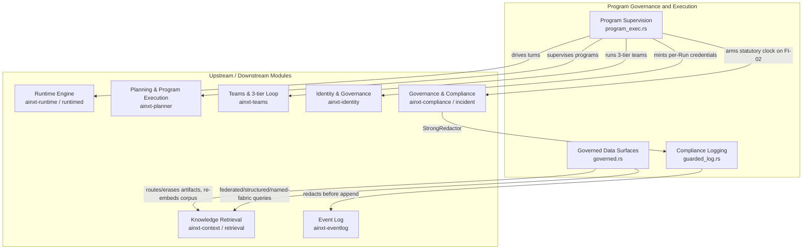
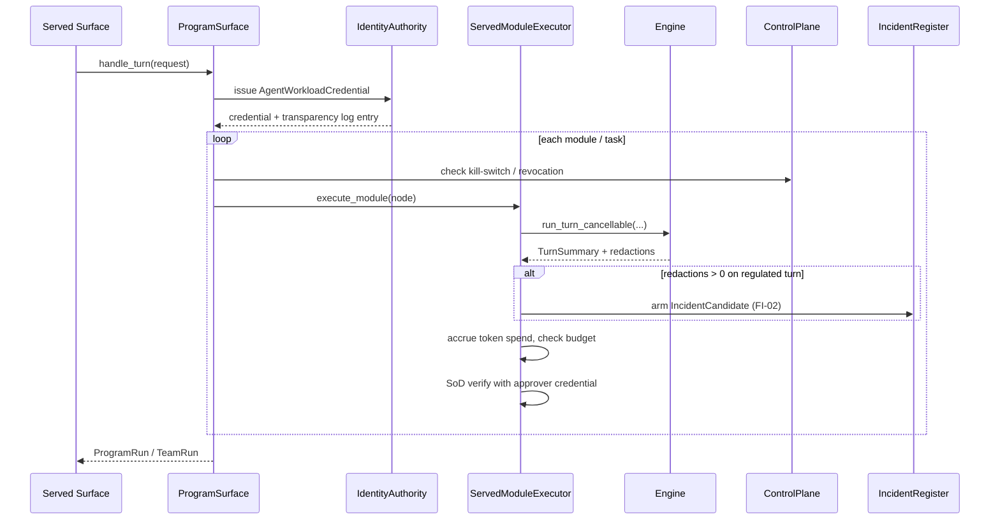

# Program Governance and Execution

The **Program Governance and Execution** module is the composition-root bridge inside `ainxt-runtimed` that makes long-horizon, governed agent execution reachable from the served runtime daemon. It closes the critical "built but unreachable" gaps between:

* the deterministic **Program Supervisor** and **3-tier Team** loops from `ainxt-planner` / `ainxt-teams`,
* the real async [`Engine`](runtime_engine.md) that serves individual turns,
* the identity, compliance, and incident subsystems that must govern every Run,
* and the regulated data-surface policies (artifact routing, KB re-embedding, federated queries) that must be honored on the served path.

In other words, this module is where "planning" and "team orchestration" meet "real execution with audit, budget, and compliance".

## Purpose

* **Wire long-horizon execution to a real model**: `ainxt-planner` and `ainxt-teams` were fully built and unit-tested, but their `RunExecutor` / `TaskExecutor` seams were only ever backed by test fakes. This module supplies a single adapter, [`EngineRunExecutor`](program_governance_and_execution_program_supervision.md), that delegates each program module or team task to a real [`Engine::run_turn_cancellable`](runtime_engine.md) turn.
* **Mint and thread per-Run identity**: every Program or Team Run receives an [`AgentWorkloadCredential`](governance_compliance.md) (IDN-03). That credential becomes the policy principal and audit actor for every turn, and can be recorded in a transparency log.
* **Enforce budget, checkpoints, and separation-of-duties**: the served program path honors token budgets, holds critical-path nodes until a human approves, and requires a distinct approver credential to authorize commits (SoD).
* **Guard regulated data surfaces**: standalone wrappers make previously unreachable data-surface rules (artifact model eligibility, embedding-lifecycle migration, tenant-aware surface catalog, federated/structured/named-fabric queries) callable from the composition root.
* **Keep cardholder data out of the durable log**: [`GuardedEventLog`](program_governance_and_execution_compliance_logging.md) applies the FI-01 sink-guard so that raw PANs or secrets are redacted before the event log hash-chains and persists them.

## Architecture Overview

### Execution Model

The Program Supervisor and 3-tier Team loops are **synchronous, deterministic** drivers (which makes them exhaustively testable). The [`Engine`](runtime_engine.md) turn is **async**. The bridge runs the whole synchronous loop on a dedicated OS thread that owns no Tokio worker; each module/task turn is driven to completion with `Handle::block_on`. The async entrypoints await the driver via a oneshot, so no worker is blocked.

### Governance Flow

## Sub-modules

| Sub-module | File | Concern | Documentation |
|------------|------|---------|---------------|
| **Program Supervision** | `program_exec.rs` | Long-horizon Program + Team execution wired to the real Engine, with identity, budget, SoD, and checkpoint governance. | [program_governance_and_execution_program_supervision.md](program_governance_and_execution_program_supervision.md) |
| **Governed Data Surfaces** | `governed.rs` | Composition-root wrappers for regulated data-surface rules: artifact model routing, erasure cascades, KB corpus re-embedding, federated/structured/named-fabric query tools, and canary release-controller config. | [program_governance_and_execution_governed_data_surfaces.md](program_governance_and_execution_governed_data_surfaces.md) |
| **Compliance Logging** | `guarded_log.rs` | FI-01 CHD sink-guard decorator over the durable event log. | [program_governance_and_execution_compliance_logging.md](program_governance_and_execution_compliance_logging.md) |

Each generated sub-module file expands on the components, responsibilities, and data flows summarized above:

* [Program Supervision](program_governance_and_execution_program_supervision.md) — full details on `ProgramSurface`, `TeamSurface`, `EngineRunExecutor`, `ServedModuleExecutor`, `VerifiedProgramRun`, and the sync/async bridge.
* [Governed Data Surfaces](program_governance_and_execution_governed_data_surfaces.md) — full details on artifact routing, erasure cascades, KB re-embedding, query tools, and release-controller configuration.
* [Compliance Logging](program_governance_and_execution_compliance_logging.md) — full details on `GuardedEventLog` and the FI-01 redaction guarantee.

## How It Fits into the System

This module sits at the boundary between the **runtime engine** and the higher-level **planning / team / governance** crates. It does not re-implement planning, retrieval, or identity logic; it composes those subsystems so they can be driven from the served daemon.

* For the core turn execution engine, see [runtime_engine.md](runtime_engine.md).
* For the planner and program supervisor that this module drives, see [planning_program_execution.md](planning_program_execution.md).
* For the team orchestration and 3-tier loop, see [pipeline_orchestration.md](pipeline_orchestration.md) and the `ainxt-teams` coverage in [governance_compliance.md](governance_compliance.md).
* For identity issuance, SoD, and transparency logging, see [governance_compliance.md](governance_compliance.md).
* For compliance redaction and incident arming, see [governance_compliance.md](governance_compliance.md).
* For the retrieval, context, and artifact subsystems that the governed data-surface wrappers call, see [knowledge_retrieval.md](knowledge_retrieval.md).
