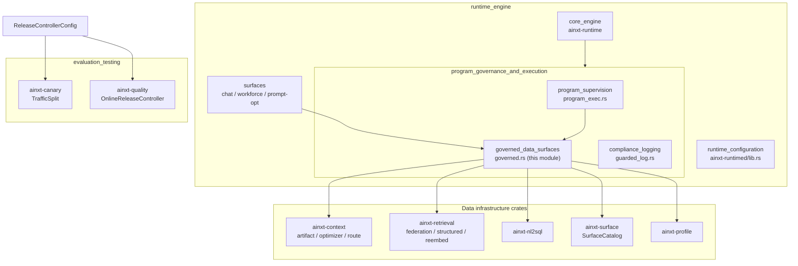
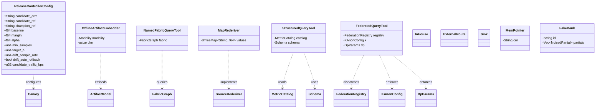
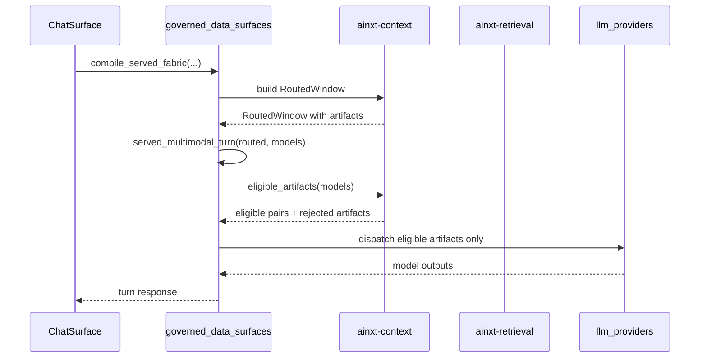
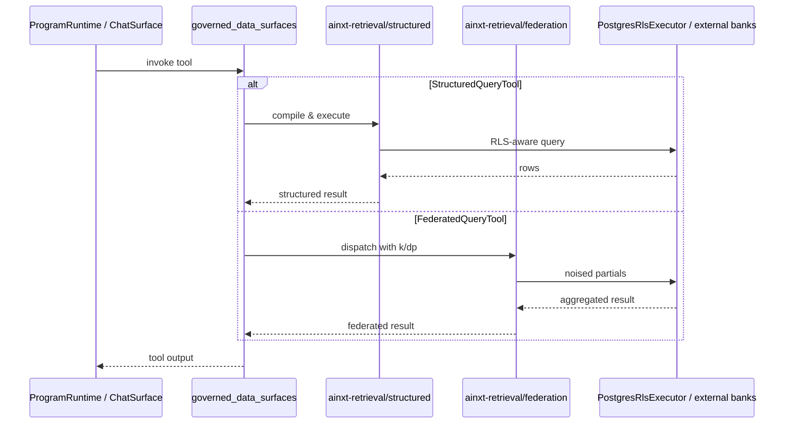
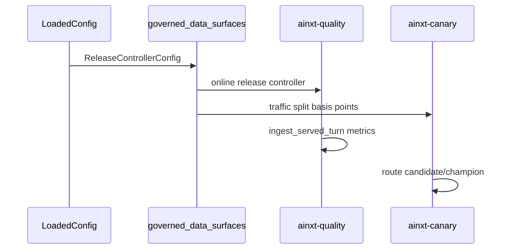
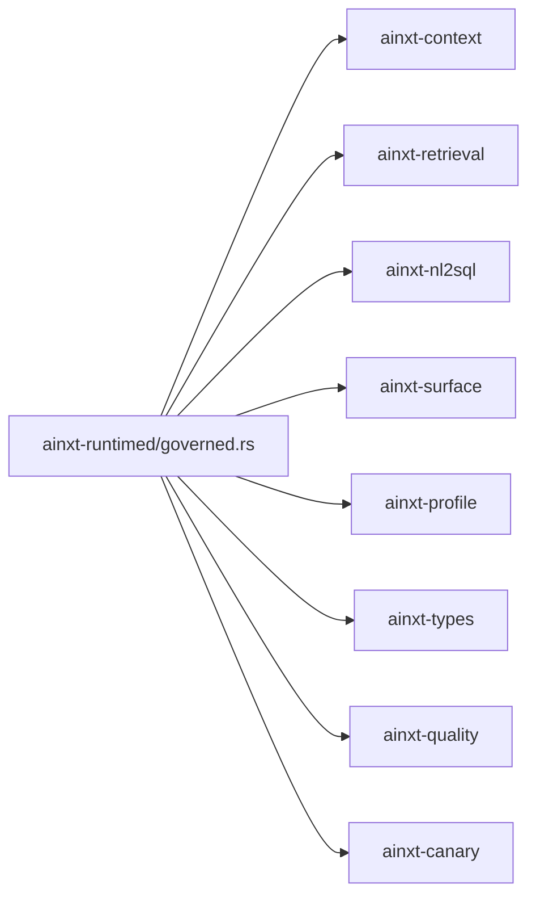

# Governed Data Surfaces

The **governed data surfaces** module (`crates/ainxt-runtimed/src/governed.rs`) is the runtime-facing composition layer that exposes the platform's *data-plane* capabilities to the rest of the served daemon. It wraps lower-level retrieval, context, artifact, and NL2SQL crates behind deterministic, policy-aware seams so that program execution, chat surfaces, and workforce surfaces can query knowledge, embed artifacts, and route structured data without directly depending on the underlying storage or model fleets.

This module is intentionally a thin "gap-fix" and "hot-wiring" surface: many of the wrapped functions (artifact model routing, corpus re-embedding, tenant-level surface overrides, federated query dispatch, structured query execution) were already implemented and unit-tested in their home crates but had no callers on the served path. `governed.rs` makes those rules reachable from `ainxt-runtimed` and, by extension, from the HTTP server and runtime engine.

---

## 1. Purpose and Core Functionality

Governed data surfaces sit at the boundary between **raw data infrastructure** (retrieval corpora, artifact stores, structured databases, federated data sources) and **governed runtime consumers** (program execution, chat surfaces, workforce surfaces). Its responsibilities are:

1. **Knowledge retrieval composition** — expose fabric-graph query tools, named-fabric query tools, and map-based rederivation helpers that the runtime can invoke during a turn.
2. **Multimodal artifact governance** — route regulated artifacts to eligible in-house models, cascade erasure requests across derived embeddings, and provide an offline embedder for air-gapped deployments.
3. **Structured and federated data access** — wrap NL2SQL/structured query execution and differentially-private federated query dispatch behind single-call tools.
4. **Release control wiring** — hold the configuration that feeds the online release controller and canary traffic split, connecting evaluation/testing infrastructure to the serving path.
5. **Offline/test defaults** — provide in-memory, deterministic stand-ins (`FakeBank`, `InHouse`, `Sink`, `MemPointer`, `ExternalRoute`) so the module can be exercised without a live cloud or database backend.

The module does not implement new algorithms. It is a *policy-aware adapter* that turns crate-internal capabilities into runtime-callable units.

---

## 2. Architecture

### 2.1 Position in the System

### 2.2 Component Overview

---

## 3. Core Components

### 3.1 `ReleaseControllerConfig`

`ReleaseControllerConfig` is the configuration seam that feeds the online release controller (`ainxt_quality::controller::OnlineReleaseController`) and the canary traffic split (`ainxt_canary::experiment::TrafficSplit`). It describes how a candidate model/prompt/program is compared against an established champion and how traffic is gradually shifted.

| Field | Meaning |
|-------|---------|
| `candidate_arm` / `candidate_ref` | Identifier and git ref for the candidate being evaluated. |
| `champion_ref` | Git ref of the incumbent champion. |
| `baseline` | Established champion quality score (0–100). |
| `margin` | Non-inferiority margin in metric points. |
| `alpha` | Confidence-sequence error level. |
| `min_samples` | Minimum candidate samples before a *Promote* decision. |
| `target_n` | Target sample size for asymptotic confidence sequence tuning. |
| `drift_sample_rate` / `drift_auto_rollback` | Post-promotion drift monitoring and auto-rollback cadence. |
| `candidate_traffic_bps` | Candidate traffic share in basis points (10000 = 100%). |

This struct is the bridge between the [evaluation_testing](evaluation_testing.md) module and the serving runtime. For details on how the release controller consumes these values, see [quality_verification](quality_verification.md) and [canary](canary.md).

### 3.2 Query and Rederivation Tools

#### `NamedFabricQueryTool`

Wraps a `FabricGraph` (from `ainxt_context::optimizer::FabricGraph`) and exposes it as a runtime-callable tool. Fabric graphs are the multi-graph representation used by the context optimizer to route windows across corpora. This tool lets program execution or chat surfaces issue a named query against a pre-compiled fabric.

See [context_retrieval_routing](context_retrieval_routing.md) for the underlying graph model.

#### `MapRederiver`

A simple in-memory key-to-float store used to exercise rederivation paths. It mirrors the `SourceRederiver` / `MapRederiver` pattern from `ainxt_synthesis::rederive` and `ainxt_context::route`, providing deterministic numeric claims that can be verified or rederived during a turn.

See [synthesis](quality_verification.md) and [context_retrieval_routing](context_retrieval_routing.md) for the rederivation semantics.

#### `StructuredQueryTool`

Combines a `MetricCatalog` (from `ainxt_retrieval::structured`) with an `ainxt_nl2sql::Schema` to execute structured, RLS-aware queries against metrics or relational data. This is the runtime seam for the NL2SQL and structured retrieval pipeline.

See [nl2sql](nl2sql.md) and [retrieval_advanced](retrieval_advanced.md) for the catalog, RLS, and query-planning details.

#### `FederatedQueryTool`

Wraps `ainxt_retrieval::federation::FederationRegistry` together with k-anonymity and differential-privacy parameters. It exposes a single-call interface for cross-tenant or cross-source federated queries that enforce privacy budgets.

See [retrieval_advanced](retrieval_advanced.md) for federation, epsilon accounting, and disclosure consent.

### 3.3 Artifact Governance

#### `OfflineArtifactEmbedder`

Deterministic, dependency-free default embedder for multimodal artifacts in air-gapped deployments. It uses an FNV-style hash over artifact id and namespace per modality, producing a fixed-dimension vector without invoking a real vision/ASR model. A deployment with real ONNX or Whisper endpoints can swap this for a model-backed implementation behind the same seam.

Related functions in this module:

- `route_artifact_model` — routes a regulated/PII multimodal artifact to an eligible in-house model based on `DataClass` and `Modality`.
- `served_multimodal_turn` — takes a `RoutedWindow` and a model catalog and returns only artifacts each model is eligible for; ineligible artifacts are reported explicitly.
- `artifact_erasure_cascade` — invokes `ArtifactStore::erasure_cascade` so that erasing an artifact also purges derived embeddings.
- `run_kb_corpus_reembed` — admin-triggered corpus migration to a new embedding version.

See [context_sources](context_sources.md) for artifact storage and embedding models, and [knowledge_retrieval](knowledge_retrieval.md) for the broader retrieval pipeline.

### 3.4 Offline / Test Stand-ins

| Component | Role |
|-----------|------|
| `InHouse` | Marker type for in-house (non-cloud) routing eligibility. |
| `ExternalRoute` | Marker type for external/cloud routing paths. |
| `Sink` | No-op or absorbing destination for data-plane outputs in tests. |
| `MemPointer` | In-memory pointer/cursor used for deterministic test scenarios. |
| `FakeBank` | In-memory federated data bank holding `NoisedPartial` results for offline DP/k-anon testing. |

These types keep the module testable without live backends and are not used on production hot paths.

---

## 4. Data Flow

### 4.1 Served Turn with Multimodal Artifacts

### 4.2 Structured / Federated Query Flow

### 4.3 Release Controller Configuration Flow

---

## 5. Dependencies

### 5.1 Direct Crate Dependencies

### 5.2 Module Documentation References

| Concern | Referenced Module |
|---------|-------------------|
| Online release controller, quality assessment, synthesis | [quality_verification](quality_verification.md) |
| Canary traffic split and experimentation | [canary](canary.md) |
| Context fabric, artifact store, routing | [context_retrieval_routing](context_retrieval_routing.md) |
| Artifact sources and embedding models | [context_sources](context_sources.md) |
| NL2SQL schemas and safe query generation | [nl2sql](nl2sql.md) |
| Structured retrieval, RLS, federation, DP | [retrieval_advanced](retrieval_advanced.md) |
| Core retrieval (corpus, embedder, reranker) | [retrieval_core](retrieval_core.md) |
| Surface catalog and tenant overrides | [surface_conversation](surface_conversation.md) |
| Program execution and supervision | [program_governance_and_execution_program_supervision](program_governance_and_execution_program_supervision.md) |
| Compliance logging | [program_governance_and_execution_compliance_logging](program_governance_and_execution_compliance_logging.md) |
| Runtime engine core | [core_engine](core_engine.md) |

---

## 6. Integration Notes

- **Hot-wiring status**: Several functions in this module are explicitly marked as "needs_hot_wiring" in source comments. They are reachable and testable but not yet mounted on live HTTP routes or automatically invoked by the composition root. Examples include `compile_served_fabric`, `served_multimodal_turn`, `run_kb_corpus_reembed`, and `surface_catalog_with_tenant_overrides`.
- **Air-gapped defaults**: `OfflineArtifactEmbedder`, `FakeBank`, `InHouse`, and `Sink` provide deterministic behavior for offline tests and local development.
- **Policy enforcement**: Data-class routing (`route_artifact_model`, `served_multimodal_turn`) and federated query privacy (`FederatedQueryTool`) are the primary governance enforcement points exposed here.
- **Release safety**: `ReleaseControllerConfig` keeps release decisions (promote/rollback/drift) configurable and auditable, linking the [evaluation_testing](evaluation_testing.md) subsystem to the serving path.

---

## 7. Summary

The `program_governance_and_execution_governed_data_surfaces` module is a runtime adapter that exposes the platform's governed data plane to program execution, chat, and workforce surfaces. It does not introduce new data algorithms; instead, it composes existing capabilities from `ainxt-context`, `ainxt-retrieval`, `ainxt-nl2sql`, `ainxt-surface`, and `ainxt-profile` behind deterministic, policy-aware seams. Key contributions include artifact eligibility routing, erasure cascades, corpus re-embedding, structured and federated query tools, and the release-controller configuration bridge.
