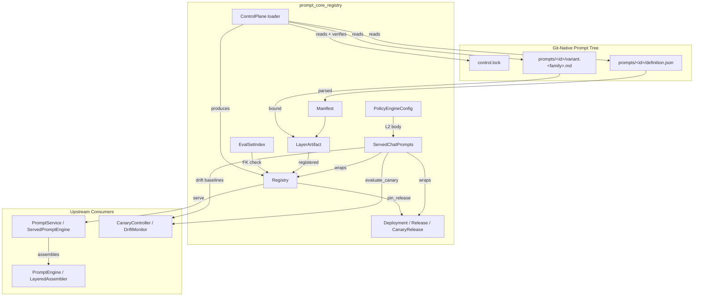
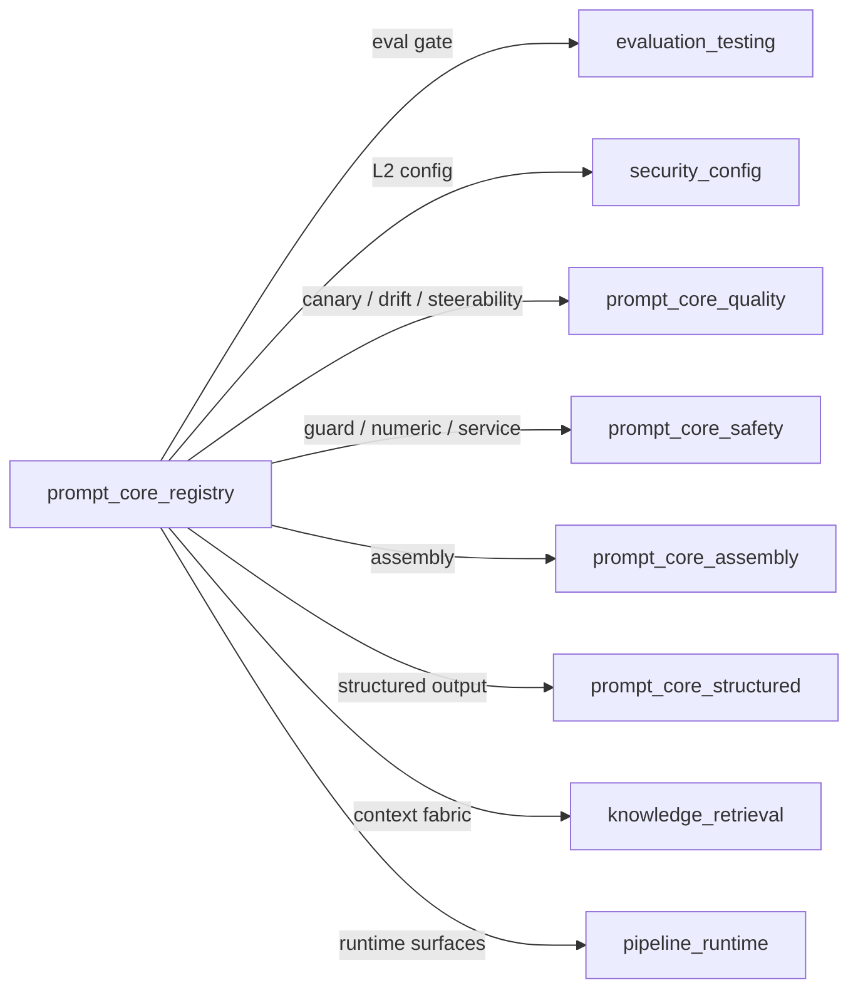
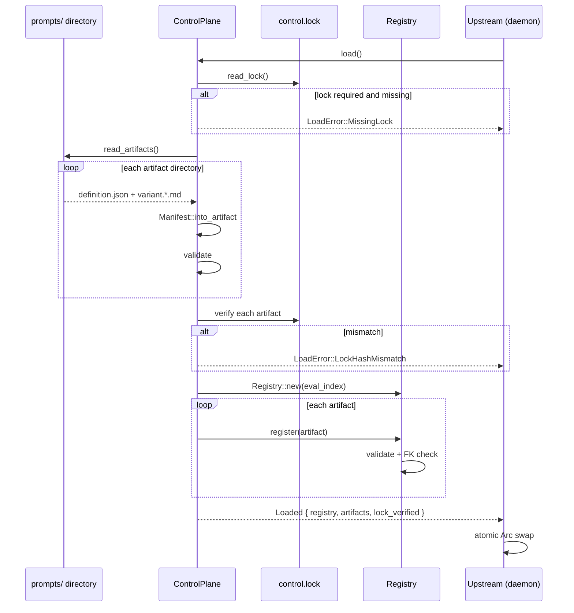
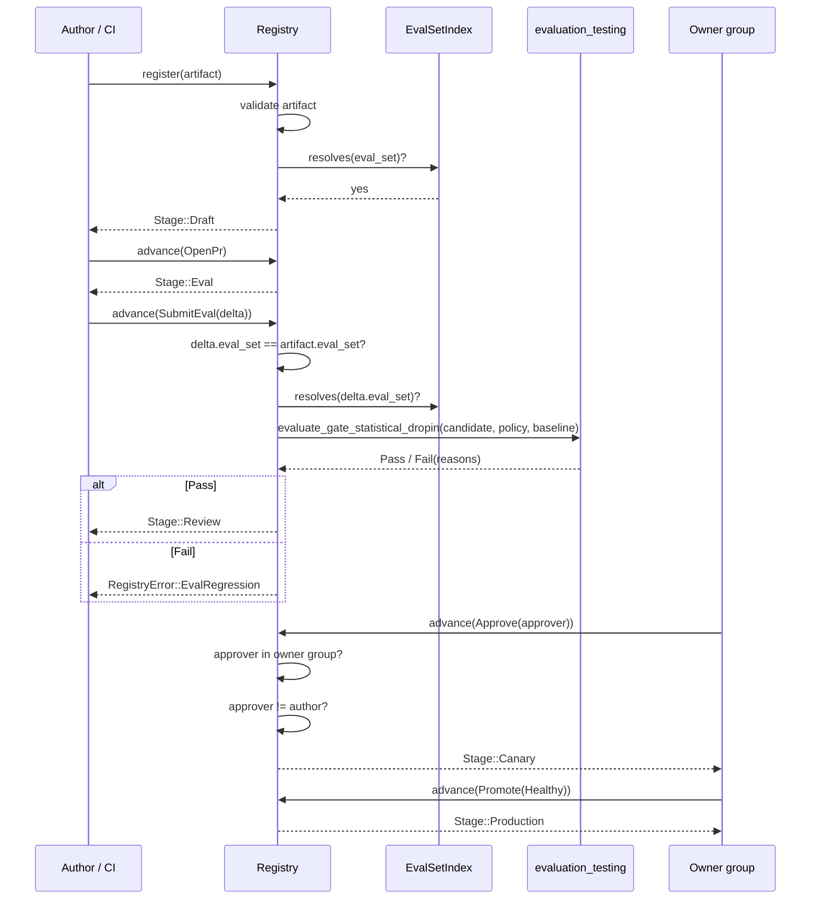
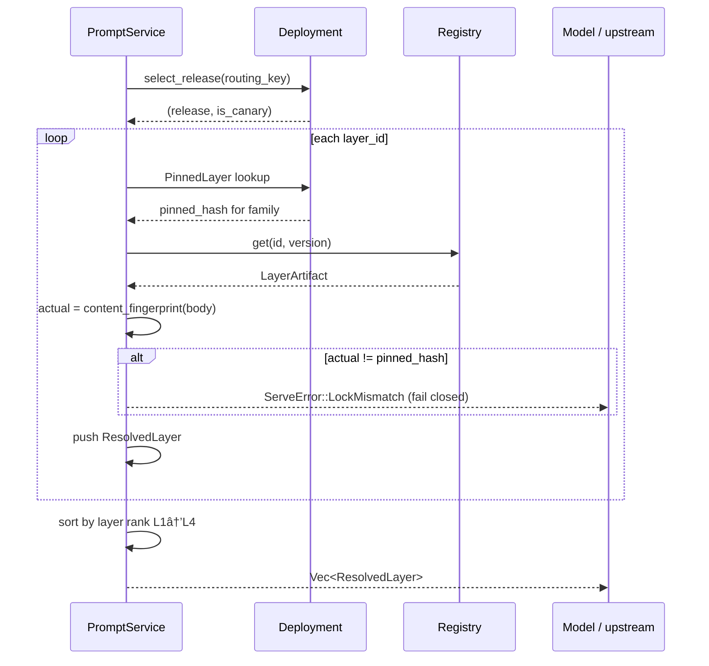
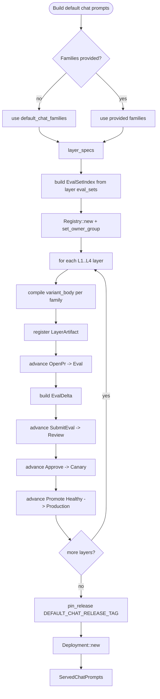
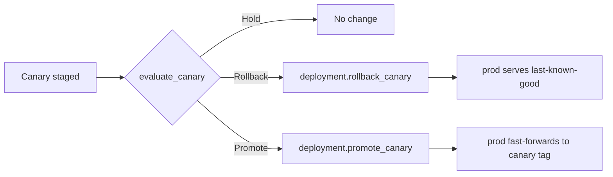

# prompt_core_registry

## Brief Introduction

`prompt_core_registry` is the runtime implementation of the **prompts-as-code** discipline for the AiNxt platform. It treats a prompt not as an ad-hoc string, but as a **versioned, per-model-tuned artifact** with a full software lifecycle: authored (`DRAFT`), evaluated (`EVAL`), reviewed (`REVIEW`), canaried (`CANARY`), promoted (`PRODUCTION`), and retired (`DEPRECATED`).

The module provides:

- A deterministic, clock-free [`Registry`](prompt_core_registry.md#registry) that stores layer artifacts, tracks lifecycle stages, enforces eval-set foreign-key resolution, and gates every lifecycle transition.
- [`LayerArtifact`](prompt_core_registry.md#layerartifact) and [`Manifest`](prompt_core_registry.md#manifest) types that bind front-matter metadata to compiled per-model variant bodies.
- [`Deployment`](prompt_core_registry.md#deployment), [`Release`](prompt_core_registry.md#release), and [`CanaryRelease`](prompt_core_registry.md#canaryrelease) types that support **rollback-by-pointer**: a regressed canary is reverted by flipping a pointer, not by rewriting immutable bodies.
- A git-native [`ControlPlane`](prompt_core_registry.md#controlplane) loader that reads `prompts/<id>/definition.json` plus `variant.<family>.md` siblings, verifies them against a `control.lock` content-address, and produces a fresh [`Registry`](prompt_core_registry.md#registry) for atomic hot-reload.
- A first-class [`ServedChatPrompts`](prompt_core_registry.md#servedchatprompts) default deployment that drives L1–L4 chat layers through the real lifecycle gates and pins them into a locked release.
- A config-sourced [`PolicyEngineConfig`](prompt_core_registry.md#policyengineconfig) so that L2 org/policy text is loaded through the existing layered TOML merge rather than hardcoded in source.

Everything is deterministic (no clock, no RNG) so that serve-time routing, rollback, and replay are reproducible.

---

## Comprehensive Documentation

### 1. Core Concepts

#### 1.1 Layered Prompt Artifacts

The registry models the four definition layers defined in `PROMPT_ENGINEERING.md` §2:

| Layer | Code | Purpose | Rank |
|-------|------|---------|------|
| Persona | `L1` | Identity / persona | 1 |
| Policy | `L2` | Org / config policy | 2 |
| Task | `L3` | Task instructions (Studio authors + optimizer tunes) | 3 |
| Guards | `L4` | Guard prompts (refuse/never; leak + injection defense) | 4 |

L5 (context) is intentionally **not** an artifact; it is the per-turn data-plane slice supplied by the context/retrieval subsystem. Layers compose in fixed rank order so that guards sit immediately above untrusted L5 context.

#### 1.2 Per-Model Variants

Each [`LayerArtifact`](prompt_core_registry.md#layerartifact) declares one or more `model_variants` and ships a compiled body for each. A Role switched from Claude to a self-hosted Qwen deployment receives the Qwen-tuned body, never the Claude prose run as-is. Variant bodies are plain structured text and are verified byte-for-byte at serve time against pinned content fingerprints.

#### 1.3 Eval-Set Foreign Key

Every artifact declares an `eval_set` reference (`id` + semver requirement). The [`EvalSetIndex`](prompt_core_registry.md#evalsetindex) is the "target table" for that foreign key. An artifact whose eval-set reference does not resolve cannot be registered, and an eval delta targeting the wrong eval set cannot advance an artifact from `EVAL` to `REVIEW`.

#### 1.4 Lifecycle Gates

The lifecycle is enforced by [`Registry::advance`](prompt_core_registry.md#registryadvance):

| From | Event | Gate | To |
|------|-------|------|-----|
| `DRAFT` | `OpenPr` | — | `EVAL` |
| `EVAL` | `SubmitEval(delta)` | Resolvable eval-set FK + non-regressing statistical drop-in gate | `REVIEW` |
| `REVIEW` | `Approve` | Approver is in `owner` group AND approver ≠ author (SoD) | `CANARY` |
| `CANARY` | `Promote(Healthy)` | Healthy canary soak | `PRODUCTION` |
| `CANARY` | `Promote(Regressed)` | — | blocked (`CanaryRegressed`) |
| any | `Deprecate` | — | `DEPRECATED` |

The EVAL→REVIEW gate reuses [`ainxt_eval::evaluate_gate_statistical_dropin`](evaluation_testing.md) so that the registry and the evaluation subsystem can never drift apart.

#### 1.5 Content Fingerprint & `control.lock`

Every variant body has a deterministic 128-bit fingerprint (`content_fingerprint`), computed from two FNV-1a lanes. This is the **in-runtime lock check**, not the cryptographic content-address (git provides that). At load time and serve time, the actual body fingerprint is compared to the pinned fingerprint; a mismatch fails closed before the body can reach a model.

---

### 2. Component Reference

#### 2.1 `Registry`

The central registry stores:

- `artifacts: BTreeMap<(id, Semver), LayerArtifact>` — all registered artifact versions.
- `stages: BTreeMap<(id, Semver), Stage>` — the lifecycle stage of each artifact.
- `eval_index: EvalSetIndex` — the eval-set FK target table.
- `owners: BTreeMap<String, BTreeSet<String>>` — CODEOWNERS membership for approval gating.

Key methods:

- `register(artifact)` — validates the artifact, checks the eval-set FK, rejects duplicate `(id, version)` pairs, and inserts at `DRAFT`.
- `get(id, version)` / `stage_of(id, version)` — lookups.
- `advance(id, version, event)` — enforces lifecycle gates and returns the new stage.
- `pin_release(tag, selection)` — builds a signed [`Release`](prompt_core_registry.md#release) with per-family variant fingerprints.
- `serve(deployment, routing_key, family, layer_ids)` — resolves layers for a turn, verifies each body against the release lock, and returns them in L1→L4 order.

#### 2.2 `LayerArtifact`

A single versioned layer artifact, the runtime shape of a `prompts/<id>/` directory:

- `id`, `layer`, `version`, `owner`, `author`, `variables`, `eval_set`, `model_variants`.
- `variants: BTreeMap<ModelFamily, String>` — compiled per-model bodies.

`LayerArtifact::validate` rejects empty ids, missing declared variants, empty variant bodies, and undeclared extra variants.

#### 2.3 `Manifest`

The parsed `definition.json` front-matter. `Manifest::into_artifact(bodies)` binds the manifest to the sibling `variant.<family>.md` bodies and runs validation. The manifest uses string versions; the runtime converts them to [`Semver`](prompt_core_registry.md#semver).

#### 2.4 `EvalSetIndex`

The set of eval sets that actually exist. `insert(id, version)` registers a version; `resolves(ref)` checks whether a reference matches any registered version.

#### 2.5 `Deployment`, `Release`, `PinnedLayer`, `CanaryRelease`

- `Release` — a signed git tag containing a `BTreeMap<String, PinnedLayer>`.
- `PinnedLayer` — an artifact id, its layer, its version, and `variant_hashes: BTreeMap<ModelFamily, String>`.
- `CanaryRelease` — a release plus a `weight_pct` (0–100).
- `Deployment` — holds `prod: Release` and an optional `canary: CanaryRelease`.

`Deployment` methods:

- `start_canary(release, weight_pct)` — stage a canary.
- `rollback_canary()` — instant pointer flip back to `prod`.
- `promote_canary()` — fast-forward `prod` onto the canary release.
- `rollback_prod_to(previous)` — repoint `prod` to a prior release.
- `select_release(routing_key)` — deterministic canary split based on a stable hash bucket of the routing key.

#### 2.6 `ControlPlane`, `ControlLock`, `Loaded`

The git-native loader:

- `ControlPlane::new(root, eval_index)` — loader bound to a `prompts/` directory.
- `allow_unlocked()` — bootstrap mode that permits loading without a `control.lock`.
- `load()` — reads `control.lock`, reads every artifact directory, verifies bodies against the lock, and registers artifacts into a fresh [`Registry`](prompt_core_registry.md#registry).
- `read_only()` — reads artifacts without registering them, so callers can derive the eval-set index from the artifacts' own declared refs.
- `ControlLock::of(artifacts)` — computes the lock a release job should write.
- `write_lock(root, lock)` — serializes the lock to disk.

`Loaded` returns the fresh registry, the artifact list, and a `lock_verified` flag.

#### 2.7 `ServedChatPrompts`, `LayerSpec`

The shipped-default layered chat deployment. It builds a [`Registry`](prompt_core_registry.md#registry) with L1–L4 chat layers, drives each through the real lifecycle to `PRODUCTION`, pins them into a release, and exposes everything the [`PromptService`](prompt_core_safety.md) needs to compile a turn.

Key functions:

- `served_chat_prompts(families)` — build from compiled-in canonical bodies.
- `served_chat_prompts_with_l2_policy(families, l2_policy_body)` — same, but with a config-sourced L2 override.
- `served_chat_prompts_from_dir(root)` — build from git-native prompt files on disk.
- `steerability_gated_served_chat_prompts(candidate, scores, min_bar)` — drop families that fail the steerability bar.
- `payments_served_chat_prompts(families)` / `default_payments_served_chat_prompts()` — payments surface with `numeric = ToolsOnly`.

`ServedChatPrompts` also provides drift baselines and canary evaluation wiring.

#### 2.8 `PolicyEngineConfig`

A `Deserialize`-able config struct that supplies the L2 policy body through `ainxt-config`'s layered TOML merge. `default_l2_body()` returns the previously hardcoded text so unconfigured deployments behave identically. See [security_config](security_config.md) and [core_infrastructure](core_infrastructure.md) for the broader config-loading story.

---

### 3. Architecture

---

### 4. Dependencies

- **[evaluation_testing](evaluation_testing.md)** — `Registry::advance` calls `ainxt_eval::evaluate_gate_statistical_dropin` for the EVAL→REVIEW merge-block gate.
- **[security_config](security_config.md)** / **[core_infrastructure](core_infrastructure.md)** — `PolicyEngineConfig` is designed to be resolved through `ainxt-config`'s layered TOML loader.
- **[prompt_core_quality](prompt_core_quality.md)** — `ServedChatPrompts` wires `CanaryController`, `DriftMonitor`, and steerability gating into the served deployment.
- **[prompt_core_safety](prompt_core_safety.md)** — L4 guard bodies and numeric policy flow into the served layers; `PromptService::compile_turn` consumes the registry/deployment produced here.
- **[prompt_core_assembly](prompt_core_assembly.md)** — `PromptEngine` and `LayeredAssembler` take the resolved `ResolvedLayer` bodies and compose the final system prompt.
- **[prompt_core_structured](prompt_core_structured.md)** — constrained/JSON-schema output is a sibling concern; the registry supplies the instruction bodies that structured engines decorate.
- **[knowledge_retrieval](knowledge_retrieval.md)** — L5 context is injected at serve time from the context/retrieval fabric.
- **[pipeline_runtime](pipeline_runtime.md)** — the runtime daemon holds `ServedPromptEngine` and routes turns through the served deployment.

---

### 5. Data Flow: Loading the Control Plane

---

### 6. Data Flow: Lifecycle Advancement

---

### 7. Data Flow: Serve-Time Resolution

---

### 8. Process Flow: Building the Shipped Default Chat Deployment

---

### 9. Process Flow: Canary Rollback / Promote

Because bodies are immutable and content-addressed, rollback is an instant pointer flip that restores the exact last-known-good bytes.

---

### 10. Error Handling Philosophy

Every error in this module is **fail-closed**:

- A malformed manifest, missing variant, or dangling eval-set FK prevents registration.
- A missing `control.lock` in production posture prevents load.
- A lock hash mismatch prevents the tampered body from being registered or served.
- A regressing eval delta keeps the artifact at `EVAL`.
- A self-approval or non-owner approval keeps the artifact at `REVIEW`.
- A regressed canary keeps the artifact at `CANARY`.
- A missing or mismatched variant at serve time returns `ServeError` rather than falling back to another body.

---

### 11. Integration with the Wider System

- **Authoring**: Prompt engineers edit `definition.json` and `variant.<family>.md` files under `prompts/`. CODEOWNERS, branch protection, signed tags, and merge-blocking CI live in the git host; this module is the runtime consumer of those artifacts.
- **Evaluation**: The EVAL→REVIEW gate delegates to the same statistical drop-in evaluator used by the evaluation pipeline, ensuring a single source of truth for what counts as a regression.
- **Serving**: The runtime daemon holds a `ServedPromptEngine` that calls `Registry::serve` and passes the resolved layers to `LayeredAssembler` for final prompt composition.
- **Observability**: Every `ResolvedLayer` carries `from_canary` for A/B attribution, and `ServedChatPrompts` seeds `DriftMonitor` baselines from the deploy-time gate mean.
- **Governance**: The lifecycle gates encode producer≠approver separation of duties and eval-set foreign-key discipline, which are enforced structurally rather than by convention.

---

### 12. See Also

- [prompt_core_assembly](prompt_core_assembly.md) — how resolved layers are assembled into the final prompt.
- [prompt_core_safety](prompt_core_safety.md) — guard rails, numeric policy, and the `PromptService` serve path.
- [prompt_core_quality](prompt_core_quality.md) — canary, drift, and steerability monitoring.
- [prompt_core_structured](prompt_core_structured.md) — constrained/structured output support.
- [evaluation_testing](evaluation_testing.md) — the evaluation gate and statistical drop-in test.
- [security_config](security_config.md) / [core_infrastructure](core_infrastructure.md) — config loading and infrastructure dependencies.
- [knowledge_retrieval](knowledge_retrieval.md) — context fabric that supplies L5 data.
- [pipeline_runtime](pipeline_runtime.md) — runtime daemon and serving surfaces.
