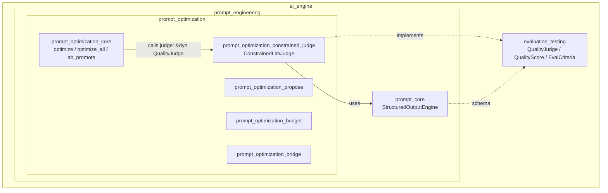
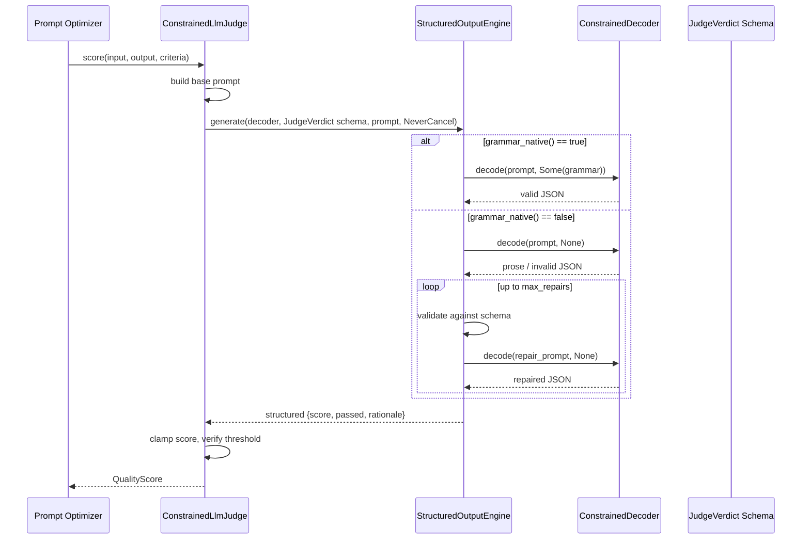
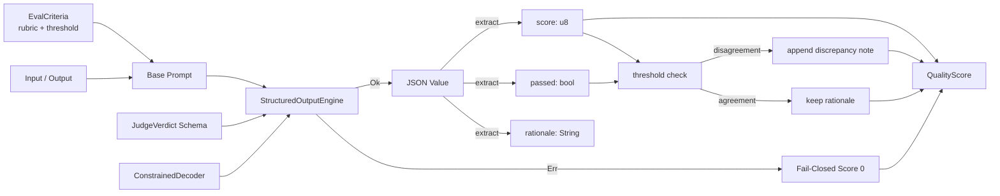
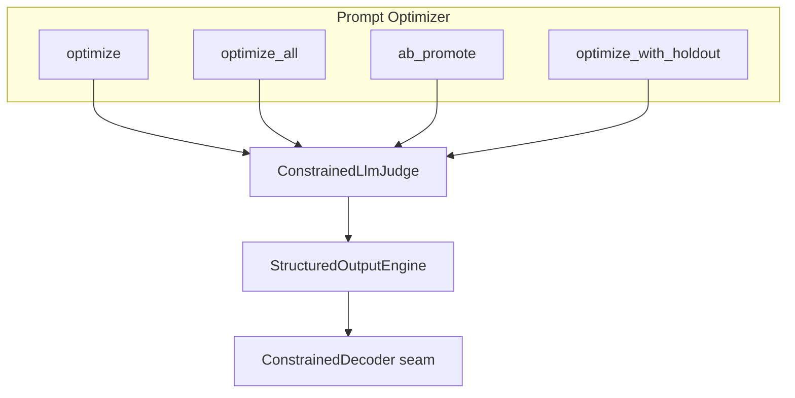
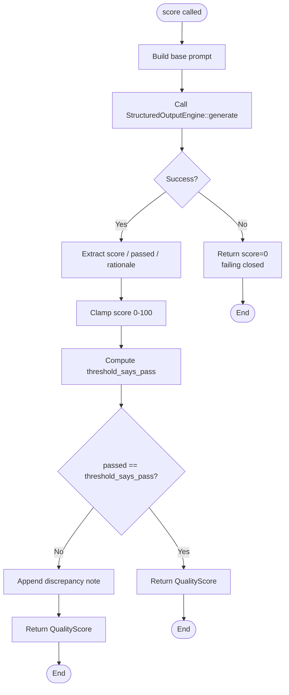

# prompt_optimization_constrained_judge

## Brief Introduction

The `prompt_optimization_constrained_judge` module closes a critical gap between the workspace's constrained-decoding infrastructure and its prompt-optimization pipeline. It provides [`ConstrainedLlmJudge`], a [`QualityJudge`](ainxt_eval.md) implementation that routes every judge-model verdict through [`StructuredOutputEngine::generate`](prompt_core.md) instead of relying on ad-hoc text parsing. This ensures that prompt optimization — which must evaluate many candidate prompts across many model families — can obtain schema-valid `{score, passed, rationale}` verdicts even from self-hosted models that do not natively enforce JSON output grammar.

The module lives in `crates/ainxt-promptopt/src/constrained_judge.rs` and is the real production caller for the generalized constrained-decoding engine's `JudgeVerdict` schema. It is intentionally placed in `ainxt-promptopt` because that crate already depends on both `ainxt-prompt` (constrained decoding) and `ainxt-eval` (judge traits), avoiding a dependency cycle that would occur if the implementation lived in `ainxt-eval`.

---

## Core Components

### `ConstrainedLlmJudge<D: ConstrainedDecoder>`

A [`QualityJudge`](ainxt_eval.md) backend that wraps [`StructuredOutputEngine`](prompt_core.md) to decode judge-model replies.

| Responsibility | Description |
|----------------|-------------|
| Schema-valid verdict extraction | Calls `StructuredOutputEngine::generate` with `StructuredOutputKind::JudgeVerdict`, which guarantees a JSON object matching `{score: integer, passed: boolean, rationale: string}`. |
| Bounded repair loop | Inherits the engine's bounded repair mechanism for non-grammar-native decoders, preventing unbounded spend during optimizer sweeps. |
| Fail-closed scoring | Any decode or schema failure returns `score: 0` with an explanatory rationale, never fabricating a passing score. |
| Threshold enforcement | Compares the model's `passed` claim against the numeric score and threshold, surfacing any disagreement in the rationale. |

#### Construction

- `ConstrainedLlmJudge::new(decoder: D)` — creates a judge with the default repair budget (3 repairs, matching `StructuredOutputEngine::default()`).
- `ConstrainedLlmJudge::with_max_repairs(decoder: D, max_repairs: usize)` — creates a judge with an explicit hard cap on repair attempts, protecting optimizer budgets from pathological models.

#### `QualityJudge::score` behavior

1. Builds a calibrated base prompt from the input, output, and [`EvalCriteria`](ainxt_eval.md).
2. Invokes `StructuredOutputEngine::generate` with the `JudgeVerdict` schema.
3. On success, extracts `score`, `passed`, and `rationale` from the structured value.
4. Clamps `score` to the `[0, 100]` range.
5. Recomputes `threshold_says_pass = score >= criteria.threshold` and, if it disagrees with the model's `passed` claim, appends a discrepancy note to the rationale.
6. On failure, returns `QualityScore { score: 0, rationale: "constrained-decoding judge failed — failing closed..." }`.

### Test Fixtures

The module includes several test-only decoder implementations used to exercise all code paths:

- **`EchoModel`** — a minimal [`ModelSeam`](prompt_optimization_core.md) used in end-to-end optimizer tests.
- **`WeakJudgeModel`** — simulates a self-hosted model that emits prose on the first attempt but produces valid JSON once the repair prompt includes the validation error.
- **`HopelessJudgeModel`** — simulates a model that never emits valid JSON, verifying fail-closed behavior.
- **`NativeDecoder`** — a grammar-native decoder that returns valid JSON on the first attempt.

---

## Architecture

### Position in the System

### Component Interaction

### Data Flow

---

## Dependencies

### Direct Dependencies

| Crate / Module | Components Used | Purpose |
|----------------|-----------------|---------|
| [`ainxt_eval`](ainxt_eval.md) | `QualityJudge`, `QualityScore`, `EvalCriteria` | Defines the judge trait and verdict types consumed by the optimizer. |
| [`ainxt_prompt::constrained`](prompt_core.md) | `ConstrainedDecoder`, `StructuredOutputEngine`, `StructuredOutputKind`, `NeverCancel` | Provides the constrained-decoding engine and decoder seam. |

### Why This Crate?

`ainxt-promptopt` is the only crate that can legally depend on both `ainxt-prompt::constrained` and `ainxt-eval::QualityJudge`:

- `ainxt-prompt` already depends on `ainxt-eval` (registry eval-delta gate reuses `evaluate_gate`).
- A reverse dependency from `ainxt-eval` back to `ainxt-prompt` would create a cycle.
- `ainxt-promptopt` depends on both, making it the natural home for the constrained-decoding-backed judge.

---

## Integration with Prompt Optimization

The prompt optimizer entry points in [`prompt_optimization_core`](prompt_optimization_core.md) accept `judge: &dyn QualityJudge`:

- `crate::optimize`
- `crate::optimize_all`
- `crate::ab_promote`
- `crate::optimize_with_holdout`

By passing a `ConstrainedLlmJudge`, the optimizer's per-model-family judging path gains schema-valid verdicts for every model family, including self-hosted deployments that lack native JSON reliability. This directly satisfies the design requirement that judging be "per-model, always" without bespoke parsers for each model family.

---

## Fail-Closed Safety

The module follows the same fail-closed discipline as [`StructuredOutputEngine`](prompt_core.md) and [`LiveProviderJudge`](evaluation_testing.md):

- **Decode failure** → `score: 0`, rationale records the structured error.
- **Schema mismatch** → handled by the engine's repair loop; if unrepairable, returns `score: 0`.
- **Disagreeing `passed` claim** → numeric score and threshold comparison take precedence; the disagreement is surfaced in the rationale.
- **Out-of-range score** → clamped to `[0, 100]`.

This ensures that a judge outage, a misbehaving model, or a schema regression is visible in the eval report and never silently treated as "the candidate failed the rubric" or, worse, "the candidate passed."

---

## Process Flow: Scoring a Candidate Answer

---

## Testing Strategy

The module's unit tests cover the full matrix of decoder behaviors:

| Test | Scenario | Expected Result |
|------|----------|-----------------|
| `gap_ainxt_promptopt_prmt_11_native_decoder_path_is_used` | Grammar-native decoder returns valid JSON immediately. | Score and rationale extracted directly. |
| `gap_ainxt_promptopt_prmt_11_weak_model_verdict_repairs_through_the_engine` | Weak model emits prose, then valid JSON after repair prompt. | Verdict repaired through the engine. |
| `gap_ainxt_promptopt_prmt_11_unrepairable_model_fails_closed_never_fabricates_a_pass` | Model never emits valid JSON. | `score: 0`, rationale contains "failing closed". |
| `gap_ainxt_promptopt_prmt_11_disagreeing_passed_claim_is_surfaced_not_masked` | Model claims `passed=true` but score is below threshold. | Discrepancy visible in rationale. |
| `gap_ainxt_promptopt_prmt_11_plugs_into_optimize_unchanged` | End-to-end through `optimize` with an `EchoModel` seam. | Optimizer produces a winner and ranked results. |

---

## Related Documentation

- [`prompt_optimization_core`](prompt_optimization_core.md) — optimizer entry points that consume `QualityJudge`.
- [`prompt_optimization_propose`](prompt_optimization_propose.md) — candidate prompt generation.
- [`prompt_optimization_budget`](prompt_optimization_budget.md) — cost modeling and budget enforcement for optimization sweeps.
- [`prompt_optimization_bridge`](prompt_optimization_bridge.md) — bridging models used during optimization.
- [`prompt_core`](prompt_core.md) — constrained decoding engine (`StructuredOutputEngine`, `ConstrainedDecoder`).
- [`ainxt_eval`](ainxt_eval.md) — evaluation traits and types (`QualityJudge`, `QualityScore`, `EvalCriteria`).
- [`evaluation_testing`](evaluation_testing.md) — broader evaluation and judging infrastructure, including `LiveProviderJudge`.
