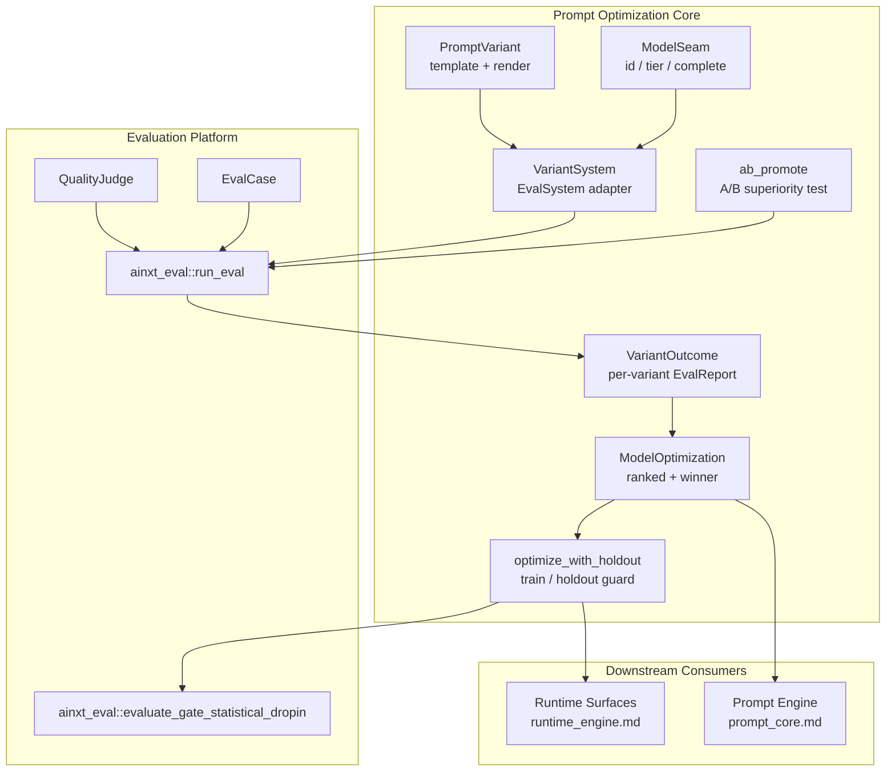
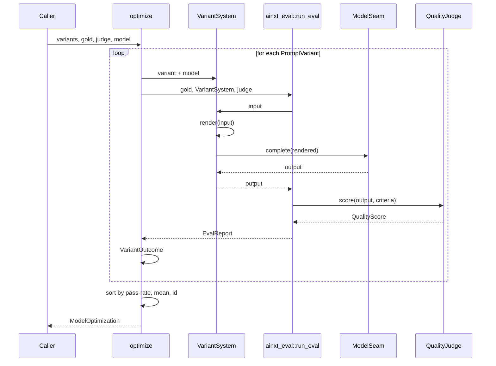
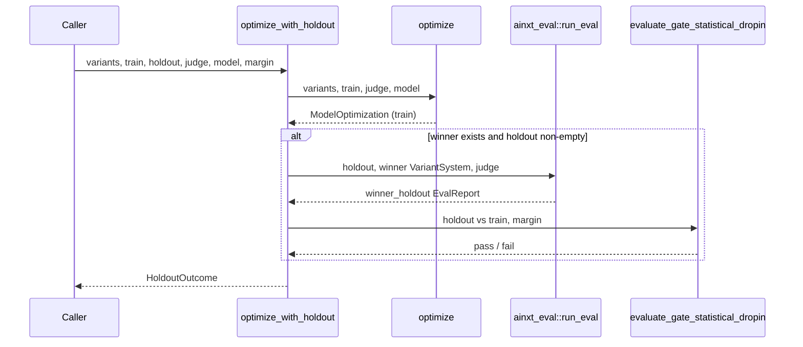
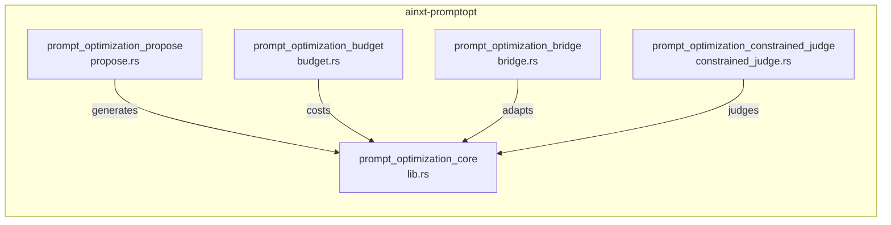
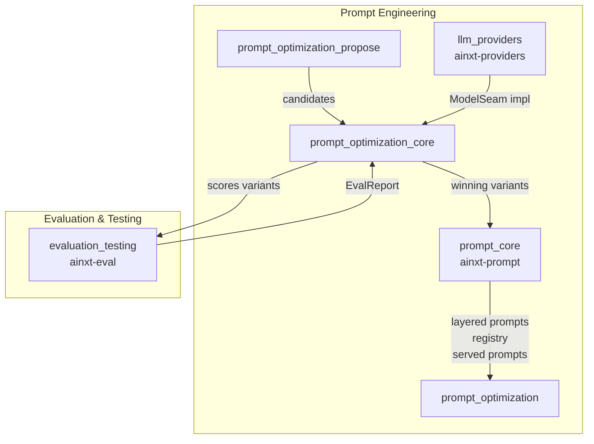
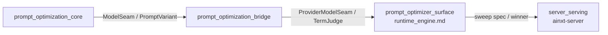

# Prompt Optimization Core (`ainxt-promptopt`)

## Brief Introduction

The **Prompt Optimization Core** module (`crates/ainxt-promptopt`, Phase P5) treats prompt text as a **search space** and the quality-evaluation gold set as the **objective function**. It automates the discovery of the best task instructions for a given model by generating candidate prompt variants, scoring each variant through the exact same evaluation gate used in production, and selecting a deterministic winner. The module is built *on top of* the evaluation platform ([`ainxt-eval`](evaluation_testing.md)) so that optimization inherits the gate's independent-judge discipline rather than inventing a second scorer.

This crate is the central orchestration layer of the broader [Prompt Optimization](prompt_optimization.md) subsystem. It provides the core algorithms for search/ranking, A/B promotion with non-inferiority margins, and train/holdout overfit detection. Companion submodules handle proposal generation ([prompt_optimization_propose](prompt_optimization_propose.md)), budget modeling ([prompt_optimization_budget](prompt_optimization_budget.md)), bridge adapters to the prompt engine ([prompt_optimization_bridge](prompt_optimization_bridge.md)), and constrained judge implementations ([prompt_optimization_constrained_judge](prompt_optimization_constrained_judge.md)).

---

## Core Functionality

The module provides four interrelated capabilities:

1. **Variant Rendering & Search Space Modeling**  
   A [`PromptVariant`](#promptvariant) is a template containing an `{input}` placeholder. The optimizer renders each variant with every case in the gold set, producing a concrete prompt that can be sent to a model.

2. **Deterministic Ranking & Winner Selection**  
   [`optimize`](#optimize) scores every variant through [`ainxt_eval::run_eval`](evaluation_testing.md), ranks them by pass-rate, mean score, and variant id, and certifies a winner only when there is actual evidence (non-empty variants and non-empty gold set).

3. **A/B Promotion with Superiority Margin**  
   [`ab_promote`](#ab_promote) tests a challenger prompt against a live champion. The challenger displaces the champion only if it is better beyond a configurable margin, preventing churn from noise.

4. **Holdout / Overfit Guard**  
   [`optimize_with_holdout`](#optimize_with_holdout) selects the winner on a train split and then confirms it on a disjoint holdout. If the winner regresses on the holdout beyond a non-inferiority margin, it is flagged as [`overfit`](#holdoutoutcome), reusing [`ainxt_eval::evaluate_gate_statistical_dropin`](evaluation_testing.md) for the regression check.

All model interaction is abstracted through the injected [`ModelSeam`](#modelseam) trait, keeping the optimizer deterministic, clock-free, and exhaustively testable.

---

## Architecture

### Component Overview



### Core Types and Responsibilities

| Type | Responsibility |
|------|----------------|
| [`PromptVariant`](#promptvariant) | Represents one candidate prompt template; renders concrete prompts by substituting `{input}`. |
| [`ModelSeam`](#modelseam) | Injected model interface that provides stable identity, tier, and completion. Keeps the optimizer testable and deterministic. |
| [`VariantSystem`](#variantsystem) | Adapts a `(PromptVariant, ModelSeam)` pair into an [`ainxt_eval::EvalSystem`](evaluation_testing.md) so variants are scored by the production eval gate. |
| [`VariantOutcome`](#variantoutcome) | A single variant's full [`EvalReport`](evaluation_testing.md) on the gold set. |
| [`ModelOptimization`](#modeloptimization) | The complete ranked result for one model, including the certified winner (if any). |
| [`AbResult`](#abresult) | Result of an A/B test between champion and challenger, including pass-rate delta and promotion decision. |
| [`HoldoutOutcome`](#holdoutoutcome) | Train/holdout optimization result with overfit detection. |

---

## Data Flow

### Standard Optimization Flow



### Holdout / Overfit Guard Flow



---

## Component Relationships

### Within Prompt Optimization

The core crate (`lib.rs`) is the algorithmic hub. It delegates specialized concerns to sibling submodules:



- **[prompt_optimization_propose](prompt_optimization_propose.md)** supplies candidate variants (e.g., `ProposeCatalog`, `StepByStepModel`).
- **[prompt_optimization_budget](prompt_optimization_budget.md)** models optimization cost and budgeted outcomes (`OptBudget`, `CostModel`).
- **[prompt_optimization_bridge](prompt_optimization_bridge.md)** connects the optimizer to the served prompt engine (`DraftSpec`, `SbsModel`).
- **[prompt_optimization_constrained_judge](prompt_optimization_constrained_judge.md)** provides judge implementations for constrained or adversarial evaluation (`ConstrainedLlmJudge`, `WeakJudgeModel`).

### Within the AI Engine

The prompt optimizer sits inside the [Prompt Engineering](prompt_engineering.md) domain, between the [Prompt Core](prompt_core.md) and the [Evaluation & Testing](evaluation_testing.md) platform:



### Cross-Cutting Dependencies

- **[evaluation_testing](evaluation_testing.md)** (`ainxt-eval`): The optimizer reuses `run_eval`, `evaluate_gate_statistical_dropin`, `EvalSystem`, `QualityJudge`, `EvalCase`, `EvalReport`, and `GatePolicy`. This ensures the optimization objective is identical to the production quality gate.
- **[prompt_core](prompt_core.md)** (`ainxt-prompt`): Consumes optimized variants through the bridge and serves them via `PromptEngine`, `LayeredAssembler`, and `Registry`.
- **[llm_providers](llm_providers.md)** (`ainxt-providers`): Real `ModelSeam` implementations are typically backed by provider-specific normalizers (OpenAI, Anthropic, Gemini).
- **[core_infrastructure](core_infrastructure.md)** (`ainxt-types`): Provides the `Tier` type used to key results by model complexity class.

---

## Key Algorithms

### Deterministic Winner Selection

The optimizer ranks variants using a fully deterministic ordering:

1. Descending pass-rate (`total_cmp` to avoid NaN ambiguity).
2. Descending mean score.
3. Ascending variant id as a final tie-breaker.

A winner is certified only when both `variants` and `gold` are non-empty. This prevents a winner from being chosen with zero evidence.

### A/B Promotion (Superiority Test)

A challenger only displaces the champion when:

```
challenger.pass_rate - champion.pass_rate > margin
```

This is the superiority mirror of the eval gate's non-inferiority rule: a marginal or equal result is treated as noise, and the incumbent is retained.

### Holdout Overfit Detection

After selecting the train winner, the winner is re-scored on a disjoint holdout. Overfit is determined by calling [`ainxt_eval::evaluate_gate_statistical_dropin`](evaluation_testing.md) with:

- `candidate` = holdout report
- `baseline` = train report
- `noninferiority_margin` = configured margin
- `min_pass_rate` and `min_mean` relaxed to `0`

If the gate fails, the winner is flagged as overfit. An empty holdout yields no confirmation and therefore never reports overfit.

---

## API Reference

### `PromptVariant`

```rust
pub struct PromptVariant {
    pub id: String,
    pub template: String,
}
```

A candidate prompt template. The template may contain the `{input}` placeholder, which is substituted by [`render`](#). The [`uses_input`](#) method exposes whether the template actually references the input — a fixed prompt that wins is a strong overfit signal.

### `ModelSeam`

```rust
pub trait ModelSeam: Send + Sync {
    fn id(&self) -> &str;
    fn tier(&self) -> Tier;
    fn complete(&self, prompt: &str) -> String;
}
```

Injected model abstraction. `id` + `tier` form the per-model optimization key; `complete` produces a deterministic output for a rendered prompt. Tests use fixed models; production implementations call a provider gateway.

### `VariantSystem`

```rust
pub struct VariantSystem<'a> {
    pub variant: &'a PromptVariant,
    pub model: &'a dyn ModelSeam,
}
```

Implements [`ainxt_eval::EvalSystem`](evaluation_testing.md). Its `respond(input)` method renders the variant with the input and asks the model to complete it.

### `optimize`

```rust
pub fn optimize(
    variants: &[PromptVariant],
    gold: &[ainxt_eval::EvalCase],
    judge: &dyn QualityJudge,
    model: &dyn ModelSeam,
) -> ModelOptimization
```

Scores and ranks all variants on the gold set for a single model, returning a deterministic winner (if evidence exists).

### `optimize_all`

```rust
pub fn optimize_all(
    variants: &[PromptVariant],
    gold: &[ainxt_eval::EvalCase],
    judge: &dyn QualityJudge,
    models: &[&dyn ModelSeam],
) -> Vec<ModelOptimization>
```

Runs [`optimize`](#optimize) once per model, preserving model order and keeping results keyed by `model_id`/`tier`.

### `ab_promote`

```rust
pub fn ab_promote(
    champion: &PromptVariant,
    challenger: &PromptVariant,
    gold: &[ainxt_eval::EvalCase],
    judge: &dyn QualityJudge,
    model: &dyn ModelSeam,
    margin: f64,
) -> AbResult
```

A/B tests a challenger against the live champion, promoting only if the challenger exceeds the champion by more than `margin` pass-rate points.

### `optimize_with_holdout`

```rust
pub fn optimize_with_holdout(
    variants: &[PromptVariant],
    train: &[ainxt_eval::EvalCase],
    holdout: &[ainxt_eval::EvalCase],
    judge: &dyn QualityJudge,
    model: &dyn ModelSeam,
    margin: f64,
) -> HoldoutOutcome
```

Selects the winner on `train`, re-scores it on `holdout`, and flags overfit when the holdout regresses beyond `margin`.

---

## Integration with the Runtime

The runtime surfaces layer ([runtime_engine](runtime_engine.md)) exposes a `prompt_optimizer_surface` that wires the optimizer into the serving path. The bridge submodule ([prompt_optimization_bridge](prompt_optimization_bridge.md)) adapts between the optimizer's `ModelSeam`/`PromptVariant` types and the runtime's `ProviderModelSeam`, `ProviderConstrainedDecoder`, and `TermJudge` components.



---

## Testing Strategy

The module's test suite is self-contained and uses fixed `ModelSeam` implementations to verify:

- Correct template rendering and placeholder substitution.
- Deterministic tie-breaking by variant id.
- A/B promotion and retention behavior at the margin.
- Holdout overfit detection, including the statistical paired-case regression guard.
- Per-model keying (different models select different winning prompts).
- Empty-input edge cases (no variants, empty gold, empty holdout).
- Serialization round-tripping of `ModelOptimization`.

Because all I/O and non-determinism are injected through `ModelSeam` and `QualityJudge`, the optimizer is fully unit-testable without network calls or clocks.

---

## Related Documentation

- [prompt_optimization](prompt_optimization.md) — parent module overview
- [prompt_optimization_propose](prompt_optimization_propose.md) — variant proposal generation
- [prompt_optimization_budget](prompt_optimization_budget.md) — cost and budget modeling
- [prompt_optimization_bridge](prompt_optimization_bridge.md) — runtime bridge adapters
- [prompt_optimization_constrained_judge](prompt_optimization_constrained_judge.md) — constrained judge implementations
- [prompt_core](prompt_core.md) — prompt engine, registry, and layered assembly
- [evaluation_testing](evaluation_testing.md) — evaluation platform and quality gates
- [llm_providers](llm_providers.md) — provider normalizers and model gateways
- [runtime_engine](runtime_engine.md) — runtime surfaces including `prompt_optimizer_surface`
