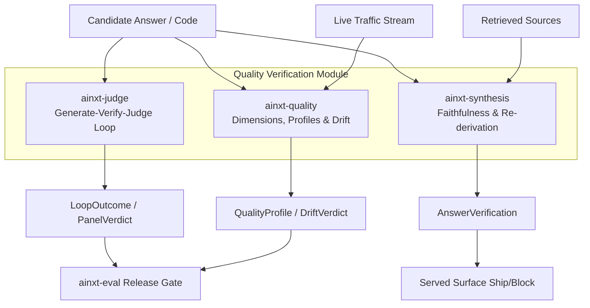
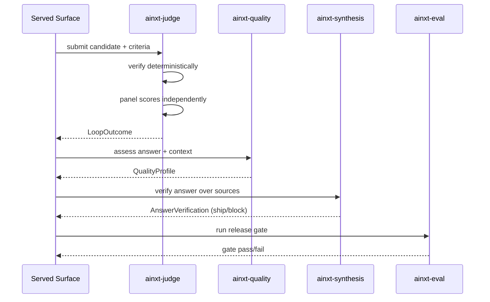

# Quality Verification Module

The **quality_verification** module is the `ai_engine` layer responsible for measuring, judging, and safeguarding the quality of generated answers and code candidates. It separates *correctness* (handled by the eval keystone) from *quality* (completeness, format, tone, groundedness, citation) and provides deterministic, testable mechanisms to detect regressions both before and after release.

## Purpose

- **Judge generated artifacts** with independent, context-isolated panels that cannot be swayed by a candidate's own summary.
- **Score answer quality** across multiple dimensions and aggregate those dimensions into configurable profiles.
- **Detect quality drift** in production traffic using streaming CUSUM change-point detection and anytime-valid canaries.
- **Verify answer faithfulness** against retrieved sources, detect cross-source conflicts, and re-derive stated numbers against server-side truth.

All core algorithms are pure and deterministic (no clock, no RNG), so release gates, canary decisions, and incident replays reproduce identically offline.

## Architecture Overview

### Sub-module Responsibilities

| Sub-module | Crate | Responsibility |
|------------|-------|----------------|
| [Judge Loop](quality_verification_judge.md) | `ainxt-judge` | Bounded generate → verify → judge loops with independent panels, context isolation, and stuck/thrash detection. |
| [Quality Assessment](quality_verification_quality.md) | `ainxt-quality` | Multi-dimensional answer scoring, weighted profile aggregation, two-sample drift detection, and online release canary/rollback control. |
| [Synthesis & Re-derivation](quality_verification_synthesis.md) | `ainxt-synthesis` | Source deduplication, cross-source conflict detection, claim attribution, numeric-claim contracts, and server-side numeric re-derivation gates. |

## High-Level Data Flow

## Relationship to the Rest of the System

- **ai_engine / answer_artifact**: `ainxt-quality` scores the textual answers that `ainxt-answer` composes and the artifacts that `ainxt-artifact` renders.
- **ai_engine / safety_guardrails**: Guardrails block unsafe outputs upstream; quality verification measures the *quality* of outputs that are already deemed safe.
- **ai_engine / knowledge_retrieval**: `ainxt-synthesis` consumes `Source` objects that correspond to chunks produced by `ainxt-retrieval` and `ainxt-context`.
- **ai_engine / evaluation_testing**: `ainxt-quality` provides `DimensionJudge` and `ProfileJudge` adapters so quality dimensions can drive the `ainxt-eval` release gate.
- **core_infrastructure / security_config**: `DataClass` sensitivity labels flow from sources through synthesis into the ledger-class numeric gate.
- **pipeline_runtime**: `ainxt-judge` primitives (`JudgePanel`, `StuckDetector`, `Reviewer`) are imported by `ainxt-pipeline` self-heal stages.

## Key Design Invariants

1. **Independent judges** — each judge sees only the candidate and criteria, never another judge's verdict.
2. **Context isolation** — the judge panel never sees a coder's self-summary, preventing sycophancy.
3. **Honest capping** — a loop that exhausts its budget without consensus returns `capped = true` and `succeeded = false`; the two are never both true.
4. **Determinism** — all scoring, drift detection, and conflict arbitration is clock-free and RNG-free.
5. **Fail-closed numeric gates** — a stated number that cannot be re-derived or that mismatches server truth blocks the answer.

## Sub-module Documentation

The following sub-module files were generated for the detailed component documentation:
- [quality_verification_judge.md](quality_verification_judge.md) — SDLC judge loop, panels, reviewers, and stuck detection.
- [quality_verification_quality.md](quality_verification_quality.md) — Quality dimensions, profiles, drift monitoring, and online release controller.
- [quality_verification_synthesis.md](quality_verification_synthesis.md) — Source synthesis, conflict arbitration, faithfulness, and numeric re-derivation.
