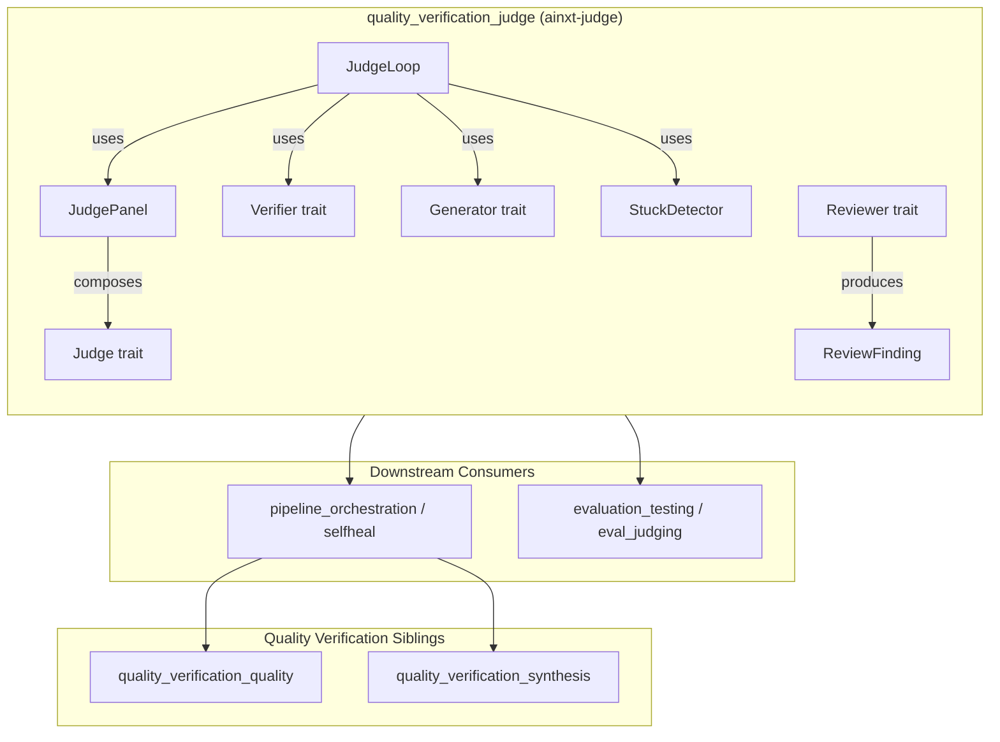
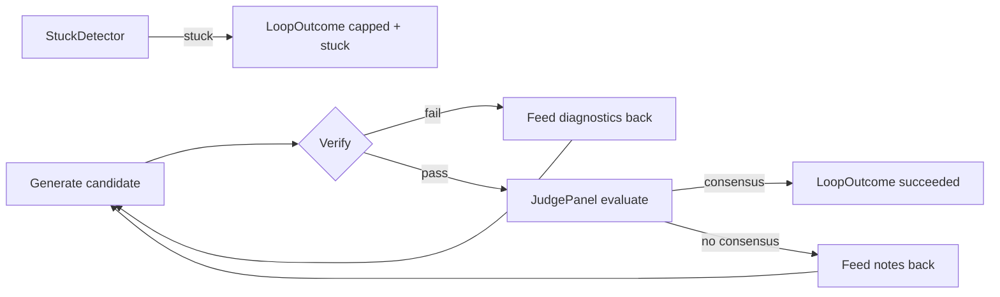
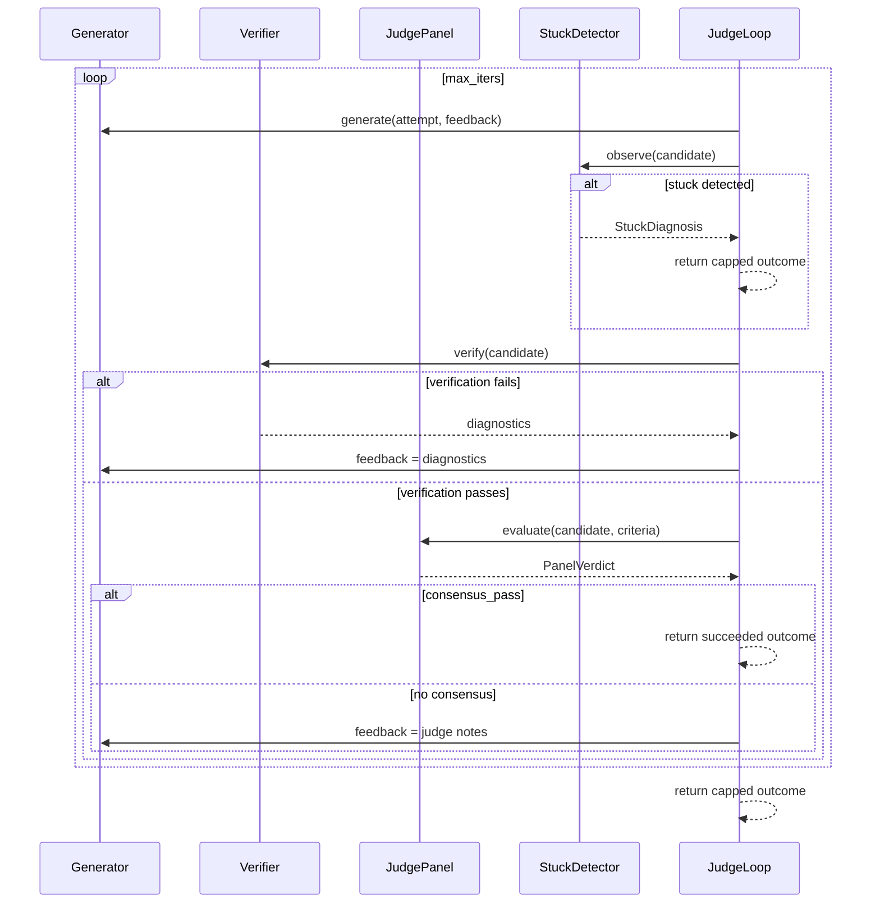

# quality_verification_judge

## Brief Introduction

`quality_verification_judge` (`ainxt-judge`) is the **SDLC judge loop** for the AI engine's quality-verification layer. It implements a bounded, deterministic **generate → verify → judge → iterate** cycle with three core guarantees:

1. **Deterministic verification gates LLM judgment.** A candidate that fails compile/test/lint checks never reaches the judge panel.
2. **Judges are independent.** Each judge scores a candidate in isolation; consensus requires a strict majority.
3. **Honest capping.** If the loop exhausts its iteration budget without consensus, it returns `capped = true` and `succeeded = false` — it never silently report failure as success.

The crate provides reusable primitives (`JudgePanel`, `StuckDetector`, `Reviewer`, `JudgeLoop`) that are consumed by the production self-heal pipeline in [`pipeline_orchestration`](pipeline_orchestration.md) and by evaluation harnesses in [`evaluation_testing`](evaluation_testing.md).

---

## Architecture



The crate is intentionally **pure and seam-driven**: `Generator`, `Verifier`, and `Judge` are traits, so the control-flow invariants (independent judging, strict-majority consensus, honest capping, stuck detection) can be exhaustively unit-tested with scripted implementations.

---

## Core Components

### 1. Criteria and Verdicts

| Component | Purpose |
|-----------|---------|
| `JudgeCriteria` | Defines the goal and per-judge passing threshold (0–100). |
| `JudgeVerdict` | One judge's score, pass/fail flag, and explanatory notes. |
| `PanelVerdict` | Aggregate of all judges: mean score, strict-majority consensus, and a `context_isolation_confirmed` flag. |

`PanelVerdict::context_isolation_confirmed` is a safety marker: it is `true` only when the panel evaluated a `CoderSubmission` through `JudgePanel::evaluate_submission`, which structurally withholds the coder's self-summary from every judge.

### 2. `JudgePanel`

A panel composes multiple `Judge` implementations. Each judge receives **only** the candidate and criteria — never another judge's verdict. Consensus requires:

```
passed * 2 > n   // strict majority, not just plurality
```

Two entry points:

- `evaluate(candidate, criteria)` — raw evaluation; caller vouches for candidate contents.
- `evaluate_submission(submission, criteria)` — **context-isolated** evaluation; strips `self_summary`.

### 3. `CoderSubmission` and the Reviewer Role

`CoderSubmission` separates:

- `candidate` — the artifact under judgment.
- `self_summary` — the coder's own completion claim.

The `Reviewer` trait implements the **finder** role from the code-review pipeline: it may see the self-summary and produces `ReviewFinding`s. Only **actionable** findings (cited lines + concrete failure message) survive `actionable_review`. This anti-noise filter prevents unreferenced stylistic opinions from reaching the coder.

### 4. `StuckDetector`

Detects thrashing **before** the iteration budget burns out. Two modes:

- `NoProgress` — the last `window` candidates are pairwise-similar above `threshold` (token-set Jaccard).
- `Cycle` — a candidate re-equals an earlier non-immediate candidate, indicating oscillation.

The detector is pure (no clock/RNG) and reusable; the production self-heal pipeline imports the same type.

### 5. `JudgeLoop`

The bounded orchestrator:



Key invariants:

- `succeeded` and `capped` are never both `true`.
- A failing candidate is never judged; diagnostics flow back as generator feedback.
- The best verified candidate is retained and returned even on cap.

### 6. Seams

| Trait | Role |
|-------|------|
| `Generator` | Produces a candidate for attempt `n`, optionally using prior feedback. |
| `Verifier` | Runs deterministic checks; returns `VerifyResult` with diagnostics. |
| `Judge` | Scores a verified candidate independently. |
| `Reviewer` | Produces actionable code-review findings (finder, not adjudicator). |

`NoVerifier` is provided for surfaces with no deterministic check to run.

---

## Data Flow

### Context-Isolated Judgment

```mermaid
sequenceDiagram
    participant Caller
    participant JudgePanel
    participant Judge1 as Judge 1
    participant Judge2 as Judge 2
    participant JudgeN as Judge N

    Caller->>JudgePanel: evaluate_submission(CoderSubmission, criteria)
    Note over JudgePanel: Drops self_summary&#59; only candidate crosses
    JudgePanel->>Judge1: score(candidate, criteria)
    JudgePanel->>Judge2: score(candidate, criteria)
    JudgePanel->>JudgeN: score(candidate, criteria)
    Judge1-->>JudgePanel: JudgeVerdict
    Judge2-->>JudgePanel: JudgeVerdict
    JudgeN-->>JudgePanel: JudgeVerdict
    JudgePanel-->>Caller: PanelVerdict(context_isolation_confirmed=true)
```



### Full Judge Loop



---

## Dependencies and Relationships

### Within `quality_verification`

- [`quality_verification_quality`](quality_verification_quality.md) — dimension-based quality assessment (completeness, groundedness, tone, citations). The judge panel provides pass/fail adjudication; quality provides continuous dimension scoring.
- [`quality_verification_synthesis`](quality_verification_synthesis.md) — claim verification, source rederivation, and conflict resolution. Synthesis produces verified claims that may become inputs to judge criteria or review findings.

### Downstream Consumers

- [`pipeline_orchestration`](pipeline_orchestration.md) — the production self-heal loop (`run_selfheal_reclassified`) imports `JudgePanel`, `StuckDetector`, and `Reviewer`/`actionable_review` from this crate. It reimplements only the outer round-control shell (re-classification, stage caching) while reusing the judging primitives.
- [`evaluation_testing`](evaluation_testing.md) — evaluation harnesses use judge panels, calibrated judges, and keyword judges to score eval cases.

### Related AI Engine Modules

- [`answer_artifact`](answer_artifact.md) — answer composition and artifact rendering; judge criteria often target answer quality produced here.
- [`prompt_engineering`](prompt_engineering.md) — prompt assembly and constrained decoding; generator/verifier seams may be backed by prompt-engineering components.

---

## Process Flows

### Code Review Pipeline Mapping

| Pipeline Stage | This Crate's Role |
|----------------|-------------------|
| Coder generates candidate | `Generator` seam |
| Compile/test/lint gate | `Verifier` seam |
| Independent adjudication | `JudgePanel::evaluate_submission` |
| Finder / LLM review | `Reviewer` + `actionable_review` |
| Thrash detection | `StuckDetector` |
| Honest budget cap | `JudgeLoop` / `LoopOutcome` |

### Anti-Sycophancy Guarantee

The `self_summary` is the coder's claim of completeness. If a judge saw it, a confident but wrong summary could bias the verdict. `evaluate_submission` structurally removes this channel, and `context_isolation_confirmed` lets downstream callers audit that isolation was applied.

### Honest Capping Guarantee

`LoopOutcome` encodes:

- `succeeded == true` → consensus reached within budget.
- `capped == true` → budget exhausted or stuck detected; `succeeded` is `false`.
- `capped == false && succeeded == false` → not possible from `JudgeLoop::run`.

The production pipeline encodes the same idea more strongly in the type system via `PipelineOutcome::Complete` and a private `CommitApproval` seal; see [`pipeline_orchestration`](pipeline_orchestration.md).

---

## Testing Strategy

The crate's test suite exercises every invariant with scripted seams:

- **Strict majority** — 2/3 passes consensus; 1/2 does not.
- **Verifier gates the panel** — broken candidates never increment judge call counters.
- **Feedback flow** — failing judge notes are fed to the next generator attempt.
- **Honest cap** — `capped && !succeeded` when the budget exhausts without consensus.
- **Context isolation** — a misleading `self_summary` cannot talk the panel into passing.
- **Actionable review** — findings without line references or concrete messages are filtered.
- **Stuck detection** — no-progress and oscillation cycles abort early before the round cap.

Because all dependencies are traits, the loop is fully deterministic and suitable for property-based or exhaustive testing.

---

## Key Design Decisions

1. **Traits over concrete LLM clients.** The crate never calls an LLM directly; it defines seams so callers can plug in provider-specific implementations from [`llm_providers`](llm_providers.md).
2. **No wall-clock timeouts.** Boundedness comes from iteration count and optional stuck detection, keeping behavior deterministic and reproducible.
3. **Separation of finder and adjudicator.** `Reviewer` may see the self-summary; `JudgePanel` must not. This mirrors human code-review roles.
4. **Token-set Jaccard for similarity.** Cheap, deterministic, and good enough to detect thrashing in code-like candidates.
