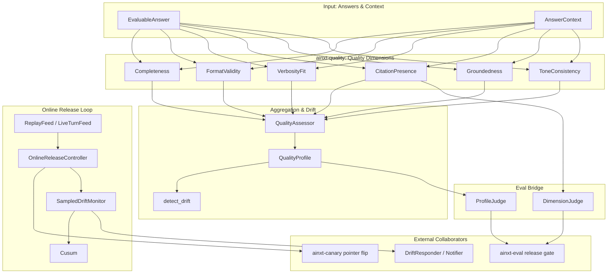
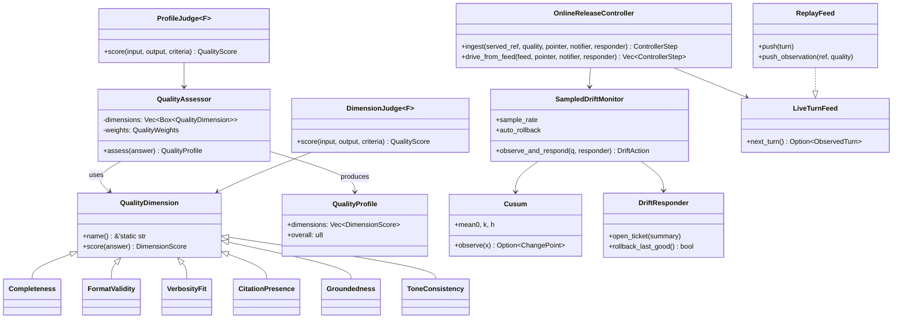
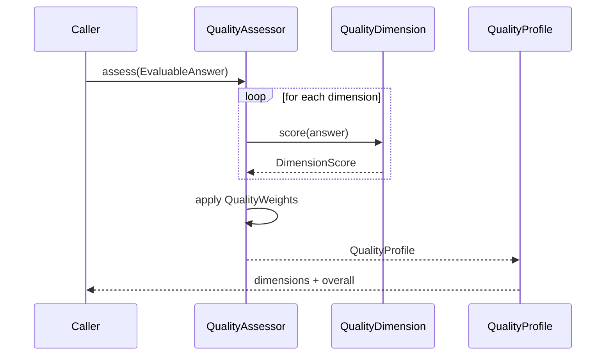
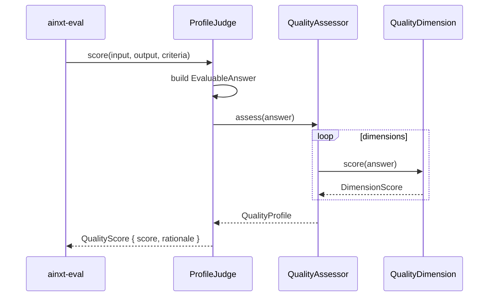
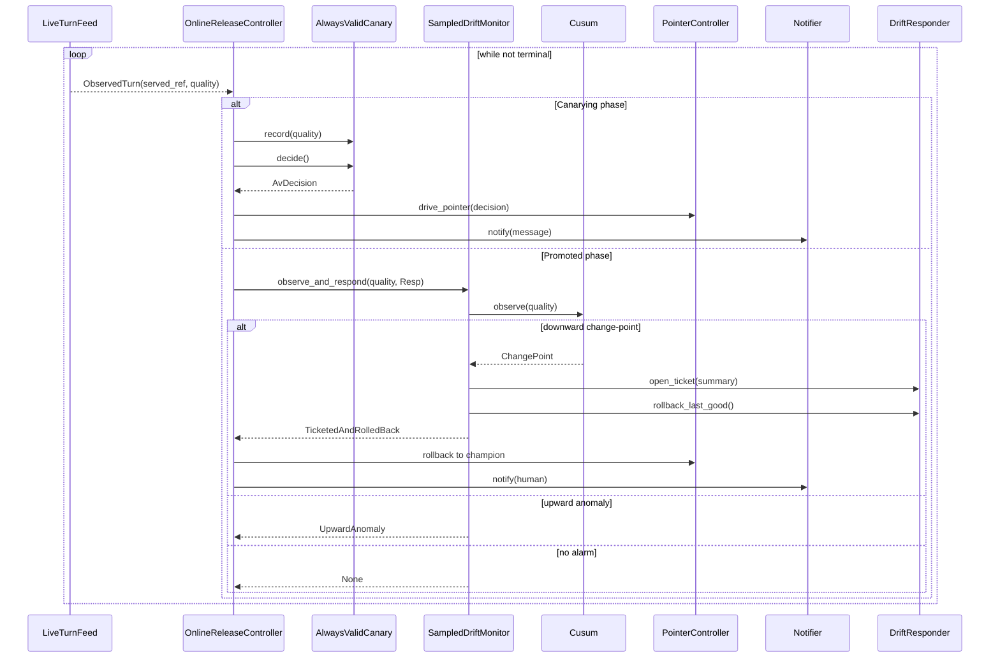
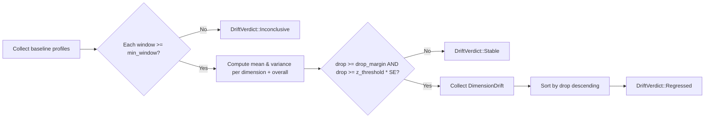

# quality_verification_quality

## Brief Introduction

The `quality_verification_quality` module (`crates/ainxt-quality`) measures **answer quality** as a distinct axis from correctness, and provides the production machinery to detect and respond to **quality drift after release**. While the eval keystone ([`evaluation_testing`](evaluation_testing.md)) gates correctness at release time, this module focuses on whether answers remain complete, well-formatted, properly cited, grounded in sources, appropriately verbose, and tonally consistent over time.

The module serves three primary purposes:

1. **Quality Assessment** — Score answers across six deterministic dimensions and aggregate them into a weighted [`QualityProfile`].
2. **Release-Gate Bridge** — Expose individual dimensions or the full profile as [`ainxt_eval::QualityJudge`](evaluation_testing.md) implementations so quality can block or admit a candidate at release time.
3. **Online Drift Monitoring** — Watch live traffic for sustained quality regression using a streaming CUSUM detector, and drive auto-ticket / auto-rollback through the online release controller.

All scoring and detection logic is deterministic (no RNG, no clock), making the module fully testable offline and replayable from recorded streams.

---

## Architecture Overview

---

## Core Components

### 1. Quality Dimensions (`lib.rs`)

A [`QualityDimension`](crates/ainxt-quality/src/lib.rs::QualityDimension) is a named, deterministic heuristic that maps an [`EvaluableAnswer`](crates/ainxt-quality/src/lib.rs::EvaluableAnswer) to a 0–100 [`DimensionScore`](crates/ainxt-quality/src/lib.rs::DimensionScore) with a rationale. The standard dimensions are:

| Dimension | Purpose | Key Inputs |
|-----------|---------|------------|
| [`Completeness`](crates/ainxt-quality/src/lib.rs::Completeness) | Coverage of required points from the question | `required_points` |
| [`FormatValidity`](crates/ainxt-quality/src/lib.rs::FormatValidity) | Conformance to declared output format (`Prose`, `Markdown`, `BulletList`, `Table`, `Json`) | `expected_format` |
| [`VerbosityFit`](crates/ainxt-quality/src/lib.rs::VerbosityFit) | Length inside target word band | `target_len` (`LengthBand`) |
| [`CitationPresence`](crates/ainxt-quality/src/lib.rs::CitationPresence) | Claims cited with in-range markers when sources exist | `sources`, citation markers `[n]` |
| [`Groundedness`](crates/ainxt-quality/src/lib.rs::Groundedness) | Fraction of content words supported by sources | `sources`, answer text |
| [`ToneConsistency`](crates/ainxt-quality/src/lib.rs::ToneConsistency) | Professional tone; penalties for hedging, apologies, shouting | `data_class` (stricter for regulated) |

Each dimension is implemented as a stateless struct implementing `QualityDimension`, so they can be swapped, composed, or replaced by LLM-based judges from [`quality_verification_judge`](quality_verification_judge.md) behind the same trait shape.

### 2. Profile Aggregation (`lib.rs`)

[`QualityAssessor`](crates/ainxt-quality/src/lib.rs::QualityAssessor) runs a fixed set of dimensions with configurable [`QualityWeights`](crates/ainxt-quality/src/lib.rs::QualityWeights) and produces a [`QualityProfile`](crates/ainxt-quality/src/lib.rs::QualityProfile). Weights are non-negative and default to uniform. The profile exposes per-dimension scores and a weighted overall score.

### 3. Drift Detection (`lib.rs`)

[`detect_drift`](crates/ainxt-quality/src/lib.rs::detect_drift) compares an ordered baseline window of profiles against a recent window using a two-sample change-point test. A regression must exceed both an absolute `drop_margin` and a `z_threshold` standard-error threshold. The result is one of:

- `DriftVerdict::Stable`
- `DriftVerdict::Regressed(Vec<DimensionDrift>)` — worst drop first
- `DriftVerdict::Inconclusive(String)` — honest cold-start when windows are too small

This offline windowed test is the analytical counterpart to the streaming monitor described below.

### 4. Eval Bridge (`lib.rs`)

To participate in the release gate, the module provides:

- [`DimensionJudge<F>`](crates/ainxt-quality/src/lib.rs::DimensionJudge) — drives [`ainxt_eval::QualityJudge`](evaluation_testing.md) from a single dimension.
- [`ProfileJudge<F>`](crates/ainxt-quality/src/lib.rs::ProfileJudge) — drives the gate from the aggregate `QualityProfile`.

Both take a builder closure `F` that maps the eval seam `(input, output, criteria)` into an `EvaluableAnswer` with the full `AnswerContext` the dimensions need.

### 5. Streaming Drift Monitor (`monitor.rs`)

[`SampledDriftMonitor`](crates/ainxt-quality/src/monitor.rs::SampledDriftMonitor) ingests live quality scores, samples every Nth observation deterministically, and feeds a tabular [`Cusum`](crates/ainxt-quality/src/monitor.rs::Cusum) detector. On a downward change-point it invokes a [`DriftResponder`](crates/ainxt-quality/src/monitor.rs::DriftResponder) to open a ticket and optionally roll back.

Key tunables:

- `mean0` — in-control baseline mean
- `k` / `h` — CUSUM slack and decision interval
- `sample_rate` — cost-bounded deterministic sampling
- `auto_rollback` — whether to trigger rollback on confirmed drift

The monitor also supports a **provider silent-update tripwire** via [`provider_silent_update`](crates/ainxt-quality/src/monitor.rs::provider_silent_update), which re-scores a frozen test set and uses a Welch t-test plus a control-plane-change flag to isolate unexplained provider model shifts from self-inflicted changes.

### 6. Online Release Controller (`controller.rs`)

[`OnlineReleaseController`](crates/ainxt-quality/src/controller.rs::OnlineReleaseController) composes three existing pieces into a live-drivable safety loop:

1. **Canarying** — candidate turns accrue into an anytime-valid canary ([`ainxt_canary::AlwaysValidCanary`](canary.md)); each turn drives the deploy pointer.
2. **Promoted** — the winning candidate becomes `env/prod`; every turn feeds the drift monitor.
3. **RolledBack** — terminal state after a regression.

The controller consumes a [`LiveTurnFeed`](crates/ainxt-quality/src/feed.rs::LiveTurnFeed) of [`ObservedTurn`](crates/ainxt-quality/src/feed.rs::ObservedTurn) observations (`served_ref`, `quality`) and uses production seams for the pointer flip, human notification, and drift response. It is fully deterministic and replayable via the in-memory test doubles.

### 7. Live-Traffic Feed (`feed.rs`)

[`LiveTurnFeed`](crates/ainxt-quality/src/feed.rs::LiveTurnFeed) is the seam between the served path and the controller. [`ReplayFeed`](crates/ainxt-quality/src/feed.rs::ReplayFeed) provides a FIFO implementation that can be preloaded for offline replay or pushed by a served hook stand-in. The production feed is driven by the runtime daemon and is infra-gated.

---

## Component Relationships

---

## Data Flow

### Offline Quality Assessment Flow

### Release Gate Bridge Flow

### Online Release / Drift Response Flow

---

## Process Flows

### Detecting a Quality Regression Offline

### Online Canary → Promote → Drift Watch Lifecycle

```mermaid
stateDiagram-v2
    [*] --> Canarying
    Canarying --> Canarying : candidate turn: record, decide, hold
    Canarying --> Promoted : AvDecision&#58;&#58;Promote
    Canarying --> RolledBack : AvDecision&#58;&#58;Rollback
    Promoted --> Promoted : turn feeds CUSUM, no alarm
    Promoted --> RolledBack : downward change-point
    RolledBack --> [*]
```

---

## Module Boundaries & Dependencies

### Upstream Consumers

- [`evaluation_testing`](evaluation_testing.md) — uses `DimensionJudge` and `ProfileJudge` as `QualityJudge` implementations in eval pipelines and release gates.
- [`runtime_engine`](runtime_engine.md) / [`server_serving`](server_serving.md) — the runtime daemon wires the production `LiveTurnFeed` onto the served turn handler and supplies the real `PointerController`, `Notifier`, and `DriftResponder`.
- [`canary`](canary.md) — the online release controller depends on `AlwaysValidCanary` and `drive_pointer` for the pre-promotion non-inferiority test and pointer flip.

### Downstream / Sibling Collaborators

- [`quality_verification_judge`](quality_verification_judge.md) — provides LLM-based judges that can implement the same `QualityDimension` shape for richer semantic groundedness or tone assessment.
- [`quality_verification_synthesis`](quality_verification_synthesis.md) — performs source rederivation and numeric verification; its outputs can inform the `Groundedness` and `CitationPresence` dimensions.
- [`knowledge_retrieval`](knowledge_retrieval.md) — supplies retrieved sources and citations that feed `Groundedness` and `CitationPresence`.

### Internal Crate Structure

| File | Responsibility |
|------|----------------|
| `src/lib.rs` | Dimensions, weights, profile, drift detection, eval bridge |
| `src/monitor.rs` | Streaming CUSUM, sampled drift monitor, provider silent-update tripwire |
| `src/controller.rs` | Online release controller state machine |
| `src/feed.rs` | Live-turn feed seam and replay implementation |

---

## Key Design Decisions

1. **Quality is separate from correctness.** The module deliberately does not judge factual accuracy; that is the domain of [`ainxt-eval`](evaluation_testing.md) and [`ainxt-synthesis`](quality_verification_synthesis.md). This crate measures presentation, completeness, citation hygiene, and groundedness.
2. **Determinism everywhere.** No RNG, no wall-clock, no hidden state. Sampling is deterministic every-Nth. This makes rollouts replayable and tests stable.
3. **Cold-start honesty.** The canary exposes an advisory `GateMode` until enough evidence has accrued, and drift detection returns `Inconclusive` for under-powered windows.
4. **Seams over I/O.** All production side effects (pointer flip, notification, ticketing, rollback) are behind traits, so the controller is testable with in-memory doubles.
5. **Provider-swap isolation.** The silent-update tripwire separates unexplained score shifts from shifts caused by recorded control-plane changes.

---

## References

- [quality_verification_judge](quality_verification_judge.md) — LLM judge panel and verifier loop.
- [quality_verification_synthesis](quality_verification_synthesis.md) — source rederivation, numeric verification, and conflict resolution.
- [evaluation_testing](evaluation_testing.md) — eval cases, release gates, and quality judges.
- [canary](canary.md) — anytime-valid canary and pointer-flip primitives.
- [knowledge_retrieval](knowledge_retrieval.md) — retrieval, context routing, and citations.
- [runtime_engine](runtime_engine.md) — turn execution and runtime surfaces.
- [server_serving](server_serving.md) — serving infrastructure that hosts the live feed.
