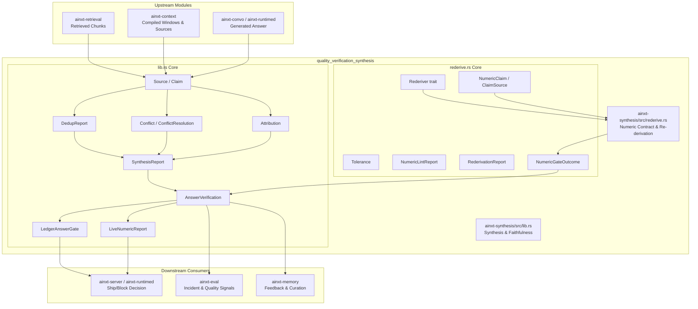
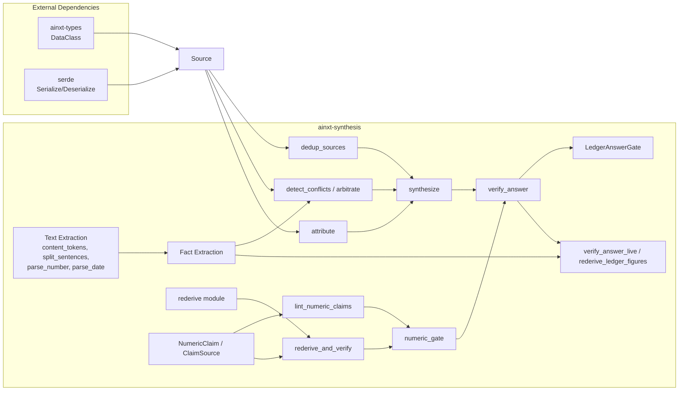
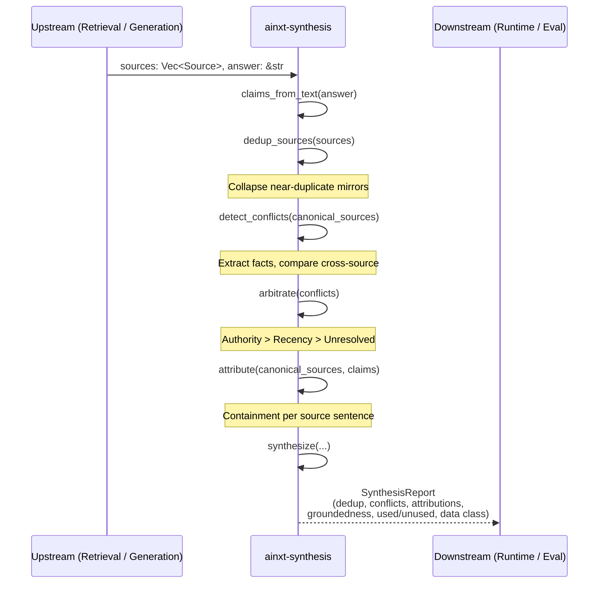
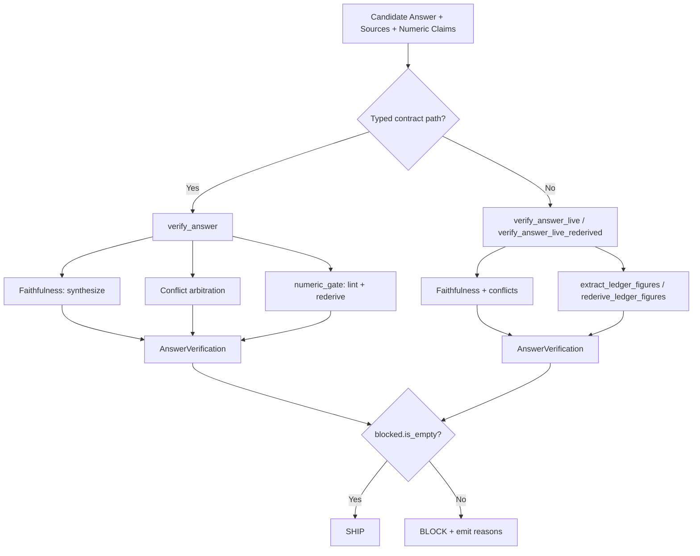
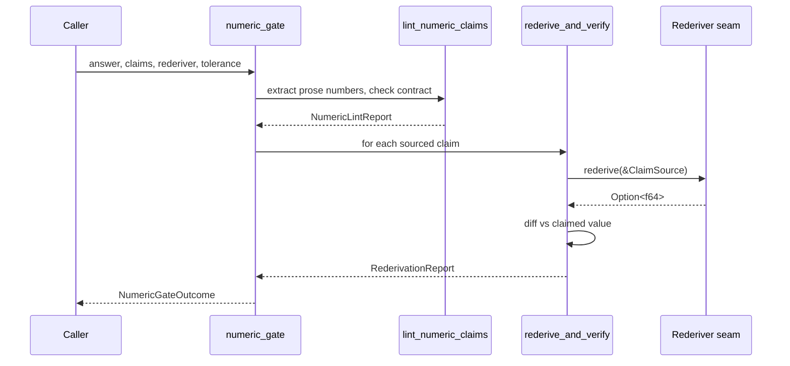
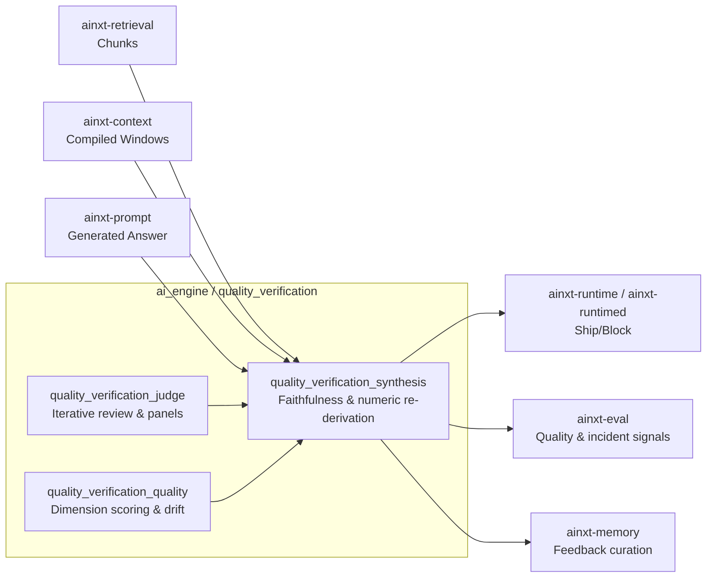

# quality_verification_synthesis

## Brief Introduction

The `quality_verification_synthesis` module (`ainxt-synthesis`) is the **cross-source synthesis and faithfulness gate** of the AiNxt AI engine. It sits downstream of retrieval and generation, answering the critical question: *"Was the retrieved material used faithfully in the generated answer?"*

Operating as a deterministic, dependency-light output-lint seam, the module takes a set of retrieved [`Source`]s and a candidate answer expressed as [`Claim`]s, then produces a [`SynthesisReport`] that surfaces unsupported claims, cross-source conflicts, attribution coverage, and the true data-class sensitivity of the answer's grounding. For payments-critical (ledger-class) answers, it additionally enforces a **numeric re-derivation gate** that independently recomputes every stated figure against server-side truth before the answer may ship.

The module is intentionally conservative and fail-closed: it prefers to flag more claims as ungrounded rather than silently bless a hallucinated or contradictory answer. This bias is essential for a system that handles regulated payment data, where a confidently wrong figure is an incident, not merely a bad answer.

---

## Module Purpose and Core Functionality

`ainxt-synthesis` provides five core capabilities:

1. **Source Deduplication** — Clusters near-duplicate retrieved sources so the same fact mirrored across multiple chunks counts once in downstream analysis.
2. **Cross-Source Conflict Detection** — Identifies contradictions between different sources about the same subject (differing numbers, dates, or negation polarity).
3. **Claim Attribution** — Matches each answer claim to supporting source sentences by lexical containment.
4. **Faithfulness & Coverage Reporting** — Computes groundedness ratios, lists used/unused sources, and reports the highest data-class sensitivity among used sources.
5. **Numeric Re-derivation** — Verifies that stated numbers either carry a typed [`NumericClaim`] contract backed by a reproducible source, or (on the live prose path) that genuine ledger figures re-derive from server-side recomputation.

These capabilities are exposed through a layered API:

| Layer | Entry Point | Purpose |
|-------|-------------|---------|
| Primitives | [`dedup_sources`], [`detect_conflicts`], [`attribute`] | Stand-alone analysis functions for custom pipelines |
| Synthesis | [`synthesize`] | Full pass over sources + claims producing a [`SynthesisReport`] |
| Contract numeric gate | [`verify_answer`] | Typed numeric-claim contract + faithfulness + conflict arbitration |
| Live numeric gate | [`verify_answer_live`], [`verify_answer_live_rederived`] | Contract-free prose path with ledger-figure extraction |
| Ledger default | [`LedgerAnswerGate`] | Payments-safe default that arms the numeric hard-block only for ledger-class sources |

---

## Architecture and Component Relationships

### High-Level Module Architecture

### Component Dependency Graph

---

## Core Components

### Sources and Claims

- [`Source`] — A retrieved source with `id`, `text`, [`DataClass`](ainxt-types.md), and optional `authority`/`timestamp` for conflict arbitration.
- [`Claim`] — A single statement from the candidate answer.
- [`claims_from_text`] — Splits raw answer prose into sentence-level claims.

### Synthesis Pipeline

- [`dedup_sources`] — Clusters sources by content-token Jaccard similarity (default threshold `0.8`). Each cluster keeps one canonical representative.
- [`detect_conflicts`] — Compares facts extracted from different sources and emits [`Conflict`] records when subjects overlap and typed values differ.
- [`arbitrate`] — Resolves a single conflict by **authority first, then recency**. If neither signal separates the sources, the result is [`ResolutionBasis::Unresolved`] and must escalate to a human.
- [`attribute`] — Matches each claim to supporting source sentences using containment (`|claim ∩ source| / |claim|`, default threshold `0.6`).
- [`synthesize`] — Runs the full pipeline and produces a [`SynthesisReport`] with deduplication, conflicts, attributions, unsupported claims, groundedness, used/unused sources, and the highest used-source data class.

### Verification Gate

- [`AnswerVerification`] — The composed ship/block verdict combining [`SynthesisReport`], conflict resolutions, and numeric gate outcome.
- [`BlockReason`] — Enumerates why an answer is blocked: unsupported claim, unresolved conflict, or numeric gate failure.
- [`VerificationPolicy`] — Tunable policy for which sub-gates are hard blocks.
- [`verify_answer`] — Runs faithfulness + conflict arbitration + typed numeric contract gate.

### Ledger-Class Gate

- [`LedgerAnswerGate`] — Payments-safe default. Arms the numeric hard-block only when any grounding source is at/above [`LEDGER_CLASS_FLOOR`] ([`DataClass::Confidential`]).
- [`is_ledger_class`] / [`is_ledger_class_at`] — Determine whether sources trigger ledger-class verification.
- [`SourceRederiver`] — A concrete [`Rederiver`] backed by a `BTreeMap` of server-truth values keyed by `metric:{id}:{query_hash}` or `tool:{call_id}`.

### Live Prose Path

- [`verify_answer_live`] — Contract-free gate for the served `/v1/chat` path. Extracts genuine ledger figures from prose and re-derives them against grounding sources.
- [`verify_answer_live_rederived`] — Same, but uses independently recomputed server-side values for structured/metric sources.
- [`extract_ledger_figures`] / [`rederive_ledger_figures`] — Extract ledger-claim figures and diff them against source text or server recomputation.
- [`LiveNumericReport`] / [`LedgerFigureFinding`] — Verdicts for each extracted ledger figure.

### Numeric Contract & Re-derivation (`rederive.rs`)

- [`NumericClaim`] — A typed number with `value`, `unit`, [`ValueClass`], and [`ClaimSource`].
- [`ClaimSource`] — Provenance: `Metric { id, query_hash }`, `Tool { call_id }`, or `Unsourced`.
- [`Rederiver`] — Trait seam for server-side recomputation. Real deployments plug in a read-replica executor or sandbox tool runner.
- [`lint_numeric_claims`] — Flags `UnsourcedClaim` and `UnbackedProseNumber` contract violations.
- [`rederive_and_verify`] — Independently recomputes each sourced claim and diffs it against the stated value.
- [`numeric_gate`] — Combines contract lint and re-derivation into a single [`NumericGateOutcome`].
- [`synthesize_numeric_claim`] / [`synthesize_numeric_claims`] — Generate a [`NumericClaim`] directly from structured/tool data before the model writes prose, eliminating model arithmetic.
- [`render_numeric_claim`] — Formats a synthesized claim into answer-ready text.

---

## Data Flow

### Full Synthesis Flow

### Answer Verification Flow

### Numeric Re-derivation Flow

---

## How the Module Fits into the Overall System

`quality_verification_synthesis` is one of three sub-modules under [`quality_verification`](quality_verification.md), alongside [`quality_verification_judge`](quality_verification_judge.md) and [`quality_verification_quality`](quality_verification_quality.md). While the judge sub-module focuses on iterative review loops and the quality sub-module assesses stylistic dimensions (tone, format, citation presence), synthesis focuses on **factual grounding, cross-source consistency, and numeric correctness**.

### Position in the AI Engine

### Adjacent Module References

- **Retrieval** — [`ainxt-retrieval`](retrieval_core.md) supplies the `Chunk`s that become [`Source`]s. The `data_class` field mirrors retrieval's sensitivity labels so lineage and routing read the same vocabulary.
- **Context** — [`ainxt-context`](context_retrieval_routing.md) produces `CompiledWindow` and structured query results. The `verify_ledger_answer` method on `CompiledWindow` is the context-side counterpart to [`LedgerAnswerGate`]; see the module's gap-audit note for why the two are not interchangeable.
- **Conversation / Runtime** — [`ainxt-convo`](surface_conversation.md) and [`ainxt-runtimed`](runtime_configuration.md) call the live verification gates before streaming an answer to the user.
- **Quality** — [`ainxt-quality`](quality_verification_quality.md) assesses dimensions such as groundedness and citation presence; synthesis provides the underlying groundedness ratio and attribution evidence.
- **Judge** — [`ainxt-judge`](quality_verification_judge.md) provides review panels and verdict loops; synthesis provides the factual conflicts and unsupported-claim findings that a judge panel may incorporate.
- **Evaluation** — [`ainxt-eval`](evaluation_testing.md) consumes `blocked_on_mismatch()` and other signals for regression vaults and release gates.
- **Memory** — [`ainxt-memory`](memory_management.md) uses synthesis outputs (e.g., unsupported claims, conflicts) as feedback events for curation and improvement.

---

## Configuration and Tunables

### `SynthesisConfig`

| Field | Default | Description |
|-------|---------|-------------|
| `dedup_jaccard` | `0.8` | Content-token Jaccard threshold for treating two sources as mirrors |
| `conflict_subject_jaccard` | `0.5` | Subject-token Jaccard threshold for calling two facts "about the same subject" |
| `support_containment` | `0.6` | Claim-to-source containment threshold for attribution |

### `VerificationPolicy`

| Field | Default | Description |
|-------|---------|-------------|
| `block_on_unsupported` | `true` | Block if any claim lacks a supporting source |
| `block_on_unresolved_conflict` | `true` | Block if any cross-source conflict cannot be arbitrated |
| `block_on_numeric_gate` | `true` | Block if numeric contract/re-derivation fails |
| `synthesis` | `SynthesisConfig::default()` | Thresholds for the synthesis pass |
| `tolerance` | `Tolerance::default()` | Numeric diff tolerances |

### `Tolerance`

| Field | Default | Description |
|-------|---------|-------------|
| `currency_abs` | `0.01` | Absolute tolerance for currency amounts (e.g., paisa) |
| `rate_abs` | `0.0001` | Absolute tolerance for rates/percentages (e.g., basis point) |

### `LEDGER_CLASS_FLOOR`

Set to [`DataClass::Confidential`](ainxt-types.md). Any answer grounded on a source at or above this floor triggers the hard numeric re-derivation block by default in [`LedgerAnswerGate`].

---

## Key Design Decisions

1. **Deterministic and dependency-light** — All text extractors (tokenizer, sentence splitter, number/date/negation scanners) are hand-written. No regex, NLP, or ML crates enter the legal or supply-chain surface.
2. **Lexical and conservative** — The module is an output-lint safety net, not a semantic entailment model. It under-claims support to avoid silently blessing ungrounded answers.
3. **Fail-closed numeric gate** — A number that cannot be independently reproduced, or that differs from server-side truth, blocks the answer. This is essential for payments software.
4. **Authority dominates recency** — In conflict arbitration, a higher-authority source wins even if a fresher source contradicts it. Only when authority is equal/absent does recency decide; otherwise the conflict is unresolved and escalates.
5. **Two numeric paths** — The typed-contract path ([`verify_answer`]) is for structured pipelines that know the compiled query behind each figure. The live prose path ([`verify_answer_live`]) extracts genuine ledger claims from model prose to avoid over-blocking benign incidental numbers.

---

## References

- [quality_verification](quality_verification.md) — Parent module grouping synthesis, judge, and quality.
- [quality_verification_judge](quality_verification_judge.md) — Iterative review panels and verdict loops.
- [quality_verification_quality](quality_verification_quality.md) — Dimension scoring, drift monitoring, and quality profiles.
- [retrieval_core](retrieval_core.md) — Source chunk retrieval and ranking.
- [context_retrieval_routing](context_retrieval_routing.md) — Compiled windows and structured query results.
- [surface_conversation](surface_conversation.md) — Conversation runtime that calls synthesis gates.
- [runtime_configuration](runtime_configuration.md) — Runtime configuration and served surfaces.
- [evaluation_testing](evaluation_testing.md) — Evaluation, regression vaults, and release gates.
- [memory_management](memory_management.md) — Memory curation and feedback loops.
- [ainxt-types](ainxt-types.md) — `DataClass` and other shared types.
