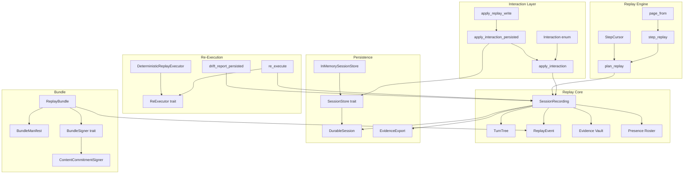
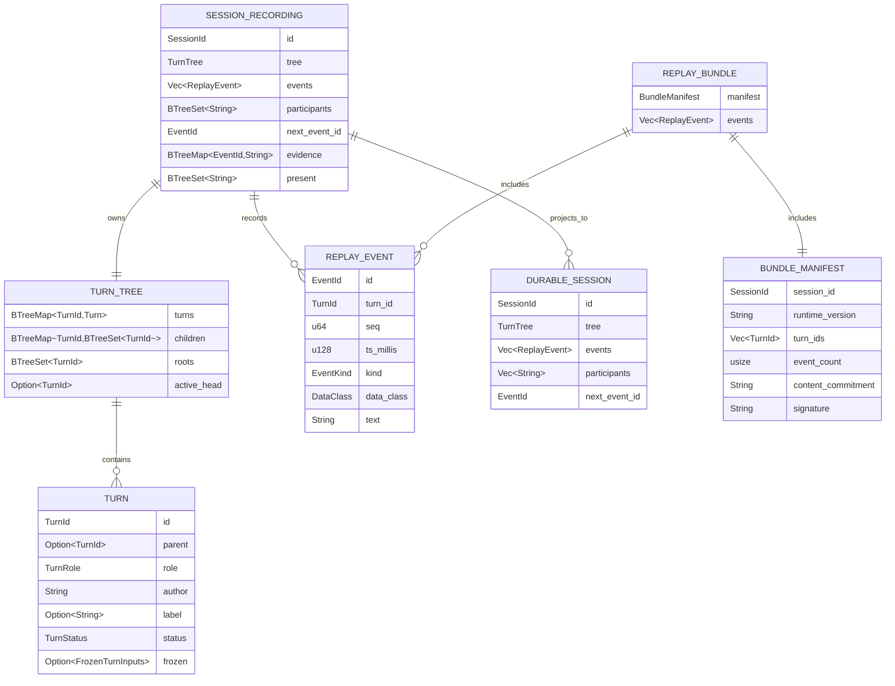
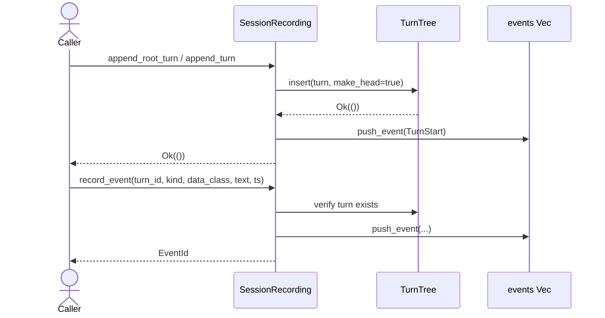
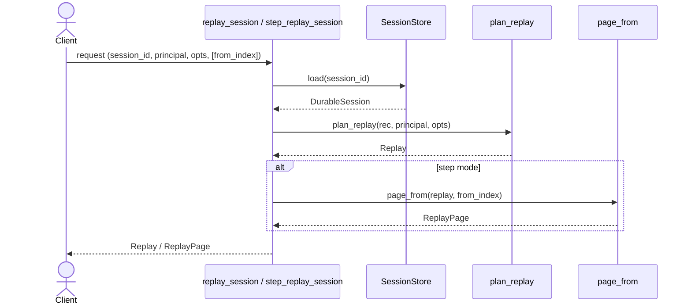
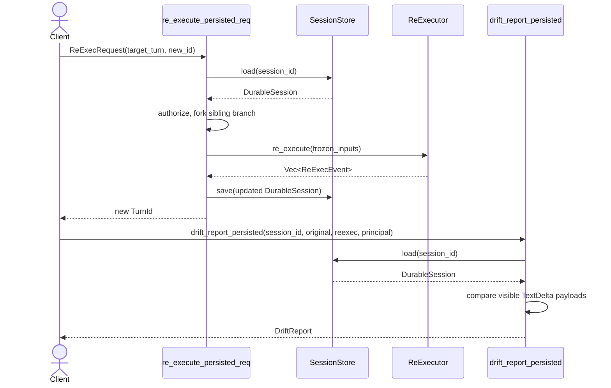
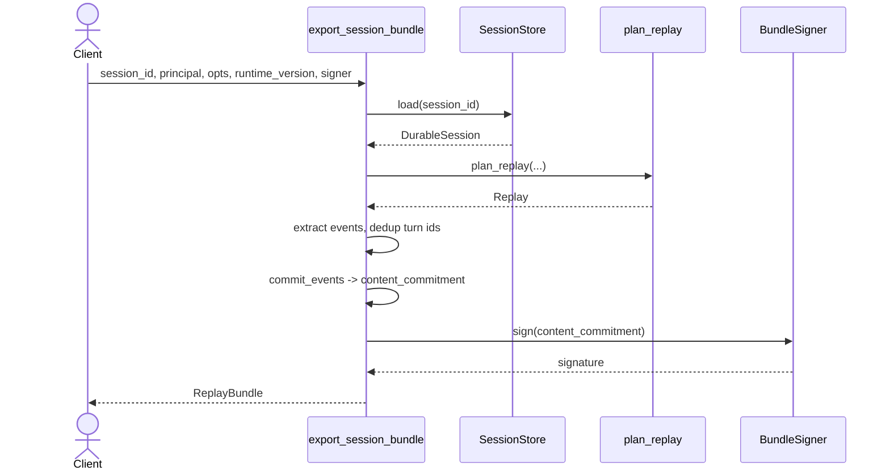
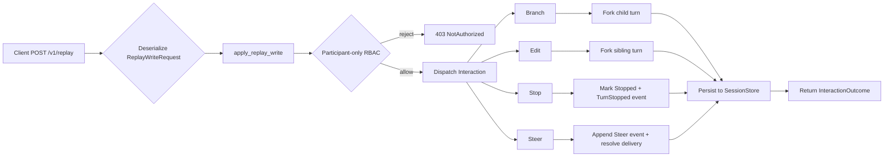
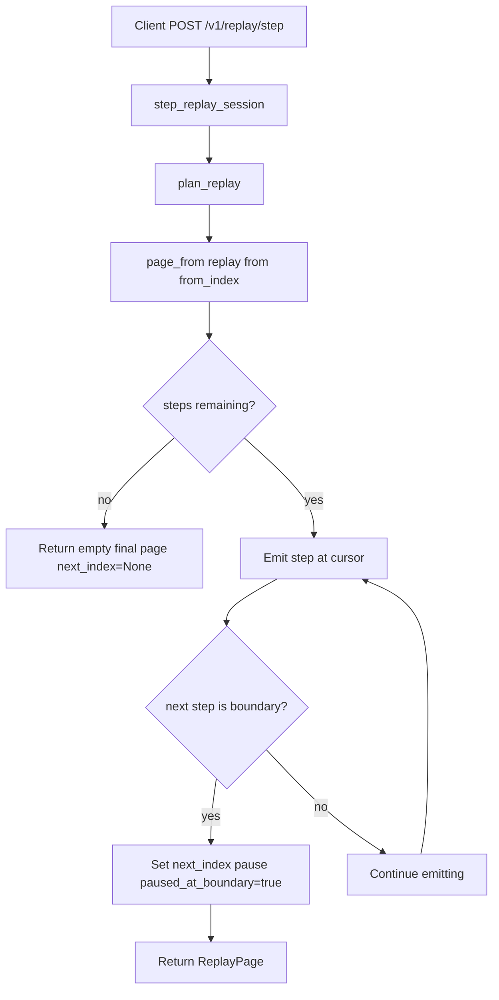
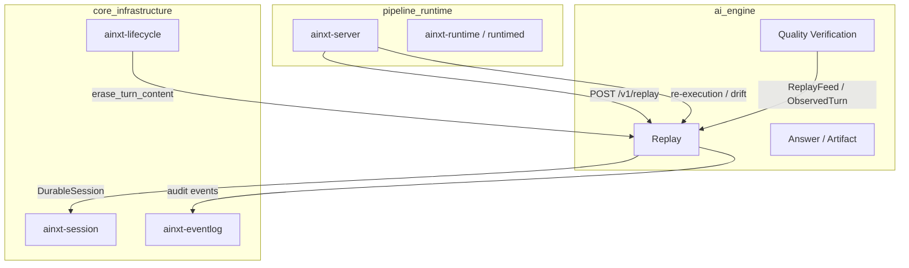

# Replay Module

The **Replay** module (`ainxt-replay`) provides the deterministic, RBAC-scoped, redaction-preserving execution-replay spine for the AiNxt system. It records collaborative sessions as a tree of turns, replays already-redacted protocol events without model calls or side effects, and supports branching, editing, stopping, and steering interactions. It also enables re-execution replay against live models to detect drift, and exports shareable, content-committed replay bundles.

This module closes three architectural gaps identified in the implementation audit: the absence of deterministic execution replay, the linear-chain event log (replaced with a turn tree), and the missing branch/edit/stop/steer interaction affordances.

---

## Table of Contents

1. [Purpose and Core Functionality](#purpose-and-core-functionality)
2. [Architecture](#architecture)
3. [Component Relationships](#component-relationships)
4. [Data Model](#data-model)
5. [Data Flow](#data-flow)
6. [Process Flows](#process-flows)
7. [RBAC and Clearance](#rbac-and-clearance)
8. [Seams and Extensibility](#seams-and-extensibility)
9. [Integration with the System](#integration-with-the-system)
10. [References](#references)

---

## Purpose and Core Functionality

The Replay module is responsible for:

- **Recording sessions as turn trees**: A [`SessionRecording`](replay.md#sessionrecording) stores a [`TurnTree`](replay.md#turntree) of turns, each with a stable id, parent pointer, role, author, label, status, and optional frozen inputs. This replaces the legacy linear event log with a branched, collaborative structure.
- **Deterministic pure-event replay**: Replays the recorded, already-redacted event stream exactly as it happened, with no model calls, no tool execution, and no side effects. Replay pacing is computed as data, not sleep.
- **RBAC-scoped and clearance-filtered viewing**: Only session participants or holders of the `compliance.replay` capability can replay a session. Events above the viewer's data-class clearance are omitted, never surfaced pre-redaction.
- **Interaction affordances**: Supports [`branch`](replay.md#branch), [`edit_turn`](replay.md#edit_turn), [`stop`](replay.md#stop), and [`steer`](replay.md#steer) operations. Editing and branching always fork new turns; history is never mutated. Stopping records a terminal state without deleting the turn.
- **Re-execution replay**: Re-runs a turn's frozen inputs against a live model via the [`ReExecutor`](replay.md#reexecutor) seam, forking a new sibling branch and never overwriting history. Drift between original and re-executed output is reported by [`DriftReport`](replay.md#driftreport).
- **Durable persistence**: Sessions round-trip through a [`SessionStore`](replay.md#sessionstore) as a safe [`DurableSession`](replay.md#durablesession) projection. Pre-redaction evidence is stored separately via [`EvidenceExport`](replay.md#evidenceexport).
- **Shareable bundles**: Exports credential-free, content-committed [`ReplayBundle`](replay.md#replaybundle) objects for training, demos, or audit handoff.
- **Collaborative presence**: Tracks ephemeral, self-asserted presence signals for multi-participant sessions (ready to wire when live multi-user sessions land).

---

## Architecture

---

## Component Relationships

### SessionRecording

[`SessionRecording`](replay.md#sessionrecording) is the central aggregate. It owns:

- A [`TurnTree`](replay.md#turntree) of all turns.
- The append-ordered [`ReplayEvent`](replay.md#replayevent) stream.
- The participant set (authorizes replay and mutation).
- A break-glass evidence vault mapping redacted event ids to pre-redaction originals.
- An ephemeral presence roster.

It is intentionally **not** `Serialize`/`Deserialize`. The durable projection is [`DurableSession`](replay.md#durablesession), which excludes the evidence vault.

### TurnTree

[`TurnTree`](replay.md#turntree) stores turns in a deterministic `BTreeMap`, child adjacency in `BTreeMap<TurnId, BTreeSet<TurnId>>`, and roots in a `BTreeSet`. It supports:

- Inserting turns with parent validation and duplicate-id rejection.
- Computing the root-to-head path for branch replay.
- Moving the active head to switch branches.

### ReplayEvent

[`ReplayEvent`](replay.md#replayevent) is one recorded protocol event. Its `text` field is always the already-redacted payload. Kinds include `TurnStart`, `TextDelta`, `ToolCall`, `ToolResult`, `ApprovalGate`, `ApprovalDecision`, `ModelCall`, `TurnEnd`, `TurnStopped`, `Steer`, `Branch`, `Edit`, and `BreakGlassAccess`. Tool calls, approval gates, and model calls are step boundaries where step-mode replay pauses.

### Interaction and apply_interaction

The [`Interaction`](replay.md#interaction) enum is the wire vocabulary for branch/edit/stop/steer. [`apply_interaction`](replay.md#apply_interaction) is the single RBAC-scoped entrypoint: it enforces participant-only mutation authorization and dispatches to the corresponding `SessionRecording` method. [`apply_interaction_persisted`](replay.md#apply_interaction_persisted) loads from and saves to a [`SessionStore`](replay.md#sessionstore). [`apply_replay_write`](replay.md#apply_replay_write) is the route-ready wrapper that takes a [`ReplayWriteRequest`](replay.md#replaywriterequest).

### Replay Engine

[`plan_replay`](replay.md#plan_replay) builds an RBAC-scoped, clearance-filtered [`Replay`](replay.md#replay) plan. [`step_replay`](replay.md#step_replay) and [`page_from`](replay.md#page_from) slice the plan into [`ReplayPage`](replay.md#replaypage) objects for stateless REST paging. [`StepCursor`](replay.md#stepcursor) provides the in-process cursor equivalent.

### Re-Execution and Drift

[`re_execute`](replay.md#re_execute) forks a new sibling branch off a target turn, runs its [`FrozenTurnInputs`](replay.md#frozenturninputs) through a [`ReExecutor`](replay.md#reexecutor), and records the new events. [`DeterministicReplayExecutor`](replay.md#deterministicreplayexecutor) is the offline, deterministic implementation. [`DriftReport`](replay.md#driftreport) compares clearance-visible `TextDelta` payloads between the original and re-executed turns.

### Persistence

[`SessionStore`](replay.md#sessionstore) is the durable persistence seam. [`InMemorySessionStore`](replay.md#inmemorysessionstore) is the offline/test implementation. [`DurableSession`](replay.md#durablesession) is the safe serializable projection. [`EvidenceExport`](replay.md#evidenceexport) is the separately gated pre-redaction vault export.

### Bundle

[`ReplayBundle`](replay.md#replaybundle) contains a [`BundleManifest`](replay.md#bundlemanifest) and the redacted event slice. The manifest includes a length-prefixed SHA-256 content commitment and a signature from a [`BundleSigner`](replay.md#bundlesigner). [`ContentCommitmentSigner`](replay.md#contentcommitmentsigner) provides keyed integrity commitment.

---

## Data Model

---

## Data Flow

### Recording a Turn and Events

### Pure-Event Replay Flow

### Re-Execution and Drift Flow

### Bundle Export Flow

---

## Process Flows

### Branch / Edit / Stop / Steer

### Step-Mode Replay Paging

---

## RBAC and Clearance

The module enforces two authorization levels:

- **Replay/view**: A principal must be a session participant **or** hold `compliance.replay` (`CAP_COMPLIANCE_REPLAY`). This is enforced by [`authorize`](replay.md#authorize).
- **Mutation** (branch/edit/stop/steer): A principal must be a session participant. Compliance replay capability is intentionally **not** sufficient. This is enforced by [`apply_interaction`](replay.md#apply_interaction).
- **Break-glass evidence access**: A principal must hold `compliance.break_glass` (`CAP_BREAK_GLASS`). Every access appends a `BreakGlassAccess` audit event.

Per-event clearance filtering uses the same pre-rank ACL predicate as the retrieval, graph, and nl2sql surfaces: an event whose `data_class` sensitivity exceeds the principal's clearance is omitted, never surfaced pre-redaction.

---

## Seams and Extensibility

The module defines clear seams for live infrastructure:

- [`ReExecutor`](replay.md#reexecutor): Re-runs frozen inputs against a live model. The built-in [`DeterministicReplayExecutor`](replay.md#deterministicreplayexecutor) is offline and deterministic. A production deployment injects a provider-backed executor behind the same trait.
- [`SessionStore`](replay.md#sessionstore): Durable persistence. The built-in [`InMemorySessionStore`](replay.md#inmemorysessionstore) is for tests and offline use. Production swaps in a Postgres-backed store.
- [`BundleSigner`](replay.md#bundlesigner): Signs replay bundles. The built-in [`ContentCommitmentSigner`](replay.md#contentcommitmentsigner) provides keyed integrity. Production plugs in an asymmetric signer/PKI where non-repudiation is required.

---

## Integration with the System

The Replay module sits within the [`evaluation_testing`](evaluation_testing.md) module of the `ai_engine` domain. It is consumed by:

- **Server/serving layer**: [`ainxt-server`](server_serving.md) mounts replay routes (`ReplayRequest`, `ReplayStepRequest`, `ReplayReexecuteRequest`, `ReplayDriftRequest`) over the persisted session store. See [`server_serving`](server_serving.md).
- **Quality verification**: The [`quality_verification`](quality_verification.md) module, particularly [`ainxt-quality`](quality_verification_quality.md), consumes replay feeds (`ReplayFeed`, `ObservedTurn`) for online release control and drift monitoring.
- **Session management**: [`ainxt-session`](core_interaction.md) provides the session lifecycle and turn tickets that feed into recordings. See [`core_interaction`](core_interaction.md).
- **Event logging**: [`ainxt-eventlog`](core_interaction.md) provides the governed, chain-hashed audit log that replay complements with its tamper-evident bundle commitments.
- **Lifecycle/erasure**: [`ainxt-lifecycle`](lifecycle.md) drives `erase_turn_content` through regulated erasure tiers, ensuring content bytes are hard-deleted while tree structure remains intact.

---

## References

- [`evaluation_testing`](evaluation_testing.md) — parent module containing replay, evaluation, conformance, canary, and related testing infrastructure.
- [`quality_verification`](quality_verification.md) — consumes replay feeds for drift monitoring and online release control.
- [`server_serving`](server_serving.md) — mounts replay, re-execution, and drift HTTP routes.
- [`core_interaction`](core_interaction.md) — session, protocol, event log, and telemetry primitives.
- [`lifecycle`](lifecycle.md) — regulated erasure and data lifecycle management that interacts with replay recordings.
- [`ai_engine`](ai_engine.md) — broader AI engine domain where replay supports answer quality, guardrails, and prompt engineering.
