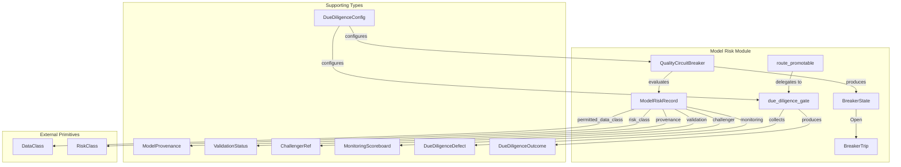
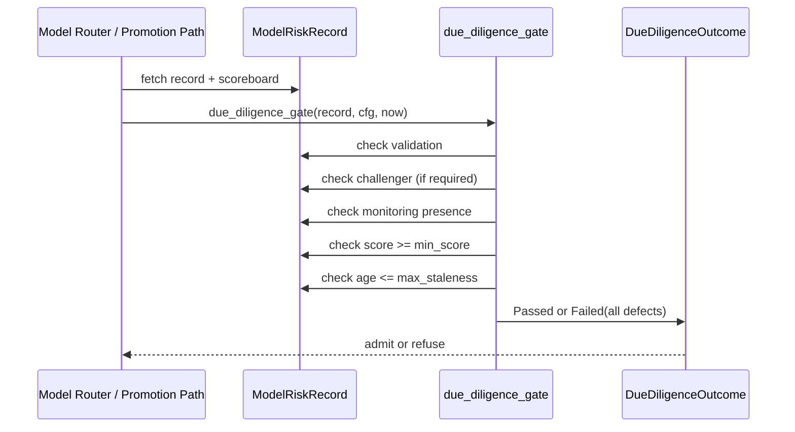
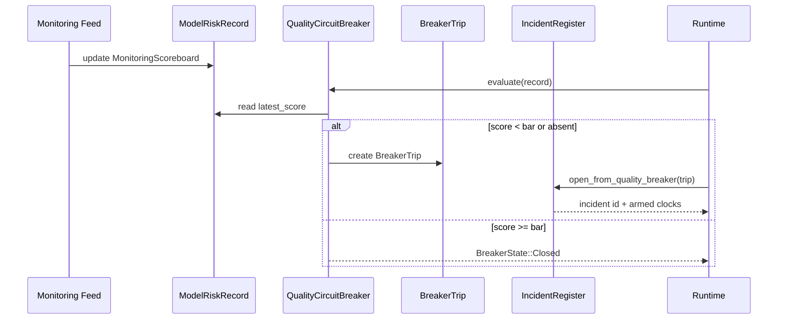
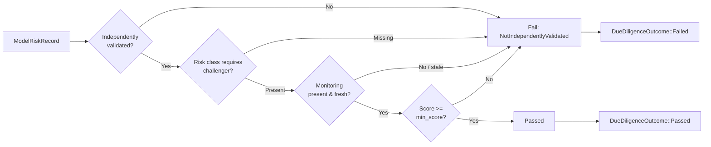
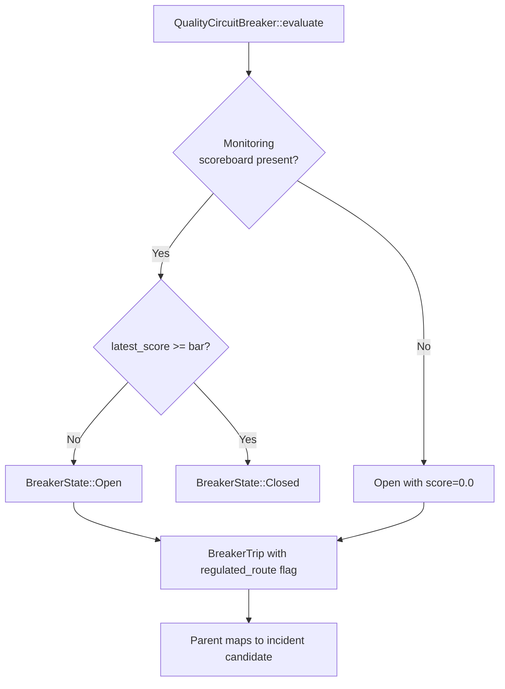

# Responsible AI Model Risk

The `responsible_ai_model_risk` module implements the SR-11-7 / DPDP §10 algorithmic due-diligence and live quality circuit-breaker controls for AI model routes. It is a sub-module of [`responsible_ai`](responsible_ai.md) within the broader [`governance_compliance`](governance_compliance.md) domain.

In RBI-regulated payment-switch and EU-AI-Act-style regimes, a model route is not "certified once"; it must be *inventoried, independently validated, challenger-benchmarked, and continuously monitored*. This module supplies the pure, deterministic, clock-free primitives that enforce that posture:

- **`ModelRiskRecord`** — the control-plane inventory entry for one model route.
- **`due_diligence_gate`** — the fail-closed promotion check that refuses a route whose validation, challenger, monitoring, or freshness bar is not met.
- **`QualityCircuitBreaker`** — the runtime half that trips when a live monitoring scoreboard drops below bar, producing typed facts for incident escalation.
- **`route_promotable`** — the clean FI-07 entrypoint called by the promotion path and model router before admitting a route.

The module shares the `ainxt-responsibleai` crate with [`responsible_ai_governance_artifacts`](responsible_ai_governance_artifacts.md), which covers model cards, system cards, bias assessment, and the deploy gate. This document focuses exclusively on the model-risk record, due-diligence gate, and quality circuit-breaker.

---

## Core Responsibilities

1. **Model Risk Inventory** — `ModelRiskRecord` captures provenance, permitted data class, risk class, independent validation status, challenger reference, live monitoring scoreboard, and limitations for a model route.
2. **Data-Sovereignty Eligibility** — `ModelRiskRecord::may_carry` enforces both the configured data-class ceiling and the regulated-data provenance invariant (cloud APIs can never carry regulated data, even if mis-configured).
3. **Algorithmic Due-Diligence Gate** — `due_diligence_gate` fails closed when a record is unvalidated, missing a required challenger, unmonitored, below the score bar, or stale.
4. **Promotion Admission** — `route_promotable` wraps the due-diligence gate as the single seam the promotion path and model router call before a route enters service.
5. **Live Quality Circuit-Breaker** — `QualityCircuitBreaker::evaluate` trips on missing or below-bar monitoring, returning a `BreakerTrip` that the parent maps to an operational-risk incident for regulated routes.

---

## Architecture



---

## Component Reference

### Risk Classification

`RiskClass` is defined in the shared [`responsible_ai_governance_artifacts`](responsible_ai_governance_artifacts.md) sibling module. It orders risk from `Minimal` → `Limited` → `High` → `Unacceptable`. The model-risk module uses this ordering to decide when a challenger model is mandatory.

### ModelProvenance

`ModelProvenance` records where a model's weights and serving infrastructure come from:

- `InHouse` — owned infrastructure; eligible for regulated/PII data.
- `CloudApi { vendor }` — third-party cloud API; never eligible for regulated data.
- `OpenWeights { origin }` — self-hosted open-weights model; eligible for regulated data if run on-premise.

`ModelProvenance::allows_regulated()` returns `true` only for `InHouse` and `OpenWeights`, providing a defense-in-depth check independent of the configured data-class ceiling.

### ValidationStatus

`ValidationStatus` tracks SR-11-7 independent validation:

- `NotValidated` — the model has not been independently validated; it must not promote.
- `IndependentlyValidated { at_tick }` — validated by a party distinct from the developer at a logical tick.

### ChallengerRef

`ChallengerRef` points to the challenger model benchmarked against the champion. It carries `model_id` and a free-text `note`. High-risk routes require a challenger under `DueDiligenceConfig::require_challenger_at_or_above`.

### MonitoringScoreboard

`MonitoringScoreboard` is the live, data-plane quality signal:

- `latest_score` — continuously evaluated quality/performance score (0.0–1.0).
- `samples` — number of observations backing the score.
- `last_update_tick` — logical tick of the last update, used to compute staleness.

Methods:

- `meets(bar)` — `latest_score >= bar`.
- `age_at(now)` — saturating age; future ticks yield age 0.

### ModelRiskRecord

`ModelRiskRecord` is the control-plane SR-11-7 inventory entry for one model route or Role:

| Field | Purpose |
|-------|---------|
| `model_id` | Route identifier |
| `provenance` | `ModelProvenance` for data-sovereignty checks |
| `permitted_data_class` | Maximum `DataClass` the model may carry |
| `intended_use` | Human-readable purpose |
| `risk_class` | `RiskClass` driving challenger requirements |
| `validation` | `ValidationStatus` |
| `challenger` | Optional `ChallengerRef` |
| `monitoring` | Optional `MonitoringScoreboard` |
| `limitations` | Known limitations |

`ModelRiskRecord::may_carry(class)` enforces both the data-class ceiling and the regulated-data provenance invariant.

### DueDiligenceConfig

`DueDiligenceConfig` defines the due-diligence bar:

| Field | Default | Purpose |
|-------|---------|---------|
| `min_score` | `0.8` | Minimum acceptable monitoring score |
| `require_challenger_at_or_above` | `RiskClass::High` | Risk class at or above which a challenger is mandatory |
| `max_monitoring_staleness` | `1000` | Maximum tolerated staleness in logical ticks |

### DueDiligenceDefect

A way the due-diligence gate found a record wanting:

- `NotIndependentlyValidated`
- `MissingChallenger { risk_class }`
- `NoMonitoring`
- `ScoreBelowBar { score, bar }`
- `MonitoringStale { age, max }`

### DueDiligenceOutcome

- `Passed` — the record may promote.
- `Failed(Vec<DueDiligenceDefect>)` — fail-closed, carrying every failing reason.

### due_diligence_gate

```rust
pub fn due_diligence_gate(
    record: &ModelRiskRecord,
    cfg: &DueDiligenceConfig,
    now: u64,
) -> DueDiligenceOutcome
```

The gate fails if **any** of the following hold, collecting all reasons:

- the model is not independently validated,
- its risk class requires a challenger and none is recorded,
- it has no monitoring scoreboard,
- the latest score is below `cfg.min_score`,
- the monitoring is staler than `cfg.max_monitoring_staleness` at `now`.

### route_promotable

```rust
pub fn route_promotable(
    record: &ModelRiskRecord,
    cfg: &DueDiligenceConfig,
    now: u64,
) -> DueDiligenceOutcome
```

The FI-07 promotion/router admission entrypoint. It delegates to `due_diligence_gate` so that "monitored, not certified-once" is enforced at the exact seam a route enters service.

### QualityCircuitBreaker

```rust
pub struct QualityCircuitBreaker { pub bar: f64 }
```

Runtime quality circuit-breaker. `evaluate(record)` returns:

- `BreakerState::Closed` — monitoring present and score at/above bar.
- `BreakerState::Open(BreakerTrip)` — monitoring missing or score below bar.

### BreakerTrip

Typed facts of a circuit-breaker trip:

| Field | Purpose |
|-------|---------|
| `route_id` | Affected route |
| `score` | Observed score (0.0 if monitoring absent) |
| `bar` | Configured bar |
| `regulated_route` | Whether the route carries a regulated data class |

The parent runtime maps `BreakerTrip` to an incident candidate for regulated routes. See [`incident`](incident.md) for incident handling.

### BreakerState

- `Closed` — healthy.
- `Open(BreakerTrip)` — contained.

---

## Data Flow

### Due-Diligence Promotion Check



### Live Circuit-Breaker Trip



---

## Process Flow: Due-Diligence Gate



## Process Flow: Quality Circuit-Breaker



---

## Dependencies

| Dependency | Module | Purpose |
|------------|--------|---------|
| `DataClass` | [`security_config_identity`](security_config_identity.md) | Data-class ceiling and regulated-data provenance rules |
| `RiskClass` | [`responsible_ai_governance_artifacts`](responsible_ai_governance_artifacts.md) | Risk classification and ordering |
| `GovernancePromotionGate` | [`responsible_ai_promotion`](responsible_ai_promotion.md) | Composes DPIA, due-diligence, and circuit-breaker gates |
| `PromotionDecision` | [`responsible_ai_routes`](responsible_ai_routes.md) | Promotion outcome consumed by routing layer |
| `IncidentCandidate` | [`incident`](incident.md) | Parent maps `BreakerTrip` to operational-risk incidents |
| Quality scores | [`quality_verification`](quality_verification.md) | Source of `MonitoringScoreboard::latest_score` |
| Evaluation signals | [`evaluation_testing`](evaluation_testing.md) | Offline eval and canary signals that feed monitoring |

---

## Integration with the Broader System

- **Governance Artifacts**: Model cards, system cards, and the deploy gate live in [`responsible_ai_governance_artifacts`](responsible_ai_governance_artifacts.md). The model-risk record is the *runtime/promotion* counterpart to those *ship* artifacts.
- **Promotion**: `route_promotable` is called by [`responsible_ai_promotion`](responsible_ai_promotion.md) and the model router before a route enters service. See also [`responsible_ai_routes`](responsible_ai_routes.md).
- **Runtime Serving**: The `QualityCircuitBreaker` provides typed trip facts to [`runtime_engine`](runtime_engine.md) and [`server_serving`](server_serving.md), which contain the route and escalate.
- **Quality Verification**: `MonitoringScoreboard::latest_score` is produced by the AI engine's quality verification subsystem. See [`quality_verification`](quality_verification.md).
- **Evaluation & Testing**: Offline eval cases, canaries, and replay provide the signals that populate monitoring scoreboards. See [`evaluation_testing`](evaluation_testing.md).
- **Incident Response**: Regulated-route breaker trips map to `IncidentCandidate::from_quality_breaker` in [`incident`](incident.md), arming statutory clocks.
- **Identity & Security**: `DataClass` and provenance rules align with [`security_config_identity`](security_config_identity.md) and ADR-012 data-localization requirements.
- **Lifecycle**: Data-class governance and retention policies in [`lifecycle`](lifecycle.md) align with the `permitted_data_class` ceiling.
- **Workforce & Teams**: Model routes are attached to roles and digital teams; see [`workforce`](workforce.md) and [`teams`](teams.md).

---

## Design Principles

- **Fail-closed**: Any missing, invalid, stale, or below-bar condition results in refusal or a tripped breaker.
- **Collect-all-errors**: `due_diligence_gate` returns every failing reason so operators can fix all gaps in one pass.
- **Deterministic**: No clock, RNG, or filesystem access; logical ticks and pure functions only.
- **Defense in depth**: `may_carry` enforces the regulated-data provenance invariant independently of the configured data-class ceiling.
- **Decoupled from incident machinery**: `BreakerTrip` carries typed facts so the parent decides how to escalate, keeping this crate pure and I/O-free.
- **Monitored, not certified-once**: Both promotion (`route_promotable`) and runtime (`QualityCircuitBreaker`) enforce continuous monitoring.
