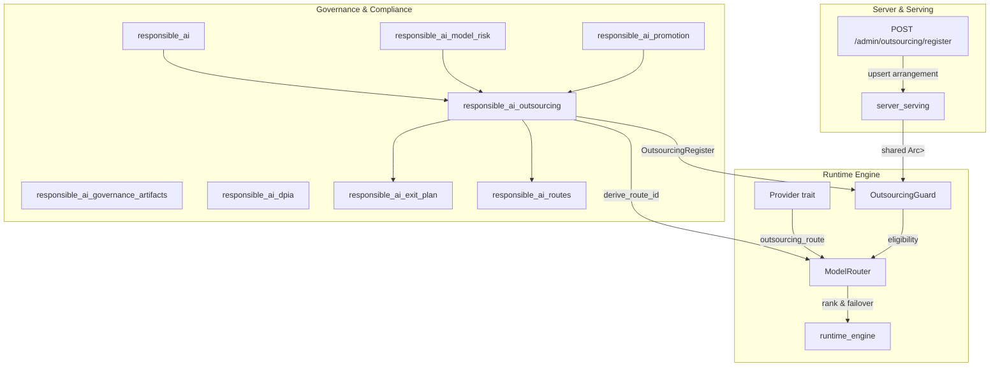
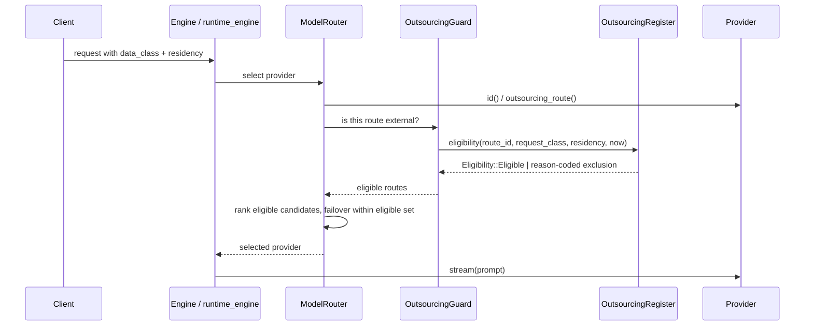
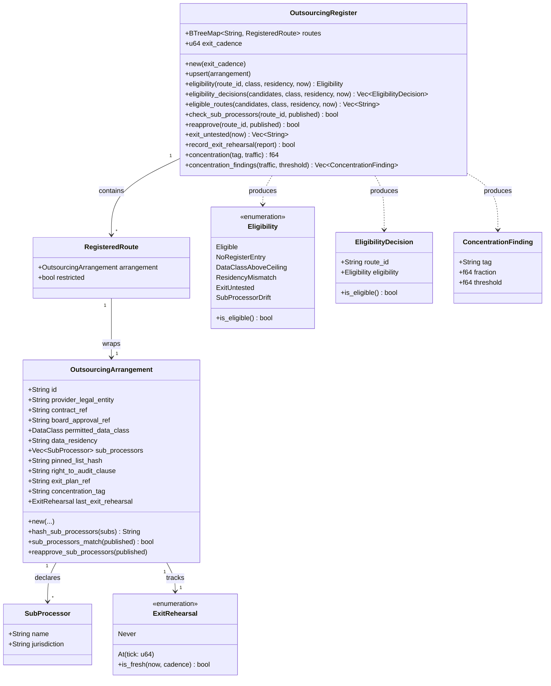
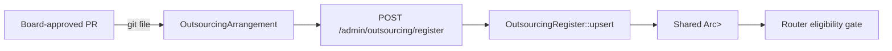
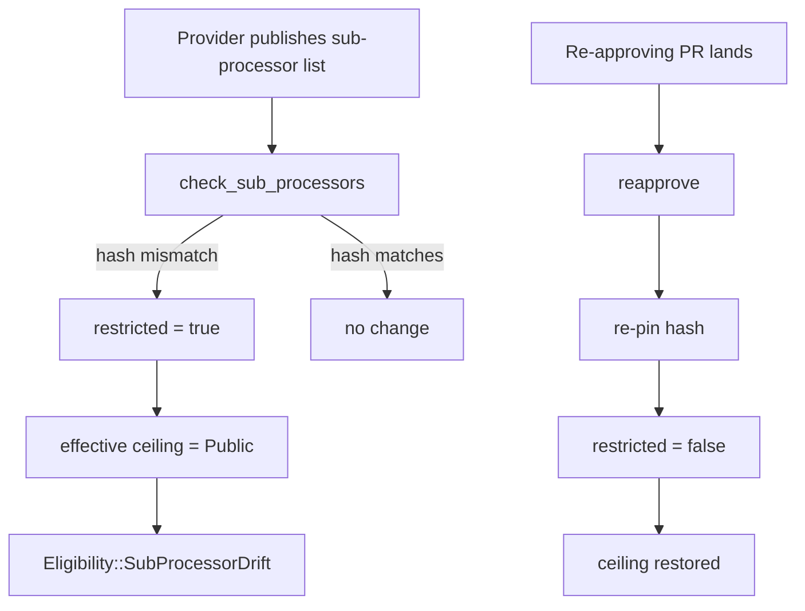
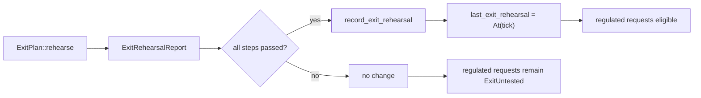
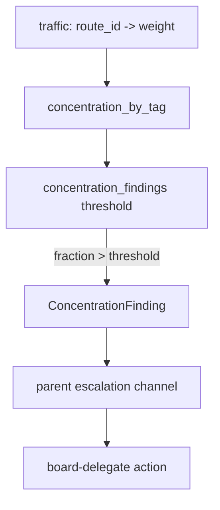

# Responsible AI — Outsourcing Register

The **outsourcing register** implements the RBI Master Direction on Outsourcing of IT Services (FI-03) inside the model router. It treats every call that ships context to an external provider — cloud LLM routes, external connectors, remote MCP servers — as a regulated IT outsourcing arrangement. A route is either registered, eligible, and auditable, or it is **excluded before ranking and before failover**. There is no "policy violation caught later": an ungoverned route simply cannot route.

This module lives under [`responsible_ai`](responsible_ai.md) and is consumed by the runtime router ([`runtime_engine`](runtime_engine.md)) and the served admin surface ([`server_serving`](server_serving.md)).

---

## What this module does

1. **Defines outsourcing arrangements** as control-plane values: provider legal entity, contract, board approval, permitted data class, data residency, sub-processor chain, right-to-audit clause, exit plan, and concentration tag.
2. **Pins sub-processor chains** with a SHA-256 TOFU hash. A silent change in the published chain fails the pin and auto-restricts the route until a re-approving PR lands.
3. **Decides route eligibility** for every request based on:
   - whether a register entry exists,
   - whether the route's permitted data class ceiling covers the request's effective data class,
   - whether the route's residency matches the request's residency label,
   - whether the exit plan has been rehearsed recently enough for regulated data.
4. **Produces auditable eligibility decisions** so every exclusion carries a reason code into the evidence trail.
5. **Tracks concentration risk** by dependency tag and emits findings when a tag's share of traffic exceeds a board-set threshold.
6. **Supports exit-plan rehearsal** by accepting typed rehearsal reports and advancing freshness only on all-pass rehearsals.

---

## Core concepts

### Route identity

Every external provider route is identified as:

```text
outsourcing.cloud.<provider_id>
```

The canonical prefix is `outsourcing.cloud.`. The helper [`derive_route_id`](responsible_ai_outsourcing.md#derive_route_id) derives the id deterministically from a provider id. This prevents a cloud provider from escaping the register because an adapter forgot to self-declare externality. The runtime can install an **authoritative externality classifier** that treats every provider as external unless it appears on a signed in-house exemption list.

### Outsourcing arrangement

An [`OutsourcingArrangement`](responsible_ai_outsourcing.md#outsourcingarrangement) is the board-approved control-plane record for one external route. It is a plain serde value, intended to be stored in a git-controlled config file with CODEOWNERS = outsourcing governance + board-delegate (ADR-026).

Key fields:

| Field | Purpose |
|-------|---------|
| `id` | Matches the router's derived route id. |
| `provider_legal_entity` | Legal entity name for the contract. |
| `contract_ref` / `board_approval_ref` | Governance references. |
| `permitted_data_class` | Maximum data class the route may carry. |
| `data_residency` | Resolved residency region, lowercased. |
| `sub_processors` | Declared chain of sub-processors. |
| `pinned_list_hash` | SHA-256 TOFU pin over the sub-processor list. |
| `right_to_audit_clause` | Contract clause reference. |
| `exit_plan_ref` | Reference to the exit plan program. |
| `concentration_tag` | Category for concentration-risk analysis. |
| `last_exit_rehearsal` | Freshness of the last exit rehearsal. |

### Eligibility

[`Eligibility`](responsible_ai_outsourcing.md#eligibility) is the reason-coded result of the non-overridable gate. Only `Eligible` lets a route proceed to ranking. All other variants are fail-safe exclusions:

- `NoRegisterEntry` — the route has no board-approved arrangement.
- `DataClassAboveCeiling` — the request's data class exceeds the route's ceiling.
- `ResidencyMismatch` — the route's residency violates the request's localisation label.
- `ExitUntested` — the exit plan is stale or never rehearsed for a regulated request.
- `SubProcessorDrift` — the sub-processor chain changed and the route is auto-restricted.

[`EligibilityDecision`](responsible_ai_outsourcing.md#eligibilitydecision) pairs a route id with its eligibility so the router can keep the eligible subset while retaining the evidence for excluded routes.

### Registered route runtime state

A [`RegisteredRoute`](responsible_ai_outsourcing.md#registeredroute) wraps an arrangement plus a `restricted` flag. When sub-processor drift is detected, `restricted` becomes `true` and the effective ceiling collapses to `DataClass::Public` until reapproved.

### Concentration risk

[`ConcentrationFinding`](responsible_ai_outsourcing.md#concentrationfinding) is emitted when the fraction of traffic depending on a single `concentration_tag` exceeds a threshold. The parent module maps this typed fact onto its escalation channel (the same pattern as [`QualityCircuitBreaker`](responsible_ai_model_risk.md#qualitycircuitbreaker) / [`BreakerTrip`](responsible_ai_model_risk.md#breakertrip)).

### Exit rehearsal

[`ExitRehearsal`](responsible_ai_outsourcing.md#exitrehearsal) records when a route's exit plan was last rehearsed. Freshness is checked against a configurable cadence in logical ticks. The register can accept an [`ExitRehearsalReport`](responsible_ai_exit_plan.md#exitrehearsalreport) from the exit-plan rehearsal machinery and advance freshness only when every step passed.

---

## Architecture



---

## Data flow: a request reaches the router



The eligibility check happens **before** ranking and **before** failover. A route excluded by the register can never be selected, even as a fallback.

---

## Component interaction



---

## Process flows

### Registering a new arrangement



The admin route mutates the **same** shared register instance the router reads. This avoids the earlier bug where the register was ownership-trapped inside the router and admin updates created a second, disjoint copy.

### Sub-processor drift detection



### Exit rehearsal lifecycle



See [`responsible_ai_exit_plan`](responsible_ai_exit_plan.md) for the exit-plan rehearsal machinery.

### Concentration risk escalation



---

## Relationship to the wider system

- **Runtime engine** ([`runtime_engine`](runtime_engine.md)): `ModelRouter` holds an `OutsourcingGuard` that wraps a shared `OutsourcingRegister`. The guard calls `eligibility` for every external candidate before ranking. The `Engine` supplies the effective data class (fused from caller declaration, arg scanner, and tool-destination floor) and residency.
- **Server & serving** ([`server_serving`](server_serving.md)): `AppState` holds an optional shared `Arc<RwLock<OutsourcingRegister>>` backing `POST /admin/outsourcing/register`. This is the same handle the router uses.
- **Responsible AI model risk** ([`responsible_ai_model_risk`](responsible_ai_model_risk.md)): `ModelRiskRecord` also carries a `permitted_data_class` ceiling. The outsourcing register gates **external** routes by arrangement; the model-risk record gates by due diligence. Both are consulted by the router.
- **Responsible AI exit plan** ([`responsible_ai_exit_plan`](responsible_ai_exit_plan.md)): produces `ExitRehearsalReport` that the register consumes to advance `last_exit_rehearsal`.
- **Responsible AI promotion** ([`responsible_ai_promotion`](responsible_ai_promotion.md)): `GovernancePromotionGate` may consult outsourcing eligibility before promoting a route.
- **Responsible AI routes** ([`responsible_ai_routes`](responsible_ai_routes.md)): `PromotionDecision` can carry `ModelRiskRouteError`; outsourcing findings feed into route-promotion decisions.
- **Security config identity** ([`security_config_identity`](security_config_identity.md)): `DataClass` and `Principal` are the identity/data-class primitives used here.
- **Core interaction** ([`core_interaction`](core_interaction.md)): event logs and telemetry carry the auditable eligibility decisions.

---

## Fail-safe design

The module is deliberately fail-closed:

- No register entry → excluded.
- Data class above ceiling → excluded.
- Residency mismatch → excluded.
- Regulated request + untested exit → excluded.
- Sub-processor drift → auto-restricted to `Public`.
- Failed or partial exit rehearsal → does **not** freshen the route.
- Unknown route in `record_exit_rehearsal` → no change.

Logical time and residency are injected; the module has no clock, RNG, or I/O of its own. This makes it deterministic and trivial to unit-test.

---

## Gaps and hot-wiring notes

The code documents two deliberate gaps (GAP-FIX gap6-responsibleai-cleanup):

1. **`exit_untested` has no served callers.** No admin route or cadence tick surfaces which routes are due for rehearsal. This would naturally back a listing route or a cadence loop.
2. **`record_exit_rehearsal` has no served callers.** The only served outsourcing route lets an operator assert `last_exit_rehearsal` directly on registration instead of calling this with a real `ExitRehearsalReport`. Wiring this to the exit-plan rehearsal machinery is a genuine follow-up.

These are documented in the source as `needs_hot_wiring` and are not forced wires.

---

## Key API surface

### `derive_route_id`

```rust
pub fn derive_route_id(provider_id: &str) -> String
```

Deterministically produces `outsourcing.cloud.<provider_id>`. Used by the authoritative externality classifier so cloud providers cannot forget to declare externality.

### `OutsourcingRegister::eligibility`

```rust
pub fn eligibility(
    &self,
    route_id: &str,
    request_class: DataClass,
    request_residency: &str,
    now: u64,
) -> Eligibility
```

The core FI-03 gate. Returns reason-coded eligibility for a single route.

### `OutsourcingRegister::eligible_routes`

```rust
pub fn eligible_routes<'a>(
    &self,
    candidates: impl IntoIterator<Item = &'a str>,
    request_class: DataClass,
    request_residency: &str,
    now: u64,
) -> Vec<String>
```

The subset of candidate routes the router keeps for ranking.

### `OutsourcingRegister::eligibility_decisions`

```rust
pub fn eligibility_decisions<'a>(
    &self,
    candidates: impl IntoIterator<Item = &'a str>,
    request_class: DataClass,
    request_residency: &str,
    now: u64,
) -> Vec<EligibilityDecision>
```

Auditable form: every candidate paired with its exclusion reason.

### `OutsourcingRegister::check_sub_processors`

```rust
pub fn check_sub_processors(&mut self, route_id: &str, published: &[SubProcessor]) -> bool
```

Returns `true` if the published list drifted from the pin and the route was auto-restricted.

### `OutsourcingRegister::reapprove`

```rust
pub fn reapprove(&mut self, route_id: &str, published: Vec<SubProcessor>) -> bool
```

Lifts an auto-restriction after a re-approving PR lands.

### `OutsourcingRegister::concentration_findings`

```rust
pub fn concentration_findings(
    &self,
    traffic: &BTreeMap<String, u64>,
    threshold: f64,
) -> Vec<ConcentrationFinding>
```

Returns concentration escalations sorted worst-first, then tag-ordered for determinism.

---

## Testing strategy

The module includes unit tests covering:

- Unregistered routes are excluded (`NoRegisterEntry`).
- Data class above ceiling is excluded.
- Residency mismatch is excluded.
- Untested exit plans exclude regulated requests.
- Fresh rehearsal makes regulated requests eligible.
- Sub-processor drift auto-restricts until reapproved.
- Eligibility decisions are auditable and match `eligible_routes`.
- Concentration fraction is computed correctly.

These tests use logical ticks and in-memory registers; no external services are required.

---

## See also

- [`responsible_ai`](responsible_ai.md) — parent module overview
- [`responsible_ai_model_risk`](responsible_ai_model_risk.md) — model-risk records and quality circuit breakers
- [`responsible_ai_exit_plan`](responsible_ai_exit_plan.md) — exit-plan rehearsal programs
- [`responsible_ai_promotion`](responsible_ai_promotion.md) — governance promotion gate
- [`responsible_ai_routes`](responsible_ai_routes.md) — promotion decisions and route errors
- [`responsible_ai_dpia`](responsible_ai_dpia.md) — data-protection impact assessment gate
- [`runtime_engine`](runtime_engine.md) — `ModelRouter`, `OutsourcingGuard`, and provider routing
- [`server_serving`](server_serving.md) — served admin routes including `/admin/outsourcing/register`
- [`security_config_identity`](security_config_identity.md) — `DataClass` and `Principal` primitives
