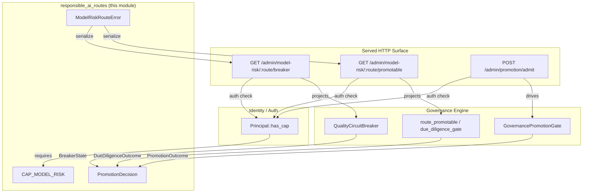
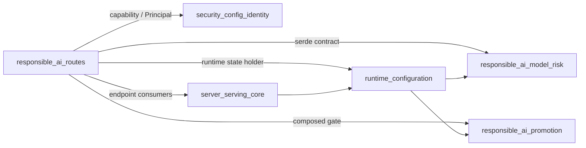
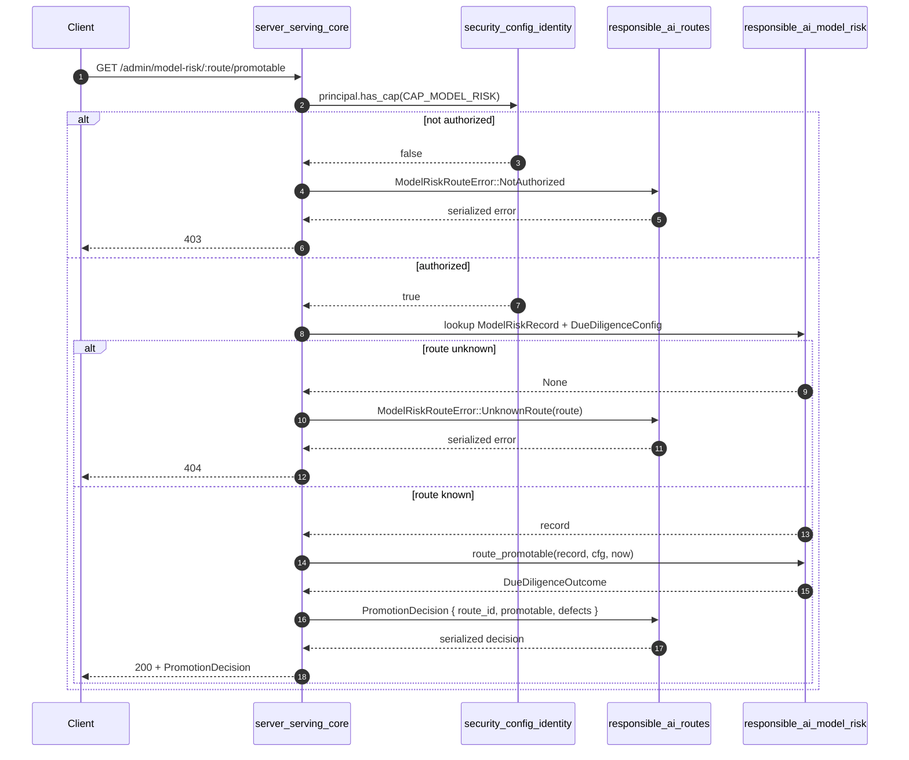
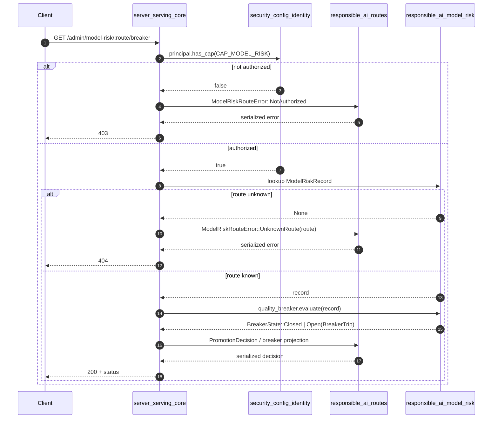
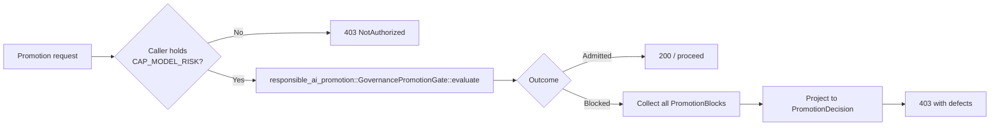
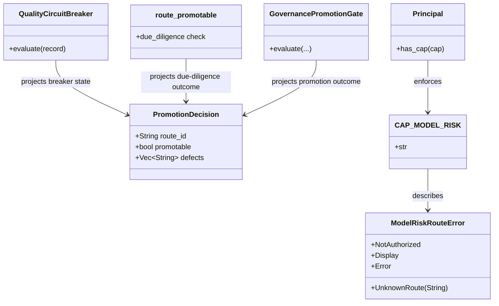

# `responsible_ai_routes` — Model-Risk Wire Contract

## Brief Introduction

`responsible_ai_routes` is the **HTTP-facing serde contract** for the FI-07 / SR-11-7 model-risk and quality-circuit-breaker surface. It lives in `crates/ainxt-responsibleai/src/routes.rs` and exports only three public items:

* `CAP_MODEL_RISK` — the capability that gates read access to model-risk status.
* `ModelRiskRouteError` — the fail-safe error enum returned by model-risk preview endpoints.
* `PromotionDecision` — a serializable projection of a route's promotability decision.

The module intentionally contains **no service logic, no inventory, and no HTTP framework code**. The real decisions are made by the [`responsible_ai_model_risk`](responsible_ai_model_risk.md) engine (`QualityCircuitBreaker`, `route_promotable`, `DueDiligenceConfig`) and the [`responsible_ai_promotion`](responsible_ai_promotion.md) composed gate (`GovernancePromotionGate`). The served daemon's endpoints (`model_risk_breaker_status`, `model_risk_promotable_status`, and the promotion admission path in `admit_promotion`) reuse those same live engine instances and project their outcomes through the types defined here.

This design keeps the wire format stable, testable, and independent from the runtime engine, while guaranteeing that preview endpoints and real promotion gates never diverge.

---

## Purpose and Scope

| Concern | In Scope | Out of Scope (see linked modules) |
|---|---|---|
| Serde-round-trippable wire types for model-risk reads | ✅ | |
| Capability constant for model-risk read authorization | ✅ | |
| Fail-safe error representation (`403`, `404`) | ✅ | |
| Algorithmic due-diligence logic | ❌ | [`responsible_ai_model_risk`](responsible_ai_model_risk.md) |
| Composed FI-06 / FI-07 promotion gate | ❌ | [`responsible_ai_promotion`](responsible_ai_promotion.md) |
| DPIA-per-feature gate | ❌ | [`responsible_ai_dpia`](responsible_ai_dpia.md) |
| HTTP route mounting, auth, and server state | ❌ | [`server_serving_core`](server_serving_core.md), [`runtime_configuration`](runtime_configuration.md) |
| Principal / capability model | ❌ | [`security_config_identity`](security_config_identity.md) |

The module's single responsibility is to be the **narrow boundary** between the deterministic governance engine and the served HTTP surface.

---

## Core Components

### `CAP_MODEL_RISK`

```rust
pub const CAP_MODEL_RISK: &str = "model-risk.read";
```

Capability string admitting the model-risk / quality-breaker read surface. It is checked by the served daemon's auth layer before any inventory lookup. An admin principal implicitly holds it via [`Principal::has_cap`](security_config_identity.md).

### `ModelRiskRouteError`

```rust
#[derive(Debug, Clone, PartialEq, Eq, Serialize, Deserialize)]
#[serde(tag = "error", rename_all = "snake_case")]
pub enum ModelRiskRouteError {
    NotAuthorized,
    UnknownRoute(String),
}
```

Tagged, serializable error enum:

* `NotAuthorized` → HTTP `403`. Caller lacks `CAP_MODEL_RISK`.
* `UnknownRoute(String)` → HTTP `404`. The requested route has no model-risk record. This is fail-safe: an un-inventoried route cannot be evaluated and must not be admitted.

The type implements `Display` and `Error` for logging and transport rendering.

### `PromotionDecision`

```rust
#[derive(Debug, Clone, PartialEq, Eq, Serialize, Deserialize)]
pub struct PromotionDecision {
    pub route_id: String,
    pub promotable: bool,
    pub defects: Vec<String>,
}
```

A serde-friendly projection of the engine's `DueDiligenceOutcome`:

* `route_id` — the model route being inspected.
* `promotable` — `true` only when the route passes algorithmic due diligence.
* `defects` — every human-readable failing reason; empty iff `promotable`.

Because the internal `DueDiligenceOutcome` is not serializable, this struct provides just enough information for a transport to render a `403`/reason page without leaking internal engine types across crate boundaries.

---

## Architecture



The diagram shows the strict layering:

1. The HTTP surface performs capability checks using `CAP_MODEL_RISK` and the identity module.
2. It reads the **same live engine instances** that real promotion decisions use.
3. It projects engine results into the serializable types defined here before returning them to the client.

---

## Dependencies



* [`responsible_ai_model_risk`](responsible_ai_model_risk.md) — supplies `QualityCircuitBreaker`, `route_promotable`, `DueDiligenceConfig`, `ModelRiskRecord`, and `BreakerState`.
* [`responsible_ai_promotion`](responsible_ai_promotion.md) — supplies `GovernancePromotionGate` and `PromotionOutcome`, which unify FI-06 DPIA and FI-07 model-risk checks.
* [`security_config_identity`](security_config_identity.md) — supplies `Principal` and the capability model that interprets `CAP_MODEL_RISK`.
* [`server_serving_core`](server_serving_core.md) — mounts the model-risk preview endpoints and the promotion admission route.
* [`runtime_configuration`](runtime_configuration.md) — holds the live `AssembledFull` state, including the shared `quality_breaker` and `dpia_gate` instances.

---

## Data Flow: Model-Risk Preview Endpoint



Key properties of this flow:

* **Auth first**: capability is verified before any model-risk lookup.
* **Fail-safe**: an unknown route returns `404` rather than a default "promotable" decision.
* **Single source of truth**: the endpoint calls the same `route_promotable` function that `admit_promotion` uses for real promotions.
* **Projection only**: the non-serializable `DueDiligenceOutcome` is converted to `PromotionDecision` at the boundary.

---

## Data Flow: Quality Breaker Status Endpoint



The breaker endpoint reuses the live `QualityCircuitBreaker` held in `AssembledFull::quality_breaker`. When the breaker is open, the returned payload carries the route id, score, bar, and regulated-route flag so that operators and downstream incident workflows have the facts they need.

---

## Process Flow: Promotion Admission



The real promotion admission path (`AssembledFull::admit_promotion`) calls `GovernancePromotionGate::evaluate` using borrowed parts (`dpia`, `dd_cfg`, `breaker`) rather than constructing a new service object. This avoids duplicating state and guarantees that the preview endpoint and the admission path see the same engine state. See [`responsible_ai_promotion`](responsible_ai_promotion.md) for the full composition of FI-06 DPIA and FI-07 checks.

---

## Component Interaction



---

## Security and Capability Model

* `CAP_MODEL_RISK` is a **read-only** capability. It is intended for DPOs, model-risk officers, and the router's internal admission check.
* The capability is enforced at the transport/auth layer, not inside this crate. This module only defines the constant so that [`server_serving_core`](server_serving_core.md) and [`security_config_identity`](security_config_identity.md) agree on the string.
* All model-risk endpoints are **fail-closed**: missing authorization or missing inventory results in a refusal, never a default-allow decision.

---

## Error Handling

| Error variant | HTTP status | Meaning | Recovery |
|---|---|---|---|
| `ModelRiskRouteError::NotAuthorized` | `403` | Caller lacks `CAP_MODEL_RISK` | Grant capability or use an admin principal |
| `ModelRiskRouteError::UnknownRoute(id)` | `404` | No `ModelRiskRecord` exists for `id` | Register the route in the model-risk inventory |

Both variants are tagged with `"error"` and serialized in `snake_case`, making them easy to consume from JSON clients and from strongly-typed SDKs generated from the schema.

---

## Design Notes

### Removed `QualityBreakerService`

Earlier versions of this module contained a self-contained `QualityBreakerService` that owned its own breaker bar, due-diligence config, and `route_id → ModelRiskRecord` inventory, plus an `into_router_guard_parts()` helper. It was fully implemented and tested but had **no real callers**: `build_router` in `ainxt-runtimed` constructed its breaker directly via `mounts::build_quality_breaker`, and `AssembledFull::admit_promotion` kept its own shared `quality_breaker` field. To prevent a divergent second inventory, the service was removed. The current module is therefore a pure wire-contract module.

---

## References

* [`responsible_ai_model_risk`](responsible_ai_model_risk.md) — engine types: `QualityCircuitBreaker`, `ModelRiskRecord`, `DueDiligenceConfig`, `route_promotable`, `BreakerState`.
* [`responsible_ai_promotion`](responsible_ai_promotion.md) — composed gate: `GovernancePromotionGate`, `PromotionOutcome`, `PromotionBlock`.
* [`responsible_ai_dpia`](responsible_ai_dpia.md) — FI-06 DPIA-per-feature gate consumed by the promotion gate.
* [`security_config_identity`](security_config_identity.md) — `Principal` and capability enforcement.
* [`server_serving_core`](server_serving_core.md) — HTTP route mounting and `FullApp`/`FullAppExt` surface.
* [`runtime_configuration`](runtime_configuration.md) — `AssembledFull` and live governance organ wiring.
* [`responsible_ai_governance_artifacts`](responsible_ai_governance_artifacts.md) — model cards, system cards, bias reports, and the deploy gate.
