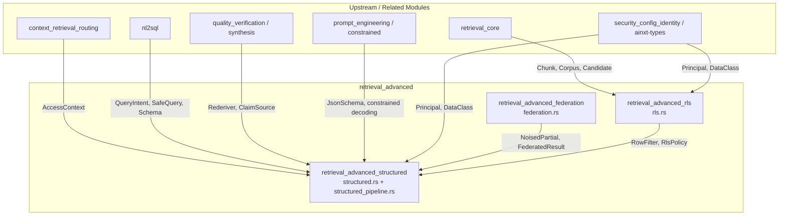
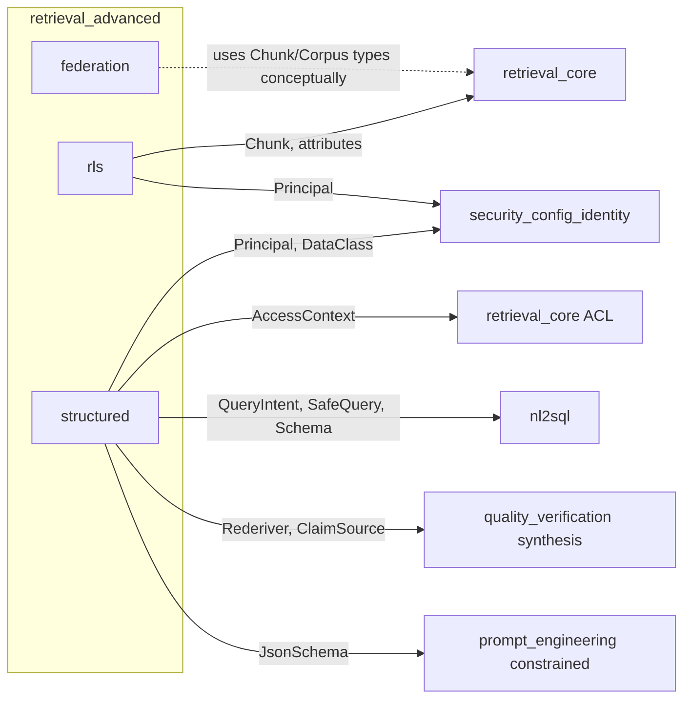
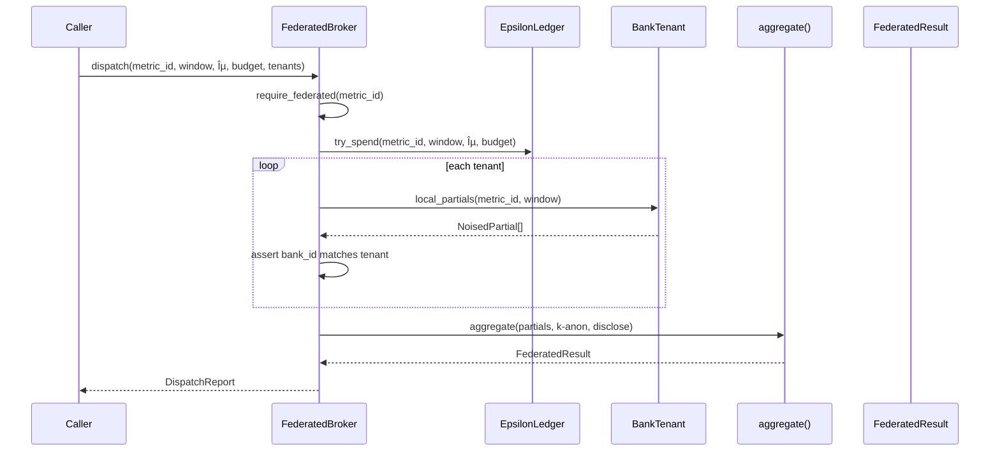
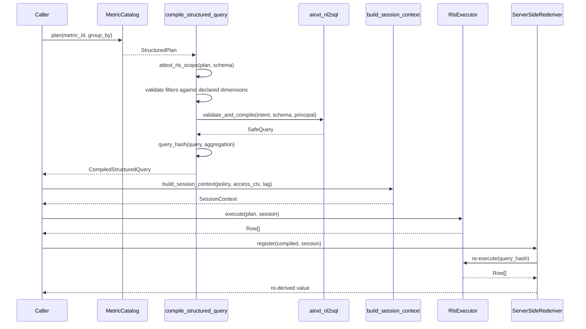

# retrieval_advanced

## Purpose

`retrieval_advanced` is the advanced retrieval sub-module within the larger `knowledge_retrieval` domain. It extends the core retrieval capabilities with three privacy- and governance-critical capabilities:

1. **Federated privacy-preserving aggregation** across isolated member-bank tenants, without any raw row ever leaving its own boundary.
2. **Row-level security (RLS)** filters bound from the caller's OBO principal and applied pre-rank, so existence of out-of-scope rows never leaks.
3. **Structured retrieval** over a closed-vocabulary metric catalog, where the model never emits raw SQL and every query is compiled deterministically against curated views with native Postgres RLS.

Together these ensure that sensitive data — especially payment-adjacent settlement and banking data — can be queried, aggregated, and verified while maintaining tenant isolation, differential-privacy budgets, row-level access control, and deterministic auditability.

## Architecture Overview

### Component Responsibilities

| Sub-module | File(s) | Responsibility |
|------------|---------|----------------|
| `retrieval_advanced_federation` | `federation.rs` | Closed-vocabulary federated queries across bank tenants with differential-privacy noise, ε-budget ledger, k-anonymity aggregation, and disclosure consent. |
| `retrieval_advanced_rls` | `rls.rs` | Principal-bound row-level security filters evaluated pre-rank, plus audited break-glass cross-scope read overrides. |
| `retrieval_advanced_structured` | `structured.rs`, `structured_pipeline.rs` | Closed-vocabulary metric catalog, git-native control-plane loader, RLS session-context derivation, and the Stage-A→Stage-B structured query compiler with server-side re-derivation. |

## High-Level Functionality

### Federated Privacy-Preserving Aggregation

The federation tier lets NPCI compute network-wide signals (for example, mule-account velocity) across member banks **without any bank's raw rows leaving its own boundary**. Each bank computes a local partial aggregate inside its own tenant, adds calibrated Laplace noise, and transmits only the noised partial. A central broker sums partials, applies a k-anonymity floor, and enforces a per-metric privacy-budget ledger.

Key guarantees:
- **Closed vocabulary**: only metrics explicitly whitelisted as `federated: true` may be queried.
- **Local DP noise**: noise is added inside the bank boundary before transmission.
- **Deterministic noise**: drawn from a seeded splitmix64 PRNG for reproducible audit.
- **ε-budget ledger**: append-only, durable, and fail-closed; exhausted budgets refuse queries rather than silently weakening noise.
- **K-anonymity**: buckets with too few contributing banks or too few underlying transactions are suppressed into an `"other"` bucket.
- **Disclosure consent**: per-bank breakdowns are withheld by default and only released when every contributing bank has a standing, unrevoked, metric-class opt-in.

See [retrieval_advanced_federation.md](retrieval_advanced_federation.md) for details.

### Row-Level Security Filters

`rls.rs` provides a retrieval-time row-filter contract analogous to Postgres `SET LOCAL ... USING (...)`. The filter binds session settings from the caller's OBO principal (for example, `department` and `user_id`) and evaluates every candidate chunk **before** ranking, fusing, or reranking. This ensures that out-of-scope rows are never scored and therefore their existence cannot leak.

Key guarantees:
- **Fail-closed**: a missing binding, missing row attribute, or mismatch denies the row.
- **Pre-rank enforcement**: applied alongside node ACL in `Corpus::hybrid_rls`.
- **Audited break-glass**: cross-scope reads require an explicit capability (`retrieval:break-glass-cross-scope-read`), a reason-coded grant, and produce a mandatory `BreakGlassAudit` record.

See [retrieval_advanced_rls.md](retrieval_advanced_rls.md) for details.

### Structured Retrieval Pipeline

The structured tier replaces free-form SQL generation with a deterministic, closed-vocabulary compiler. A git-reviewed `MetricCatalog` defines the only metrics, dimensions, source views, RLS policies, and row scopes that exist. The pipeline:

1. **Stage A** resolves the intent against the catalog (`MetricCatalog::plan`).
2. **Stage B** compiles a `SELECT`-only `QueryIntent` into a parameterized `SafeQuery` via `ainxt_nl2sql::validate_and_compile`.
3. **RLS attestation** cross-checks the metric's declared row scope against the compiled query's actual row scope, refusing any mismatch.
4. **Session-context derivation** builds the exact `SET LOCAL` bindings from the OBO `AccessContext`, fail-closed on missing claims.
5. **Server-side re-derivation** independently re-executes the compiled query and reapplies the aggregation to verify numeric claims (`ServerSideRederiver`).

Key guarantees:
- **No raw SQL from the model**: the LLM emits only `(metric_id, group_by, filters, aggregation)` within a closed vocabulary.
- **Git-native control plane**: metric definitions are content-addressed, hot-reloadable, and validated all-or-nothing.
- **Native Postgres RLS**: enforcement happens on a read replica; the runtime never sees a row RLS would hide.
- **Deterministic re-derivation**: compiled queries carry a stable `query_hash` used by the synthesis numeric gate.

See [retrieval_advanced_structured.md](retrieval_advanced_structured.md) for details.

## Module Boundaries and Dependencies

- **retrieval_core**: supplies the `Chunk`, `Corpus`, candidate/rerank abstractions, and ACL context that RLS filters extend. See [retrieval_core.md](retrieval_core.md).
- **nl2sql**: provides the schema-aware, RLS-injecting SQL compiler used by the structured pipeline. See [nl2sql.md](nl2sql.md).
- **quality_verification / synthesis**: consumes the `ServerSideRederiver` to independently verify metric-sourced numeric claims. See [quality_verification.md](quality_verification.md).
- **prompt_engineering / constrained**: the metric catalog emits a constrained-decoding schema so Stage-A proposals can be grammar-enforced. See [prompt_engineering.md](prompt_engineering.md).
- **security_config_identity / ainxt-types**: provides `Principal`, `DataClass`, and `AccessContext` used for principal-derived RLS and clearance checks. See [security_config_identity.md](security_config_identity.md).

## Data Flow: Federated Structured Query

## Data Flow: Structured Query with RLS

## Fail-Closed Design

Every sub-module in `retrieval_advanced` is designed to fail closed:

- **Federation**: non-whitelisted metrics, exhausted ε budgets, tenant-isolation violations, and missing disclosure consent all refuse the query or withhold data.
- **RLS**: missing principal claims, missing row attributes, or mismatched values deny the row; break-glass without the explicit capability is refused.
- **Structured retrieval**: unknown metrics/dimensions, undeclared filter dimensions, RLS-scope mismatches, unregistered source views, unbindable session values, and stale/drifted control-plane files all abort compilation or execution.

This fail-closed posture is what makes the module suitable for payment-adjacent and other high-sensitivity retrieval workloads.

## Documentation Index

- [retrieval_advanced_federation.md](retrieval_advanced_federation.md) — federated privacy-preserving aggregation across bank tenants.
- [retrieval_advanced_rls.md](retrieval_advanced_rls.md) — principal-bound row-level security filters and break-glass overrides.
- [retrieval_advanced_structured.md](retrieval_advanced_structured.md) — closed-vocabulary metric catalog, structured query compiler, and server-side re-derivation.
- [retrieval_core.md](retrieval_core.md) — core retrieval primitives (`Chunk`, `Corpus`, candidates, rerankers, ACL).
- [nl2sql.md](nl2sql.md) — schema-aware SQL compiler used by the structured pipeline.
- [quality_verification.md](quality_verification.md) — synthesis and numeric-claim verification that consumes `ServerSideRederiver`.
- [prompt_engineering.md](prompt_engineering.md) — constrained decoding and prompt engineering, including the `JsonSchema` used by the metric catalog.
- [security_config_identity.md](security_config_identity.md) — `Principal`, `DataClass`, and identity primitives used for RLS and clearance checks.
