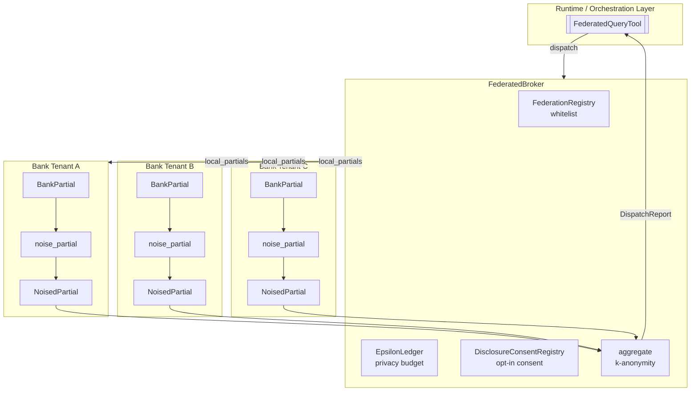
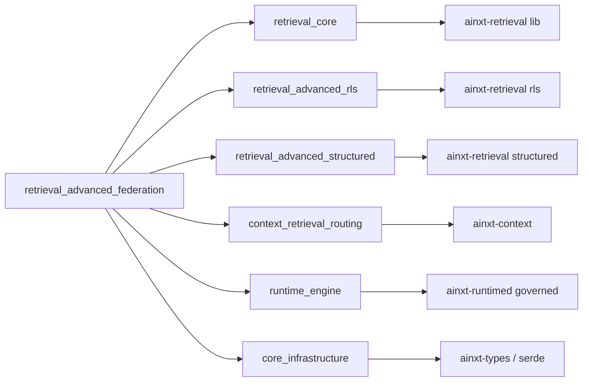
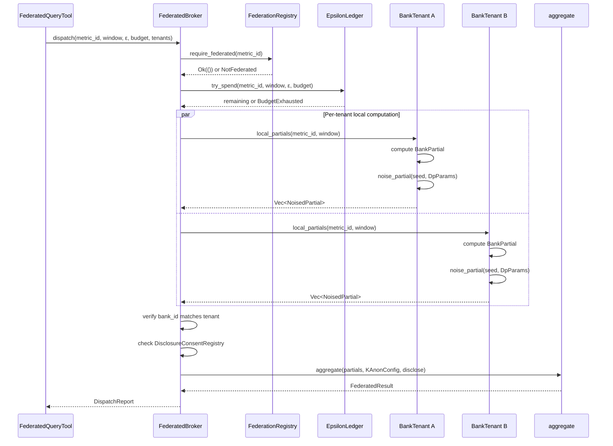
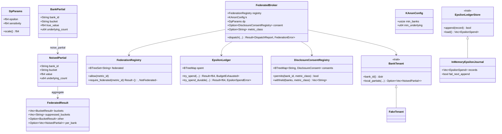
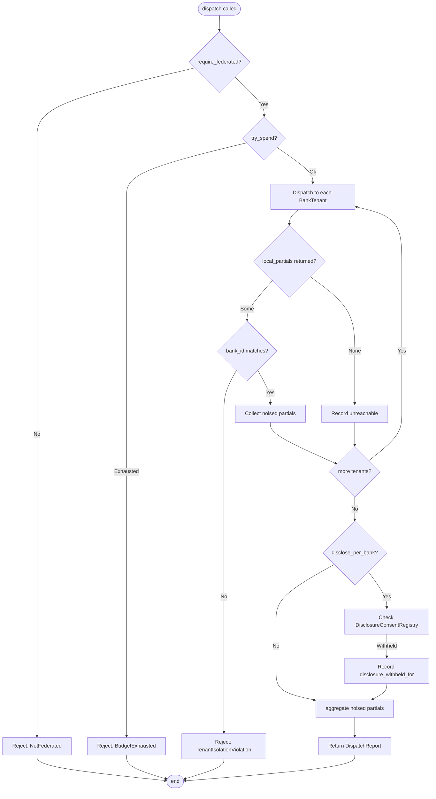
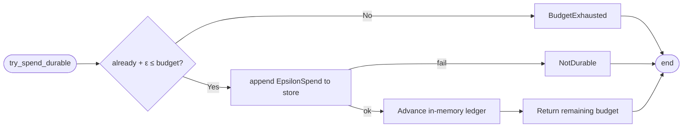
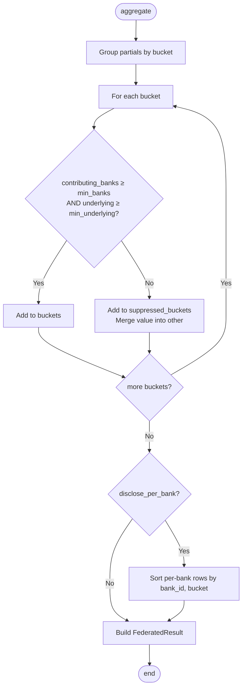

# retrieval_advanced_federation

## Brief Introduction

`retrieval_advanced_federation` implements the broker-side and bank-side logic for **privacy-preserving federated aggregation across isolated member-bank tenants**. It enables network-wide signals (for example, mule-account velocity across banks) to be computed **without any bank's raw rows ever leaving its own boundary**. Each tenant computes a local partial aggregate inside its own trust boundary, adds calibrated differential-privacy (DP) noise before transmission, and a central broker sums the noised partials under a k-anonymity floor and a per-metric privacy-budget ledger.

The module is intentionally **pure and deterministic**: DP noise is drawn from a caller-supplied seed via a splitmix64 PRNG, so every query is reproducible for audit. It is fail-closed at every gate: non-whitelisted metrics are rejected before any bank is contacted, exhausted privacy budgets refuse further queries (rather than silently weakening noise), and tenant-isolation violations abort the entire dispatch.

This module lives inside the broader [knowledge_retrieval](knowledge_retrieval.md) subsystem, alongside [retrieval_core](retrieval_core.md), [retrieval_advanced_rls](retrieval_advanced_rls.md), and [retrieval_advanced_structured](retrieval_advanced_structured.md). It is consumed by higher-level runtime surfaces such as [runtime_engine](runtime_engine.md), where `FederatedQueryTool` exposes federated signals to the rest of the system.

---

## Core Concepts

| Concept | Purpose |
|---------|---------|
| **Closed-vocabulary federation** | Only metric ids explicitly whitelisted (`federated: true`) can be federated. No open cross-bank query surface exists. |
| **Local-before-transmit DP noise** | Each bank adds Laplace noise to its partial *before* it leaves the tenant boundary; the true value is never transmitted. |
| **Privacy-budget ledger** | A per-(metric, window) append-only ε budget debits each query and refuses further queries once exhausted. |
| **K-anonymity floor** | Buckets contributed by too few banks or underpinned by too few transactions are suppressed and merged into an `"other"` bucket. |
| **Disclosure opt-in** | Per-bank breakdowns are withheld by default and only included when every contributing bank has a standing, git-reviewed consent record. |
| **Tenant isolation** | The broker never holds bank credentials or reads raw rows; it only orchestrates noised partials returned by the `BankTenant` seam. |

---

## Architecture



### Component Breakdown

- **`FederationRegistry`** — A git-reviewed whitelist of metric ids that may be federated. `require_federated` rejects non-whitelisted metrics before any tenant is contacted.
- **`DpParams`** — Calibrates Laplace noise via `scale = sensitivity / epsilon`.
- **`BankPartial` / `NoisedPartial`** — The bank-side local partial (true value + underlying count) and the only object that crosses the tenant boundary (value + noise + underlying count).
- **`EpsilonLedger` / `EpsilonLedgerStore`** — Tracks per-(metric, window) ε spend. The durable store seam guarantees write-ahead debit so budget survives restarts.
- **`KAnonConfig` / `aggregate`** — Sums noised partials per bucket and suppresses small cells into `"other"`.
- **`DisclosureConsent` / `DisclosureConsentRegistry`** — Per-bank, per-metric-class opt-in for releasing per-bank breakdowns.
- **`BankTenant`** — The isolation seam through which the broker requests noised partials without ever touching raw rows or credentials.
- **`FederatedBroker`** — Orchestrates the full pipeline: whitelist → budget debit → tenant dispatch → tenant-isolation check → consent gate → aggregation.

---

## Dependencies



`retrieval_advanced_federation` depends only on `serde` and the standard library for serialization; it is I/O-free by design. Physical tenant isolation, durable ledger storage, and transport authentication are provided by surrounding infrastructure modules. For the foundational retrieval primitives (embeddings, rerankers, corpus definitions), see [retrieval_core](retrieval_core.md). For row-level security controls, see [retrieval_advanced_rls](retrieval_advanced_rls.md). For structured query execution, see [retrieval_advanced_structured](retrieval_advanced_structured.md).

---

## Data Flow



### Key Data Structures

| Structure | Contains | Crosses tenant boundary? |
|-----------|----------|--------------------------|
| `BankPartial` | `bank_id`, `bucket`, `true_value`, `underlying_count` | No |
| `NoisedPartial` | `bank_id`, `bucket`, `value` (noised), `underlying_count` | Yes |
| `BucketResult` | `bucket`, aggregated `value`, `contributing_banks`, `underlying_count` | Yes (output) |
| `FederatedResult` | `buckets`, `suppressed_buckets`, `other`, optional `per_bank` | Yes (output) |
| `DispatchReport` | `result`, `contributed`, `unreachable`, `epsilon_remaining`, `disclosure_withheld_for` | Yes (output) |

---

## Component Interactions



---

## Process Flows

### Federated Query Dispatch



### Privacy-Budget Debit



### K-Anonymity Aggregation



---

## Deterministic Differential Privacy

The module uses a deterministic splitmix64 PRNG to draw Laplace noise from an explicit seed. This satisfies the system's `DETERMINISTIC` mandate: the same seed and scale always produce the same noise value, making queries reproducible for audit. Different seeds (for example, derived from `query_hash + bank_id`) produce independent draws across banks and queries.

```rust
pub fn laplace_noise(seed: u64, scale: f64) -> f64
pub fn noise_partial(p: &BankPartial, dp: DpParams, seed: u64) -> NoisedPartial
```

The Laplace scale is `sensitivity / epsilon`. Smaller ε (stronger privacy) yields larger noise. The function guards against non-finite or non-positive scales by returning zero noise, avoiding `NaN` in the output.

---

## Privacy-Budget Ledger

The `EpsilonLedger` is the defense against **averaging-out attacks**: because Laplace noise is zero-mean, repeated queries with independent seeds could recover the true aggregate. The ledger caps the total ε spent per `(metric_id, window)` pair.

- `try_spend` performs an in-memory debit.
- `try_spend_durable` writes the debit to an `EpsilonLedgerStore` before advancing the in-memory ledger, ensuring budget survives process restarts.
- `InMemoryEpsilonJournal` is the offline reference implementation with an injectable `fail_next_append` flag to test the fail-closed path.

When the budget is exhausted, the query is **refused**, not silently re-noised with a weaker ε.

---

## K-Anonymity and Disclosure Controls

### K-Anonymity Floor

`aggregate` suppresses any bucket that fails either of:

- `contributing_banks < min_banks`
- `underlying_count < min_underlying`

Suppressed buckets are merged into an `"other"` bucket so that no small, distinguishable cell is returned.

### Disclosure Consent

Per-bank breakdowns are governed by `DisclosureConsentRegistry`:

- Absence of a consent record = refusal.
- A revoked record = refusal.
- A record that does not name the metric class = refusal.
- The breakdown is released only if **every contributing bank** permits the metric class.

The caller's `disclose_per_bank` flag is treated as a request, not an authorization. If any bank withholds consent, the aggregate still returns but `disclosure_withheld_for` lists the non-consenting banks for audit.

---

## Integration with the Wider System

`retrieval_advanced_federation` is one of three advanced retrieval capabilities grouped under [retrieval_advanced](retrieval_advanced.md):

- **[retrieval_advanced_federation](retrieval_advanced_federation.md)** — cross-tenant privacy-preserving aggregation (this module).
- **[retrieval_advanced_rls](retrieval_advanced_rls.md)** — row-level security policies and break-glass grants.
- **[retrieval_advanced_structured](retrieval_advanced_structured.md)** — structured query planning and server-side rederivation.

It sits on top of [retrieval_core](retrieval_core.md), which provides the embedding, reranking, and corpus primitives, and is consumed by the runtime layer in [runtime_engine](runtime_engine.md) via `FederatedQueryTool`. The broader retrieval pipeline is orchestrated by [knowledge_retrieval](knowledge_retrieval.md), which also brings in context routing from [context_retrieval_routing](context_retrieval_routing.md) and natural-language-to-SQL from [nl2sql](nl2sql.md).

---

## Fail-Closed Guarantees

| Threat | Mitigation |
|--------|------------|
| Open-ended cross-bank queries | `FederationRegistry` whitelist rejects unknown metrics before dispatch. |
| Averaging out DP noise | `EpsilonLedger` caps ε per (metric, window) and refuses further queries. |
| Small-cell disclosure | `KAnonConfig` suppresses buckets with too few banks or transactions. |
| One tenant impersonating another | `FederatedBroker` aborts if any partial's `bank_id` does not match its tenant. |
| Silent per-bank exposure | `DisclosureConsentRegistry` requires standing, unrevoked, per-class opt-in from every contributor. |
| Budget lost on restart | `EpsilonLedgerStore` write-ahead discipline persists debits before advancing memory. |

---

## Testing Strategy

The module includes inline unit tests covering:

- Whitelist rejection before bank contact.
- Determinism and calibration of Laplace noise.
- Privacy-budget debit, exhaustion, and exact-budget edge cases.
- K-anonymity suppression by bank count and underlying transaction count.
- Default withholding and opt-in of per-bank breakdowns.
- End-to-end bank-side noise followed by broker aggregation.
- Broker dispatch, ledger debit, tenant isolation, and unreachable-tenant handling.

The `InMemoryEpsilonJournal::fail_next_append` flag specifically exercises the durable-store failure path so that the fail-closed behavior is tested offline rather than assumed in production.
