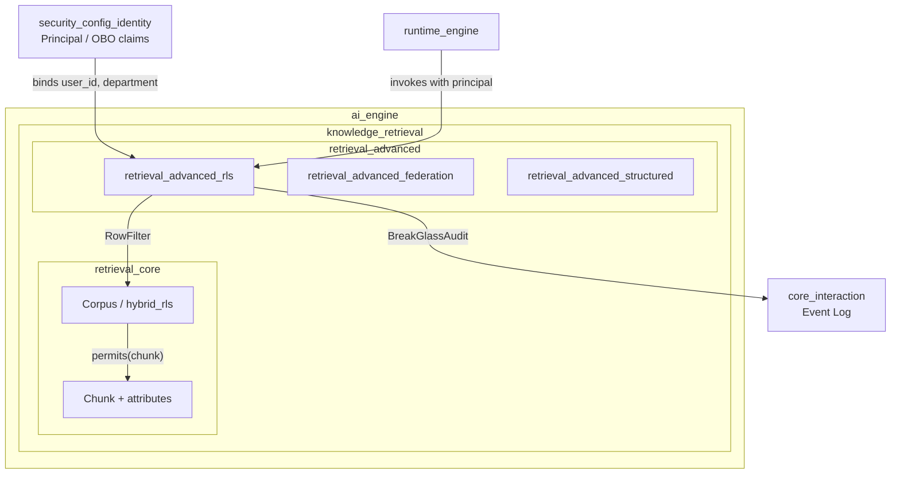
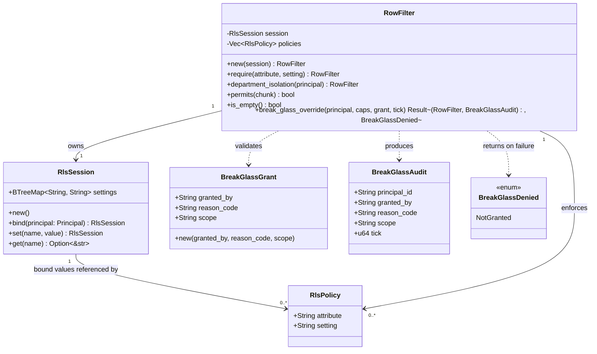
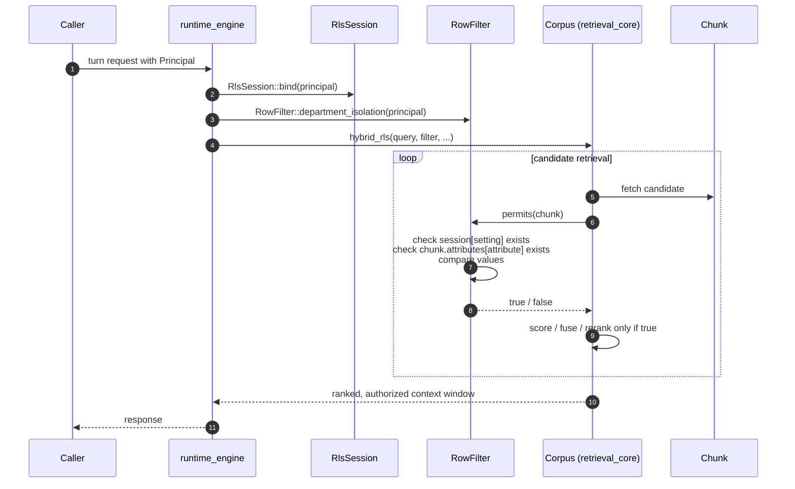
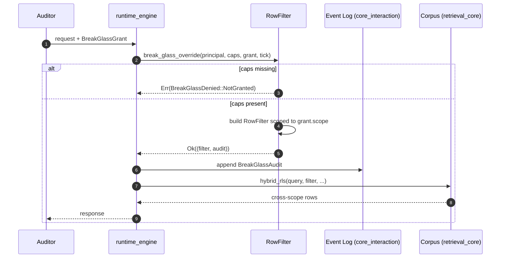
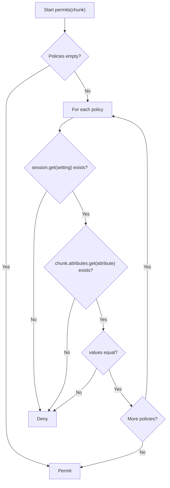
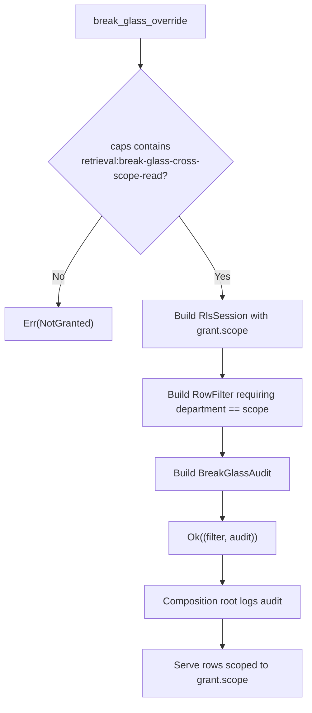

# retrieval_advanced_rls

## Brief Introduction

`retrieval_advanced_rls` implements **row-level security (RLS) for the knowledge-retrieval layer**. It binds per-request predicates from the caller's OBO principal and applies them **pre-rank** to every [`Chunk`](retrieval_core.md#chunk) candidate, ensuring that rows the caller is not authorized to read are never scored, reranked, fused, or counted. The module is the retrieval analogue of database RLS (`SET LOCAL app.tenant = ...` plus a `USING` policy): a session setting is captured from the principal at query start, and each readable row must carry a matching attribute.

The module lives under [`knowledge_retrieval`](knowledge_retrieval.md) → `retrieval_advanced`, alongside [`retrieval_advanced_federation`](retrieval_advanced_federation.md) and [`retrieval_advanced_structured`](retrieval_advanced_structured.md). While `retrieval_core` provides the embedding, lexical, and reranking machinery, `retrieval_advanced_rls` closes the authorization half by enforcing **per-request, principal-derived row scopes**.

Two invariants make the design safe for sensitive data such as payments records:

1. **Pre-rank, existence-never-leaks.** `RowFilter::permits` is evaluated in `Corpus::hybrid_rls` before scoring and fusion, so denied rows leave no statistical trace.
2. **Fail-closed.** A policy is satisfied only when the bound session setting is present **and** the row carries the referenced attribute **and** the values match. Missing binding, missing attribute, or mismatch all deny the row.

The module also provides an **audited break-glass override** for senior/auditor cross-scope reads (e.g., RBI audits, incident investigation). The override is capability-gated, reason-coded, scoped to a single cross-scope value, and always returns a mandatory `BreakGlassAudit` record that the composition root must log before serving any row.

---

## Architecture

### Module Position



### Component Overview



---

## Core Components

### `RlsSession`

`RlsSession` is the `SET LOCAL` half of RLS. It holds a sorted map of bound setting names to values captured from the caller's [`Principal`](security_config_identity.md#principal) or supplied by the composition root.

- **`bind(principal)`** — captures `user_id` and, if present, `department`. A `None` department is intentionally **not bound**, so department isolation fail-closes instead of matching an empty string.
- **`set(name, value)`** — binds custom settings such as a resolved tenant id.
- **`get(name)`** — returns the bound value, if any.

The use of `BTreeMap` makes the session deterministic and easy to serialize for audit/replay purposes.

### `RlsPolicy`

A single row-security predicate:

```text
USING (chunk.attributes[attribute] = session.settings[setting])
```

- `attribute` — the key looked up in `Chunk::attributes`.
- `setting` — the session setting whose bound value the attribute must equal.

Policies are pure equality checks. More complex predicates (range, membership, etc.) are intentionally not supported at this layer; they belong in [`retrieval_advanced_structured`](retrieval_advanced_structured.md) or the upstream query planner.

### `RowFilter`

`RowFilter` combines a bound `RlsSession` with a list of `RlsPolicy` rules. A row passes **only if every policy holds**; an empty policy set is a no-op that permits all rows.

- **`department_isolation(principal)`** — the common case. Binds the principal's department and requires `chunk.attributes["department"] == session["department"]`.
- **`permits(chunk)`** — fail-closed evaluation used by `Corpus::hybrid_rls`.
- **`is_empty()`** — indicates whether any policy is in force.

### Break-Glass Override

For genuine cross-scope reads, `RowFilter::break_glass_override` provides a **single-query, explicitly granted, reason-coded exception**.

- Requires the capability `retrieval:break-glass-cross-scope-read` in the caller's granted capabilities.
- Returns both the overridden `RowFilter` **and** a `BreakGlassAudit` record in the same `Result`, making it structurally impossible to obtain the override without also obtaining the audit payload.
- The override is scoped to exactly one value (`grant.scope`), never "all rows".

`BreakGlassGrant` carries the approver identity, a PII-free reason code, and the target scope. `BreakGlassAudit` captures who exercised the override, who approved it, why, what scope was reached, and the logical tick.

---

## Data Flow

### Standard Department-Isolation Query



### Break-Glass Cross-Scope Read



---

## Process Flows

### Policy Evaluation (Fail-Closed)



### Break-Glass Decision



---

## Integration with the System

### Upstream Callers

The typical caller is the runtime engine ([`runtime_engine`](runtime_engine.md)), which:

1. Receives a turn request carrying an authenticated [`Principal`](security_config_identity.md#principal).
2. Decides whether to apply standard department isolation or a break-glass override based on surface configuration and granted capabilities.
3. Passes the resulting `RowFilter` into `Corpus::hybrid_rls` from [`retrieval_core`](retrieval_core.md).

The module is a **read-filter, not an admission gate**: it shapes which rows a turn may read, never whether the turn proceeds. The runtime never denies a turn solely because the caller lacks row-scope clearance.

### Downstream Consumers

- [`retrieval_core`](retrieval_core.md) — `Corpus::hybrid_rls` consumes `RowFilter` and applies it pre-rank.
- [`core_interaction`](core_interaction.md) — the composition root writes `BreakGlassAudit` records to the event log for compliance.
- [`retrieval_advanced_structured`](retrieval_advanced_structured.md) — structured query pipelines may layer additional SQL-level RLS (e.g., Postgres `USING` policies) on top of this retrieval-time filter.

### Relationship to Other Security Modules

- [`security_config_identity`](security_config_identity.md) supplies the `Principal` type and OBO claims (`user_id`, `department`, granted capabilities).
- [`retrieval_advanced_federation`](retrieval_advanced_federation.md) handles cross-tenant differential-privacy budgets and disclosure consent; RLS handles single-tenant, principal-derived row scopes.
- [`retrieval_advanced_structured`](retrieval_advanced_structured.md) provides SQL-level row filters and server-side rederivation for structured data sources.

---

## Security & Compliance Considerations

| Concern | Mitigation |
|--------|-----------|
| Existence leakage | Filter runs **pre-rank**; denied rows never enter scoring/fusion/reranking. |
| Missing principal claims | `None` department is not bound, so department isolation denies all rows rather than matching empty strings. |
| Missing row attributes | `permits` returns `false` if the referenced attribute is absent. |
| Admin bypass | No role-based bypass. Cross-scope reads require the explicit `retrieval:break-glass-cross-scope-read` capability. |
| Silent override | `break_glass_override` returns the filter and audit record together; the audit payload must be logged before serving rows. |
| Audit PII safety | `BreakGlassAudit` contains only ids, reason codes, scope, and tick — never row contents. |
| Determinism | Sorted `BTreeMap`, no clock or RNG, making behavior reproducible for tests and replay. |

---

## References

- [`retrieval_core`](retrieval_core.md) — `Corpus`, `Chunk`, `hybrid_rls`, and the retrieval scoring pipeline.
- [`retrieval_advanced_federation`](retrieval_advanced_federation.md) — cross-tenant federation, differential privacy, and disclosure consent.
- [`retrieval_advanced_structured`](retrieval_advanced_structured.md) — structured query execution and SQL-level RLS integration.
- [`knowledge_retrieval`](knowledge_retrieval.md) — broader retrieval architecture and context routing.
- [`security_config_identity`](security_config_identity.md) — `Principal`, OBO claims, and capability model.
- [`core_interaction`](core_interaction.md) — event logging and audit sinks.
- [`runtime_engine`](runtime_engine.md) — the engine that binds principals and invokes retrieval.
