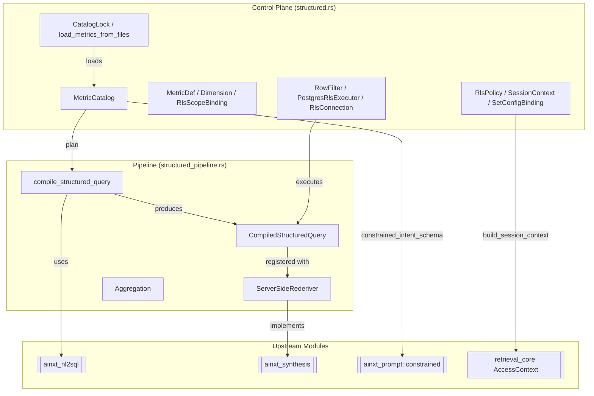
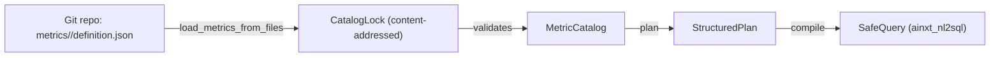
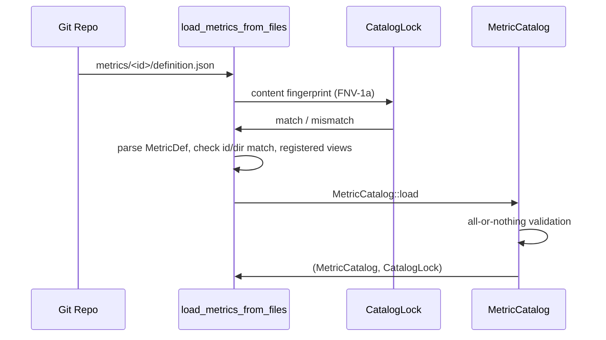
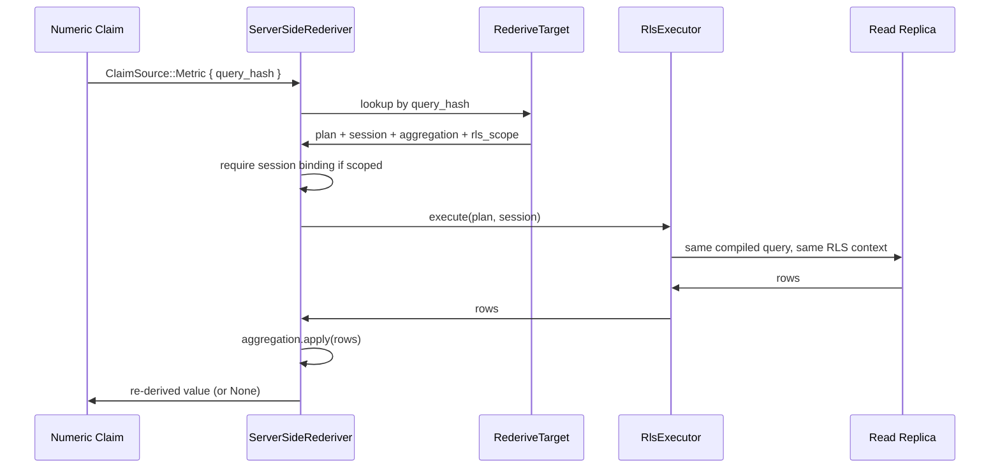
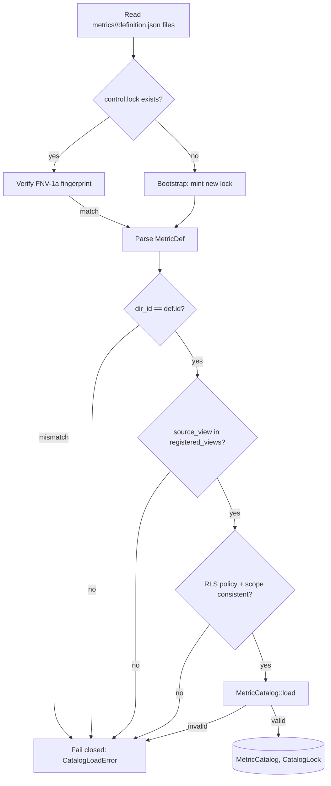
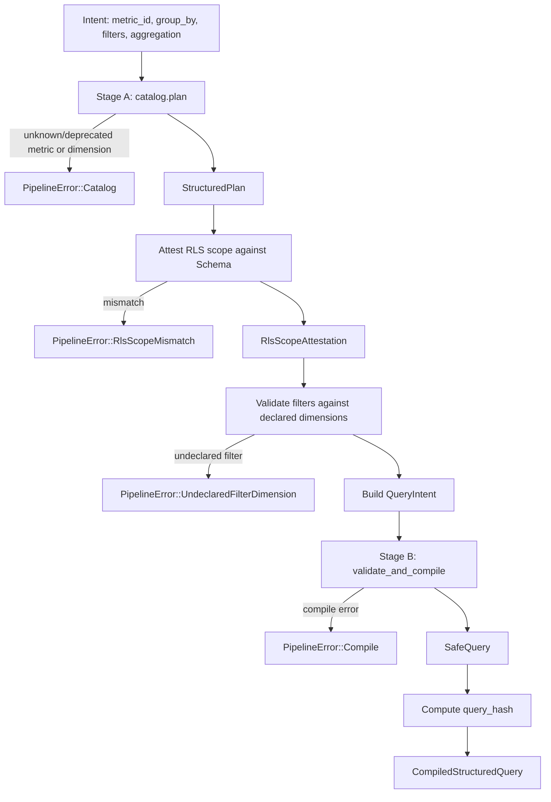
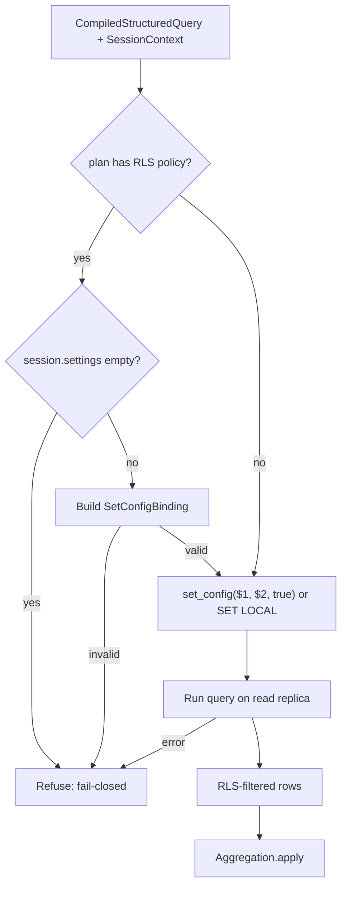
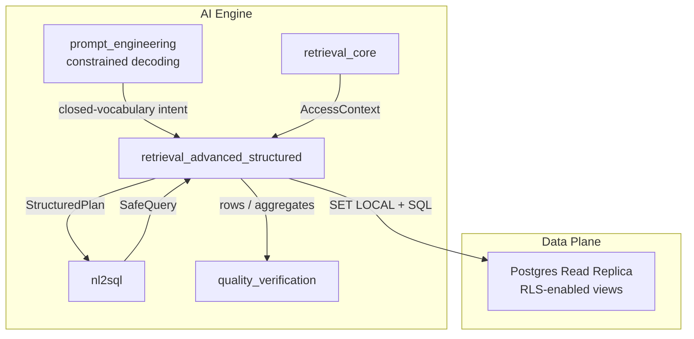

# retrieval_advanced_structured

## Brief Introduction

`retrieval_advanced_structured` is the **closed-vocabulary, deterministic compiler for structured (metric-based) retrieval**. It guarantees that the system never produces raw free-form SQL from a model: the only thing an LLM may emit is a constrained intent (`metric_id`, `group_by`, `filters`, `aggregation`), and a deterministic, offline-auditable compiler turns that intent into a parameterized SQL query against a curated, catalog-approved database view.

The module lives in `crates/ainxt-retrieval` and is composed of two source files:

- `structured.rs` — the **control plane**: the metric/dimension catalog, row-level-security (RLS) session-context derivation, and the database execution seam.
- `structured_pipeline.rs` — the **integrated pipeline**: catalog resolution → NL-to-SQL compilation → server-side re-derivation.

It is part of the larger [`retrieval_advanced`](retrieval_advanced.md) subsystem, alongside [`retrieval_advanced_federation`](retrieval_advanced_federation.md) and [`retrieval_advanced_rls`](retrieval_advanced_rls.md), and consumes the core retrieval primitives defined in [`retrieval_core`](retrieval_core.md).

---

## Core Purpose

Structured retrieval answers numeric/factual questions over curated data (e.g., "how many settlement failures occurred for bank X last hour?") without ever letting the model write SQL. The module enforces four design invariants from `STRUCTURED_FEDERATED_RETRIEVAL.md`:

1. **Closed vocabulary** — a metric or dimension not declared in [`MetricCatalog`] does not exist to the compiler.
2. **Curated views only** — every metric targets a read-only `v_*` view, never a base table.
3. **Enforceable RLS** — a metric with a declared RLS policy must also declare the exact row scope that policy enforces; the compiler cross-checks the declared scope against the SQL it emits.
4. **Fail-closed derivation** — RLS `SET LOCAL` session variables are derived from the OBO [`AccessContext`](retrieval_core.md); a missing required claim aborts the query.

---

## Architecture

### High-level component map

### Catalog as the single source of truth

The catalog is loaded from git-native definition files (ADR-026). Each file is content-addressed with an FNV-1a fingerprint and checked against a pinned `control.lock`. The loader is **all-or-nothing**: one malformed or drifted definition rejects the entire catalog.

---

## Key Components

### `MetricCatalog`

The closed vocabulary of structured retrieval. It stores [`MetricDef`]s keyed by metric id and provides:

- `load(metrics, registered_rls)` — all-or-nothing validation against a set of known Postgres RLS policy names.
- `resolve(metric_id)` — closed-vocabulary lookup; unknown/deprecated metrics fail.
- `plan(metric_id, group_by)` — emits a [`StructuredPlan`] after validating that every grouping dimension is declared on the metric.
- `metric_ids()` — the exact vocabulary a Stage-A proposal may reference (deprecated metrics excluded).
- `constrained_intent_schema()` — a GBNF/native constrained-decoding schema where `metric_id` is an enum over `metric_ids()`, preventing the model from emitting an out-of-catalog metric.

### `MetricDef`

A single metric definition:

| Field | Purpose |
|-------|---------|
| `id` | Canonical metric identifier. |
| `source_view` | Read-only `v_*` view the compiler targets. |
| `dimensions` | Allowed grouping/filtering dimensions, each labeled with a `DataClass`. |
| `data_class_ceiling` | Sensitivity ceiling fed to the Model Router. |
| `rls_predicate_ref` | Postgres RLS policy name (optional, but rare). |
| `rls_scope` | Exact row-scope rules the RLS policy enforces (§2.2.2). |
| `federated` | Whether the metric is on the federated whitelist. |
| `deprecated` | Loaded for lineage but cannot be planned. |
| `freshness_sla_seconds` | Replica lag budget before results are flagged `stale_as_of`. |

### `RlsScopeBinding` / `ScopeAttr`

Declares that the metric's RLS policy enforces `column = <principal attribute>`. `ScopeAttr` mirrors `ainxt_nl2sql::PrincipalAttr`:

- `Department` — caller's department / org unit.
- `UserId` — caller's user id (owner-scoped rows).

The compiler cross-checks the declared scope against the row scope actually compiled into the SQL; any mismatch refuses the query.

### `RlsPolicy` / `SessionContext` / `SetConfigBinding`

`RlsPolicy` binds a Postgres RLS policy name to the `SET LOCAL` session variables its predicate reads. `build_session_context` derives those values from the OBO [`AccessContext`](retrieval_core.md). If a required claim is missing, it returns `RlsError::MissingClaim` and the query must abort.

`SetConfigBinding` is the **only** way to render a binding. It validates the GUC name and quotes the value as a Postgres literal (or uses the parameterized `SELECT set_config($1, $2, true)` path). This makes the binding structurally un-forgeable: OBO-sourced values are never interpolated into SQL text.

### `RlsExecutor` / `RowFilter` / `PostgresRlsExecutor`

- `RlsExecutor` is the seam between the deterministic compiler and the database.
- `RowFilter` is an offline, in-process oracle that mirrors Postgres RLS semantics for tests.
- `PostgresRlsExecutor<C: RlsConnection>` is the production path: it refuses to run a policied plan with an empty session context, builds validated `SetConfigBinding`s, and delegates to a live Postgres read replica.

### `compile_structured_query` (pipeline)

The integrated Stage-A → Stage-B compiler:

1. **Stage A**: `catalog.plan(metric_id, group_by)` validates the metric and grouping dimensions.
2. **RLS scope attestation**: `attest_rls_scope` cross-checks the metric's declared row scope against the schema's compiled row scope.
3. **Filter validation**: every `DimensionFilter` must reference a declared dimension.
4. **Projection**: build a `SELECT`-only `QueryIntent` over the curated `source_view`.
5. **Stage B**: `ainxt_nl2sql::validate_and_compile` produces a parameterized `SafeQuery` under the caller's clearance.

Output: a [`CompiledStructuredQuery`] carrying the plan, query, aggregation, and a stable `query_hash`.

### `ServerSideRederiver`

Implements `ainxt_synthesis::rederive::Rederiver`. For a numeric claim tagged `ClaimSource::Metric { query_hash, .. }`, it independently re-executes the same compiled query through the same `RlsExecutor` seam and re-applies the same `Aggregation`. This is a fresh data-path recomputation, not a re-ask of the model. See [`quality_verification`](quality_verification.md) for how the numeric gate uses this.

---

## Data Flow

### End-to-end structured query

```mermaid
sequenceDiagram
    participant LLM as Constrained LLM Output
    participant Cat as MetricCatalog
    participant Pipe as compile_structured_query
    participant NL2SQL as ainxt_nl2sql
    participant Exec as RlsExecutor
    participant DB as Postgres Read Replica

    LLM->>Cat: metric_id, group_by, filters, aggregation
    Cat->>Cat: resolve metric, validate dimensions
    Cat->>Pipe: StructuredPlan
    Pipe->>Pipe: validate filters, attest RLS scope
    Pipe->>NL2SQL: QueryIntent over source_view
    NL2SQL->>Pipe: SafeQuery (parameterized SQL)
    Pipe->>Pipe: compute query_hash
    Pipe->>Exec: CompiledStructuredQuery + SessionContext
    Exec->>DB: SET LOCAL app.dept = ...&#59; SELECT ...
    DB->>Exec: RLS-filtered rows
    Exec->>Pipe: rows
    Pipe->>Pipe: Aggregation.apply(rows)
```

### Git-native catalog load

### Server-side re-derivation

---

## Component Interactions

### Within the module

| Caller | Callee | Purpose |
|--------|--------|---------|
| `load_metrics_from_files` | `CatalogLock::of`, `MetricCatalog::load` | Content-address and validate a git-native catalog. |
| `MetricCatalog::plan` | `MetricCatalog::resolve` | Resolve metric and validate grouping dimensions. |
| `compile_structured_query` | `MetricCatalog::plan`, `attest_rls_scope`, `validate_and_compile` | Bridge Stage A and Stage B. |
| `PostgresRlsExecutor::execute` | `SessionContext::bindings` | Apply fail-closed, parameterized RLS bindings. |
| `ServerSideRederiver::rederive` | `RlsExecutor::execute`, `Aggregation::apply` | Recompute a metric-sourced claim. |

### With other modules

| This module | Other module | Relationship |
|-------------|--------------|--------------|
| `structured.rs` | [`retrieval_core`](retrieval_core.md) | Uses `AccessContext` from `crate::acl` for OBO-derived RLS variables. |
| `structured_pipeline.rs` | [`nl2sql`](nl2sql.md) | Projects the `StructuredPlan` into a `QueryIntent` and calls `validate_and_compile`. |
| `structured_pipeline.rs` | [`quality_verification`](quality_verification.md) | `ServerSideRederiver` implements `ainxt_synthesis::rederive::Rederiver`, consumed by the numeric gate. |
| `MetricCatalog::constrained_intent_schema` | [`prompt_engineering`](prompt_engineering.md) | Emits an `ainxt_prompt::constrained::JsonSchema` for Stage-A constrained decoding. |
| `MetricDef::federated` | [`retrieval_advanced_federation`](retrieval_advanced_federation.md) | Federated whitelisting is cross-checked by federation. |
| `RlsPolicy` / `RlsScopeBinding` | [`retrieval_advanced_rls`](retrieval_advanced_rls.md) | Complements the RLS policy runtime; this module owns the catalog-side declaration and session derivation. |

---

## Process Flows

### Loading a new metric catalog

### Compiling a structured query

### Executing with RLS

---

## Error Model

The module is **fail-closed** at every boundary:

| Error | Meaning | Handling |
|-------|---------|----------|
| `CatalogError::UnknownMetric` | Metric not in catalog. | Refuse intent; model cannot propose it. |
| `CatalogError::UnknownDimension` | Dimension not declared on metric. | Refuse grouping/filter. |
| `CatalogError::InvalidSourceView` | Target is not a `v_*` view. | Reject whole catalog load. |
| `CatalogError::UnknownRlsPolicy` | Dangling RLS reference. | Reject whole catalog load. |
| `CatalogLoadError::LockMismatch` | Content drift vs `control.lock`. | Refuse load. |
| `CatalogLoadError::IdMismatch` | Directory name differs from declared id. | Refuse load. |
| `CatalogLoadError::RlsPolicyWithoutScope` | Policy declared but no scope. | Refuse load. |
| `PipelineError::RlsScopeMismatch` | Compiled scope differs from declared scope. | Refuse query. |
| `PipelineError::UndeclaredFilterDimension` | Filter on unknown dimension. | Refuse before DB access. |
| `RlsError::MissingClaim` | Required OBO claim absent. | Abort query. |
| `RlsBindingError::InvalidVarName` / `InvalidValue` | Cannot safely bind session var. | Abort query. |

---

## Integration into the Overall System

`retrieval_advanced_structured` sits between the **constrained LLM output layer** and the **database/read-replica layer**:

- **Upstream**: receives a constrained intent from [`prompt_engineering`](prompt_engineering.md) (Stage-A schema produced by `MetricCatalog::constrained_intent_schema`).
- **Downstream**: executes against a Postgres read replica whose curated views carry the RLS policies named by the catalog.
- **Sidestream**: feeds `ServerSideRederiver` into [`quality_verification`](quality_verification.md) for independent numeric-claim verification, and is cross-checked by [`retrieval_advanced_federation`](retrieval_advanced_federation.md) for federated whitelisting.

---

## References

- [`retrieval_core`](retrieval_core.md) — base retrieval primitives and `AccessContext`.
- [`retrieval_advanced`](retrieval_advanced.md) — parent module overview.
- [`retrieval_advanced_federation`](retrieval_advanced_federation.md) — federated dispatch and budget accounting.
- [`retrieval_advanced_rls`](retrieval_advanced_rls.md) — RLS policy runtime details.
- [`nl2sql`](nl2sql.md) — the Stage-B SQL compiler consumed by `compile_structured_query`.
- [`quality_verification`](quality_verification.md) — numeric claim verification via `ServerSideRederiver`.
- [`prompt_engineering`](prompt_engineering.md) — constrained decoding schemas and prompt control.
