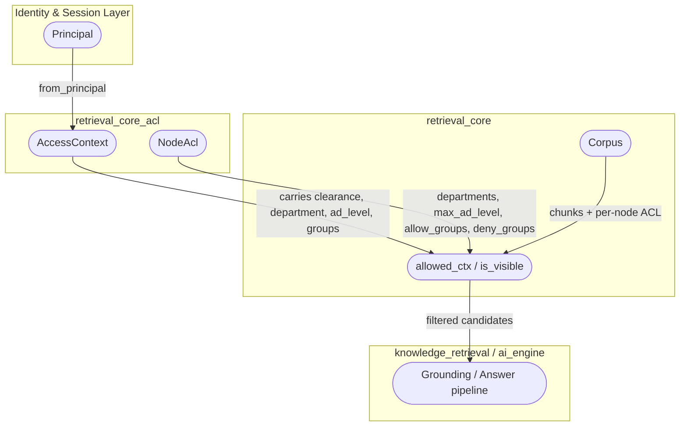
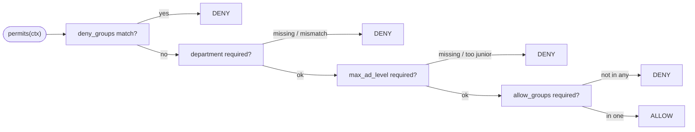
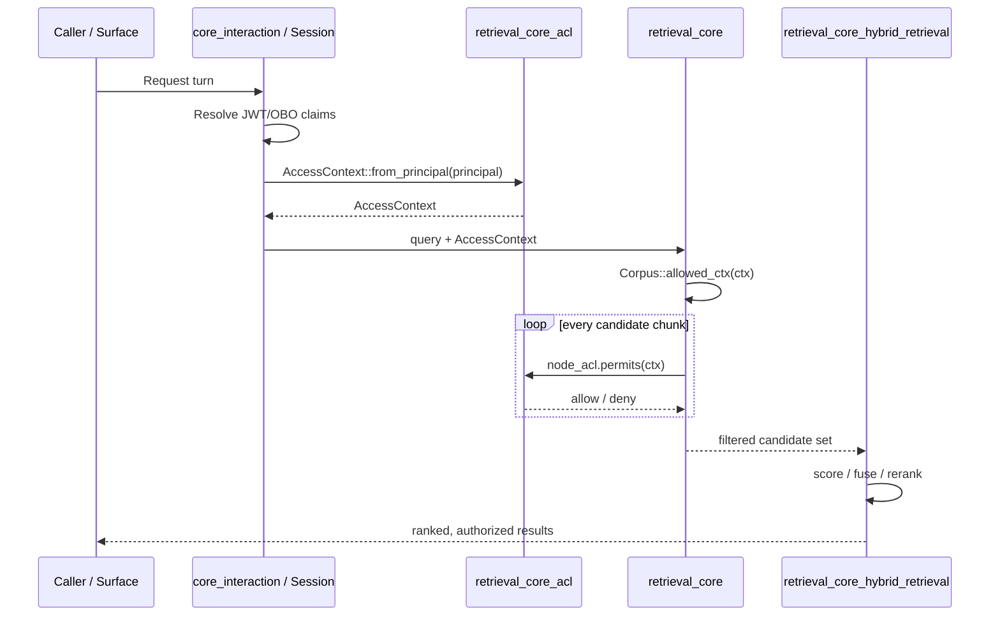
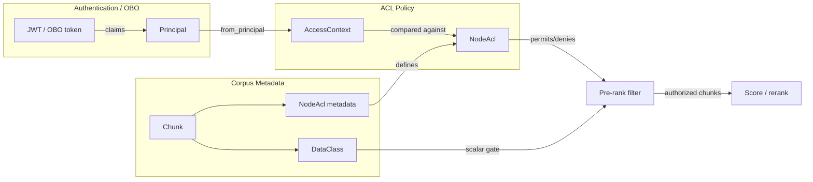

# retrieval_core_acl

## Brief Introduction

`retrieval_core_acl` implements **node/edge-level access control** for the knowledge-retrieval pipeline. While the base retrieval layer gates chunks on the scalar `DataClass` clearance, real-world corpora also need orthogonal RBAC axes: **department ownership**, **AD seniority** (`ad_level`), and **explicit allow/deny groups**. This module provides the pure, deterministic policy types (`AccessContext` and `NodeAcl`) that enforce those extra axes **before** ranking, so a denied node never leaks its existence through scores, result counts, or rank gaps.

It lives in `crates/ainxt-retrieval/src/acl.rs` and is a sub-module of [`retrieval_core`](retrieval_core.md) under the [`knowledge_retrieval`](knowledge_retrieval.md) area of [`ai_engine`](ai_engine.md).

---

## Core Purpose

The module answers one question: **"May this caller see this node?"** beyond the coarse `DataClass` scalar.

A concrete example from the design docs: a settlement postmortem may be `Internal` by data class, yet visible only to `settlement-eng` staff at `ad_level <= 3` and only if they are in the `oncall` group. `retrieval_core_acl` supplies the policy primitives that make that possible.

Two safety rules govern the design:

1. **Pre-rank, existence-never-leaks.** `NodeAcl` is evaluated in the same pre-rank pass as the class filter (via [`retrieval_core`](retrieval_core.md)'s `Corpus::allowed_ctx`), so invisible nodes are never scored, fused, reranked, or counted.
2. **Fail-closed on missing claims.** If an ACL requires a seniority ceiling or an allow-group and the caller's `AccessContext` cannot prove it, the node is denied. A deny-group always wins.

---

## Architecture

### Component Overview

### `AccessContext`

`AccessContext` is the **caller-side** read context. It is built from a [`security_config_identity`](security_config_identity.md) `Principal` and carries every axis a `NodeAcl` can gate on:

| Field | Meaning | Source |
|-------|---------|--------|
| `clearance` | Max `DataClass` the caller may read | `Principal.clearance` |
| `department` | AD department / org unit | `Principal.department` |
| `ad_level` | AD seniority (0 = most senior exec, 6 = junior) | `Principal.ad_level` |
| `groups` | Group/role memberships | `Principal.groups` |

Key methods:

- `AccessContext::from_principal(&Principal)` — the live served grounding path builder. Called every turn by the conversation layer (e.g., [`surface_conversation_intelligence`](surface_conversation_intelligence.md)) when assembling grounding.
- `AccessContext::new(...)` — explicit construction, useful in tests and batch jobs.
- `with_ad_level`, `with_groups` — builder-style overrides.

### `NodeAcl`

`NodeAcl` is the **resource-side** policy attached to a node/edge/chunk. Every axis is optional; an all-empty ACL permits everyone.

| Field | Semantics | Fail-closed behavior |
|-------|-----------|----------------------|
| `departments` | Only callers in one of these departments may see the node | Unknown / non-matching department → deny |
| `max_ad_level` | Caller must be at least this senior (`ad_level <= max`) | Unknown `ad_level` → deny |
| `allow_groups` | Caller must be in at least one allow-group | No matching group → deny |
| `deny_groups` | Caller in any deny-group is refused | Always wins over other axes |

Key methods:

- `NodeAcl::new()` / `NodeAcl::default()` — empty ACL (permits everyone).
- `departments(...)`, `max_ad_level(...)`, `allow_groups(...)`, `deny_groups(...)` — fluent builders.
- `permits(&self, ctx: &AccessContext) -> bool` — deterministic evaluation.

### Evaluation Order

---

## Integration with the Retrieval Pipeline

`retrieval_core_acl` does **not** perform embedding, scoring, or reranking. It is a policy primitive consumed by [`retrieval_core`](retrieval_core.md) during the **pre-rank filtering** phase.

Because filtering happens before ranking, an unauthorized node cannot be inferred from:

- Result set size changes
- Score distribution gaps
- Rerank position shifts

This property is required by the `CONTEXT_FABRIC.md` design (§2, §3, §8.3) and is shared with the class-level filter in [`retrieval_core`](retrieval_core.md).

---

## Data Flow

---

## Dependencies

### Direct Upstream Dependencies

| Module / Crate | Components Used | Role |
|----------------|-----------------|------|
| [`security_config_identity`](security_config_identity.md) | `Principal`, `DataClass` | Source of caller claims and scalar clearance |
| [`core_interaction`](core_interaction.md) | Session / turn resolution | Builds the live `Principal` from JWT/OBO tokens |

### Direct Downstream Consumers

| Module | Consumption |
|--------|-------------|
| [`retrieval_core`](retrieval_core.md) | `Corpus::allowed_ctx` / `is_visible` calls `NodeAcl::permits` |
| [`knowledge_retrieval`](knowledge_retrieval.md) | Uses filtered candidates for grounding and answer synthesis |
| [`surface_conversation_intelligence`](surface_conversation_intelligence.md) | Calls `AccessContext::from_principal` each turn |

### Sibling Modules

- [`retrieval_core_hybrid_retrieval`](retrieval_core_hybrid_retrieval.md) — scoring, fusion, reranking (operates on the ACL-filtered candidate set).
- [`retrieval_core_maintenance`](retrieval_core_maintenance.md) — index SLOs and recall/latency monitoring (does not change ACL semantics, but ACL filtering affects observed latency).
- [`retrieval_core_reembed`](retrieval_core_reembed.md) — embedding migration (ACL metadata travels with chunks).

---

## Security Properties

### Fail-Closed by Design

- Missing `department` when a node requires one → **deny**.
- Missing `ad_level` when a node has a `max_ad_level` ceiling → **deny**.
- Missing allow-group membership when a node has `allow_groups` → **deny**.
- Any `deny_groups` match → **deny**, regardless of other satisfied axes.

### Determinism

Evaluation uses sorted `BTreeSet<String>` comparisons only. There is no randomness, no clock, and no I/O inside `permits`. This makes ACL decisions cacheable, testable, and safe to run in parallel.

### Existence Privacy

By running in the same pre-rank pass as the `DataClass` filter, `NodeAcl` ensures that unauthorized nodes are removed **before** any scoring or counting. This prevents information leakage through:

- Top-K truncation
- Score histograms
- Fusion weights
- Reranker attention patterns

---

## Testing

The module includes an inline `#[cfg(test)]` suite covering:

- Empty ACL permits everyone.
- Department gate allows matching departments and denies unknown/non-matching ones.
- Seniority gate allows `ad_level <= max_ad_level` and denies juniors or unknowns.
- Allow/deny group logic, including deny-group precedence.
- `from_principal` correctly propagates `department`, `ad_level`, and `groups` from `Principal`.

These tests also document the regression that motivated the module: older principals that lacked `ad_level`/`groups` claims would fail-closed on seniority/group-gated nodes, while entitled principals with those claims were previously over-restricted because the claims were dropped on the served grounding path.

---

## When to Use / Extend

### Use this module when you need to:

- Gate retrieval candidates on department, seniority, or group membership.
- Enforce fine-grained RBAC on knowledge-graph nodes, document chunks, or structured rows.
- Keep ACL decisions deterministic and side-effect-free.

### Do NOT use this module for:

- Data-class gating alone — that belongs to [`retrieval_core`](retrieval_core.md)'s `DataClass` filter.
- Row-level security for SQL databases — see [`retrieval_advanced`](retrieval_advanced.md) (`rls`, `structured`).
- Differential-privacy or federation budget enforcement — see [`retrieval_advanced`](retrieval_advanced.md) (`federation`).
- Dynamic connector-scope authorization — see [`connectors_runtime`](connectors_runtime.md) and [`security_config_identity`](security_config_identity.md).

### Extension points

New axes should follow the same pattern:

1. Add the claim to `Principal` (additive, serde-default).
2. Add the corresponding field to `AccessContext::from_principal`.
3. Add the optional gate to `NodeAcl`.
4. Evaluate the gate in `permits` with fail-closed semantics.
5. Ensure the new gate is checked in the pre-rank pass inside [`retrieval_core`](retrieval_core.md).

---

## References

- [`retrieval_core`](retrieval_core.md) — base retrieval, `Corpus`, and the pre-rank class filter.
- [`retrieval_core_hybrid_retrieval`](retrieval_core_hybrid_retrieval.md) — scoring, fusion, and reranking on the filtered candidate set.
- [`retrieval_advanced`](retrieval_advanced.md) — row-level security, structured retrieval, and federation.
- [`security_config_identity`](security_config_identity.md) — `Principal`, `DataClass`, and identity claims.
- [`core_interaction`](core_interaction.md) — session and turn-level context resolution.
- [`knowledge_retrieval`](knowledge_retrieval.md) — parent area documentation.
- [`ai_engine`](ai_engine.md) — top-level AI engine documentation.
