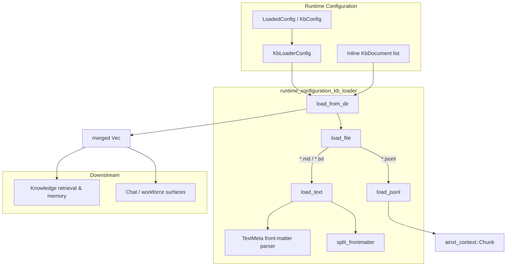
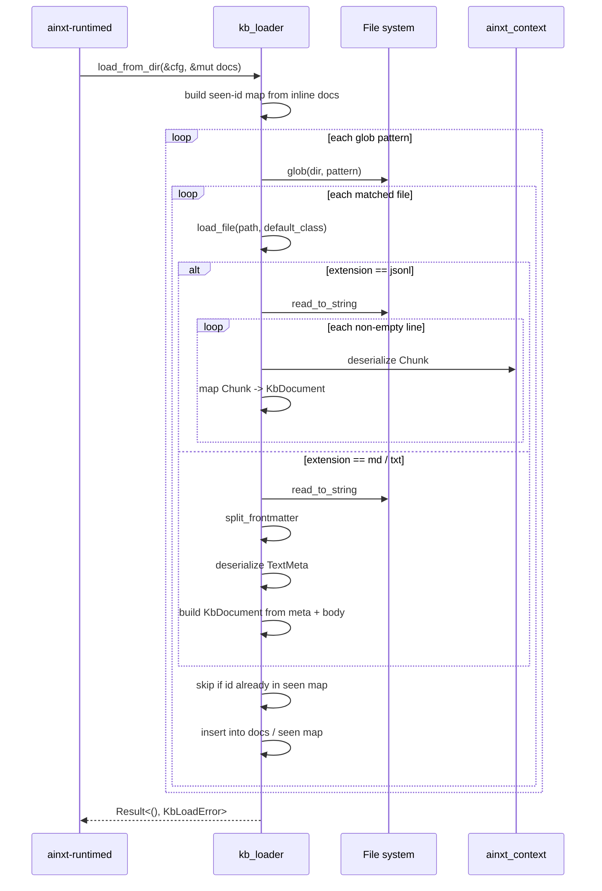
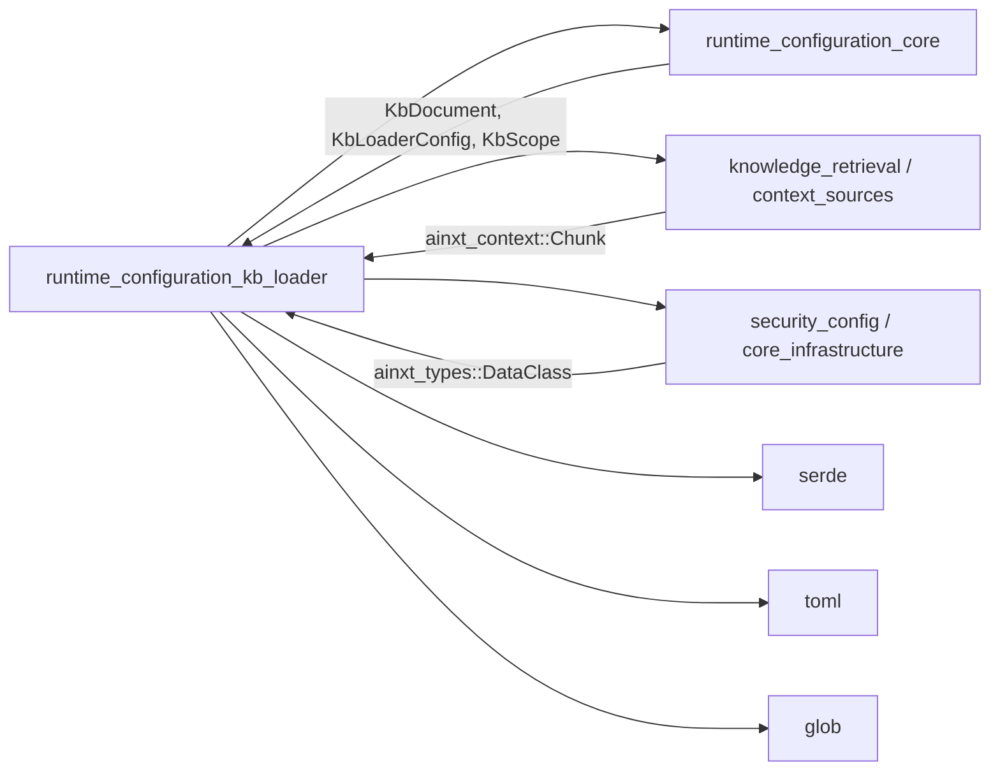
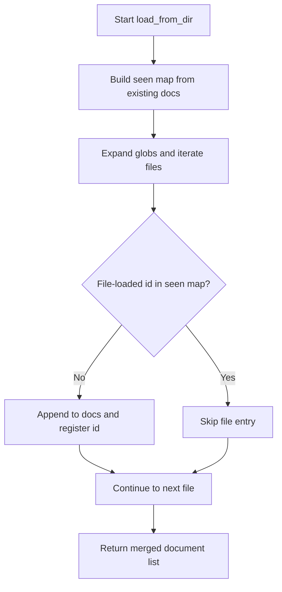

# Runtime Configuration: Knowledge-Base Loader

The `runtime_configuration_kb_loader` module is a small, focused startup-time component inside `ainxt-runtimed`. It hydrates the daemon's live knowledge base (`[kb.documents]`) from files on disk, merging them with any inline documents that were already supplied in the runtime configuration file. The loader supports `.jsonl`, `.md`, and `.txt` inputs, applies default data-class and scope policies when they are omitted, and respects identity-based precedence so that explicitly configured documents always win over file-loaded documents with the same identifier.

This module is part of the broader [runtime_configuration](runtime_configuration.md) subsystem and is consumed exclusively by the runtime daemon during configuration loading.

---

## Purpose and Core Functionality

At daemon startup the runtime configuration may declare a knowledge-base directory:

```toml
[kb.loader]
dir = "/etc/ainxt/kb"
globs = ["*.jsonl", "*.md"]
default_class = "internal"
```

The KB loader:

1. Resolves the configured directory and glob patterns.
2. Walks matching files and converts each entry into a [`KbDocument`](runtime_configuration_core.md).
3. For `.jsonl` files, deserializes [context chunks](knowledge_retrieval.md) (from `ainxt_context::Chunk`) into fully-typed documents.
4. For `.md`/`.txt` files, parses an optional TOML front-matter block (`TextMeta`) and treats the remainder of the file as the document body.
5. Merges loaded documents into the existing `Vec<KbDocument>`, skipping any file-loaded entry whose `id` is already present because inline `[[kb.documents]]` entries take precedence.

The loader is intentionally simple: it performs no embedding, no indexing, and no runtime updates. Its only job is to bridge on-disk corpus assets into the daemon's loaded configuration so that downstream retrieval, memory, and surface components can operate on a populated knowledge base.

---

## Architecture



### Component Responsibilities

| Component | Responsibility |
|-----------|----------------|
| `KbLoadError` | Unified error type for I/O, JSON, and TOML front-matter failures. |
| `load_from_dir` | Entry point. Builds a seen-id index from the existing document list, expands globs, dispatches per-file loading, and merges new documents. |
| `load_file` | Routes a path to the correct parser based on its extension. |
| `load_jsonl` | Reads a JSON-lines file where each line is an `ainxt_context::Chunk`, mapping chunk fields into `KbDocument`. |
| `load_text` | Reads a Markdown or plain-text file, splits TOML front-matter from the body, and produces a single `KbDocument`. |
| `TextMeta` | Deserializable front-matter schema: `id`, `source`, `data_class`, `scope`, `namespace`, `repo`, `department`, `max_ad_level`, `allow_groups`, `deny_groups`, `row_attributes`. |
| `split_frontmatter` | Splits `---` delimited TOML front-matter from the rest of the file. |

---

## Data Model

### `TextMeta`

`TextMeta` is the private front-matter schema used for `.md` and `.txt` files. All fields are optional; missing values are filled from the loader configuration or file metadata.

```rust
#[derive(Debug, Default, Deserialize)]
struct TextMeta {
    id: Option<String>,
    source: Option<String>,
    data_class: Option<DataClass>,
    scope: Option<KbScope>,
    namespace: Option<String>,
    repo: Option<String>,
    department: Option<String>,
    max_ad_level: Option<u8>,
    allow_groups: Vec<String>,
    deny_groups: Vec<String>,
    row_attributes: BTreeMap<String, String>,
}
```

Default-resolution rules for text files:

- `id` → `source` → file stem → `"unknown"`
- `source` → file stem → `"unknown"`
- `data_class` → `KbLoaderConfig.default_class`
- `scope` → `KbScope::Platform`

### `KbDocument` mapping

Both JSONL and text loaders produce the same `KbDocument` type defined in [runtime_configuration_core](runtime_configuration_core.md). The mapping is:

| `KbDocument` field | JSONL source | Text source |
|--------------------|--------------|-------------|
| `id` | `chunk.id` | `TextMeta.id` or `source` |
| `source` | `chunk.source` | `TextMeta.source` or file stem |
| `text` | `chunk.text` | body after front-matter |
| `data_class` | `chunk.data_class` | `TextMeta.data_class` or default |
| `scope` | `KbScope::Platform` | `TextMeta.scope` or `Platform` |
| `namespace` | `None` | `TextMeta.namespace` |
| `repo` | `None` | `TextMeta.repo` |
| `department` | first department in `chunk.acl.departments` | `TextMeta.department` |
| `max_ad_level` | `chunk.acl.max_ad_level` | `TextMeta.max_ad_level` |
| `allow_groups` | `chunk.acl.allow_groups` | `TextMeta.allow_groups` |
| `deny_groups` | `chunk.acl.deny_groups` | `TextMeta.deny_groups` |
| `row_attributes` | `chunk.attributes` | `TextMeta.row_attributes` |

---

## Data Flow



---

## Dependencies



### Internal dependencies

- **[runtime_configuration_core](runtime_configuration_core.md)** — provides `KbDocument`, `KbLoaderConfig`, `KbScope`, and the `LoadedConfig` assembly that calls the loader.
- **[runtime_configuration_mounts](runtime_configuration_mounts.md)** — sibling module that handles offline transport and self-test mounts; both are invoked from the same configuration-loading path.

### External dependencies

- **[knowledge_retrieval](knowledge_retrieval.md)** / **[context_sources](context_sources.md)** — the JSONL loader reuses `ainxt_context::Chunk` as the on-disk serialization format for pre-chunked corpus entries.
- **[security_config](security_config.md)** / **[core_infrastructure](core_infrastructure.md)** — `DataClass` (from `ainxt_types`) is the classification enum applied to every loaded document.

### Crate dependencies

- `serde` — deserialization of `TextMeta` and `Chunk`.
- `toml` — front-matter parsing for text files.
- `glob` — directory pattern expansion.
- `thiserror` — structured error definitions.

---

## Configuration

The loader is driven by `KbLoaderConfig`, which is part of the daemon's TOML configuration:

```toml
[kb.loader]
dir = "/var/lib/ainxt/kb"   # optional; empty/absent disables loading
globs = ["*.jsonl", "*.md"] # optional; defaults to ["*.jsonl", "*.md", "*.txt"]
default_class = "internal"  # applied when a document omits data_class
```

If `dir` is missing or empty, `load_from_dir` returns immediately without error. If `globs` is empty, the default set is used.

---

## Error Handling

`KbLoadError` covers the three failure modes that can occur while reading corpus files:

- `Io(std::io::Error)` — directory or file cannot be read.
- `Json { path, source }` — a JSONL line cannot be parsed as `ainxt_context::Chunk`.
- `Frontmatter { path, source }` — the TOML front-matter in a text file is invalid.

The loader does not attempt partial success: the first error aborts the entire load operation. Callers in `ainxt-runtimed` typically surface this as a fatal startup failure so that the daemon does not run with an incomplete knowledge base.

---

## Precedence Rules



This guarantees that operators can override any on-disk document by declaring an inline `[[kb.documents]]` entry with the same `id` in the runtime configuration file.

---

## Testing

The module includes unit tests that exercise the two primary behaviors:

1. **Mixed loading** — a `.jsonl` file and a `.md` file with front-matter are both loaded into `KbDocument` entries with correct IDs and data classes.
2. **Precedence** — an inline document with the same ID as a file-loaded document is retained, and the file entry is discarded.

These tests use temporary directories under the system temp path and clean up after themselves.

---

## Integration with the System

The KB loader sits at the boundary between static configuration and runtime knowledge services:

- **Upstream**: invoked by the configuration assembly logic in `ainxt-runtimed::lib` (see [runtime_configuration_core](runtime_configuration_core.md)).
- **Downstream**: the populated `Vec<KbDocument>` is consumed by knowledge-retrieval, memory, and surface components that need a seeded corpus at startup.

Because the loader runs once during configuration loading, it has no runtime HTTP surface, no background tasks, and no distributed coordination. It is the file-system counterpart to inline `[kb.documents]` configuration.

---

## See Also

- [runtime_configuration](runtime_configuration.md) — parent subsystem overview.
- [runtime_configuration_core](runtime_configuration_core.md) — `KbDocument`, `KbLoaderConfig`, and overall daemon configuration assembly.
- [runtime_configuration_mounts](runtime_configuration_mounts.md) — sibling module for offline transport and self-test mounts.
- [knowledge_retrieval](knowledge_retrieval.md) — retrieval and context subsystems that consume the loaded documents.
- [context_sources](context_sources.md) — source of `ainxt_context::Chunk` used by the JSONL loader.
