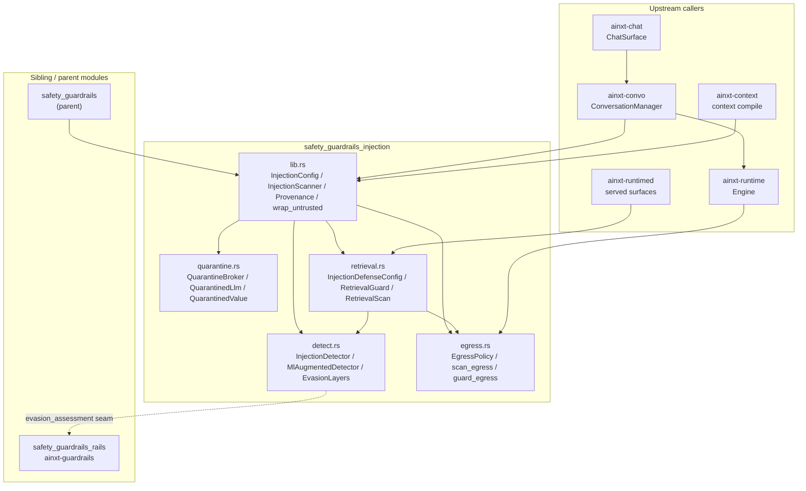
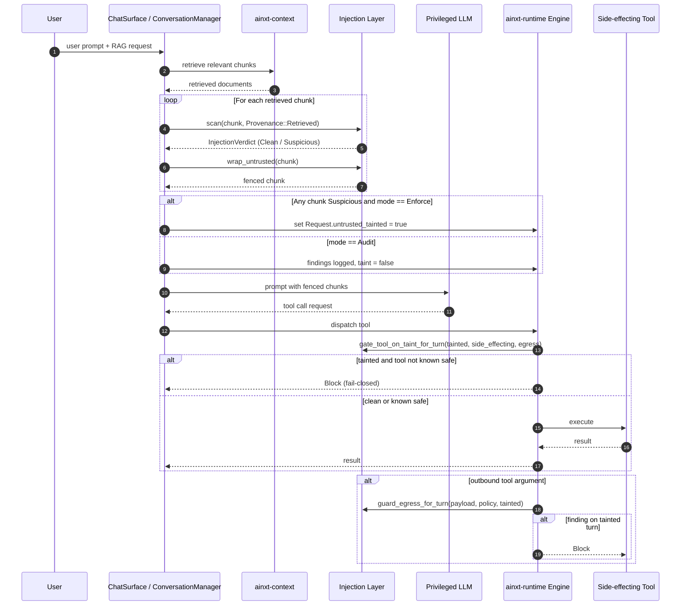
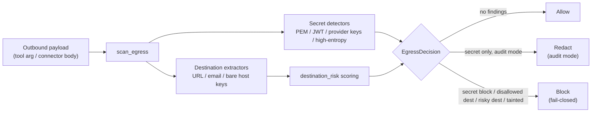
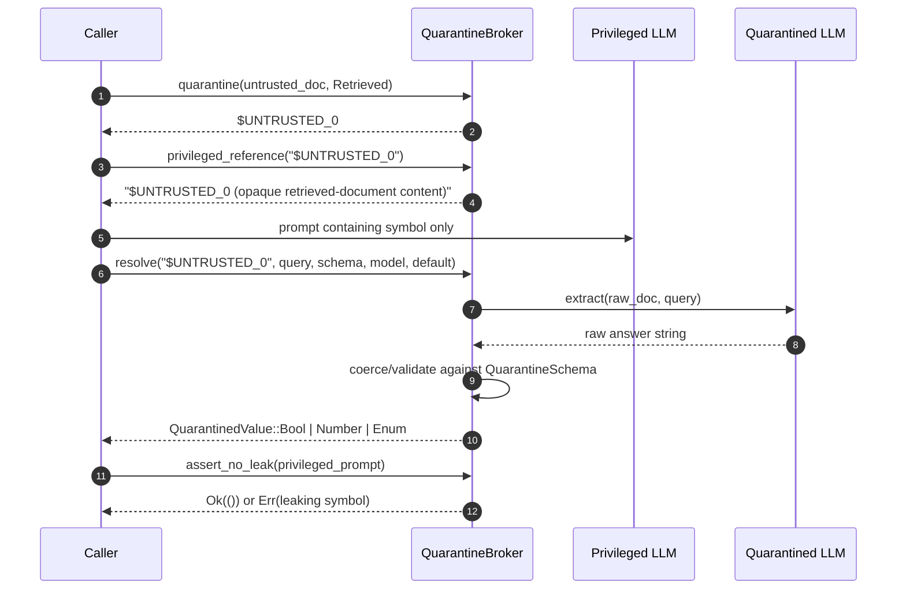
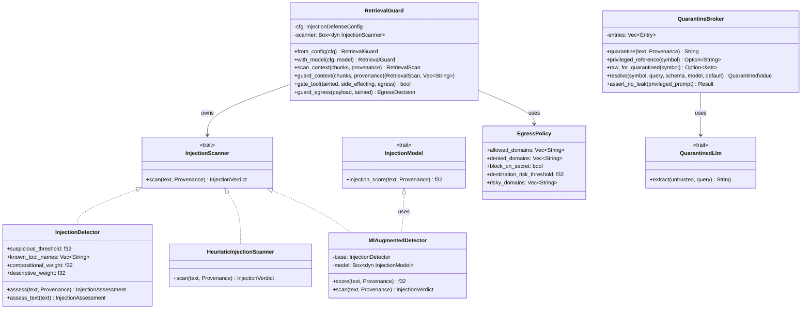

# safety_guardrails_injection

## Brief Introduction

The `safety_guardrails_injection` module (Rust crate `ainxt-injection`) provides **indirect prompt-injection defense** for the AiNxt agentic runtime. It protects against malicious instructions that enter the system through **untrusted content** — retrieved knowledge-base chunks, tool results, and connector data (emails, tickets, chats) — rather than through the user's own prompt. The module is governed by [ADR-009](adr-009.md) and is designed to be **deterministic, scored, multilingual, and fail-closed**.

The layer is **default OFF** during gateway coexistence; deployments opt in via configuration. When enabled, it combines:

1. **Instruction/data separation** — untrusted content is fenced and labeled as `DATA` so the model treats it as information, not commands.
2. **Scored multi-signal detection** — a weighted detector that recognizes coercion phrases, role spoofing, tool invocation, encoded payloads, homoglyph evasion, and multilingual injection stems.
3. **Capability gating** — when a turn is *tainted* by suspicious untrusted content, side-effecting and egress-capable tools are blocked.
4. **Outbound DLP** — a mirror egress control that prevents secrets and disallowed destinations from leaving through tool arguments or connector payloads.
5. **Dual-LLM quarantine** — a structural defense where a privileged tool-wielding model only sees opaque symbols for untrusted content, while a quarantined model extracts only typed values.

This module is a child of [`safety_guardrails`](safety_guardrails.md) and a sibling of [`safety_guardrails_rails`](safety_guardrails_rails.md). The related service crate [`injection_service`](injection_service.md) exposes a standalone HTTP scanning service built on the same primitives.

---

## Core Responsibilities

| Concern | Implementation | File |
|---|---|---|
| Detection engine | Scored, multi-signal indirect-injection detector | `detect.rs` |
| Outbound DLP | Secret detection, destination allow-list, risky-destination scoring | `egress.rs` |
| Public API & config | `InjectionConfig`, `InjectionScanner`, `wrap_untrusted`, `Provenance` | `lib.rs` |
| Structural isolation | Dual-LLM quarantine broker with typed value channel | `quarantine.rs` |
| Served entrypoint | `RetrievalGuard` — scan → fence → taint in one call | `retrieval.rs` |

---

## Architecture



### Component Breakdown

#### `lib.rs` — Public API and Configuration

- **`Provenance`** classifies content origin: `UserDirect` (trusted), `Retrieved`, `ToolResult`, `Connector` (all untrusted).
- **`InjectionMode`** selects behavior: `Off`, `Audit` (detect and log, still proceed), or `Enforce` (detect, log, and taint the turn).
- **`InjectionScanner`** is the detection seam. The default implementation is `HeuristicInjectionScanner`, which delegates to `InjectionDetector`.
- **`wrap_untrusted`** fences untrusted content with `<untrusted source="...">` markers and neutralizes any nested fence markers to prevent delimiter injection.
- **`InjectionConfig`** is the narrow configuration type; it is widened to `InjectionDefenseConfig` in `retrieval.rs`.

#### `detect.rs` — Scored Indirect-Injection Detector

The detector replaces a fixed substring list with a **weighted, per-category-maximum score** clamped to `[0.0, 1.0]`. A turn becomes `Suspicious` when the score crosses the configured threshold (`0.5` by default).

Signal categories:

| Category | Source | Typical weight |
|---|---|---|
| `instruction-override` | Phrase table + compositional co-occurrence | 0.4–0.5 |
| `prompt-exfiltration` | Phrase table | 0.3–0.45 |
| `role-hijack` | Phrase table | 0.4–0.45 |
| `exfiltration` | Phrase table | 0.4–0.5 |
| `action-coercion` | Phrase table (financial / destructive) | 0.4–0.5 |
| `tool-coercion` | Phrase + structural tool syntax | 0.4–0.5 |
| `imperative-verb` | Sentence-leading directive verb | 0.2 |
| `role-spoof` | ChatML / system / assistant markers | 0.45 |
| `tool-invocation` | `<tool_call>`, `function_call`, known tool names | 0.4–0.5 |
| `encoded-payload` | base64/hex/percent decoding, zero-width/bidi, homoglyphs | 0.35–0.5 |

Key design properties:

- **Multilingual**: coercion stems in Hindi (Devanagari and Hinglish), Spanish, French, German, Portuguese, Russian, Chinese, Arabic, and Japanese.
- **Compositional override**: detects reworded injections by co-occurrence of an override token and an instruction/prior-reference token within one sentence, with precision layers (word-start matching, citation context, directed vs. descriptive weighting).
- **Homoglyph evasion**: folds Cyrillic/Greek/full-width confusables back to ASCII and re-scans; mixed-script tokens are flagged as corroborating signals.
- **Encoded payloads**: base64, hex, and percent-encoded blobs are decoded and re-scanned; zero-width and bidi control characters are flagged.
- **ML seam**: `InjectionModel` + `MlAugmentedDetector` combine `max(heuristic, model)` so the model can only make detection stricter.
- **Trusted short-circuit**: user-authored content always scores `0.0` and is never passed to the ML model.

#### `egress.rs` — Outbound DLP and Destination Control

Egress defense is the mirror of injection detection: it stops secrets and disallowed destinations from leaving the system.

- **`EgressPolicy`** is fully serde-deserializable and includes:
  - `allowed_domains` / `denied_domains` (suffix match)
  - `risky_domains` (deployment-extensible sink list)
  - `block_on_secret`, `block_on_risky_destination`
  - `destination_risk_threshold`, `min_entropy_bits`, `min_secret_len`
- **Secret detectors**: PEM private keys, AWS access keys, OpenAI-style `sk-…`, GitHub tokens, Slack tokens, Google API keys, Bearer tokens, JWTs, and generic high-entropy tokens.
- **Destination extraction**: `scheme://host`, `mailto:`, emails, IP literals, and bare hosts from destination-ish JSON keys (`host`, `endpoint`, `webhook_url`, etc.).
- **Destination risk scoring**: intrinsic risk taxonomy (webhook catchers, paste sinks, onion services, tunnels, dynamic DNS, URL shorteners, punycode IDN, IP literals, userinfo-obfuscated URLs) summed per-category and clamped.
- **Enforcement**: `guard_egress` returns `Allow`, `Redact` (audit mode), or `Block` (fail-closed). `guard_egress_for_turn` treats any finding as blocking on a tainted turn.
- **Tool taint gating**: `gate_tool_on_taint` and `gate_tool_on_taint_for_turn` block any tool unless it is **known** to be both non-side-effecting and non-egress (`Some(false) && Some(false)`); unclassified tools (`None`) are fail-closed on a tainted turn.

#### `quarantine.rs` — Dual-LLM / Privileged-Quarantined Pattern

The strongest structural defense against indirect injection is **never letting a privileged model read attacker-controlled bytes**.

- **`QuarantineBroker`** registers untrusted content and returns an opaque symbol (`$UNTRUSTED_0`) for the privileged prompt.
- The privileged model sees only the symbol + provenance tag, never the raw bytes.
- A **`QuarantinedLlm`** (no tool access) reads the raw content and answers a typed query.
- **`QuarantinedValue`** is constrained to `Bool`, `Number`, or a validated `Enum` label — no free-text variant can smuggle instructions back.
- **`assert_no_leak`** is a defense-in-depth check that verifies the privileged prompt does not contain raw quarantined content.

#### `retrieval.rs` — Served Entrypoint

`RetrievalGuard` packages the full contract for surfaces that do not route through `ChatSurface`/`ConversationManager`:

1. `scan_context` — scans every retrieved chunk.
2. `fence` — wraps chunks as untrusted data.
3. `guard_context` — scan + fence in one pass.
4. `gate_tool` — fail-closed tool gating on a tainted turn.
5. `guard_egress` — outbound guard using the configured `EgressPolicy`.

`InjectionDefenseConfig` widens `InjectionConfig` with detector thresholds, internal tool names, and the full egress policy, making the entire layer reachable from configuration.

> **Note:** The production served path currently implements the same scan+fence+taint contract independently inside `ainxt-convo`/`ainxt-runtime`; `RetrievalGuard` remains a strongly typed, single-call convenience primitive for callers that do not route through the standard conversation surface. See the detailed doc comment in `retrieval.rs` for the full gap analysis.

---

## Data Flow: Indirect Injection Defense on a RAG Turn



---

## Data Flow: Outbound Egress Guard



---

## Data Flow: Dual-LLM Quarantine



---

## Component Interaction



---

## Configuration

The layer is controlled through `InjectionConfig` / `InjectionDefenseConfig`:

```toml
[injection]
mode = "enforce"                       # off | audit | enforce
gate_side_effects_on_taint = true
scan_retrieved = true
fence_untrusted = true
suspicious_threshold = 0.5
compositional_weight = 0.5
descriptive_weight = 0.25
known_tool_names = ["send_email", "wire_payment"]

[injection.egress]
allowed_domains = ["npci.org.in", "api.internal"]
denied_domains = ["attacker.example"]
block_on_secret = true
block_on_risky_destination = true
destination_risk_threshold = 0.5
risky_domains = ["known-sink.example"]
```

- `mode = Off`: the layer short-circuits before any scanning.
- `mode = Audit`: scans, logs findings, but does **not** taint the turn.
- `mode = Enforce`: scans, logs, and taints; side-effecting/egress tools are gated.
- `egress` is independent of `mode`: outbound DLP can be active even when injection detection is off.

---

## Integration with the Rest of the System

| Related module | Relationship |
|---|---|
| [`safety_guardrails`](safety_guardrails.md) | Parent module; owns the overall guardrails taxonomy. |
| [`safety_guardrails_rails`](safety_guardrails_rails.md) | Sibling module (`ainxt-guardrails`); reuses `evasion_assessment` from `detect.rs` for its jailbreak rail, sharing multilingual lexicon and evasion detection. |
| [`injection_service`](injection_service.md) | Standalone HTTP service crate that wraps the same detector, judge pipeline, and policy layers for external scanning workloads. |
| [`core_interaction`](core_interaction.md) | `ainxt-protocol` defines `Request.untrusted_tainted`, which the runtime reads to gate tool dispatch. |
| [`application_runtime`](application_runtime.md) | `ainxt-runtime`/`ainxt-runtimed` consume taint flags and call `gate_tool_on_taint_for_turn` / `guard_egress_for_turn`. |
| [`surface_conversation`](surface_conversation.md) | `ainxt-chat`/`ainxt-convo` implement the production scan+fence+taint path for served chat surfaces. |
| [`knowledge_retrieval`](knowledge_retrieval.md) | `ainxt-context` applies `wrap_untrusted` during context compilation. |
| [`security_config`](security_config.md) | `ainxt-config` loads runtime configuration including `InjectionDefenseConfig`. |

---

## Security Properties

1. **Fail-closed by default**: unclassified tools, unknown destinations, and validation failures in quarantine all result in denial.
2. **Deterministic**: no clock or RNG; scores are reproducible for the same input and config.
3. **Multilingual**: coercion detection is not English-only; Hindi/Hinglish and other major languages are first-class.
4. **Evasion-resistant**: homoglyph folding, encoded-payload decoding, and compositional co-occurrence catch reworded and obfuscated attacks.
5. **Defense in depth**: detection, fencing, taint gating, egress DLP, and quarantine can operate together.
6. **Trusted-content safe**: user-authored prompts are never scanned as untrusted; jailbreak behavior is handled by [`safety_guardrails_rails`](safety_guardrails_rails.md).

---

## Operational Notes

- The module is **default OFF**; operators must explicitly enable it.
- `Audit` mode is useful for measuring false-positive rates before enforcing.
- `known_tool_names` should be populated from the deployed tool registry to activate the strong tool-coercion signal.
- `allowed_domains` should enumerate legitimate outbound endpoints; without it, risky-destination scoring still blocks known exfiltration sinks.
- ML augmentation is optional; the deterministic floor is designed to stand alone in air-gapped deployments.
