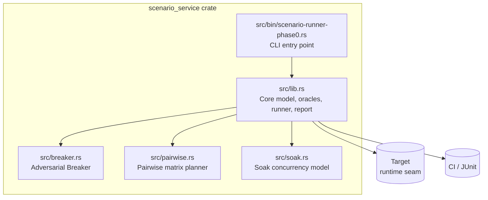
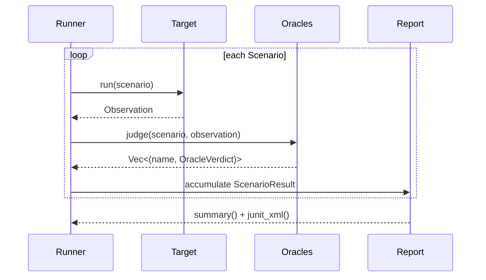
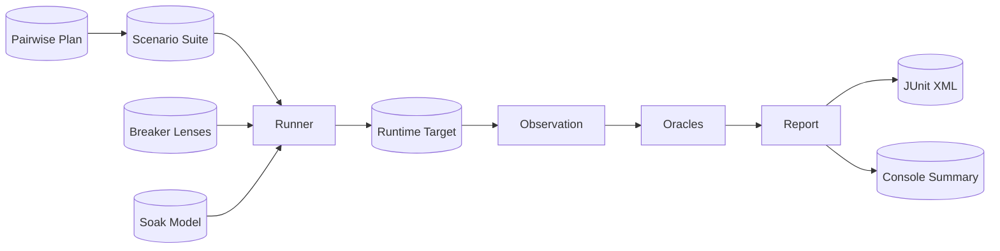

# scenario_service Module

## Overview

The `scenario_service` module (crate `ainxt-scenario`) is the **AiNxt scenario-matrix runner** — the Definition-of-Done (DoD) engine that measures whether each development phase is "done". It provides a deterministic, zero-dependency testing harness that drives a [`Target`] through a matrix of [`Scenario`]s, applies layered [`Oracle`]s to each [`Observation`], and produces a [`Report`] with JUnit XML output for CI gating.

The module is intentionally lightweight (`std`-only, zero external dependencies) so it can close Gate #0 without expanding the legal or supply-chain surface. The real runtime implements the [`Target`] trait; an async adapter is planned for Phase 1. All oracle logic, the runner, the adversarial exploration loop, the pairwise covering-array planner, and the soak model are fully exercised offline against mock and faulty targets.

## Purpose

- Provide a **single, auditable DoD signal** for every phase of the AiNxt runtime.
- Encode the scenario categories and oracle taxonomy from `SCENARIO_MATRIX.md`, `EVAL_PLATFORM.md`, and `AGENT_TESTER.md`.
- Support deterministic regression testing, adversarial exploration, pairwise matrix generation, and concurrency/soak modeling.
- Emit JUnit XML so CI can fail the build when any scenario fails.

## Architecture



### Component Responsibilities

| File | Responsibility |
|------|----------------|
| `src/lib.rs` | Defines the core domain model (`Scenario`, `Observation`, `Expectation`), the [`Target`] seam, all single- and pair-oracle implementations, the [`Runner`], and the [`Report`] with JUnit serialization. Also ships a built-in `sample_suite()` for Phase-0 green builds. |
| `src/breaker.rs` | Implements the adversarial test agent: delta-debug minimizer (`ddmin`), adversarial verifier, diverse [`Lens`] fleet, deterministic chaos/fault injection seams, and the [`Breaker`] exploration loop that produces verified, minimized [`Finding`]s plus an honest coverage/gap report. |
| `src/pairwise.rs` | Deterministic 7-axis pairwise (all-pairs) covering-array planner. Generates tractable scenario matrices across Surface × Model × DataClass × Locale × Transport × Concurrency × Fault, and expands templates into tagged [`Scenario`]s. |
| `src/soak.rs` | Deterministic model of the load/soak concurrency spine. Proves bounded growth, back-pressure, and session isolation invariants for the ≥2,000-session, ≥1-hour soak mandate without requiring live infra in offline tests. |
| `src/bin/scenario-runner-phase0.rs` | CLI binary that runs the built-in sample suite against a reference-correct target, prints a summary, writes a JUnit report, and exits non-zero on failure. |

## High-Level Functionality

The following sections summarize the module's behavior. For implementation details, component contracts, and code-level examples, see the sub-module documentation linked above.

### Scenario Execution

A [`Scenario`] is an input plus an [`Expectation`] that describes what "correct" looks like. A [`Target`] runs the scenario and returns an [`Observation`]. The [`Runner`] applies a layered set of [`Oracle`]s and produces a [`ScenarioResult`] and aggregate [`Report`].



### Oracle Taxonomy

The module implements the full single-observation and pair-observation oracle taxonomy from `AGENT_TESTER.md`:

- **CrashOracle** — fails if a turn errors when it was expected to complete.
- **SpecOracle** — enforces `must_contain`, `must_not_contain`, and `must_error_contains`.
- **InvariantOracle** — forbids leak markers and duplicate side effects (double-execution).
- **VisualOracle** — structural render integrity (replacement glyph, empty render, unclosed code fence).
- **PerformanceOracle** — latency budget enforcement.
- **MetamorphicOracle** *(pair)* — same input asked twice must yield materially equal answers.
- **DifferentialOracle** *(pair)* — candidate must not diverge from a reference implementation.

### Adversarial Exploration

The [`Breaker`] is the deterministic core of a real test agent. It explores adversarially with a budget-bounded, novelty-biased loop, verifies each candidate finding K times to kill flakes, minimizes repros with Zeller's `ddmin`, and reports honest coverage including lenses that found nothing.

### Pairwise Matrix Generation

Full cross-product of the seven axes would be ~132k cases. The [`pairwise_plan`](scenario_service_pairwise.md) produces a covering array where every value-pair of every axis-pair appears at least once, reducing the matrix to a tractable size while preserving interaction coverage.

### Soak Concurrency Model

The [`run_soak`](scenario_service_soak.md) function models a bounded-inbox, fixed-worker scheduler. It asserts that live items never exceed the worker ceiling, that full inboxes shed turns rather than grow unbounded, and that per-session accumulators never bleed across sessions.

## Sub-modules

Detailed documentation for each sub-module:

- [scenario_service_core](scenario_service_core.md) — core scenario model, oracles, runner, and reporting.
- [scenario_service_breaker](scenario_service_breaker.md) — adversarial exploration, delta-debug minimization, chaos/fault injection seams.
- [scenario_service_pairwise](scenario_service_pairwise.md) — 7-axis pairwise covering-array planner and scenario expansion.
- [scenario_service_soak](scenario_service_soak.md) — deterministic load/soak concurrency model.

## Relationship to Other Modules

The `scenario_service` module sits at the **verification boundary** of the system. It does not depend on the runtime; instead, the runtime implements the [`Target`] trait.

- **pipeline_runtime / ai_engine / core_infrastructure** — these modules provide the production runtime surfaces, models, retrieval, memory, and serving logic that a real [`Target`] adapter will exercise. The scenario runner treats them as the system under test.
- **injection_service** — a related verification-focused crate that runs guardrail/judge policy layers. `scenario_service` can drive injection-related scenarios (e.g., `Category::Injection`, `Category::DataClassLeak`) against any target, including a future adapter for the injection service.
- **governance_compliance** — scenarios in categories such as `ComplianceRedaction`, `RbacDeny`, and `AirGap` verify that governance and compliance rules are honored by the runtime.

## Data Flow



## CI Integration

The `scenario-runner-phase0` binary is the Phase-0 CI gate:

```bash
cargo run --bin scenario-runner-phase0 -- scenario-junit.xml
```

It runs the built-in `sample_suite()` against a `ReferenceTarget` that models correct behavior. When the real runtime target is wired in Phase 1, the binary will accept that target and load the full git-native scenario matrix on top of the sample suite. Exit code is `0` only when `report.all_passed()` is true.

## Design Principles

1. **Zero external dependencies** — `std`-only for Gate #0 supply-chain safety.
2. **Deterministic** — no RNG, no threads, no clocks in the core harness; tests replay identically.
3. **Seam-based** — the [`Target`] trait is the only boundary to the runtime; oracles and runner are unchanged when the runtime evolves.
4. **Honest coverage** — reports explicitly show which categories, lenses, and oracles were exercised and which found nothing.
5. **Offline-closable** — adversarial exploration, pairwise planning, and soak modeling are all mechanically testable without live infrastructure.
