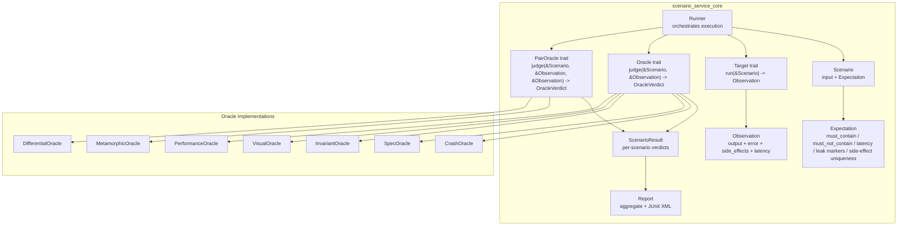
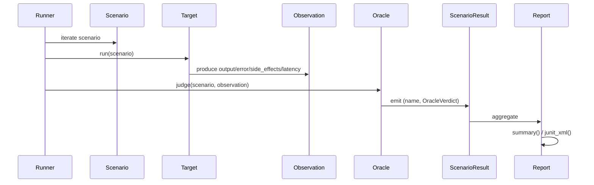
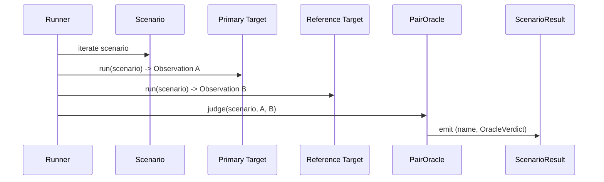
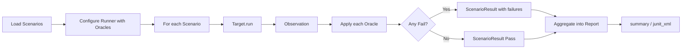
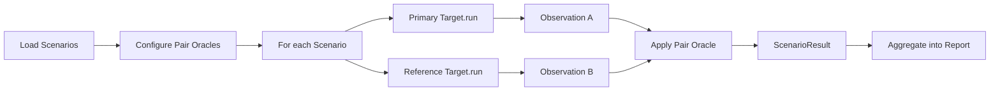
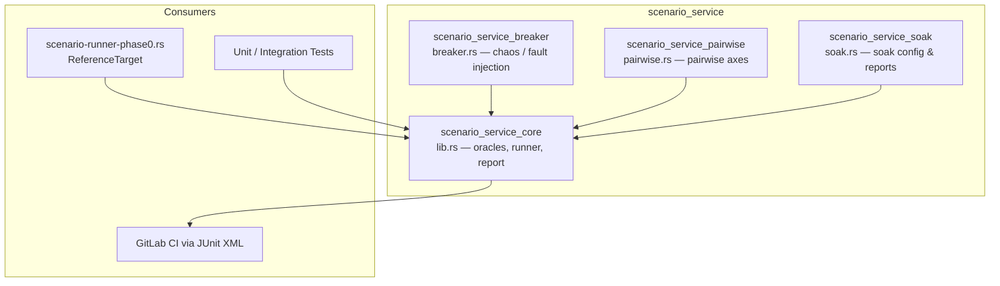

# scenario_service_core

## Brief Introduction

`scenario_service_core` is the **Definition-of-Done (DoD) engine** for the AiNxt scenario-matrix runner. It provides a minimal, dependency-free harness that drives a [`Target`] through a suite of [`Scenario`]s, applies a layered stack of [`Oracle`]s to each [`Observation`], and emits a [`Report`] that can gate CI/CD pipelines via JUnit XML.

The crate is intentionally a **Phase-0 skeleton**: it uses only the Rust standard library, keeps the supply-chain surface empty for early compliance gates, and defines the `Target` trait as the single seam where the real (eventually async) runtime will plug in without disturbing oracles, scenarios, or reporting.

---

## Core Responsibilities

| Responsibility | Description |
| -------------- | ----------- |
| **Scenario Definition** | Declarative `Scenario` + `Expectation` structs that encode what correct behavior looks like for a given input. |
| **Target Abstraction** | The `Target` trait isolates the harness from the system under test; mock, faulty, and real runtime adapters all implement the same interface. |
| **Layered Oracles** | Single-observation oracles (`Crash`, `Spec`, `Invariant`, `Visual`, `Performance`) and pair-oracles (`Metamorphic`, `Differential`) judge correctness. |
| **Execution Engine** | `Runner` orchestrates scenarios × target × oracles and produces uniform `ScenarioResult`s. |
| **Reporting** | `Report` aggregates results, computes coverage by category, prints a human summary, and exports JUnit XML for GitLab CI. |

---

## Architecture



### Component Breakdown

#### `Scenario` and `Expectation`

A [`Scenario`] is a pure-data test case: an `id`, `name`, `category`, `tags`, `input`, and an [`Expectation`]. [`Expectation`] is the contract the target must satisfy and includes:

- `must_contain` / `must_not_contain` — substring assertions on the output.
- `must_complete` — the turn must finish without error.
- `max_latency_ms` — optional latency budget.
- `forbid_side_effect_dupes` — detects double-execution (e.g., duplicate settlement ids).
- `forbidden_leak_markers` — detects PAN/PII/secret/cross-tenant leaks.
- `must_error_contains` — positive assertion for expected-denial scenarios (RBAC deny, auth expiry).

#### `Target`

```rust
pub trait Target {
    fn run(&self, scenario: &Scenario) -> Observation;
}
```

`Target` is the **only seam** between the harness and the runtime. Mock targets are used in unit tests; the production runtime will be adapted here. Because the trait is synchronous in Phase 0, an async adapter is expected later without changing oracle or runner code.

#### `Observation`

Captures everything the target produced for a scenario:

- `output` — rendered text / model answer.
- `error` — optional error message.
- `side_effects` — ids of dispatched side-effecting actions.
- `latency_ms` — measured turn latency.

#### `Oracle` and `PairOracle`

`Oracle` judges a single observation against an expectation and returns one of:

- `Pass`
- `Fail(String)`
- `NotApplicable`

`PairOracle` judges two observations — the primary run and a reference run — enabling **metamorphic** and **differential** checks that a single observation cannot express.

| Oracle | Type | Purpose |
| ------ | ---- | ------- |
| `CrashOracle` | Single | Fails if the turn errored when `must_complete` was true. |
| `SpecOracle` | Single | Enforces `must_contain`, `must_not_contain`, and `must_error_contains`. |
| `InvariantOracle` | Single | Forbids leak markers and duplicate side effects. |
| `PerformanceOracle` | Single | Enforces `max_latency_ms`. |
| `VisualOracle` | Single | Structural render integrity: replacement glyphs, empty renders, unclosed code fences. |
| `MetamorphicOracle` | Pair | Same input run twice must yield materially equal output and completion status. |
| `DifferentialOracle` | Pair | Candidate output must match a reference / shadow implementation. |

#### `Runner`

`Runner` owns the configured oracle stack and provides:

- `with_default_oracles()` — crash, spec, invariant, performance.
- `with_full_taxonomy()` — adds `VisualOracle` to the default set.
- `run(scenarios, target)` — executes single-observation oracles.
- `run_shadow_parity(scenarios, primary, reference, pair_oracles)` — executes pair oracles for metamorphic stability or shadow-mode parity.

#### `Report`

Aggregates `ScenarioResult`s and provides:

- `total()`, `passed()`, `failed()`, `all_passed()`
- `coverage()` — maps `Category` to count for honest coverage reporting.
- `summary()` — human-readable text output.
- `junit_xml()` — JUnit XML for CI consumption.

---

## Data Flow



### Shadow / Pair-Oracle Flow



---

## Process Flows

### Standard Run



### Shadow Parity Run



---

## Module Relationships

`scenario_service_core` lives inside the `ainxt-scenario` crate. It is the foundational layer on which the other scenario submodules are built.



### Sibling Modules

- **[scenario_service_breaker](scenario_service_breaker.md)** — provides `Breaker`, `ChaosDriver`, and fault-injection targets (`FlakyTarget`, `LeakyTarget`, `InfiniteLens`, etc.) that implement `Target` to simulate failures the core oracles detect.
- **[scenario_service_pairwise](scenario_service_pairwise.md)** — defines `AxisTuple` for combinatorial scenario generation; generated scenarios feed into the core `Runner`.
- **[scenario_service_soak](scenario_service_soak.md)** — defines `SoakConfig` and `SoakReport` for long-running scenario execution, reusing the core `Runner` and `Report` types.

### Upstream Dependencies

The core crate deliberately avoids external dependencies in Phase 0. It only uses `std::collections::BTreeMap`, `std::collections::HashSet`, and `std::fmt`. No crates from `core_infrastructure`, `ai_engine`, or `pipeline_runtime` are required at this layer, which is why the module can be exercised before the full runtime is available.

When the real runtime is wired in, it will implement `Target` and likely depend on modules such as:

- **[core_interaction](../core_infrastructure/core_interaction.md)** — for session/turn abstractions (`SessionManager`, `TurnInput`, `EventEnvelope`).
- **[ai_engine](../ai_engine/ai_engine.md)** — for model output, guardrails, and answer quality.
- **[pipeline_runtime](../pipeline_runtime/pipeline_runtime.md)** — for the production execution path.

---

## Key Design Decisions

1. **Zero external dependencies in Phase 0** — keeps the legal and supply-chain surface empty for Gate #0.
2. **Trait-based target seam** — `Target` isolates the harness from runtime evolution; async adapters can be added later without touching oracles.
3. **Data-only expectations** — no behavior lives in `Expectation`, making scenarios serializable and reviewable.
4. **Layered oracle taxonomy** — mirrors `AGENT_TESTER.md` §2 and provides honest coverage reporting via `oracle_taxonomy()`.
5. **Single vs. pair oracle split** — `Oracle` and `PairOracle` are separate traits because metamorphic/differential checks require a reference observation.
6. **JUnit XML output** — enables native CI integration without additional tooling.

---

## Usage Example

```rust
use ainxt_scenario::{sample_suite, Runner, Target, Scenario, Observation};

struct CorrectTarget;
impl Target for CorrectTarget {
    fn run(&self, _s: &Scenario) -> Observation {
        Observation {
            output: "UPI".into(),
            error: None,
            side_effects: vec![],
            latency_ms: 10,
        }
    }
}

let scenarios = sample_suite();
let runner = Runner::with_full_taxonomy();
let report = runner.run(&scenarios, &CorrectTarget);

assert!(report.all_passed());
println!("{}", report.summary());
println!("{}", report.junit_xml());
```

---

## Extension Points

- **New oracle** — implement `Oracle` or `PairOracle` and add it to the runner.
- **New scenario category** — extend `Category` (or use `Category::Custom`) and update `fmt::Display`.
- **New target adapter** — implement `Target` for the real runtime, a mock, or a chaos-injected wrapper from [scenario_service_breaker](scenario_service_breaker.md).
- **New report format** — add methods to `Report`; the aggregation logic remains unchanged.

---

## References

- **[scenario_service_breaker](scenario_service_breaker.md)** — fault-injection targets and chaos drivers.
- **[scenario_service_pairwise](scenario_service_pairwise.md)** — pairwise scenario generation.
- **[scenario_service_soak](scenario_service_soak.md)** — long-running soak test configuration and reporting.
- **[core_interaction](../core_infrastructure/core_interaction.md)** — session/turn protocol abstractions consumed by future runtime targets.
- **[ai_engine](../ai_engine/ai_engine.md)** — model output, guardrails, and quality assessment used by production targets.
- **[pipeline_runtime](../pipeline_runtime/pipeline_runtime.md)** — production execution surfaces that will eventually implement `Target`.
