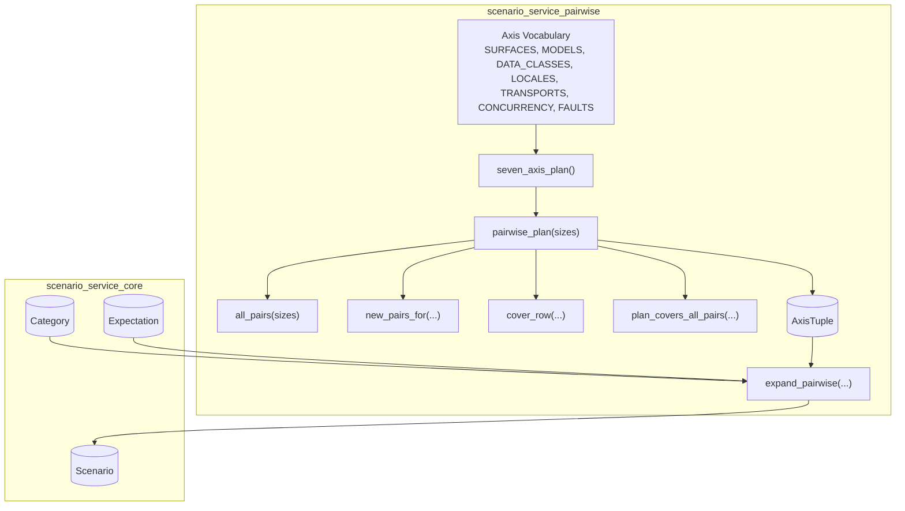
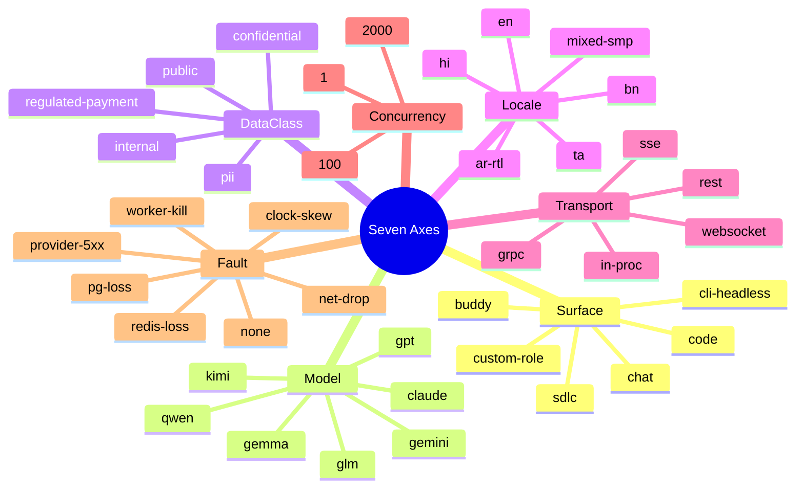
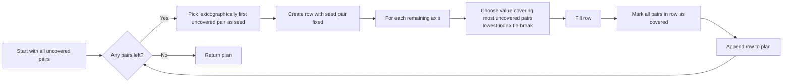
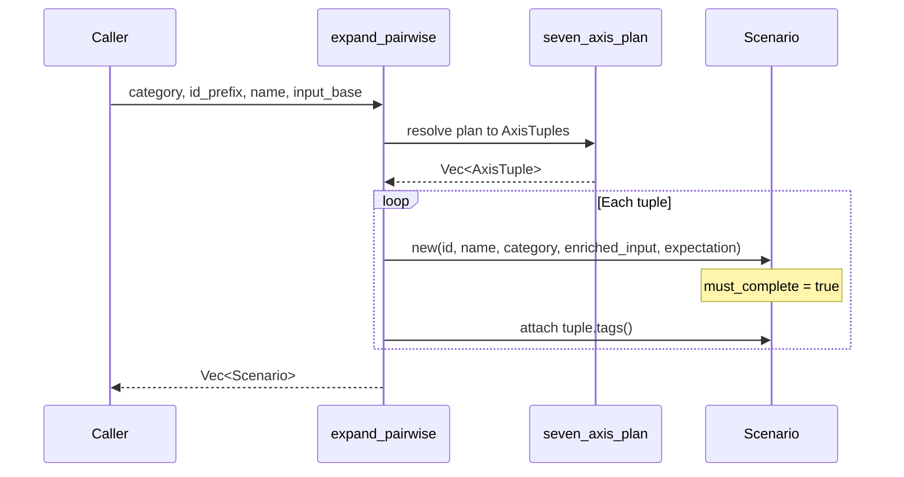
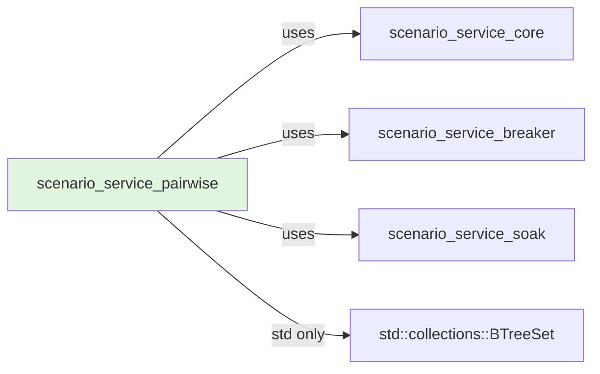
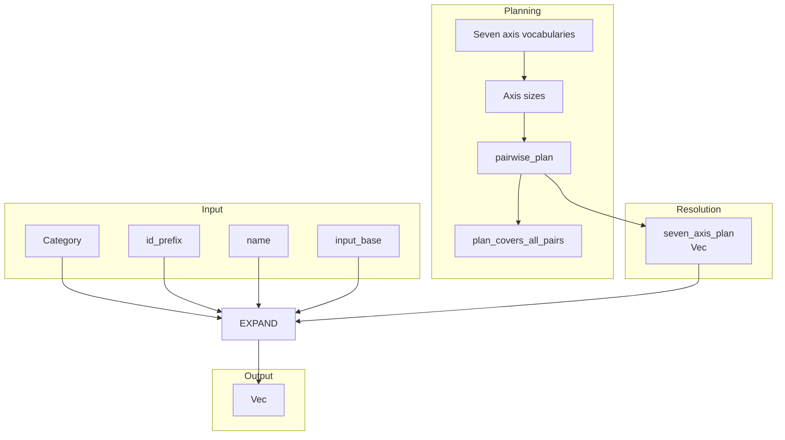

# scenario_service_pairwise

## Brief Introduction

`scenario_service_pairwise` is the deterministic covering-array planner for the `ainxt-scenario` testing framework. It generates a **pairwise (all-pairs)** test matrix across seven independent axes — Surface, Model, Data Class, Locale, Transport, Concurrency, and Fault — and expands that matrix into concrete, tagged [`Scenario`](scenario_service_core.md) instances. Instead of exercising the full combinatorial explosion (over 130,000 cases for the seven axes), it guarantees that every value-pair of every axis-pair appears in at least one scenario, producing a tractable, deterministic, and high-coverage test suite.

The module is pure, `std`-only, and uses a fixed-order greedy AETG-style construction with lowest-index tie-breaks, so the same plan is produced on every run with no randomness.

---

## Core Responsibilities

1. **Axis Vocabulary** — Define the canonical seven axes and their value sets that drive scenario diversity.
2. **Pairwise Planning** — Build a minimal covering array where every cross-axis value-pair is covered at least once.
3. **Plan Verification** — Self-check that a generated plan actually covers all required pairs.
4. **Scenario Expansion** — Cross a category template with the seven-axis plan to produce distinct, tagged `Scenario` objects ready for execution by the [`Runner`](scenario_service_core.md).

---

## Architecture

### Component Overview

| Component | File | Purpose |
|-----------|------|---------|
| `AxisTuple` | `pairwise.rs` | A resolved seven-axis value tuple with tag generation and named axis lookup. |
| `pairwise_plan` | `pairwise.rs` | Greedy covering-array builder over arbitrary axis sizes. |
| `seven_axis_plan` | `pairwise.rs` | Resolves `pairwise_plan` over the canonical seven axes. |
| `expand_pairwise` | `pairwise.rs` | Expands a category template into a vector of tagged `Scenario`s. |
| `plan_covers_all_pairs` | `pairwise.rs` | Verifies complete pairwise coverage. |

---

## The Seven Axes

The module defines seven independent dimensions that capture the most common sources of interaction bugs in the system. Each axis is a static slice of string values.

| Axis | Values | Why it matters |
|------|--------|----------------|
| `surface` | 6 | Different capabilities, autonomy, and RBAC profiles per surface. |
| `model` | 7 | Failover, tokenizer behavior, malformed output, and injection sensitivity vary by model family. |
| `data_class` | 5 | Routing, retrieval eligibility, and hard-safety cells change with data classification. |
| `locale` | 6 | i18n and Indic-language quality coverage. |
| `transport` | 5 | Cancellation, streaming, and backpressure differ per transport. |
| `concurrency` | 3 | Isolation and backpressure only manifest at scale. |
| `fault` | 7 | Chaos injection for resilience testing (test-environment gated). |

The full Cartesian product is `6 × 7 × 5 × 6 × 5 × 3 × 7 = 132,300` cases. Pairwise coverage reduces this to a small fraction while still catching the overwhelming majority of interaction defects.

---

## Pairwise Planning Algorithm

`pairwise_plan` implements a deterministic greedy AETG-style covering-array constructor.

### Data Representation

- A `PairKey` is an unordered tuple `(axis_i, val_i, axis_j, val_j)` with `axis_i < axis_j`.
- `all_pairs` enumerates every such pair that must be covered.
- Each row is a `Vec<usize>` of axis value indices, using `usize::MAX` to mean "unset".

### Construction Steps

1. **Seed selection** — Pick the first uncovered pair from a `BTreeSet` (lexicographically smallest). This guarantees progress every iteration.
2. **Greedy fill** — For each remaining axis, evaluate every value and pick the one that covers the most still-uncovered pairs. Ties are broken by lowest value index, ensuring determinism.
3. **Cover update** — Remove all pairs present in the completed row from the uncovered set.
4. **Repeat** until no uncovered pairs remain.

### Edge Cases

- Empty size list → empty plan.
- Any axis with size `0` → empty plan.
- Single axis → one row per value.

---

## Scenario Expansion

`expand_pairwise` bridges the covering array to the scenario execution framework.

For each `AxisTuple` in the plan, the function:

1. Creates a `Scenario` with a unique ID (`{id_prefix}-{i:04}`).
2. Enriches the base input string with the resolved axis values for observability.
3. Sets `Expectation::must_complete = true`, meaning the turn must finish without crashing even under a chaos fault.
4. Attaches seven tags of the form `axis=value` to the scenario.

This produces genuinely distinct scenarios — no padding rows — because each row represents a different code path through the axis matrix.

---

## Dependencies

- **[scenario_service_core](scenario_service_core.md)** — Provides `Scenario`, `Category`, `Expectation`, and the `Runner`/`Oracle` traits that execute generated scenarios.
- **[scenario_service_breaker](scenario_service_breaker.md)** — Provides adversarial/chaos testing primitives; the `fault` axis in pairwise maps to chaos modes exercised by the breaker subsystem.
- **[scenario_service_soak](scenario_service_soak.md)** — Provides long-running load configuration; the `concurrency` axis overlaps with soak concurrency levels.
- **Standard library** — `std::collections::BTreeSet` for deterministic ordering of uncovered pairs.

---

## Data Flow

---

## Integration with the Scenario Service

`scenario_service_pairwise` is one of four scenario-generation strategies in the `ainxt-scenario` crate:

| Module | Strategy | Use case |
|--------|----------|----------|
| [scenario_service_core](scenario_service_core.md) | Core framework, oracles, and runner | Shared execution engine and assertions. |
| [scenario_service_breaker](scenario_service_breaker.md) | Adversarial chaos and fuzzing | Find security and resilience defects via targeted attacks. |
| **scenario_service_pairwise** | Combinatorial covering array | Systematically cover interaction bugs across seven axes. |
| [scenario_service_soak](scenario_service_soak.md) | Long-running load tests | Validate stability and resource behavior under sustained load. |

The pairwise module is typically invoked by scenario-runner binaries (e.g., `scenario-runner-phase0`) to generate a broad, deterministic regression matrix before execution by the shared `Runner`.

---

## Key Invariants & Guarantees

- **Determinism** — Same input always produces the same plan; no RNG is used.
- **Coverage guarantee** — Every value-pair of every axis-pair appears in at least one row.
- **No padding** — Each row maps to a distinct scenario with a unique ID and code path.
- **Graceful degradation** — Even rows with a non-`none` fault expect `must_complete = true`; the system must survive the fault, not just the happy path.
- **Tractability** — The seven-axis plan is orders of magnitude smaller than the full cross-product.

---

## Testing

The module includes unit tests that verify:

- Small covering arrays (2×3×2) cover all pairs and beat full cross-product size.
- The seven-axis plan covers every cross-axis pair and is less than 1% of the full Cartesian product.
- Every row is fully assigned and every value index is in range.
- `AxisTuple` resolves correctly and produces seven `axis=value` tags.
- `expand_pairwise` yields unique IDs, seven tags per scenario, and `must_complete` expectations.
- Edge cases (empty sizes, zero-size axis, single axis) are handled correctly.

---

## References

- [scenario_service_core](scenario_service_core.md) — `Scenario`, `Category`, `Expectation`, `Runner`, and oracle framework.
- [scenario_service_breaker](scenario_service_breaker.md) — Chaos and adversarial testing primitives that realize the `fault` axis.
- [scenario_service_soak](scenario_service_soak.md) — Soak/load testing configuration aligned with the `concurrency` axis.
