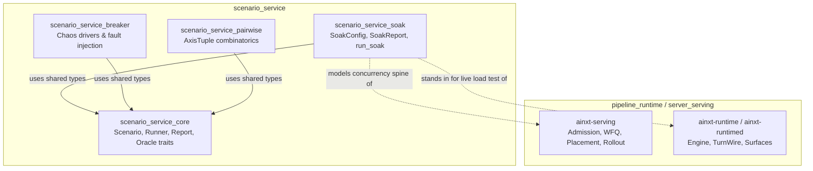
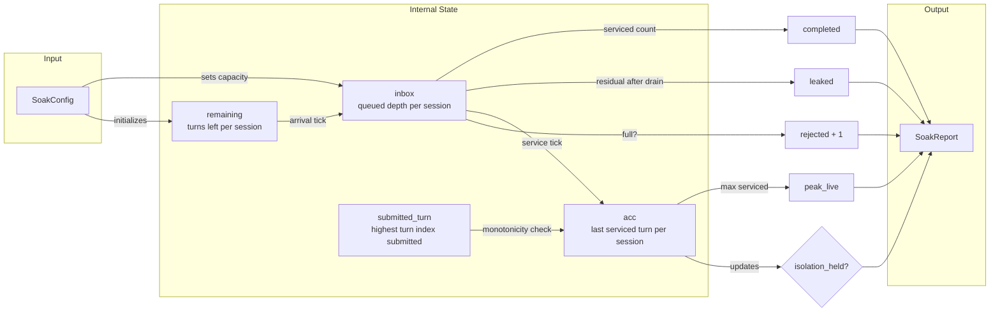
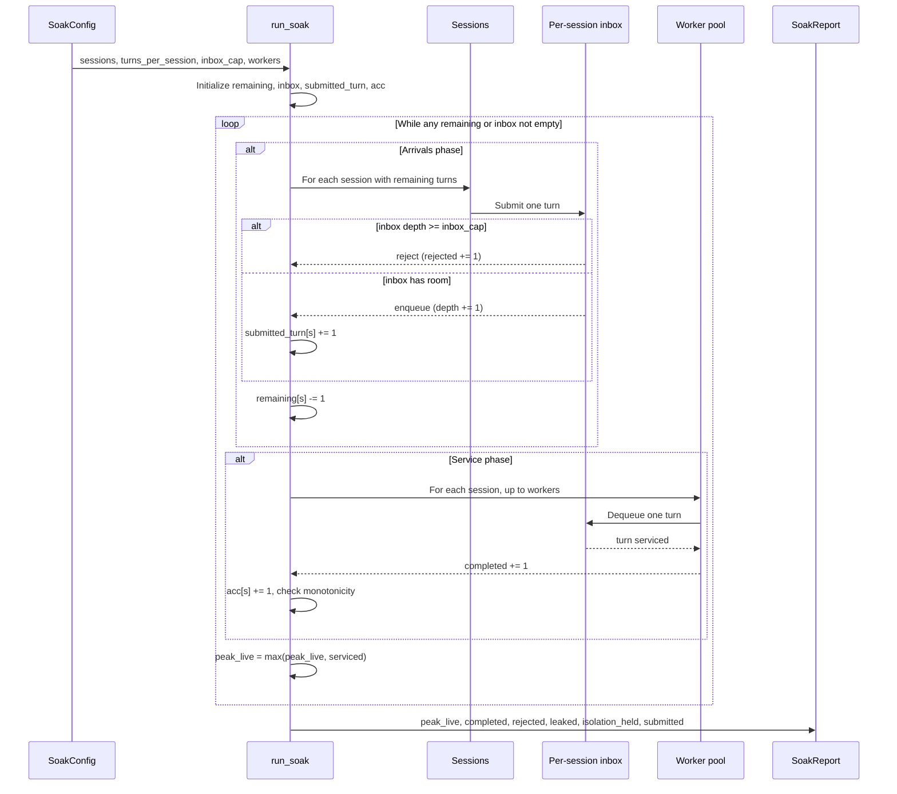
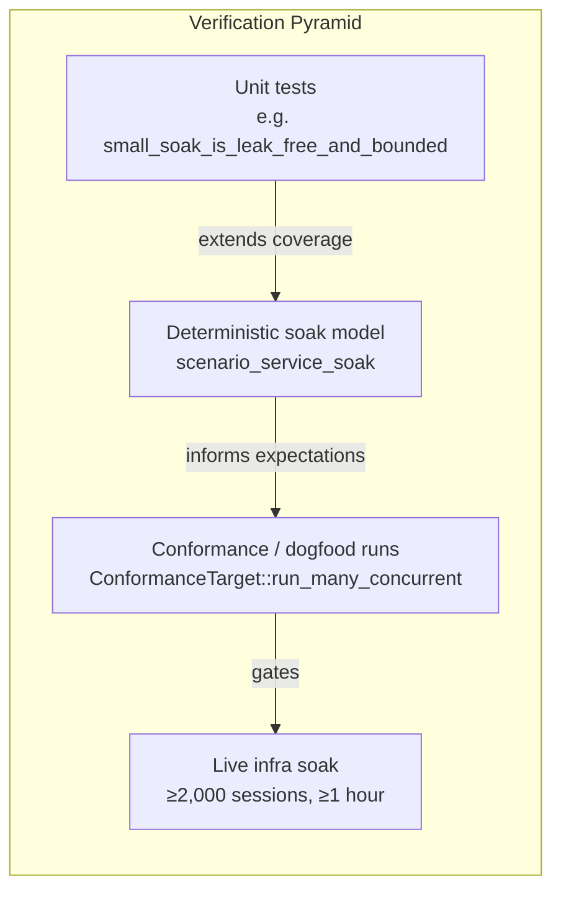
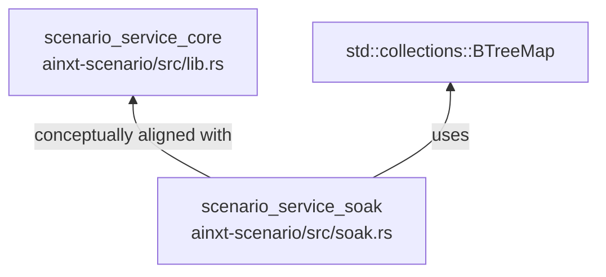

# scenario_service_soak

## Brief Introduction

`scenario_service_soak` is the load-and-soak modeling component of the broader [`scenario_service`](scenario_service.md). It provides a deterministic, std-only, zero-dependency model of the concurrency spine under sustained load. The model simulates thousands of concurrent sessions submitting turns into bounded per-session inboxes that are drained by a fixed worker pool, and it mechanically proves the three properties a real ≥1-hour, ≥2,000-session soak must guarantee: no memory leaks, back-pressure instead of unbounded queue growth, and strict session isolation under contention.

The live soak still requires a running served daemon under real GPU/Postgres/Redis load for an hour or more, but this offline model closes the deterministic verification gap and replays identically across runs.

---

## Module Purpose and Core Functionality

The soak module exists to answer one question offline: *can the serving concurrency spine sustain a mandated load floor without leaking, blowing up, or bleeding state across sessions?*

It does this by:

1. **Modeling a bounded-inbox, fixed-worker scheduler** — each session has its own inbox with a configurable capacity, and a fixed-size worker pool services queued turns each tick.
2. **Exercising sustained back-pressure** — the arrival rate (`sessions`) intentionally exceeds the service rate (`workers`), forcing the scheduler to reject turns when inboxes are full.
3. **Reporting honest soak signals** — `SoakReport` captures peak live concurrency, completed turns, rejected turns, residual leaked items, and whether session isolation held.
4. **Providing a deterministic pass/fail verdict** — `SoakReport::passed` checks that nothing leaked, concurrency never exceeded the worker ceiling, isolation held, and every submitted turn was accounted for.

The module is intentionally minimal: it depends only on `std::collections::BTreeMap` and contains no clocks, RNG, threads, or async machinery. This makes it suitable for unit tests and CI gates that must reproduce the same result on every run.

---

## Architecture and Component Relationships

`scenario_service_soak` is one of four scenario sub-modules in `ainxt-scenario`. It builds on the shared scenario vocabulary defined in [`scenario_service_core`](scenario_service_core.md) (scenarios, runners, observations, expectations, oracles, and reports) but specializes that vocabulary for long-duration, high-concurrency load modeling. The other sub-modules — [`scenario_service_breaker`](scenario_service_breaker.md) for chaos/fault injection and [`scenario_service_pairwise`](scenario_service_pairwise.md) for combinatorial axis exploration — address different verification concerns and are documented separately.



### Component Inventory

| Component | File | Responsibility |
|-----------|------|----------------|
| `SoakConfig` | `crates/ainxt-scenario/src/soak.rs` | Parameterizes the soak: sessions, turns per session, inbox capacity, worker pool size. |
| `SoakReport` | `crates/ainxt-scenario/src/soak.rs` | Aggregated metrics and invariant verdict from a soak run. |
| `run_soak` | `crates/ainxt-scenario/src/soak.rs` | Tick-driven deterministic scheduler that executes the model and returns a `SoakReport`. |

---

## Data Structures

### `SoakConfig`

`SoakConfig` is a plain, `Copy` struct that defines the load shape. Its default values reflect the mandate floor: 2,000 concurrent sessions, 5 turns per session, an inbox capacity of 8, and a worker pool of 64.

| Field | Type | Meaning |
|-------|------|---------|
| `sessions` | `u32` | Number of concurrent sessions. The mandate floor is 2,000. |
| `turns_per_session` | `u32` | How many turns each session submits over the soak window. |
| `inbox_cap` | `u32` | Maximum depth of a per-session inbox before turns are rejected. |
| `workers` | `u32` | Fixed worker pool size; the absolute ceiling on live, in-flight work items. |

### `SoakReport`

`SoakReport` captures the honest signals needed to judge a soak run. It is also `Copy` and equality-comparable, making it easy to assert on in tests.

| Field | Type | Meaning |
|-------|------|---------|
| `peak_live` | `u32` | Highest number of items serviced in a single tick (in-flight high-water mark). Must not exceed `workers`. |
| `completed` | `u64` | Turns that were successfully serviced. |
| `rejected` | `u64` | Turns shed due to a full inbox (503-class back-pressure). |
| `leaked` | `u32` | Items still queued after the full drain. Must be 0. |
| `isolation_held` | `bool` | True iff every session's accumulator advanced only on its own turns. |
| `submitted` | `u64` | Total turns submitted (`sessions × turns_per_session`). |

### `SoakReport::passed`

The pass criterion encodes the three soak invariants:

```rust
self.leaked == 0
    && self.peak_live <= cfg.workers
    && self.isolation_held
    && self.completed + self.rejected == self.submitted
```

A failure in any of these clauses indicates a leak, unbounded concurrency, cross-session state bleed, or silent turn loss.

---

## Data Flow

The data flow inside `run_soak` is a closed loop between session state, per-session inboxes, and the worker pool. No external I/O or shared mutable state is involved.



### State Maps

`run_soak` maintains four `BTreeMap<u32, u32>` structures keyed by session id:

- `remaining`: turns each session still has to submit.
- `inbox`: current queued depth per session.
- `submitted_turn`: highest turn index submitted per session (used for the isolation check).
- `acc`: last serviced turn index per session (must advance monotonically and only on that session's own turns).

All maps are initialized from `cfg.sessions` and `cfg.turns_per_session`. The total submitted count is computed up front as `sessions × turns_per_session`.

---

## Process Flow: `run_soak`

The scheduler is a simple tick loop with two phases per tick: arrivals and service. The loop terminates when all sessions have exhausted their remaining turns and every inbox has drained to zero.



### Termination Guarantee

The loop is guaranteed to terminate:

1. While arrivals continue, `remaining[s]` strictly decreases for every active session each tick.
2. Once arrivals stop, the total inbox depth is bounded by `sessions × inbox_cap`, and the worker pool removes at least one item per tick (up to `workers`).
3. Therefore the queue drains in finite time and the loop exits.

### Invariant Checks Per Tick

- **Leak freedom**: after the drain, `inbox_total(&inbox)` must be 0. Any non-zero value is recorded as `leaked`.
- **Bounded concurrency**: `peak_live` tracks the maximum items serviced in any single tick and is checked against `cfg.workers`.
- **Back-pressure**: rejected turns are counted explicitly rather than silently queued.
- **Session isolation**: `acc[s]` is incremented only when session `s` is serviced, and the new value must not regress. Because the model services one turn per session per service slot, this verifies that no peer session advances another session's accumulator.

---

## Relationship to the Overall System

`scenario_service_soak` is a verification tool, not a production runtime. It stands in the test pyramid between unit tests and the live long-running soak:



- The deterministic model lives in [`scenario_service`](scenario_service.md) alongside the chaos and pairwise scenario sub-modules.
- The real concurrency spine it models is implemented in [`pipeline_runtime`](../pipeline_runtime/pipeline_runtime.md), particularly the admission, scheduling, placement, and rollout components in `ainxt-serving` and the engine/surface wiring in `ainxt-runtime` / `ainxt-runtimed`.
- The live soak is typically driven through the conformance infrastructure documented in [`ai_engine`](../ai_engine/ai_engine.md) under `evaluation_testing` / `conformance`.

---

## Dependencies

`scenario_service_soak` has no crate dependencies beyond the Rust standard library. It uses `std::collections::BTreeMap` for deterministic ordering and lookup.



Because the file is part of `ainxt-scenario`, it shares the crate's zero-dependency discipline and can be compiled and tested in isolation.

---

## Usage Example

```rust
use ainxt_scenario::soak::{SoakConfig, run_soak};

let cfg = SoakConfig {
    sessions: 2000,
    turns_per_session: 5,
    inbox_cap: 8,
    workers: 64,
};

let report = run_soak(&cfg);
assert!(report.passed(&cfg), "soak invariants violated: {report:?}");
```

A smaller configuration is used in the bundled unit test `small_soak_is_leak_free_and_bounded` to keep CI fast while still exercising all three invariants.

---

## References

- [`scenario_service`](scenario_service.md) — parent module overview
- [`scenario_service_core`](scenario_service_core.md) — shared scenario traits and types
- [`scenario_service_breaker`](scenario_service_breaker.md) — chaos and fault-injection scenarios
- [`scenario_service_pairwise`](scenario_service_pairwise.md) — combinatorial pairwise exploration
- [`pipeline_runtime`](../pipeline_runtime/pipeline_runtime.md) — production runtime and serving infrastructure modeled by the soak
- [`ai_engine`](../ai_engine/ai_engine.md) — AI engine modules, including conformance and evaluation testing that consume soak results
