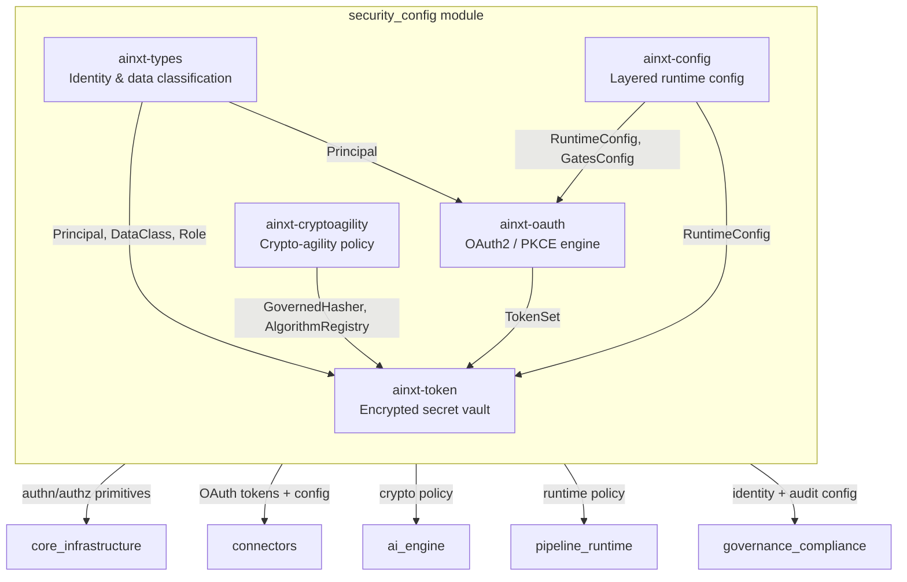
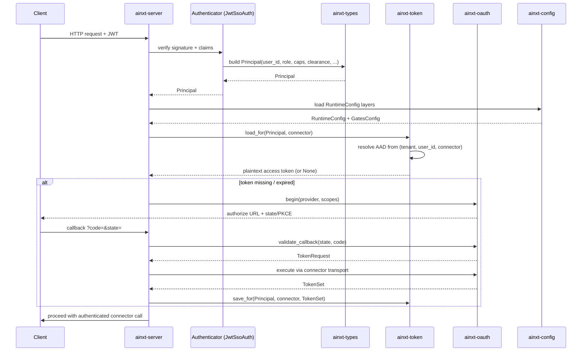
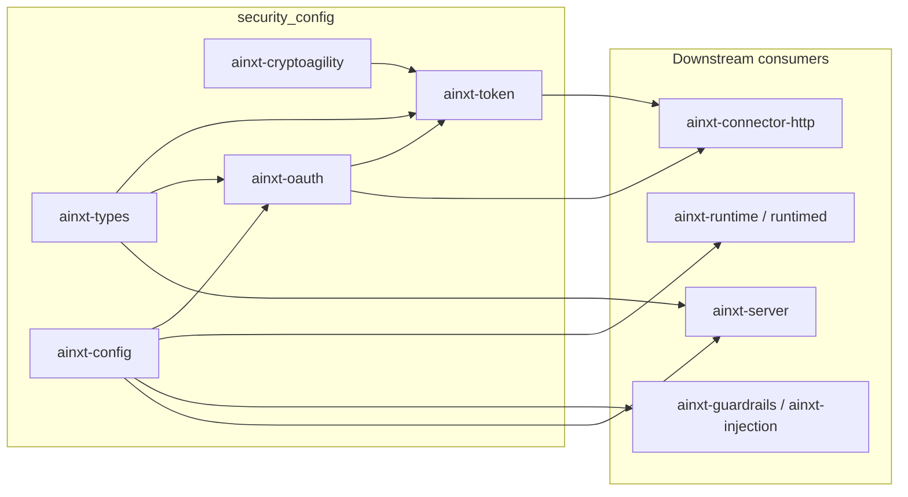

# security_config Module

## Purpose

The `security_config` module is the trust, identity, cryptography, and policy foundation of the AiNxt platform. It sits at the boundary between the core infrastructure and every higher-level service that must authenticate callers, protect secrets, negotiate OAuth consent, enforce crypto policy, and load a validated runtime configuration. Every other module in the system — from connectors to the AI engine to governance — depends on the primitives, policies, and secrets managed here.

In short, `security_config` answers four questions for the rest of the platform:

1. **Who is calling?** — [`Principal`](security_config_identity.md#principal) and [`DataClass`](security_config_identity.md#dataclass) from `ainxt-types`.
2. **What cryptographic primitives are permitted right now?** — the crypto-agility registry and [`GovernedHasher`](security_config_cryptoagility.md#governedhasher) from `ainxt-cryptoagility`.
3. **How are user secrets stored and used?** — the encrypted [`TokenVault`](security_config_token.md#tokenvault) from `ainxt-token` and the OAuth PKCE engine from `ainxt-oauth`.
4. **What is the runtime allowed to do?** — the layered, mandatory-gate [`RuntimeConfig`](security_config_runtime.md#runtimeconfig) from `ainxt-config`.

## Architecture Overview

The module is intentionally split into small, single-responsibility crates so that each security boundary can be reasoned about, tested, and audited independently:

- `ainxt-types` is pure domain types with no I/O.
- `ainxt-cryptoagility` is pure, deterministic policy resolution with no wall-clock or randomness.
- `ainxt-token` isolates secrets behind a trait-based codec/store seam.
- `ainxt-oauth` is a pure protocol engine with no network transport.
- `ainxt-config` merges typed configuration layers and validates safety invariants.

## Sub-modules

| Sub-module | Crate(s) | Responsibility | Documentation |
|------------|----------|----------------|---------------|
| Identity & data classification | `ainxt-types` | [`Principal`](security_config_identity.md#principal), [`DataClass`](security_config_identity.md#dataclass), [`Tier`](security_config_identity.md#tier), [`Role`](security_config_identity.md#role) | [security_config_identity.md](security_config_identity.md) |
| Crypto-agility policy | `ainxt-cryptoagility` | [`AlgorithmRegistry`](security_config_cryptoagility.md#algorithmregistry), [`GovernedHasher`](security_config_cryptoagility.md#governedhasher), PQC readiness | [security_config_cryptoagility.md](security_config_cryptoagility.md) |
| Encrypted token vault | `ainxt-token` | [`TokenVault`](security_config_token.md#tokenvault), [`AeadCodec`](security_config_token.md#aeadcodec), [`KeyRing`](security_config_token.md#keyring), [`TokenStore`](security_config_token.md#tokenstore) | [security_config_token.md](security_config_token.md) |
| OAuth2 / PKCE engine | `ainxt-oauth` | [`OAuthProvider`](security_config_oauth.md#oauthprovider), [`begin`](security_config_oauth.md#begin), [`validate_callback`](security_config_oauth.md#validate_callback), incremental consent | [security_config_oauth.md](security_config_oauth.md) |
| Runtime configuration | `ainxt-config` | [`RuntimeConfig`](security_config_runtime.md#runtimeconfig), [`Loader`](security_config_runtime.md#loader), [`GatesConfig`](security_config_runtime.md#gatesconfig) | [security_config_runtime.md](security_config_runtime.md) |

## Data Flow: Authenticated Request

## Security Invariants

The module enforces several cross-cutting invariants that are relied on by the rest of the system:

1. **Mandatory gates cannot be removed.** `ainxt-config`'s [`GatesConfig`](security_config_runtime.md#gatesconfig) selects *which* provider runs a gate, but there is no `off` switch. The engine receives gates as required constructor arguments.
2. **Crypto policy is data, not code.** `ainxt-cryptoagility` resolves algorithms from an [`AlgorithmRegistry`](security_config_cryptoagility.md#algorithmregistry). Deprecating, forbidding, or migrating to a PQC primitive is a config edit, not a code change.
3. **Secrets are encrypted at rest and bound to identity.** `ainxt-token` seals every OAuth/API token with XChaCha20-Poly1305 and binds the ciphertext to `(tenant, user_id, connector)` via AAD. A record cannot be transplanted to another user or tenant.
4. **OAuth callbacks are single-use and CSRF-bound.** `ainxt-oauth` stashes `state` + PKCE server-side, consumes it atomically on callback, and rejects unknown, replayed, or expired states.
5. **Configuration is layered and fail-closed.** `ainxt-config` merges layers from defaults → deployment → tenant → profile → request, then validates that required policy bodies (e.g. `policy.l2_body`) are non-empty and that numeric bars are in range.

## Relationship to Other Modules

- **core_infrastructure**: `security_config` consumes and extends the shared primitives from `core_infrastructure`. In particular, `ainxt-types::Principal` is the identity atom carried through `ainxt-session`, `ainxt-eventlog`, `ainxt-telemetry`, and `ainxt-cache`. See [core_interaction.md](core_interaction.md) for the session/telemetry context in which `Principal` flows.
- **connectors**: The connector runtime (`ainxt-connector`, `ainxt-connector-http`, `ainxt-mcp`) uses `ainxt-token` to retrieve user tokens and `ainxt-oauth` to initiate/complete OAuth flows. See [connectors.md](connectors.md) for how connector capabilities are authorized.
- **ai_engine**: Guardrails, injection detection, and prompt policy are configured through `ainxt-config` and reference `DataClass` for routing sensitive data. See [safety_guardrails.md](safety_guardrails.md) and [prompt_engineering.md](prompt_engineering.md).
- **pipeline_runtime**: The runtime engine and serving layer load `RuntimeConfig` to select gates, models, limits, and telemetry. See [runtime_engine.md](runtime_engine.md) and [server_serving.md](server_serving.md).
- **governance_compliance**: Identity authority, incident response, and lifecycle governance build on `Principal`, crypto-agility, and audit configuration. See [identity.md](identity.md) and [governance_compliance.md](governance_compliance.md).

## Mermaid: Component Dependency Diagram

## See Also

The following sub-module documentation files were generated for `security_config` and are cross-referenced throughout this page:

- [security_config_identity.md](security_config_identity.md) — `Principal`, `DataClass`, `Tier`, `Role`
- [security_config_cryptoagility.md](security_config_cryptoagility.md) — `AlgorithmRegistry`, `GovernedHasher`, PQC policy
- [security_config_token.md](security_config_token.md) — `TokenVault`, `AeadCodec`, `KeyRing`, `TokenStore`
- [security_config_oauth.md](security_config_oauth.md) — `OAuthProvider`, PKCE, callback validation, incremental consent
- [security_config_runtime.md](security_config_runtime.md) — `RuntimeConfig`, `Loader`, `GatesConfig`
