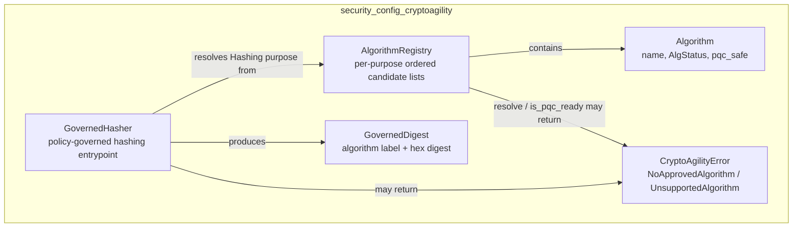
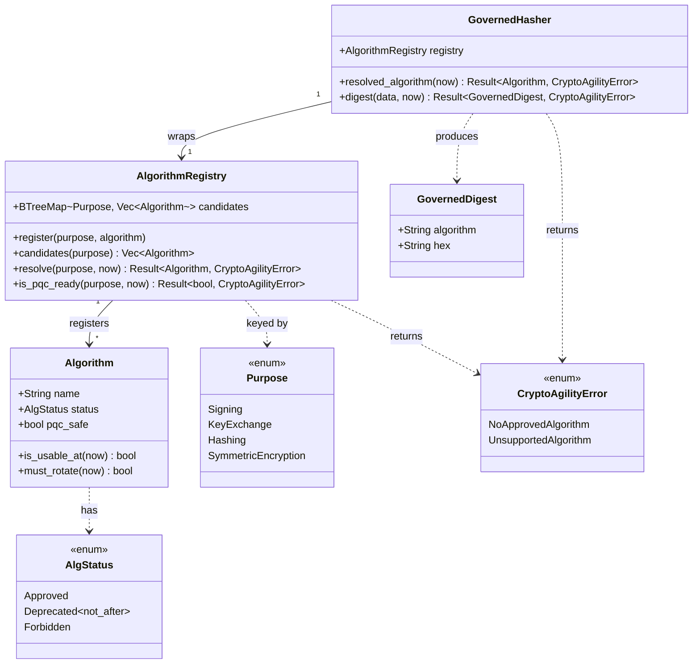
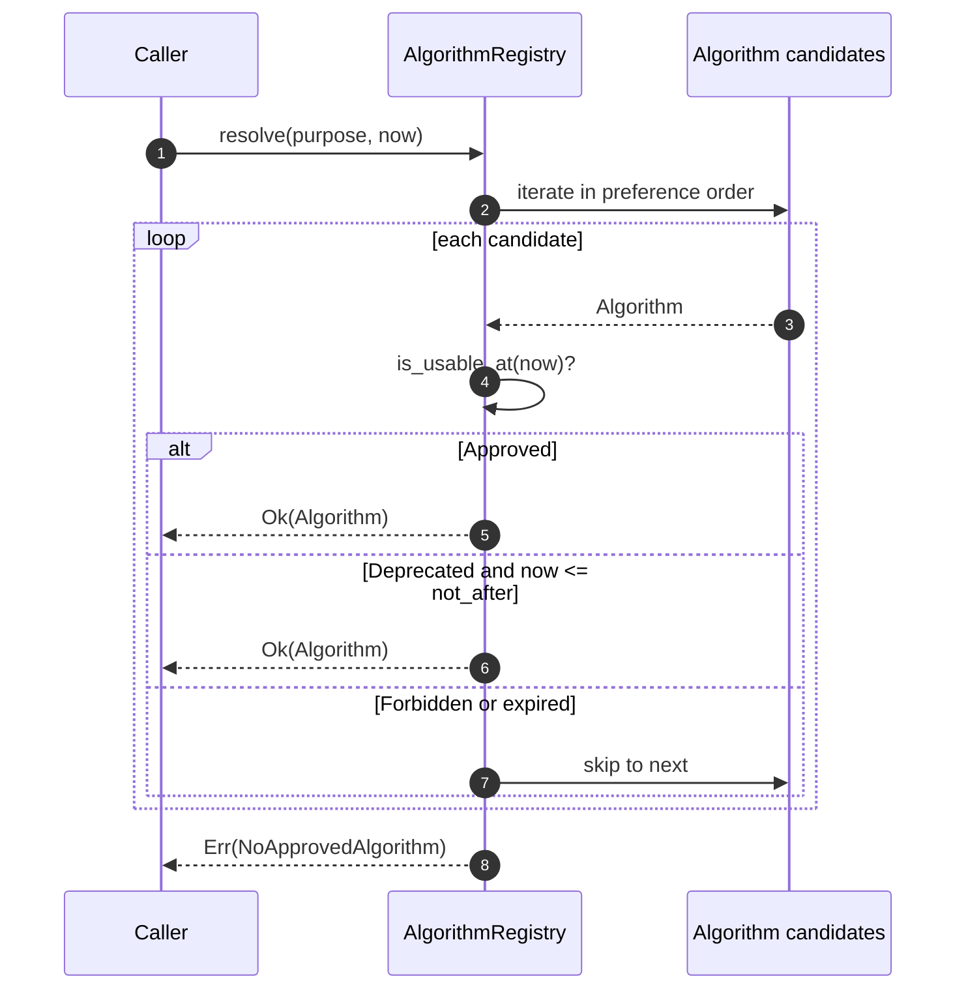
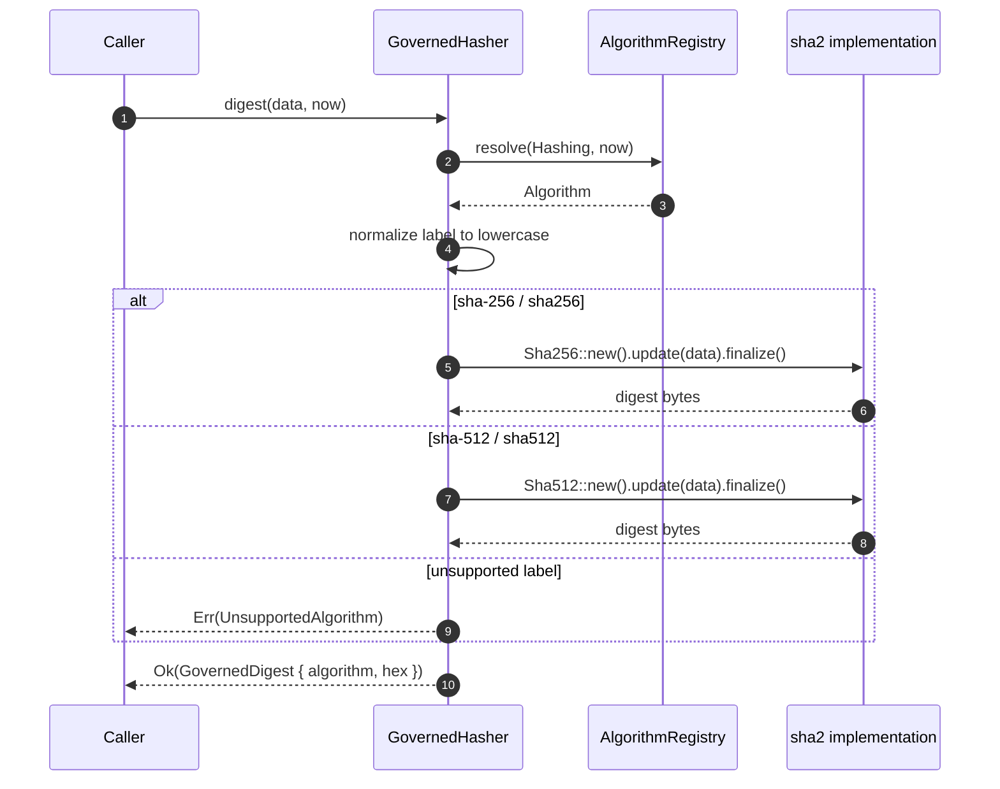
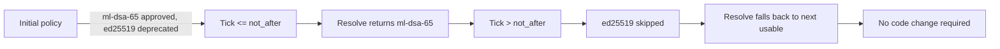
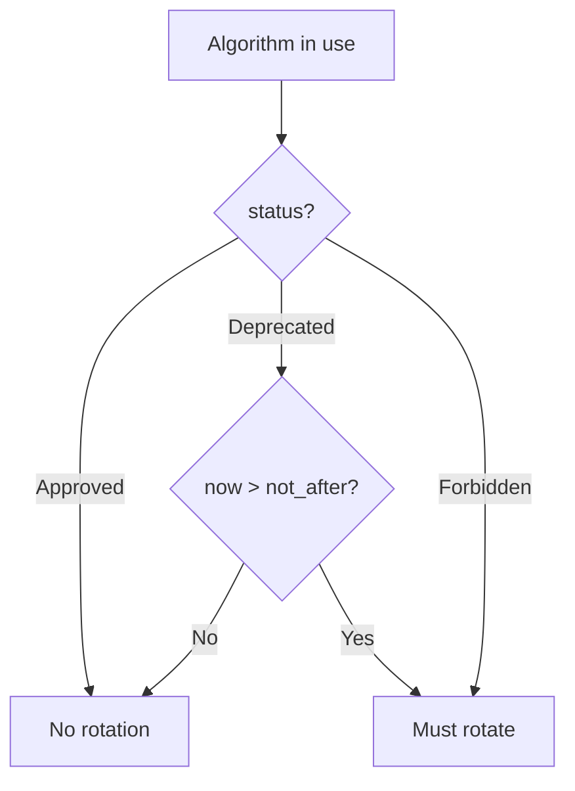
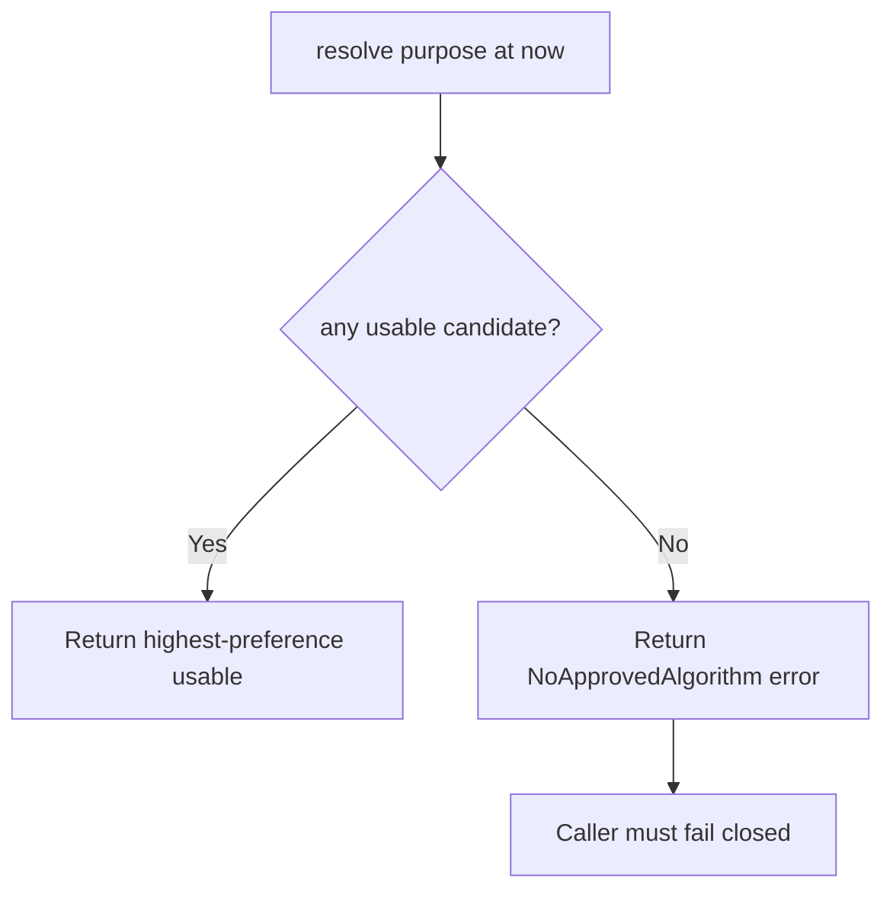
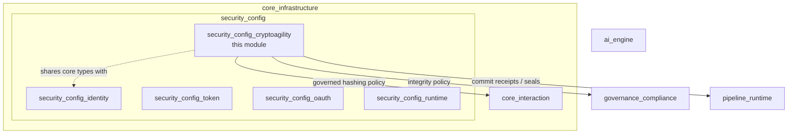

# security_config_cryptoagility

## Brief Introduction

The `security_config_cryptoagility` module provides the platform's **crypto-agility and post-quantum cryptography (PQC) readiness policy core**. It makes cryptographic primitive selection a data-driven, policy-governed decision rather than a hard-coded implementation detail.

In production systems—especially those handling sensitive workloads such as payments, identity, and audit logging—cryptographic algorithms can become compromised or deprecated over time. The classic failure mode is *silent stickiness*: code continues using a weakened primitive (for example, SHA-1 or RSA-1024) because the deprecation lived in documentation rather than in executable policy. This crate eliminates that failure mode by:

1. **Centralizing algorithm selection** in [`AlgorithmRegistry`](security_config_cryptoagility.md#algorithmregistry), which holds ordered preference lists per cryptographic [`Purpose`](security_config_cryptoagility.md#purpose).
2. **Enforcing policy at selection time** through [`Algorithm::is_usable_at`](security_config_cryptoagility.md#algorithm) and [`Algorithm::must_rotate`](security_config_cryptoagility.md#algorithm), so deprecated or forbidden algorithms are skipped automatically.
3. **Providing a governed hashing entrypoint** via [`GovernedHasher`](security_config_cryptoagility.md#governedhasher), ensuring that every hash operation uses the policy-resolved algorithm and never a silent fallback.
4. **Reporting PQC readiness** through [`AlgorithmRegistry::is_pqc_ready`](security_config_cryptoagility.md#algorithmregistry), which reflects the algorithm that *would actually be used*, not a static registry claim.

The module is intentionally pure, deterministic, and free of I/O or wall-clock reads. Logical time is injected as a [`Tick`](security_config_cryptoagility.md#tick), making every behavior unit-testable and reproducible.

---

## Core Concepts

### Purpose

A [`Purpose`](security_config_cryptoagility.md#purpose) scopes algorithm selection to a specific cryptographic job. The registry keeps independent preference lists for each purpose, so a PQC migration can proceed purpose-by-purpose without affecting unrelated operations.

| Purpose | Example use |
|---------|-------------|
| `Signing` | Message, artifact, or token signatures |
| `KeyExchange` | Key establishment and agreement |
| `Hashing` | Cryptographic digests for event logs, chains, and integrity checks |
| `SymmetricEncryption` | Bulk symmetric encryption |

### Algorithm Status

Each [`Algorithm`](security_config_cryptoagility.md#algorithm) carries a policy [`AlgStatus`](security_config_cryptoagility.md#algstatus):

- **`Approved`** — fully allowed at any logical time.
- **`Deprecated { not_after }`** — usable only while `now <= not_after`; after that it behaves like `Forbidden`.
- **`Forbidden`** — never selectable, regardless of preference rank. Always triggers rotation.

The sunset on `Deprecated` is encoded in the policy itself, not in a separate side table, eliminating the risk that an expired primitive is honored by accident.

### Anti-Downgrade Invariant

The resolver walks candidates in preference order but **skips any candidate that is not usable at the injected tick**. A `Forbidden` algorithm pinned at rank 0 is therefore harmless: resolution simply moves to the next usable candidate. If no candidate is usable, resolution returns [`CryptoAgilityError::NoApprovedAlgorithm`](security_config_cryptoagility.md#cryptoagilityerror) rather than falling back to a degraded primitive. This is the crate's fail-closed guarantee.

### Governed Hashing

[`GovernedHasher`](security_config_cryptoagility.md#governedhasher) closes the gap between policy selection and actual cryptographic operation. It resolves the `Hashing` purpose from the registry before computing a digest. Supported labels include `sha-256`/`sha256` and `sha-512`/`sha512` (case-insensitive). If the resolved label has no implementation in this build, the operation returns [`CryptoAgilityError::UnsupportedAlgorithm`](security_config_cryptoagility.md#cryptoagilityerror) instead of silently using a hard-coded hash.

---

## Architecture

### Component Relationships

---

## Data Flow

### Algorithm Resolution Flow

### Governed Hash Flow

---

## Process Flows

### PQC Migration by Policy Edit

### Rotation Decision

### Fail-Closed Resolution

---

## Module Placement in the System

`security_config_cryptoagility` sits under [`security_config`](security_config.md), which is part of [`core_infrastructure`](core_infrastructure.md). It is the cryptographic policy sibling to:

- [`security_config_identity`](security_config_identity.md) — identity primitives such as [`Principal`](security_config_identity.md#principal).
- [`security_config_token`](security_config_token.md) — token storage, sealing, and key rings.
- [`security_config_oauth`](security_config_oauth.md) — OAuth flows and pending authorization stores.
- [`security_config_runtime`](security_config_runtime.md) — runtime configuration loading and limits.

The crypto-agility policy is consumed by durable, hash-chained, and integrity-sensitive components across the system. For example:

- [`core_interaction`](core_interaction.md) components such as [`JsonlEventLog`](core_interaction.md#jsonleventlog) and [`GovernedChainHasher`](core_interaction.md#governedchainhasher) rely on governed hashing for tamper-evident logs.
- [`governance_compliance`](governance_compliance.md) modules, including incident registers, lifecycle erasure, and identity transparency logs, use the policy to ensure long-term evidentiary integrity.
- [`pipeline_runtime`](pipeline_runtime.md) components such as the pipeline journal and wire seals use governed digests for commit receipts and audit trails.

---

## API Summary

### AlgorithmRegistry

| Method | Description |
|--------|-------------|
| `new()` | Create an empty registry. |
| `register(purpose, algorithm)` | Append an algorithm to a purpose's preference list. |
| `candidates(purpose)` | Inspect the ordered candidate list for a purpose. |
| `resolve(purpose, now)` | Select the highest-preference usable algorithm at `now`. |
| `is_pqc_ready(purpose, now)` | Report whether the resolved algorithm is PQC-safe. |

### Algorithm

| Method | Description |
|--------|-------------|
| `approved(name, pqc_safe)` | Construct an `Approved` candidate. |
| `deprecated(name, not_after, pqc_safe)` | Construct a `Deprecated` candidate with sunset. |
| `forbidden(name, pqc_safe)` | Construct a `Forbidden` candidate. |
| `is_usable_at(now)` | Whether the algorithm may be selected at `now`. |
| `must_rotate(now)` | Whether an in-use algorithm must be rotated away. |

### GovernedHasher

| Method | Description |
|--------|-------------|
| `new(registry)` | Wrap a policy registry. |
| `resolved_algorithm(now)` | Inspect the algorithm that would govern hashing. |
| `digest(data, now)` | Compute a policy-governed digest. |

### Default Policy

[`default_hash_policy()`](security_config_cryptoagility.md#default_hash_policy) returns the canonical starting policy for `Hashing`: `sha-256` as `Approved`. Deployments override this via configuration (for example, through [`IncidentRegister`](governance_compliance.md) hash-policy hooks) to deprecate primitives or stage PQC migrations without changing code.

---

## Design Guarantees

- **Determinism.** No wall-clock reads, randomness, or I/O. Behavior depends only on the injected `Tick`.
- **Fail-closed.** If no algorithm is usable, resolution returns an error; it never degrades.
- **Anti-downgrade.** A `Forbidden` candidate is skipped unconditionally, even at rank 0.
- **Sunset enforcement.** `Deprecated` algorithms become unusable strictly after `not_after`.
- **Auditability.** [`GovernedDigest`](security_config_cryptoagility.md#governeddigest) records the policy label of the algorithm that produced it, supporting evidentiary "manner of production" requirements.
- **PQC reflection.** `is_pqc_ready` reports on the algorithm that would actually be resolved, not on the registry as a whole.

---

## Related Documentation

- [`security_config`](security_config.md) — parent module covering identity, token, OAuth, and runtime security configuration.
- [`security_config_identity`](security_config_identity.md) — identity primitives such as `Principal`.
- [`security_config_token`](security_config_token.md) — token storage and key management.
- [`security_config_oauth`](security_config_oauth.md) — OAuth authorization flows.
- [`security_config_runtime`](security_config_runtime.md) — runtime configuration and limits.
- [`core_infrastructure`](core_infrastructure.md) — broader infrastructure context.
- [`core_interaction`](core_interaction.md) — event logs, sessions, and telemetry that consume governed hashing.
- [`governance_compliance`](governance_compliance.md) — incident, lifecycle, and identity governance that rely on crypto-agility policy.
- [`pipeline_runtime`](pipeline_runtime.md) — pipeline journaling and wire seals that use governed digests.
