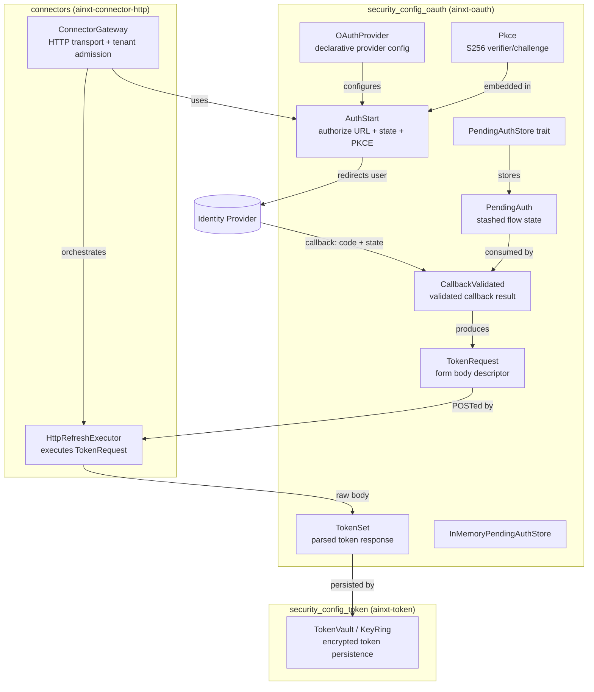
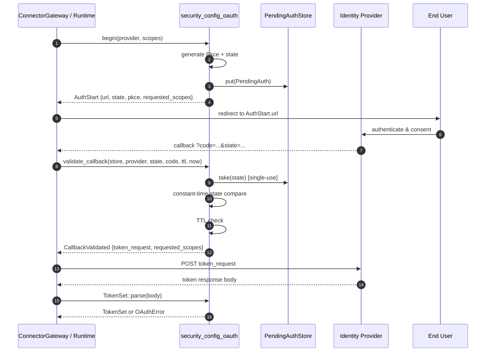
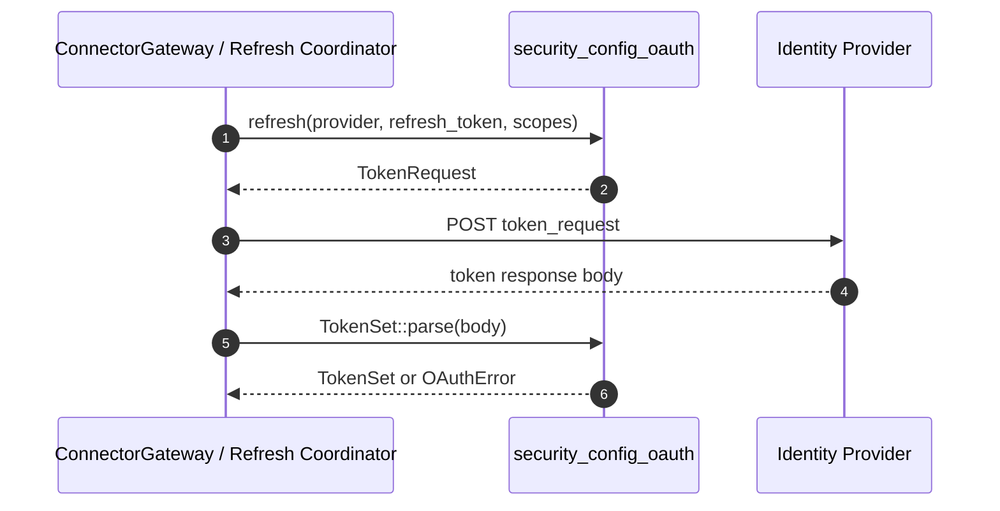
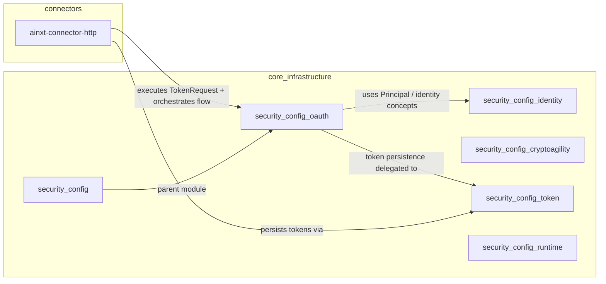

# security_config_oauth

## Brief Introduction

`security_config_oauth` is the **pure, transport-agnostic OAuth2 authorization-code + PKCE engine** for the AiNxt platform. It lives inside the [`security_config`](security_config.md) subsystem of [`core_infrastructure`](core_infrastructure.md) and is responsible for constructing and validating the artifacts required by an OAuth2 handshake, without performing any network I/O itself.

The crate implements the protocol rules defined in RFC 6749 (OAuth2 Authorization Code Grant) and RFC 7636 (PKCE). It generates PKCE verifiers/challenges, builds authorize URLs, creates token-exchange and refresh request descriptors, parses token responses, detects incremental-consent gaps, and validates callback `state` against a server-side pending-auth store. All cryptographic material (PKCE `verifier`, CSRF `state`, access tokens, refresh tokens) is handled deterministically so the logic can be exhaustively unit-tested.

By design, this crate does **not** execute HTTP calls. The actual transport is provided by the connector layer (see [`connectors`](connectors.md), specifically [`ainxt-connector-http`](ainxt-connector-http.md)), which POSTs the [`TokenRequest`] descriptors produced here and returns the raw response body for parsing.

---

## Core Responsibilities

| Responsibility | Description |
|----------------|-------------|
| **PKCE generation** | Mint a fresh `S256` PKCE pair for every flow, binding the token exchange to the client that started it. |
| **Authorize URL construction** | Build a correctly encoded authorization request URL, including `response_type=code`, `client_id`, `redirect_uri`, `scope`, `state`, and PKCE challenge. |
| **Token request descriptors** | Produce `application/x-www-form-urlencoded` request bodies for `authorization_code` exchange and `refresh_token` refresh. |
| **Token response parsing** | Parse successful token responses and map OAuth2 error codes to typed errors, distinguishing re-consent cases. |
| **Incremental consent** | Compute scope deltas so callers can request only missing scopes instead of failing or re-prompting for everything. |
| **Callback CSRF defense** | Validate the `state` echoed by the identity provider against a single-use, TTL-bounded server-side stash. |

---

## Architecture



### Component Breakdown

#### `OAuthProvider`
A declarative, serializable configuration struct holding the public OAuth2 provider endpoints, `client_id`, `redirect_uri`, and default scopes. It deliberately **does not** contain the client secret; secrets are managed by [`security_config_token`](security_config_token.md).

Convenience constructors are provided for:
- **Microsoft Entra ID (v2.0)** — tenant-scoped endpoints for the Graph connector.
- **Atlassian Cloud OAuth 2.0 (3LO)** — fixed `auth.atlassian.com` endpoints with baked-in `audience=api.atlassian.com` and `prompt=consent` parameters required by Atlassian.

#### `Pkce`
Represents an RFC 7636 PKCE pair. The `verifier` is a 43-character base64url-encoded random value kept server-side; the `challenge` is its SHA-256 hash, sent on the authorize request. The method is always `S256`; the insecure `plain` method is never used.

#### `AuthStart`
The output of [`begin`]: the full authorize URL, the CSRF `state`, the `Pkce` pair, and the `requested_scopes`. The caller must persist `state` and `pkce` server-side until the callback arrives.

#### `TokenRequest`
A transport-neutral descriptor containing the `token_endpoint` and the raw form fields for either an `authorization_code` exchange or a `refresh_token` refresh. The HTTP client is responsible for URL-encoding the form body.

#### `TokenSet`
A parsed successful token response containing `access_token`, optional `refresh_token`, `expires_in`, the granted `scope` list, and `token_type`. It can compute an absolute expiry time and classify provider error responses into:
- `OAuthError::Provider` — generic provider error.
- `OAuthError::ConsentRequired` — user must re-interact/consent (codes: `consent_required`, `interaction_required`, `login_required`, `invalid_grant`).
- `OAuthError::MalformedResponse` — unparseable response.

#### `PendingAuth` and `PendingAuthStore`
`PendingAuth` is what the server stashes between `begin` and callback: `state`, `pkce`, `requested_scopes`, and creation timestamp. `PendingAuthStore` is the trait abstraction for this stash; production deployments use a Redis-backed store with short TTLs, while `InMemoryPendingAuthStore` is provided for tests and single-process development.

#### `CallbackValidated`
The result of [`validate_callback`]: the PKCE-bound token-exchange request plus the originally requested scopes, so the caller can check incremental consent after the token is received.

---

## Data Flow

### Authorization-Code Flow



### Refresh Flow



---

## Security Properties

| Threat | Mitigation |
|--------|------------|
| **Stolen authorization code** | PKCE `code_verifier` binds the token exchange to the flow initiator. |
| **CSRF / login-CSRF** | Unguessable `state` token, stashed server-side and validated with constant-time comparison on callback. |
| **Replay of captured callback** | `PendingAuthStore::take` atomically consumes the entry; a matched `state` is burned after first use. |
| **Stale flow completion** | TTL check rejects callbacks older than the configured threshold. |
| **Timing side-channel on state** | [`ct_eq`] compares the full byte string in constant time. |
| **Over-scoped token use** | `missing_scopes` / `needs_consent` detect when granted scopes are insufficient and trigger step-up consent for only the delta. |

---

## Incremental Consent

OAuth2 providers may grant fewer scopes than requested. Instead of failing opaquely, this crate exposes:

- `missing_scopes(granted, required)` — returns the required scopes not yet granted.
- `needs_consent(granted, required)` — true if any required scope is missing.
- `step_up_consent(provider, granted, required)` — returns a fresh `AuthStart` for exactly the missing scopes, or `None` if no re-prompt is needed.

The production step-up path lives in [`ainxt-connector-http`](ainxt-connector-http.md) (`ConnectorGateway::step_up_consent_if_needed`), which delegates the scope-diff calculation to this crate but adds tenant-scoped admission, vault metadata reads, and atomic persistence.

---

## Module Relationships



- **Parent module**: [`security_config`](security_config.md) — groups identity, crypto-agility, token, OAuth, and runtime configuration concerns.
- **Sibling identity**: [`security_config_identity`](security_config_identity.md) — defines `Principal` and related identity primitives used by callers when scoping OAuth flows.
- **Sibling token**: [`security_config_token`](security_config_token.md) — owns encrypted storage of access/refresh tokens and key management; this crate produces the tokens but does not persist them.
- **Consumer**: [`connectors`](connectors.md) / [`ainxt-connector-http`](ainxt-connector-http.md) — performs HTTP transport, tenant admission, and vault integration around the artifacts produced here.

---

## Key API Surface

### Starting a Flow

```rust
pub fn begin(provider: &OAuthProvider, scopes: &[String]) -> AuthStart;
pub fn begin_and_store(
    store: &dyn PendingAuthStore,
    provider: &OAuthProvider,
    scopes: &[String],
    now_unix: u64,
) -> Result<AuthStart, CallbackError>;
```

### Token Exchange / Refresh

```rust
pub fn exchange_code(provider: &OAuthProvider, code: &str, pkce: &Pkce) -> TokenRequest;
pub fn refresh(provider: &OAuthProvider, refresh_token: &str, scopes: &[String]) -> TokenRequest;
```

### Callback Validation

```rust
pub fn validate_callback(
    store: &dyn PendingAuthStore,
    provider: &OAuthProvider,
    returned_state: &str,
    code: &str,
    ttl_secs: u64,
    now_unix: u64,
) -> Result<CallbackValidated, CallbackError>;
```

### Token Parsing

```rust
impl TokenSet {
    pub fn parse(body: &str) -> Result<TokenSet, OAuthError>;
    pub fn expires_at(&self, now_unix: u64) -> Option<u64>;
}
```

### Incremental Consent

```rust
pub fn missing_scopes(granted: &[String], required: &[String]) -> Vec<String>;
pub fn needs_consent(granted: &[String], required: &[String]) -> bool;
pub fn step_up_consent(
    provider: &OAuthProvider,
    granted: &[String],
    required: &[String],
) -> Option<AuthStart>;
```

---

## Testing Strategy

The crate includes an extensive inline test suite covering:

- Base64url encoding against known vectors.
- PKCE challenge against RFC 7636 Appendix B test vector.
- Correct authorize URL construction, including percent-encoding of `redirect_uri` and joining with `&` when the provider endpoint already contains a query string.
- Token exchange and refresh form field correctness.
- Successful and error token response parsing, including `ConsentRequired` classification.
- Incremental consent and step-up scope deltas.
- Constant-time equality.
- Callback happy path, forged-state rejection, single-use semantics, and TTL expiry.
- Provider configuration serialization and provider-specific helpers (Entra, Atlassian).

Because the crate is I/O-free, all protocol rules are deterministic and testable without mocks for network behavior.

---

## References

- Parent subsystem: [`security_config`](security_config.md)
- Identity primitives: [`security_config_identity`](security_config_identity.md)
- Encrypted token persistence: [`security_config_token`](security_config_token.md)
- Crypto-agility primitives: [`security_config_cryptoagility`](security_config_cryptoagility.md)
- Runtime configuration: [`security_config_runtime`](security_config_runtime.md)
- HTTP transport consumer: [`connectors`](connectors.md) / [`ainxt-connector-http`](ainxt-connector-http.md)
- System context: [`core_infrastructure`](core_infrastructure.md)
