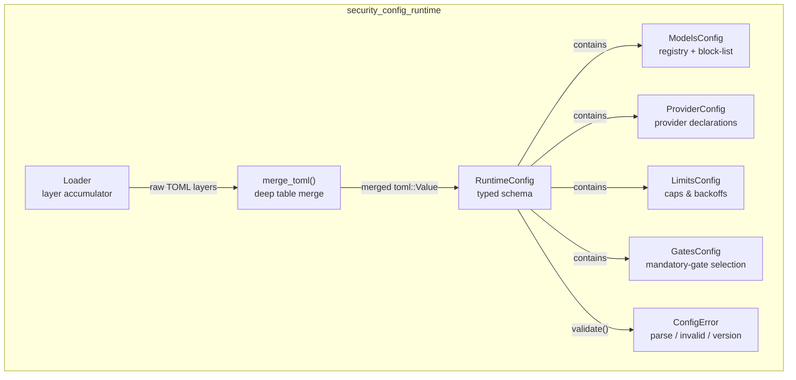
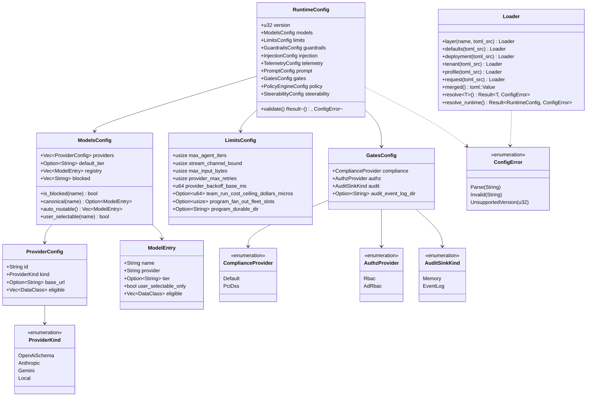
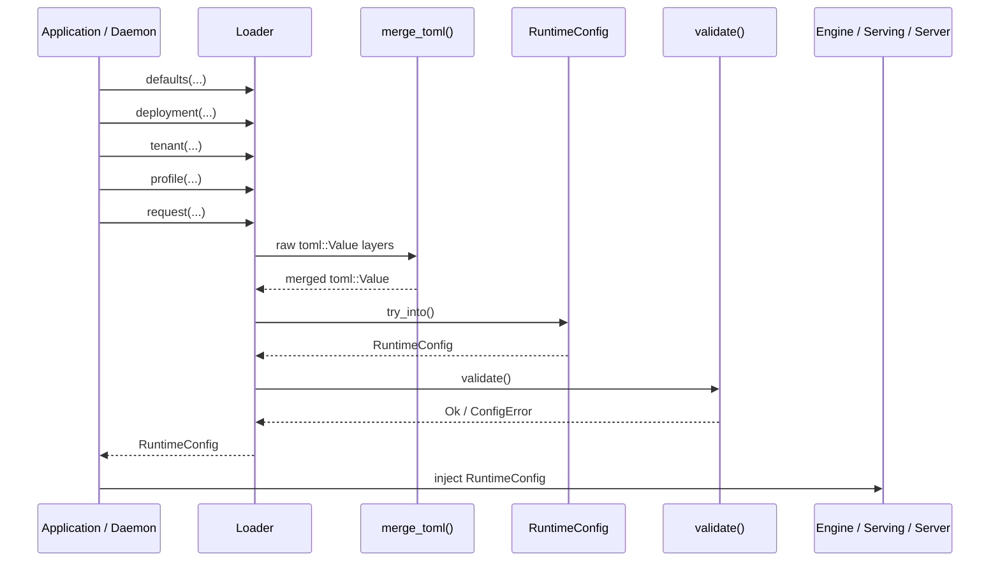
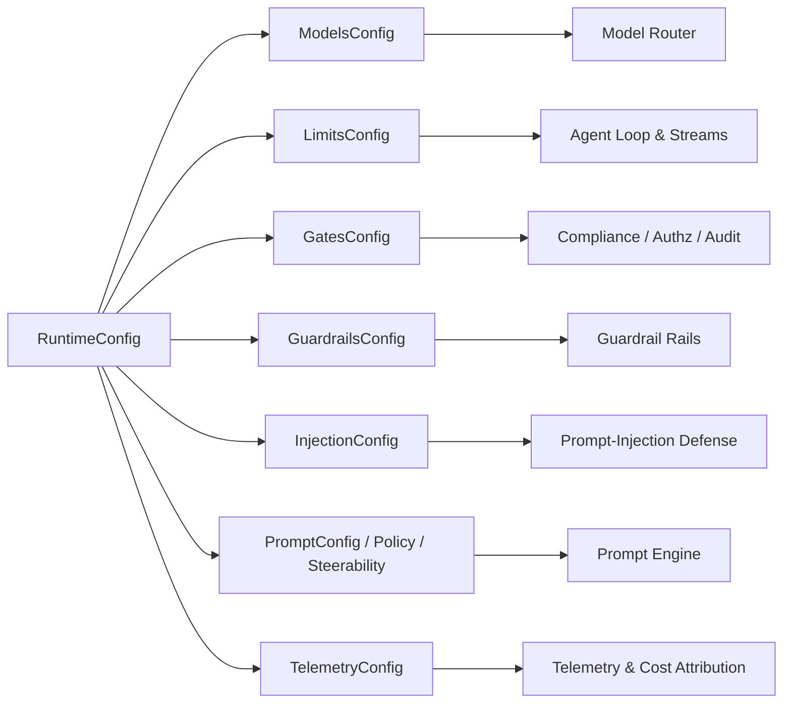
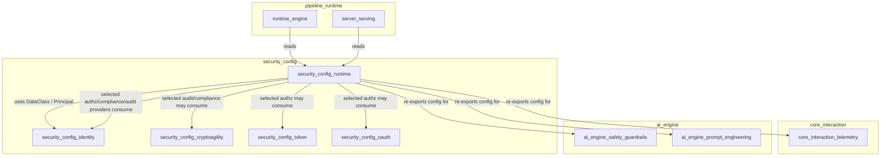
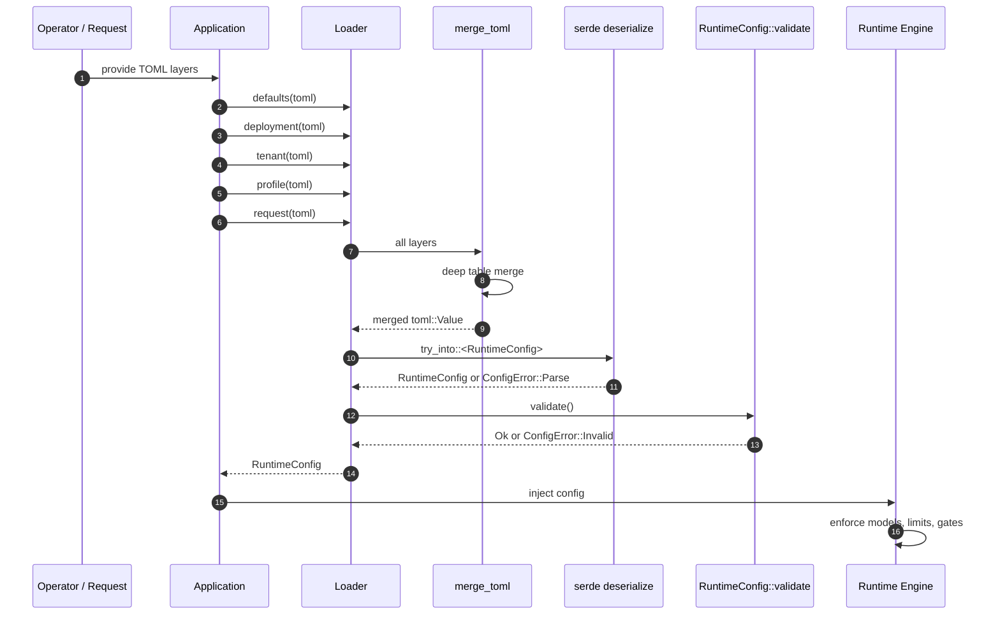

# security_config_runtime

## Introduction

`security_config_runtime` is the **layered, schema-validated runtime configuration** subsystem for the platform. It is responsible for turning ordered configuration layers — built-in defaults, deployment-wide settings, tenant/org overrides, surface profiles, and per-request overrides — into a single strongly-typed [`RuntimeConfig`]. This config drives every safety-critical and operational decision made by the engine: which models and providers are allowed, which gates enforce compliance/authorization/audit, retry and budget limits, prompt-injection defenses, guardrails, telemetry sinks, and prompt-engineering policy.

The module lives under [`security_config`](security_config.md) and is the bridge between the identity, cryptographic, token, and OAuth subsystems (its sibling modules) and the rest of the platform. While those sibling modules define *who* and *how* to trust, `security_config_runtime` defines *what the runtime is allowed to do* with that trust.

> **Design motto:** *Config-first, safety-invariant.* Every behavior is declarative and configurable, but the configuration schema makes it **impossible** to remove a mandatory gate. You can only select *which provider* runs a gate, never disable it.

---

## Purpose & Scope

`security_config_runtime` answers three questions for the running system:

1. **What is allowed?** — model registry, blocked models, provider eligibility, data-class ceilings, routing tiers.
2. **What are the limits?** — agent-loop iterations, input size, stream backpressure, retries, cost ceilings, fleet slots.
3. **Which gates run where?** — mandatory compliance, authorization, and audit sink selection.

It does **not** implement the gates themselves. It only declares *which* implementation each gate uses and supplies the parameters those implementations need. The actual gate logic lives in:

- [`ai_engine_safety_guardrails`](ai_engine_safety_guardrails.md) for `guardrails` and `injection` config.
- [`ai_engine_prompt_engineering`](ai_engine_prompt_engineering.md) for `prompt`, `policy`, and `steerability` config.
- [`core_interaction_telemetry`](core_interaction_telemetry.md) for `telemetry` config.
- [`security_config_identity`](security_config_identity.md), [`security_config_cryptoagility`](security_config_cryptoagility.md), [`security_config_token`](security_config_token.md), and [`security_config_oauth`](security_config_oauth.md) for the primitives consumed by the selected authz/compliance/audit providers.

---

## Core Concepts

| Concept | Description |
|--------|-------------|
| **Layered merge** | Config layers are merged as raw `toml::Value` tables before deserialization. Tables merge recursively; scalars and arrays are replaced by the more-specific layer. |
| **Typed schema** | The merged value is deserialized into [`RuntimeConfig`], a `#[serde(deny_unknown_fields)]` struct. Unknown keys fail fast. |
| **Validation** | [`RuntimeConfig::validate`] enforces invariants that types alone cannot express: iteration caps, non-empty L2 policy body, valid probability ranges, unique provider/model IDs, and registry consistency. |
| **Mandatory gates** | [`GatesConfig`] contains only *provider selection* enums. There is no `off` flag and no `None` variant for disabling compliance, authorization, or audit. |
| **Canonical model registry** | [`ModelsConfig::registry`] is the config projection of the platform model policy. [`ModelsConfig::blocked`] is the authoritative block-list that overrides the registry. |

---

## Architecture

### Component Overview



### Class Diagram



---

## Component Reference

### `RuntimeConfig`

The fully-resolved runtime configuration. It is the product of merging all layers and passing [`RuntimeConfig::validate`]. It aggregates domain-specific sub-configs re-exported from other crates:

- `guardrails` → [`ai_engine_safety_guardrails`](ai_engine_safety_guardrails.md)
- `injection` → [`ai_engine_safety_guardrails`](ai_engine_safety_guardrails.md) (prompt-injection defense)
- `prompt` / `policy` / `steerability` → [`ai_engine_prompt_engineering`](ai_engine_prompt_engineering.md)
- `telemetry` → [`core_interaction_telemetry`](core_interaction_telemetry.md)

### `ModelsConfig`, `ModelEntry`, `ProviderConfig`

The canonical model registry and provider declarations.

- `ModelsConfig::registry` lists every canonical model, the provider that serves it, its routing tier, and whether it is user-selectable-only.
- `ModelsConfig::blocked` is the authoritative block-list. A blocked model is excluded from both `auto_routable()` and `user_selectable()` even if it appears in the registry.
- `ProviderConfig::eligible` and `ModelEntry::eligible` declare which [`DataClass`](security_config_identity.md) values the provider/model may handle. Routing intersects these ceilings with the gate decisions.

### `LimitsConfig`

Operational guardrails:

- `max_agent_iters` is hard-ceilinged at `MAX_AGENT_ITERS_CEILING` (64) regardless of config.
- `team_run_cost_ceiling_dollars_micros` sets a dollar ceiling across a served Team run's rolled-up sub-agent cost.
- `program_fan_out_fleet_slots` seeds the planner's elastic fan-out policy.
- `program_durable_dir` enables crash-resumable Program state via the event-log subsystem.

### `GatesConfig`

The safety-invariant type. It selects **which** provider runs each mandatory gate but never allows a gate to be removed:

- `compliance`: `Default` (OSS redact-and-proceed) or `PciDss` (enterprise plugin).
- `authz`: `Rbac` (capability-based) or `AdRbac` (enterprise AD-backed).
- `audit`: `Memory` (dev/test) or `EventLog` (durable tamper-evident log).

### `Loader`

Accumulates config layers in precedence order and resolves them. Canonical helpers make the ordering explicit:

```text
defaults → deployment → tenant/org → surface profile → per-request overrides
```

`Loader::resolve_runtime()` performs merge → deserialize → validate in one call.

### `ConfigError`

Three failure modes:

- `Parse` — TOML syntax error or deserialization failure.
- `Invalid` — config violates a validation rule (e.g., empty L2 policy body, duplicate provider ID).
- `UnsupportedVersion` — config declares a schema version the build does not understand.

---

## Data Flows

### Configuration Loading Flow



### RuntimeConfig Consumption Flow



---

## Configuration Loading Process

1. **Layer accumulation** — callers add TOML strings via `Loader::defaults`, `deployment`, `tenant`, `profile`, `request`, or the generic `layer` method.
2. **Deep merge** — `merge_toml` recursively merges tables. Scalars and arrays are replaced by the more-specific layer, so a per-request override wins over a deployment default.
3. **Deserialization** — the merged `toml::Value` is converted into the typed `RuntimeConfig`. `deny_unknown_fields` ensures typos and unsupported keys fail immediately.
4. **Validation** — `RuntimeConfig::validate` checks:
   - Schema version matches `CONFIG_VERSION`.
   - `max_agent_iters` is within `1..=64`.
   - `stream_channel_bound` ≥ 1.
   - `provider_max_retries` ≤ 10 and `provider_backoff_base_ms` ≤ 60,000.
   - `policy.l2_body` is non-empty.
   - `steerability.min_bar` is in `[0.0, 1.0]`.
   - Provider IDs are unique and non-empty.
   - Model names are unique, reference declared providers, and are not simultaneously registered and blocked.
5. **Injection** — the validated `RuntimeConfig` is passed into the engine, serving layer, server, and other consumers.

---

## Validation & Safety Invariants

The module encodes several safety invariants directly in its types and validation:

| Invariant | How it is enforced |
|-----------|--------------------|
| Mandatory gates cannot be removed | `GatesConfig` enums have no `Off` variant and no `enabled` flag. |
| Agent loops cannot run forever | `MAX_AGENT_ITERS_CEILING` caps iterations at compile time; validation enforces `1..=64`. |
| L2 policy cannot be silently dropped | `policy.l2_body` must be non-empty. |
| Steerability bar is a valid pass-rate | `steerability.min_bar` must be in `0.0..=1.0`. |
| Model policy is contradiction-free | A model cannot be both registered and blocked. |
| Provider/model IDs are unique | Validation rejects duplicates and empty IDs. |
| Unknown config keys fail fast | `#[serde(deny_unknown_fields)]` on `RuntimeConfig`. |

---

## Integration with the Overall System

`security_config_runtime` sits at the center of the configuration plane:



- **Upstream:** The `Loader` consumes raw TOML from deployment files, environment-specific overlays, and per-request overrides.
- **Downstream:** `RuntimeConfig` is consumed by [`pipeline_runtime`](pipeline_runtime.md) components such as `ainxt-runtime`, `ainxt-runtimed`, `ainxt-server`, and `ainxt-serving` to make routing, gating, and budgeting decisions.
- **Sibling modules:** The selected `GatesConfig` providers delegate to identity, crypto, token, and OAuth primitives as needed. For example, `AuthzProvider::Rbac` relies on [`security_config_identity`](security_config_identity.md) capabilities, while `AuditSinkKind::EventLog` relies on cryptographic hashing from [`security_config_cryptoagility`](security_config_cryptoagility.md) and the event-log subsystem.

---

## Security Considerations

- **Fail-closed by default:** Validation errors prevent the runtime from starting with an unsafe or incomplete config. An empty L2 policy body, an out-of-range steerability bar, or a blocked-and-registered model all produce `ConfigError::Invalid`.
- **No silent gate removal:** The absence of an `off` variant in `GatesConfig` means a configuration cannot accidentally or maliciously disable compliance, authorization, or audit.
- **Layer precedence is deterministic:** The most-specific layer always wins, preventing deployment defaults from silently overriding tenant or per-request safety settings.
- **Schema versioning:** `CONFIG_VERSION` ensures an older binary refuses to load a newer, incompatible config rather than misinterpreting it.
- **Data-class ceilings:** Provider and model eligibility lists are intersected at routing time, so regulated or PII data cannot leak to a provider that is not explicitly cleared for it.

---

## Related Modules

- [`security_config`](security_config.md) — parent module covering identity, crypto, token, OAuth, and runtime configuration.
- [`security_config_identity`](security_config_identity.md) — principals, data classes, and capability primitives consumed by authz gates.
- [`security_config_cryptoagility`](security_config_cryptoagility.md) — governed digests and algorithm registry used by audit and compliance sinks.
- [`security_config_token`](security_config_token.md) — token vault and sealed secrets used by authz providers.
- [`security_config_oauth`](security_config_oauth.md) — OAuth flows used by authz providers.
- [`ai_engine_safety_guardrails`](ai_engine_safety_guardrails.md) — implementation of `guardrails` and `injection` config.
- [`ai_engine_prompt_engineering`](ai_engine_prompt_engineering.md) — implementation of `prompt`, `policy`, and `steerability` config.
- [`core_interaction_telemetry`](core_interaction_telemetry.md) — implementation of `telemetry` config and cost attribution.
- [`pipeline_runtime`](pipeline_runtime.md) — the runtime engine and serving layer that consume `RuntimeConfig`.

---

## Appendix: Complete Configuration Loading Sequence


