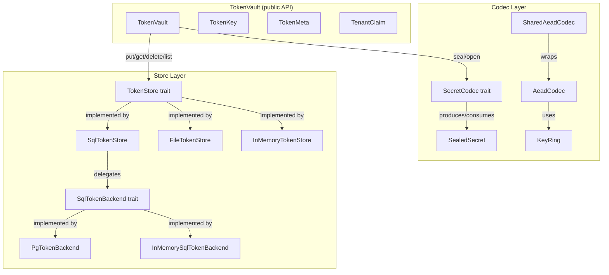
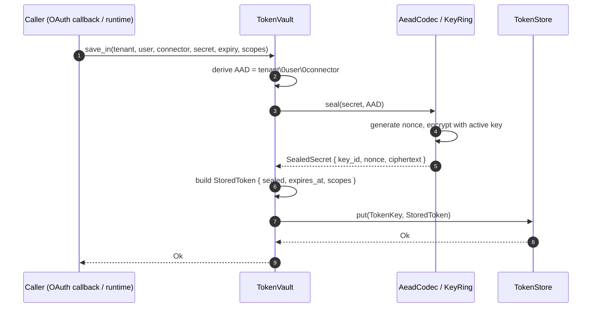
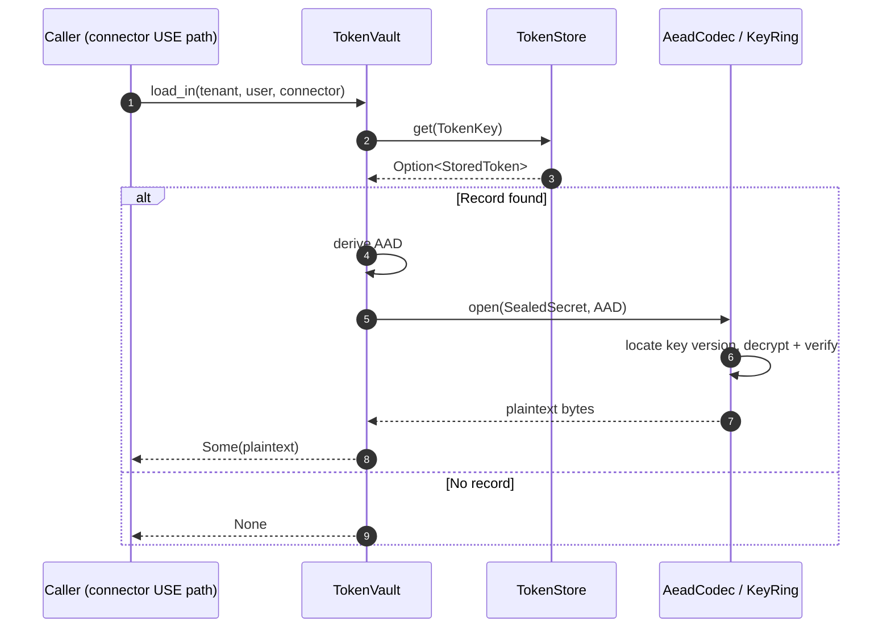
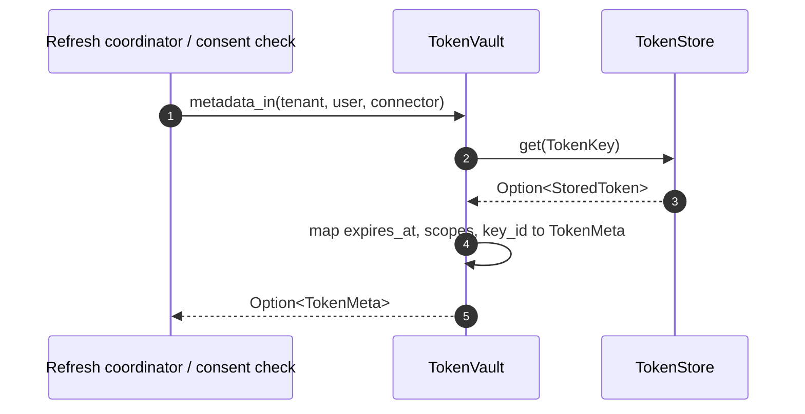
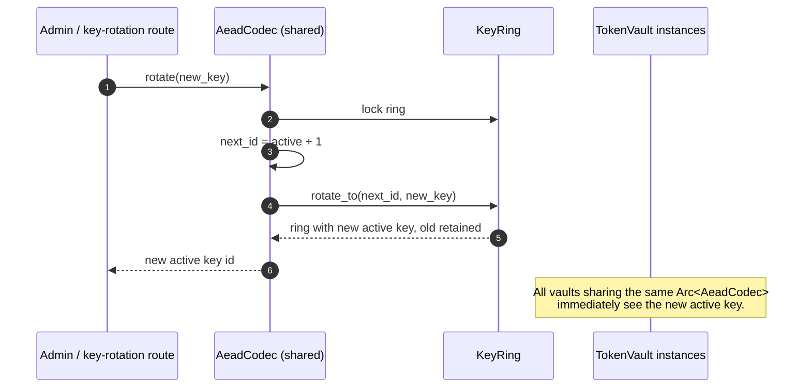
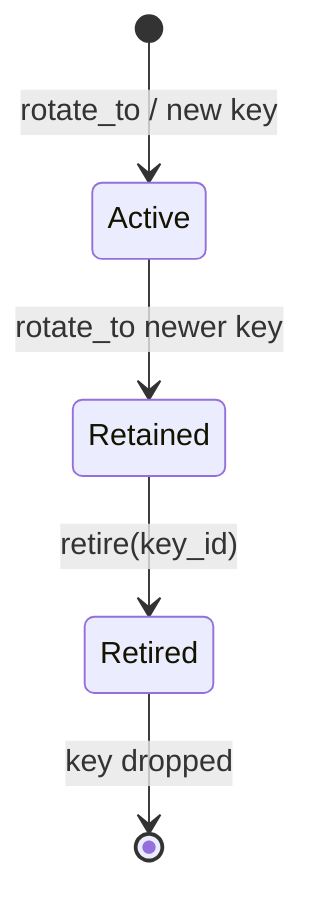
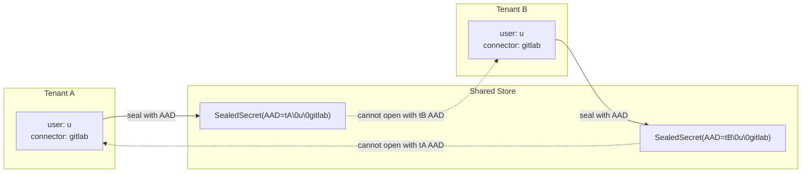
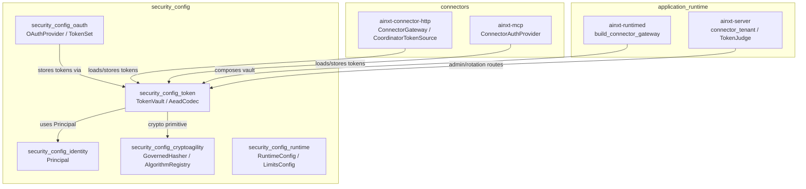

# security_config_token — Encrypted Per-User Connector Secret Vault

## Brief Introduction

The `security_config_token` module provides the system's encrypted token storage subsystem. It is responsible for safely persisting OAuth tokens, API keys, and other connector secrets on a per-user, per-connector, and per-tenant basis. The module ensures that secrets are encrypted at rest using authenticated encryption, cryptographically bound to their owner and connector context, and isolated across tenants and users.

This module is part of the broader [`security_config`](security_config.md) subsystem, alongside [`security_config_identity`](security_config_identity.md), [`security_config_cryptoagility`](security_config_cryptoagility.md), [`security_config_oauth`](security_config_oauth.md), and [`security_config_runtime`](security_config_runtime.md). It is consumed by connector and runtime modules that need to store or retrieve user credentials without exposing plaintext secrets to storage backends.

---

## Core Responsibilities

1. **Authenticated Encryption**: Seal plaintext secrets using XChaCha20-Poly1305 with additional authenticated data (AAD) so that ciphertext is bound to `(tenant, user_id, connector)`.
2. **Versioned Key Management**: Support non-disruptive key rotation through a `KeyRing` that retains older keys for decryption while sealing new records with the active key.
3. **Pluggable Storage**: Provide multiple `TokenStore` implementations — in-memory, file-backed, and SQL-backed — all operating only on ciphertext.
4. **Tenant & User Isolation**: Enforce cryptographic and storage-layer isolation across tenants and users, even when user identifiers overlap.
5. **Identity-Bound API**: Offer a verified-identity API where the user and tenant axes are derived from authenticated principals, reducing confused-deputy risk.
6. **Metadata Without Decryption**: Store non-secret metadata (expiry, scopes) in the clear so refresh schedulers and consent checks can operate without decrypting secrets.

---

## Architecture

The module is structured in three layers, each exposing a seam for testing, alternative implementations, and operational flexibility:

| Layer | Primary Types | Purpose |
|-------|---------------|---------|
| **Codec** | `SecretCodec`, `AeadCodec`, `KeyRing`, `SharedAeadCodec`, `SealedSecret` | Authenticated encryption and key rotation. |
| **Store** | `TokenStore`, `InMemoryTokenStore`, `FileTokenStore`, `SqlTokenStore`, `SqlTokenBackend`, `InMemorySqlTokenBackend`, `PgTokenBackend` | Persistence of sealed records. |
| **Vault** | `TokenVault`, `TokenKey`, `StoredToken`, `TokenMeta`, `TenantClaim` | Composition of codec + store; the public API. |

### High-Level Architecture Diagram

---

## Component Reference

### Codec Layer

#### `SecretCodec`
The encryption seam. Implementations must provide:
- `seal(plaintext, aad) -> SealedSecret`
- `open(sealed, aad) -> Vec<u8>`
- `active_key_id() -> u32`

The AAD binds each ciphertext to its logical owner context, preventing record transplantation across users, connectors, or tenants.

#### `AeadCodec`
Default implementation using **XChaCha20-Poly1305** over a versioned `KeyRing`. Features:
- 256-bit keys and 192-bit nonces generated via the OS CSPRNG.
- Nonce randomness safe for random selection without reuse concerns.
- Live, mutex-protected key rotation via `AeadCodec::rotate`.
- Live key retirement via `AeadCodec::retire`.

#### `KeyRing`
A versioned set of encryption keys. New records seal with the active key; retained older keys can still open historical records. Supports:
- `new(key_id, key)` — bootstrap with one active key.
- `generate(key_id)` — create a random active key.
- `with_key(key_id, key)` — add a decryption-only key.
- `rotate_to(key_id, key)` — install and activate a new key.
- `retire(key_id)` — drop an old key version (refuses to retire the active key).

#### `SharedAeadCodec`
Wraps `Arc<AeadCodec>` so that multiple `TokenVault` instances share a single live, rotatable codec. Prevents silent divergence that would occur if each vault owned an independent `KeyRing` built from the same raw key bytes.

#### `SealedSecret`
The self-describing persisted ciphertext envelope:
- `key_id`: which key version encrypted the record.
- `nonce`: per-record random nonce.
- `ciphertext`: encrypted bytes with appended Poly1305 tag.

### Store Layer

#### `TokenStore`
Persistence seam keyed by `(tenant, user_id, connector)`. Methods:
- `put(key, StoredToken)`
- `get(key) -> Option<StoredToken>`
- `delete(key) -> bool`
- `connectors_for(tenant, user_id) -> Vec<String>`

Only ciphertext and non-secret metadata ever pass through this interface.

#### `InMemoryTokenStore`
Test and development store backed by a shared `BTreeMap` behind a mutex. Cheap to clone.

#### `FileTokenStore`
Durable, single-process file-backed store. Persists records as JSON and writes atomically via temp-file-and-rename. Suitable for OSS deployments that do not require cross-process shared storage.

#### `SqlTokenStore<B: SqlTokenBackend>`
Durable, cross-process relational store. Converts `StoredToken` to/from `TokenRow` and delegates to a `SqlTokenBackend`. Designed for the `user_connector_tokens` Postgres table keyed by `(tenant, user_id, connector)`.

#### `SqlTokenBackend`
The narrow relational seam mapping one-to-one to parameterized SQL statements:
- `upsert(row)`
- `fetch(tenant, user_id, connector)`
- `remove(tenant, user_id, connector)`
- `list_connectors(tenant, user_id)`

#### `InMemorySqlTokenBackend`
Offline fake of the relational backend, modelling the `user_connector_tokens` table with correct upsert, tenant-scoped listing, and delete semantics. Enables full `SqlTokenStore` testing without a live database.

#### `PgTokenBackend` (feature = `postgres`)
Driver-agnostic Postgres binding of `SqlTokenBackend`. Issues parameterized SQL against `user_connector_tokens` through a pluggable `PgExecutor` port. Pulls no database crate directly; deployments inject a real driver-backed executor.

### Vault Layer

#### `TokenVault`
The public composition of codec + store. Provides three API families:

1. **Tenant-scoped API** (`save_in`, `load_in`, `metadata_in`, `revoke_in`, `connectors_for_in`): accepts explicit tenant and user strings.
2. **Verified-identity API** (`save_for`, `load_for`, `metadata_for`, `revoke_for`, `connectors_for_principal`): derives the key from a `TenantClaim` and a `Principal`, making confused-deputy mistakes structurally harder.
3. **Unscoped API** (`save`, `load`, `metadata`, `revoke`, `connectors_for`): operates in the `DEFAULT_TENANT` sentinel for single-tenant callers.

#### `TokenKey`
The storage identity: `(tenant, user_id, connector)`. Provides constructors for unscoped, scoped, and principal-bound keys. The principal-bound constructor `for_principal` ensures the user axis is always the verified `Principal::user_id`.

#### `TenantClaim`
A tenant identifier proven to originate from a verified identity claim. It is deliberately not constructible from an arbitrary `&str`, requiring an explicit `from_verified_claim` call. This makes it impossible to pass a client-supplied tenant string into the identity-bound vault API by accident.

#### `StoredToken`
What the store persists: a `SealedSecret` plus plaintext metadata (`expires_at`, `scopes`).

#### `TokenMeta`
Non-secret metadata returned without decrypting the secret.

---

## Data Flow

### Saving a Secret

### Loading a Secret

### Reading Metadata Without Decryption

---

## Key Rotation and Lifecycle

### Rotation Flow

### Key States

- **Active**: used for all new `seal` operations.
- **Retained**: can still `open` historical records; not used for new seals.
- **Retired**: removed from the ring; records sealed under it become permanently unopenable.

---

## Tenant and User Isolation

The module enforces isolation at two levels:

1. **Storage-layer isolation**: The composite primary key `(tenant, user_id, connector)` ensures that two tenants sharing the same `user_id` cannot collide or enumerate each other's grants.
2. **Cryptographic isolation**: The AEAD AAD includes the tenant, user, and connector. Even an attacker with full write access to the store cannot transplant a sealed record from one tenant or user to another — the authentication tag will fail verification.

---

## Dependencies

### Internal Dependencies

| Crate | Module | Usage |
|-------|--------|-------|
| `ainxt-types` | [`security_config_identity`](security_config_identity.md) | `Principal` — the verified identity type used by the identity-bound vault API. |

### External Dependencies

- `chacha20poly1305` — XChaCha20-Poly1305 AEAD implementation.
- `serde` — serialization for file-backed and SQL row formats.
- `zeroize` — secure memory wiping of key material.

---

## Module Placement in the System

The `security_config_token` module sits at the boundary between identity verification, connector authentication, and runtime configuration. Connector implementations such as [`ainxt-connector-http`](connectors.md) and [`ainxt-mcp`](connectors.md) rely on it to persist and retrieve user credentials, while the runtime server ([`ainxt-server`](pipeline_runtime.md), [`ainxt-runtimed`](pipeline_runtime.md)) composes the vault and exposes key-rotation and deauthorization operations.

---

## Security Properties

| Property | Mechanism |
|----------|-----------|
| **Confidentiality at rest** | XChaCha20-Poly1305 encryption; store sees only ciphertext. |
| **Integrity** | Poly1305 authentication tag; tampered ciphertext fails to open. |
| **Owner binding** | AAD includes `(tenant, user_id, connector)`; transplantation fails. |
| **Key rotation** | Versioned `KeyRing` retains old keys while activating new ones. |
| **Forward control** | `retire` drops old keys, rendering their records unrecoverable. |
| **Tenant isolation** | Composite storage key and AAD both include tenant. |
| **Confused-deputy resistance** | `TenantClaim` + `Principal` bound API removes client-controlled axes. |
| **Least exposure** | Metadata (`expires_at`, `scopes`) readable without decryption. |

---

## Error Handling

- `CodecError::Encrypt` — encryption failure (operational/config issue).
- `CodecError::Decrypt` — decryption or authentication failure. Coarse by design to avoid distinguishing wrong key, tampering, or AAD mismatch.
- `CodecError::UnknownKey(u32)` — a sealed record references a key version not present in the ring.
- `StoreError(String)` — backend persistence failure.
- `VaultError` — wraps either a `CodecError` or a `StoreError`.

---

## Testing Strategy

The crate includes extensive unit tests covering:

- Seal/open round trips and AAD binding.
- Tamper detection and fresh nonces per seal.
- Key rotation, retention, and retirement semantics.
- In-memory, file-backed, and SQL-backed store behavior.
- Multi-tenant isolation at both storage and cryptographic layers.
- Cross-tenant record transplantation failure.
- Verified-identity API cross-sub isolation.
- Offline proof of the Postgres backend using a fake `PgExecutor` (feature `postgres`).

These tests allow the relational store logic to be proven without a live database, while the production Postgres binding only needs to honor the narrow `SqlTokenBackend` / `PgExecutor` seam.

---

## Related Documentation

- [`security_config`](security_config.md) — parent module overview.
- [`security_config_identity`](security_config_identity.md) — identity primitives (`Principal`).
- [`security_config_cryptoagility`](security_config_cryptoagility.md) — governed cryptographic algorithms.
- [`security_config_oauth`](security_config_oauth.md) — OAuth flow and token exchange.
- [`security_config_runtime`](security_config_runtime.md) — runtime configuration and limits.
- [`connectors`](connectors.md) — connector modules that consume the token vault.
- [`pipeline_runtime`](pipeline_runtime.md) — runtime server and serving infrastructure.
