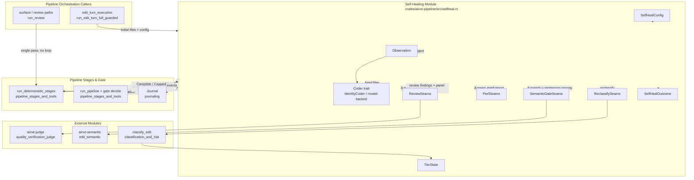
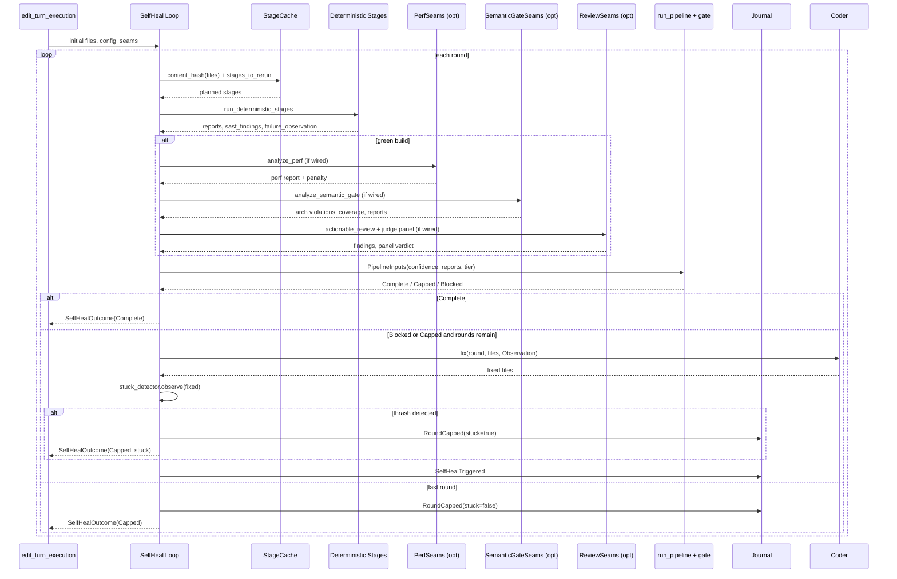
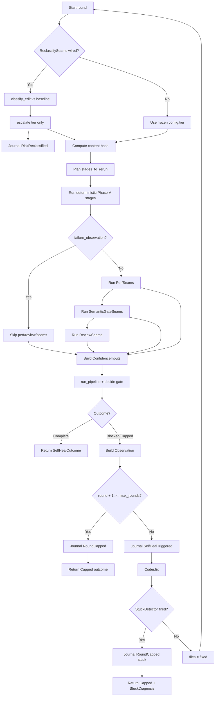
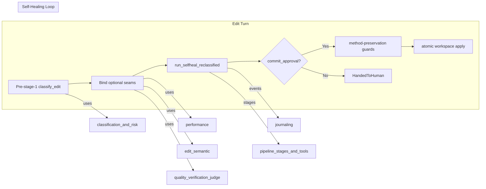

# Self-Healing Module

The **Self-Healing** module turns the code-review pipeline from a single-pass verifier into a bounded, auditable **fix-and-reverify loop**. When a candidate edit fails a deterministic stage, the loop asks a pluggable [`Coder`](self_healing.md#coder-seam) to produce a revised file set, re-runs the invalidated stages, and re-evaluates the commit gate. The loop is capped by a configurable round limit and a thrash/stuck detector, and every round is recorded in the tamper-evident journal.

This module lives inside [`pipeline_orchestration`](pipeline_orchestration.md) and is driven by the live edit-turn entrypoints in [`edit_turn_execution`](edit_turn_execution.md) and the review entrypoints in [`surface_conversation`](surface_conversation.md) (via [`pipeline_stages_and_tools`](pipeline_stages_and_tools.md)).

---

## Core Responsibilities

1. **Bounded self-heal loop** — repeatedly invoke the `Coder` on rejection until the gate clears, the round budget is exhausted, or the stuck detector fires.
2. **Honest outcomes** — a `Capped` result always carries the real `rounds_exhausted` and the actual blocking stage; it is never rendered as a false `Complete`.
3. **Re-entry planning** — use a content-hash [`StageCache`](pipeline_stages_and_tools.md) to re-run only the stages invalidated by the latest fix.
4. **Optional stage seams** — wire in Performance Analysis, Architecture/Regression Review, LLM Review, and independent Judge panels only when the deployment provides them.
5. **Mid-run risk re-classification** — re-derive the risk tier from the *current* healed set each round, escalating only, so a fix that widens the blast radius is gated correctly.
6. **Forensic observability** — emit `SelfHealTriggered`, `RoundCapped`, and `RiskReclassified` events into the journal for regulator replay.

---

## Architecture



---

## Component Reference

### `SelfHealConfig`

The loop budget and risk context. Carries:

- `lang`, `tier`, `rung` — language, initial risk tier, and edit-engine fidelity.
- `max_rounds` — hard cap on self-heal rounds.
- `stuck` — optional `(window, threshold)` for the [`StuckDetector`](quality_verification_judge.md).
- `blast_radius_test_coverage`, `architecture_violations`, `judge_approved` — fallback scalars used when the corresponding seam is not wired.
- `policy` — the [`GatePolicy`](pipeline_stages_and_tools.md) thresholds.
- `blast_fan_out` — the pre-stage-1 blast radius, journaled on `PipelineStarted`.

### `Coder` Seam

```rust
pub trait Coder: Send + Sync {
    fn fix(
        &self,
        round: u8,
        files: &[(String, String)],
        observation: &Observation,
    ) -> Vec<(String, String)>;
}
```

The `Coder` is the fix generator. Implementations include:

- [`IdentityCoder`](self_healing.md#identitycoder) — the air-gapped default; returns files unchanged. It guarantees that a failing edit cannot be silently converted into a false `Complete`.
- Model-backed coder — in a deployed system, the edit ladder + LLM (`EditEngine` in [`edit_turn_execution`](edit_turn_execution.md)) produces the next candidate.
- Test coders: `FixOnceCoder`, `NoOpCoder`, `ThrashCoder`.

### `Observation`

A structured feedback object passed to the `Coder`:

- `stage` — the stage that rejected the candidate.
- `diagnostics` — exact, un-paraphrased tool output, plus actionable LLM Review findings when the build was green but the gate still blocked.

### `SelfHealOutcome`

The typed result of a self-heal run:

- `outcome` — `Complete`, `Capped`, or `Blocked`.
- `rounds` — actual rounds spent (never hard-coded).
- `stuck` — optional [`StuckDiagnosis`](quality_verification_judge.md) when the thrash detector fired.
- `rerun_log` — per-round list of stages that re-ran.
- `final_files` — the healed file set at outcome time.
- `last_review` / `last_judge` — final LLM Review findings and independent Judge panel verdict.

### Optional Seams

| Seam | Purpose | Wired By |
|------|---------|----------|
| `PerfSeams` | Stage 6 Performance Analysis: benchmark regression + complexity diff. | [`performance`](performance.md) |
| `SemanticGateSeams` | Stage 7 Architecture Review + Stage 8 Regression Detection against a [`LayerContract`](edit_semantic.md). | [`edit_semantic`](edit_semantic.md) |
| `ReviewSeams` | Stage 9 LLM Review (finder) + independent Judge panel (adjudicator). | [`quality_verification_judge`](quality_verification_judge.md) |
| `ReclassifySeams` | Mid-run escalate-only risk re-classification from the current healed set. | [`classification_and_risk`](classification_and_risk.md) |

---

## Data Flow



---

## Process Flow: One Self-Heal Round



---

## Key Design Invariants

1. **Honest `Capped`**. `rounds_exhausted` is always the real count; it is never fabricated as `0`.
2. **No model judgment on broken builds**. `ReviewSeams` and `JudgePanel` run only when `failure_observation` is `None`.
3. **Context-isolated adjudication**. The Judge panel uses `evaluate_submission`, which structurally withholds the coder's `self_summary`. `judge_independent` must be `true` for Tier 2+ commits.
4. **Escalate-only re-classification**. The effective tier can only move up during self-heal; it never de-escalates.
5. **Tier-3 triggers**. Any SAST finding or unremediated architecture violation forces `RiskTier::HighRisk` for the current round and latches `prior_finding` for all later rounds.
6. **Deterministic re-entry**. Phase-A stages always re-run; later stages are cached by content hash.

---

## Integration with the System

The self-heal loop is the inner engine of the full edit turn:



- [`edit_turn_execution`](edit_turn_execution.md) calls `run_selfheal_reclassified` with all seams wired and `ReclassifySeams` bound to the pre-edit baseline.
- [`pipeline_stages_and_tools`](pipeline_stages_and_tools.md) supplies `run_deterministic_stages`, `run_pipeline`, `Stage`, `StageReport`, and `StageTools`.
- [`classification_and_risk`](classification_and_risk.md) supplies `classify_edit` and `RiskTier`.
- [`performance`](performance.md) supplies `PerfSeams`, `BenchmarkHarness`, `PerfAdvisor`, and `PerfBudget`.
- [`edit_semantic`](edit_semantic.md) supplies `SemanticGateSeams`, `LayerContract`, `Rung`, and `CochangeGraph`.
- [`quality_verification_judge`](quality_verification_judge.md) supplies `Reviewer`, `JudgePanel`, `JudgeCriteria`, `ReviewFinding`, `PanelVerdict`, `StuckDetector`, and `StuckDiagnosis`.
- [`journaling`](journaling.md) records `SelfHealTriggered`, `RoundCapped`, and `RiskReclassified` events.
- [`wire_seal`](wire_seal.md) seals deployment policy at the route boundary before the config reaches the loop.

---

## Entrypoints

| Function | Seams Wired | Use Case |
|----------|-------------|----------|
| `run_selfheal` | None | Backward-compatible single-loop entry; no perf/review/semantic/reclass. |
| `run_selfheal_with_perf` | `PerfSeams` | Adds Stage 6 performance analysis. |
| `run_selfheal_full` | `PerfSeams`, `ReviewSeams`, `SemanticGateSeams` | Fully composed loop used by surface review paths. |
| `run_selfheal_reclassified` | All above + `ReclassifySeams` | Live edit turn; re-derives tier every round. |

---

## Testing Strategy

The module includes deterministic test coders that exercise the three terminal paths:

- `FixOnceCoder` — converges to `Complete` in two rounds.
- `NoOpCoder` — never fixes; hits the round cap with the real `rounds_exhausted`.
- `ThrashCoder` — oscillates between candidates; the stuck detector cuts the loop early with a diagnosis.

These tests verify the honest-`Capped` invariant, journal event emission, and Phase-A re-entry behavior without requiring a live model.
