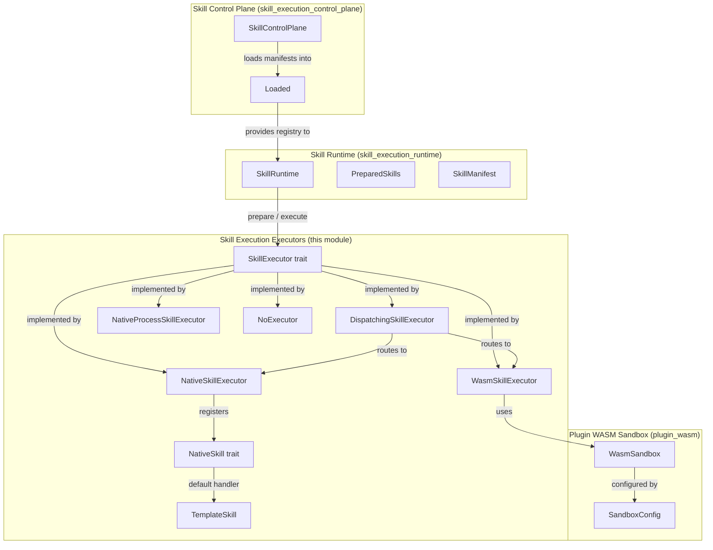
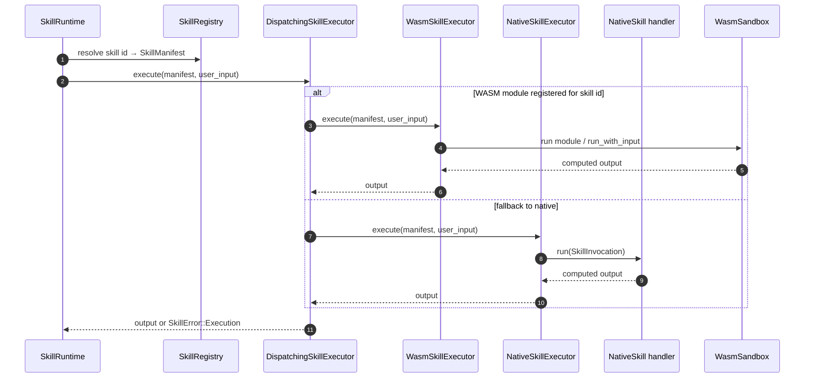
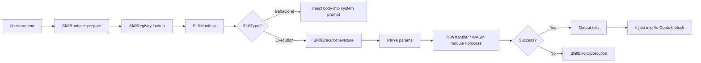
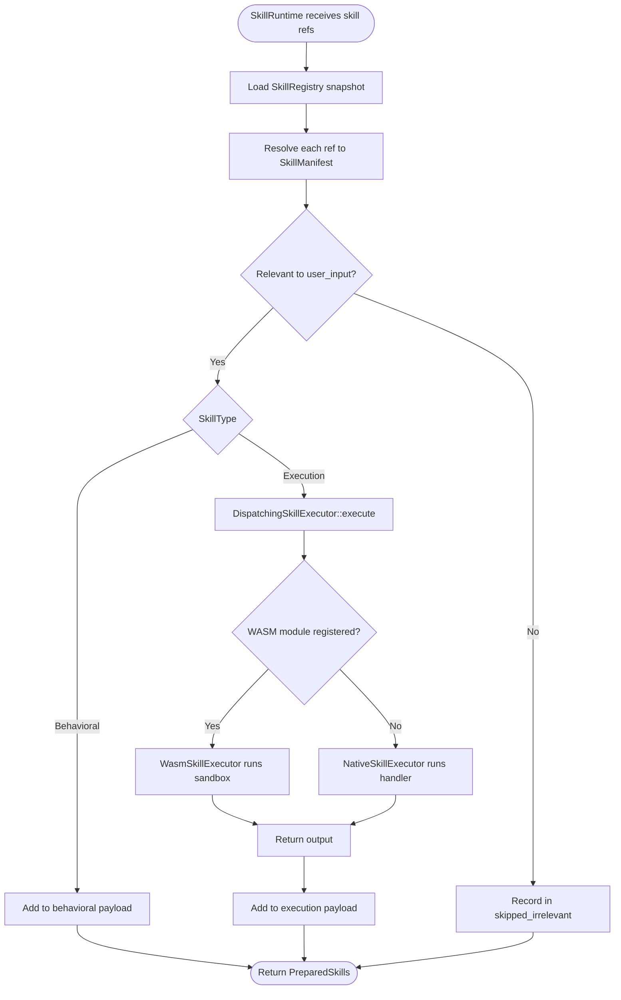
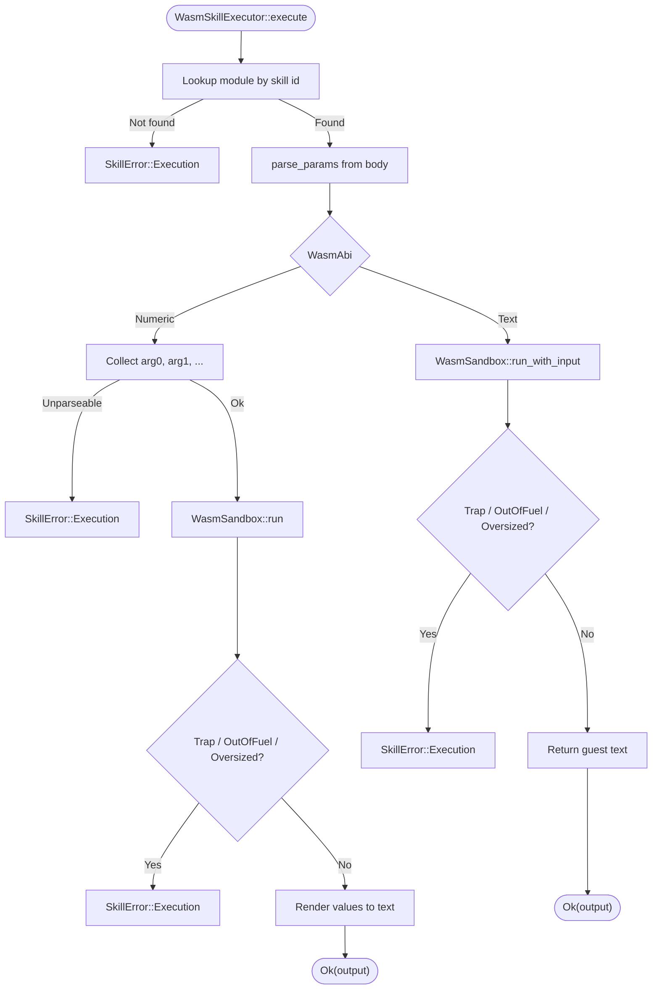
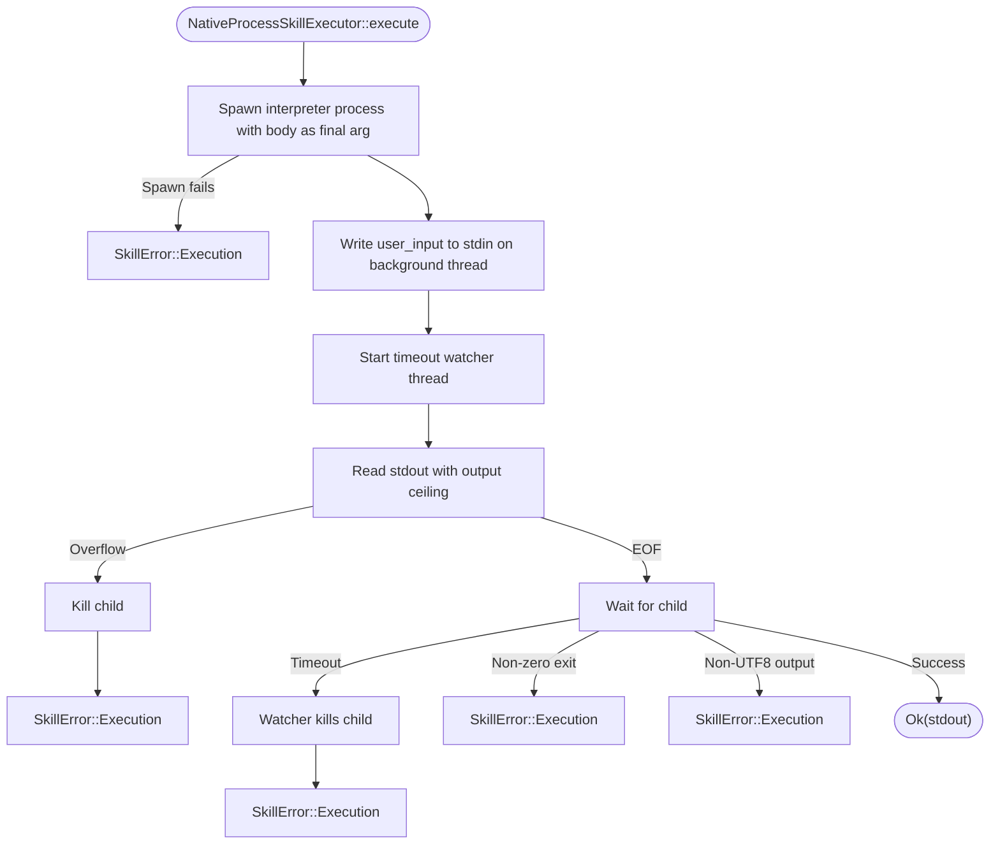
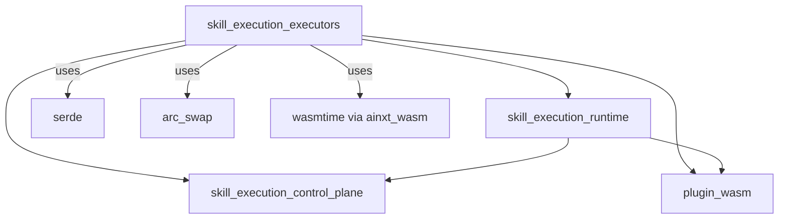

# Skill Execution Executors

The **skill execution executors** module provides the concrete runtime implementations that run *execution* skills — code-bearing skills whose output is injected into the `## Context` block of a turn. It sits at the bottom of the [skill execution](skill_execution_runtime.md) stack: the [SkillRuntime](skill_execution_runtime.md) decides *which* skills to run and *where* their output goes, while the executors in this module decide *how* the code actually runs and enforce the isolation, resource, and failure policies around that execution.

This module is part of the broader [application runtime](../MODULE_TREE.md#application_runtime) subsystem and is the execution half of the [skill execution](skill_execution_runtime.md) domain. It complements the [skill execution control plane](skill_execution_control_plane.md), which loads and pins skill manifests from git-native configuration.

---

## Purpose and Core Functionality

Skills come in two kinds (see [skill execution runtime](skill_execution_runtime.md)):

- **Behavioral skills** are plain-text SOPs injected into the system prompt. They do not run code and are handled entirely by the runtime layer above this module.
- **Execution skills** contain code that must run before the model call and produce text that is injected into `## Context`. This module is responsible for running that code safely.

The module exposes a single trait seam — [`SkillExecutor`](#skillexecutor) — and several implementations that trade off capability, isolation, and trust:

| Executor | Isolation | Use Case |
|----------|-----------|----------|
| [`NativeSkillExecutor`](#nativeskillexecutor) | In-process Rust handler | Trusted, compiled-in skills (e.g., templating, deterministic computation) |
| [`WasmSkillExecutor`](#wasmkillexecutor) | WebAssembly sandbox (`ainxt_wasm`) | Untrusted or third-party skills with zero ambient authority |
| [`NativeProcessSkillExecutor`](#nativeprocessskillexecutor) | Separate OS process | Arbitrary shell/Python snippets without recompiling the runtime |
| [`DispatchingSkillExecutor`](#dispatchingskillexecutor) | Router | Production wiring that chooses WASM when available, native otherwise |
| [`NoExecutor`](#noexecutor) | N/A | Fail-closed placeholder for surfaces that only allow behavioral skills |

All executors share the same failure posture: **fail closed**. An unregistered skill, a runtime error, an oversized output, a panic, a trap, or a non-zero exit status surfaces as a [`SkillError::Execution`](skill_execution_runtime.md#skillerror) rather than silently injecting empty or truncated context.

---

## Architecture



### Component Interaction



---

## Core Components

### `SkillExecutor`

The trait seam that abstracts over every execution backend. It is `Send + Sync` so that a single [`SkillRuntime`](skill_execution_runtime.md) can hold an executor behind a trait object and call it from async/multi-threaded serving contexts.

```rust
pub trait SkillExecutor: Send + Sync {
    fn execute(&self, skill: &SkillManifest, user_input: &str) -> Result<String, SkillError>;
}
```

The runtime never runs code directly; it always calls through this seam. New isolation backends can be added without changing [`SkillRuntime::prepare`](skill_execution_runtime.md#skillruntime).

### `NativeSkillExecutor`

Runs trusted, compiled-in Rust handlers in-process. It is the production default for built-in skills.

Key properties:

- **Handler registry**: maps skill id → `Arc<dyn NativeSkill>`.
- **Panic isolation**: a handler that panics is caught with `catch_unwind` and reported as a [`SkillError::Execution`](skill_execution_runtime.md#skillerror); it cannot crash the turn.
- **Output ceiling**: refuses outputs larger than `DEFAULT_MAX_SKILL_OUTPUT_BYTES` (64 KiB by default, configurable).
- **Fail closed**: unregistered skill ids produce an explicit error rather than empty context.

The executor parses `key = value` lines from the manifest `body` into a `BTreeMap<String, String>` and constructs a [`SkillInvocation`](#skillinvocation) containing the skill id, user input, manifest body, and parsed params. Handlers receive this deterministic input bundle and return a `String`.

#### `NativeSkill` and `TemplateSkill`

`NativeSkill` is the per-handler trait:

```rust
pub trait NativeSkill: Send + Sync {
    fn run(&self, inv: &SkillInvocation<'_>) -> Result<String, String>;
}
```

`TemplateSkill` is the canonical built-in handler. It renders the manifest body as a template, substituting `{input}` with the user's turn and `{key}` with params. Undefined placeholders are a hard error; `{{` and `}}` escape literal braces.

### `WasmSkillExecutor`

Runs execution skills as WebAssembly modules inside the [`ainxt_wasm::WasmSandbox`](plugin_wasm.md). This is the isolation tier for untrusted or third-party skills.

Key properties:

- **Zero ambient authority**: modules are instantiated with an empty import set, so they have no network, filesystem, clock, or host calls unless explicitly granted.
- **Resource capped**: fuel-metered execution, bounded linear memory, and bounded output size.
- **Two ABIs**:
  - **Numeric ABI**: inputs come from contiguous `arg0`, `arg1`, … params in the manifest body; the guest returns numeric values that are rendered into text.
  - **Text ABI**: the user-turn text is passed to the guest through its own linear memory (`alloc` + `(ptr,len) -> (out_ptr,out_len)`), and the guest returns UTF-8 text directly.
- **Fail closed**: unregistered modules, guest traps, fuel exhaustion, and oversized outputs all surface as [`SkillError::Execution`](skill_execution_runtime.md#skillerror).

See [plugin_wasm.md](plugin_wasm.md) for details on the underlying sandbox configuration and `Value` types.

### `DispatchingSkillExecutor`

The production router that lets a single [`SkillRuntime`](skill_execution_runtime.md) use both native and sandboxed skills transparently:

- If a WASM module is registered for the skill id, the call goes to [`WasmSkillExecutor`](#wasmkillexecutor).
- Otherwise, it falls back to [`NativeSkillExecutor`](#nativeskillexecutor).

This is the executor returned by [`SkillRuntime::with_builtins_and_wasm`](skill_execution_runtime.md#skillruntime), which is the served composition root's production wiring. It makes sandboxed skills reachable without breaking existing built-in native skills.

### `NativeProcessSkillExecutor`

Runs a skill's manifest `body` as literal source for a separate OS process (e.g., `/bin/sh -c <body>` or `python3 -c <body>`). It is the native-process tier of the isolation-host seam.

Key properties:

- **Cleared environment**: the child inherits no ambient env vars except an explicit allow-list plus `PATH` (so host secrets do not leak in).
- **Disposable working directory**: a fresh empty temp dir per invocation, removed afterwards.
- **Hard wall-clock timeout**: a watcher thread kills the child if it exceeds the budget.
- **Output-size ceiling**: kills the child and fails closed if captured stdout exceeds the cap.
- **Fail-closed process semantics**: non-zero exit, spawn failure, or non-UTF-8 output is an error.

> **Honest scope**: this executor does **not** provide container-grade isolation (no network namespace, cgroups, or syscall filters). It is the immediately usable tier that requires no extra infrastructure. A deployment needing stronger isolation should wrap the interpreter in a container runtime outside this crate.

> **Composition-root note**: as documented in the source, `NativeProcessSkillExecutor` is intentionally **not** wired into the served composition root (`ainxt-runtimed::build_skill_runtime`). No existing `SkillManifest`, `SkillType`, or `definition.md` convention declares a "run my body as literal shell/Python" mode; every `Execution`-type skill falls back to `NativeSkillExecutor`, whose contract treats `body` as parameters, not source. Wiring it in would require inventing a new skill category and interpreter policy with no current caller.

### `NoExecutor`

A placeholder implementation that refuses every execution skill. It is useful when a surface offers only behavioral skills, so an accidental execution ref fails closed rather than silently producing nothing.

---

## Data Flow



### Execution Skill Input/Output Contract

For every execution skill, the executor receives:

- `skill: &SkillManifest` — the resolved manifest, including `id`, `skill_type`, `description`, and `body`.
- `user_input: &str` — the user's turn text.

It must return either:

- `Ok(String)` — the text to inject under `### <skill_id>` inside the `## Context` block.
- `Err(SkillError::Execution { skill, message })` — a hard failure that surfaces to the caller.

The input contract is intentionally deterministic: no clock, no RNG, no ambient I/O is passed to native handlers, making execution-skill output replayable for forensic reproducibility.

---

## Process Flows

### Running a Built-in Native Skill



### Sandboxed WASM Execution



### Native Process Execution



---

## Dependencies



### Internal Dependencies

- **[skill_execution_runtime](skill_execution_runtime.md)**: owns the `SkillRuntime`, `SkillRegistry`, `SkillManifest`, `PreparedSkills`, and `SkillError` types. The executors consume these types and are plugged into `SkillRuntime`.
- **[skill_execution_control_plane](skill_execution_control_plane.md)**: loads git-native skill manifests and produces a `Loaded` registry that `SkillRuntime` uses. The executors do not interact with it directly.
- **[plugin_wasm](plugin_wasm.md)**: provides `WasmSandbox`, `SandboxConfig`, and `Value` for the `WasmSkillExecutor`.

### External Dependencies

- `serde` — serialization of `SkillManifest` and `SkillType`.
- `arc_swap` — used by `SkillRuntime` for lock-free hot reloads of the registry.
- `wasmtime` — underlying WebAssembly engine, accessed through `ainxt_wasm`.

---

## How It Fits into the Overall System

The skill execution executors are the lowest layer of the [skill execution](skill_execution_runtime.md) stack within [application_runtime](../MODULE_TREE.md#application_runtime). Their role is to make the "execution" kind of skill safe and usable in production.

At a high level, a turn flows as follows:

1. The [conversation / surface layer](surface_conversation.md) receives a user turn.
2. The [runtime engine](runtime_engine.md) or [chat surface](surface_conversation.md) asks [`SkillRuntime`](skill_execution_runtime.md) to prepare skills for the turn.
3. `SkillRuntime` loads a consistent snapshot of the [`SkillRegistry`](skill_execution_runtime.md) (hot-reloadable via [arc_swap](skill_execution_control_plane.md)) and resolves each skill ref.
4. For **behavioral** skills, the body is added to the system prompt.
5. For **execution** skills, `SkillRuntime` calls the configured `SkillExecutor` implementation from this module.
6. The executor runs the skill code (native handler, WASM guest, or OS process) and returns output or a hard error.
7. `SkillRuntime` assembles the final prompt: **persona → behavioral skills → guard prompts → `## Context` (execution outputs + retrieval) → history → user turn**.

The executors therefore bridge the declarative skill configuration (loaded by the control plane) and the actual computed context that grounds a model turn. They are critical to the platform's ability to safely extend model behavior with custom code without compromising turn stability or host security.

---

## Configuration and Usage

### Creating a Native-Only Runtime

```rust
use ainxt_skill::{SkillRuntime, NativeSkillExecutor, builtin};

let mut exec = NativeSkillExecutor::new();
builtin::register_handlers(&mut exec);
let runtime = SkillRuntime::new(registry, Box::new(exec));
```

### Creating a Runtime with Both Native and WASM Skills

```rust
use ainxt_skill::{SkillRuntime, WasmSkillExecutor, DispatchingSkillExecutor, NativeSkillExecutor, builtin};

let mut native = NativeSkillExecutor::new();
builtin::register_handlers(&mut native);

let wasm = WasmSkillExecutor::with_defaults()?;
// ... register WASM modules ...

let runtime = SkillRuntime::with_builtins_and_wasm(wasm);
// or manually:
let runtime = SkillRuntime::new(registry, Box::new(DispatchingSkillExecutor::new(native, wasm)));
```

### Creating a Native Process Executor

```rust
use ainxt_skill::NativeProcessSkillExecutor;

let exec = NativeProcessSkillExecutor::posix_shell()
    .with_timeout(Duration::from_secs(10))
    .with_max_output_bytes(32 * 1024)
    .with_env("API_ENDPOINT", "https://example.com");
```

---

## Testing and Guarantees

The module's test suite exercises the following guarantees:

- **Type separation**: behavioral and execution skills are separated into different injection payloads in ref order.
- **Hard errors on missing refs**: `SkillError::NotFound` is returned for unregistered skill ids.
- **Execution failure surfacing**: `NoExecutor` and unregistered handlers fail closed.
- **Panic isolation**: a panicking native handler is caught and reported.
- **Output ceilings**: oversized outputs are rejected.
- **Template correctness**: `TemplateSkill` substitutes `{input}` and params, rejects undefined placeholders, and handles escaped braces.
- **WASM sandboxing**: guest code computes real values, infinite loops are trapped by fuel, ungranted imports are denied, and unparseable args are hard errors.
- **Process sandboxing**: real processes run and capture stdout, stdin reaches the child, hanging processes are killed, output ceilings are enforced, ambient env vars are cleared, and non-zero exits are errors.
- **Relevance filtering**: described skills are skipped when irrelevant, and undescribed skills remain unconditionally relevant for backward compatibility.

---

## See Also

- [skill_execution_runtime.md](skill_execution_runtime.md) — skill registry, runtime, and prompt assembly.
- [skill_execution_control_plane.md](skill_execution_control_plane.md) — git-native loading and pinning of skill manifests.
- [plugin_wasm.md](plugin_wasm.md) — WebAssembly sandbox used by `WasmSkillExecutor`.
- [surface_conversation.md](surface_conversation.md) — chat surfaces that consume prepared skills.
- [runtime_engine.md](runtime_engine.md) — the engine that orchestrates turns and surfaces.
