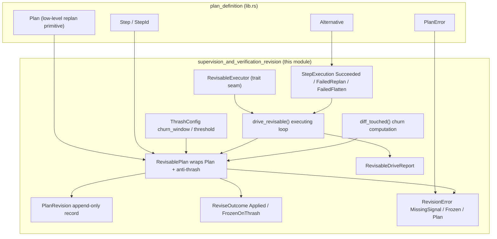
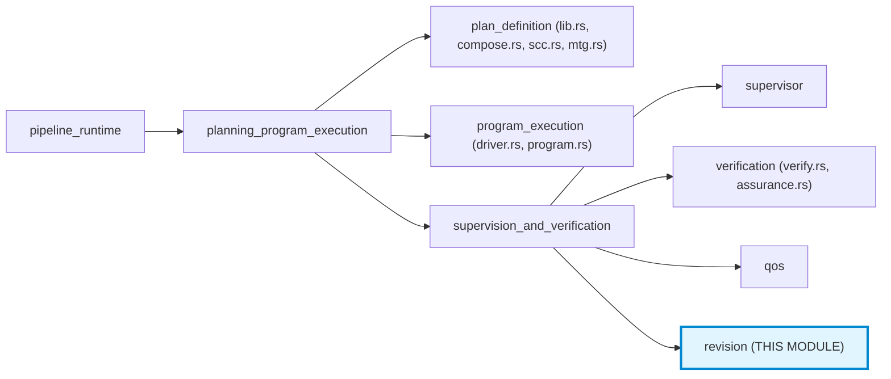
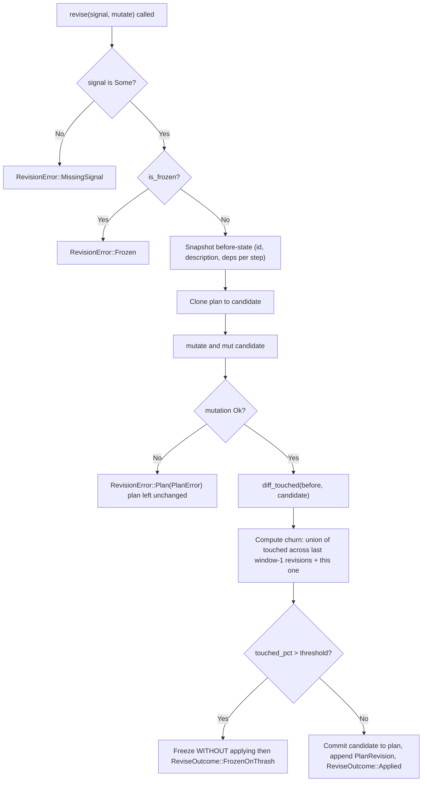
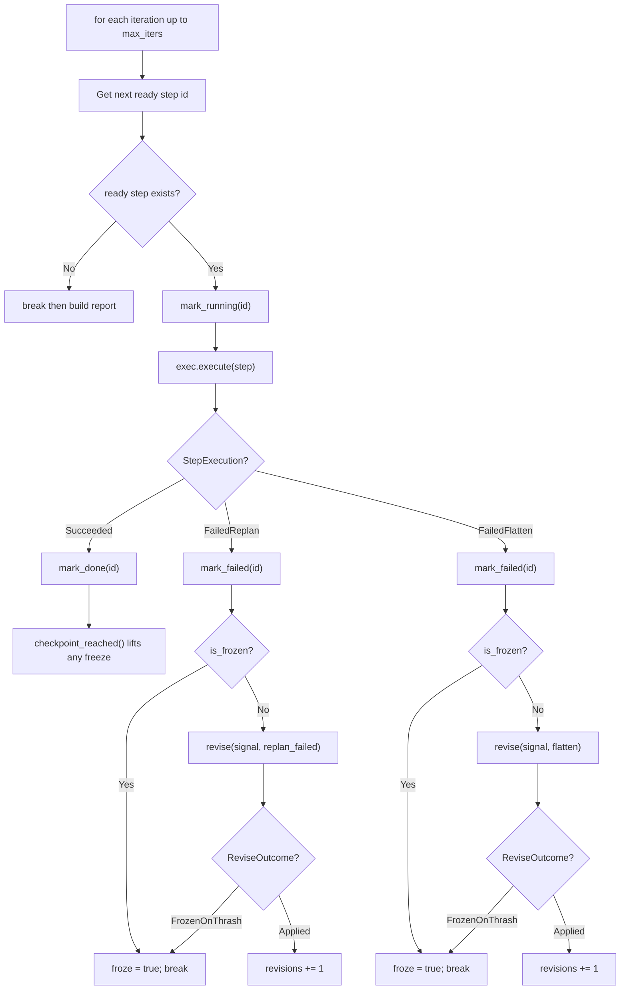
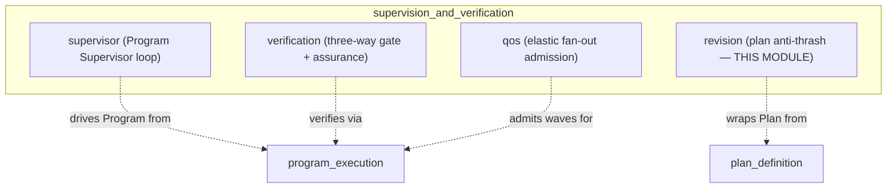

# Supervision & Verification — Revision (Plan Anti-Thrash)

> **Source file:** `crates/ainxt-planner/src/revision.rs`
> **Parent module:** [Supervision & Verification](supervision_and_verification.md) → [Planning & Program Execution](planning_program_execution.md) → [Pipeline Runtime](pipeline_runtime.md)
> **Design reference:** `docs/architecture/LOOP_AND_AGENT_TEAMS.md` §9 (plan stability / anti-thrash) and §6 (the *thrash* detector)

---

## 1. Purpose

The **Revision** module is the **plan anti-thrash** layer of the long-horizon planning subsystem. It wraps the low-level [`Plan`](plan_definition.md#plan) type with three stability disciplines mandated by the design's §9, ensuring that an executing plan cannot silently reshuffle itself into an unbounded stream of micro-edits when steps fail:

| Discipline | What it enforces |
|---|---|
| **Change-justification** | Every structural mutation must carry a triggering *signal* (which critic finding / judge gap / new context caused it). A signal-less mutation is rejected at the API boundary. |
| **Append-only revision history** | Every accepted mutation appends a `PlanRevision` record — never an in-place overwrite — so a run's full planning history is replayable. |
| **Freeze-on-thrash cooldown** | When structural churn across the last `churn_window` revisions exceeds `churn_threshold_pct`, plan mutation is **frozen** until a natural checkpoint is reached, forcing one deliberate, consolidated re-plan instead of a stream of micro-edits. |

The module is **pure and deterministic**: no clock, no randomness, no I/O. Every guarantee is a property a unit test asserts on concrete values.

---

## 2. Architecture Overview

### Module hierarchy context

---

## 3. Core Components

### 3.1 `ThrashConfig`

Tunable configuration for the thrash detector (§9).

| Field | Type | Default | Description |
|---|---|---|---|
| `churn_window` | `usize` | `3` (`DEFAULT_CHURN_WINDOW`) | Number of consecutive revisions the thrash detector looks back over. |
| `churn_threshold_pct` | `u32` | `40` (`DEFAULT_CHURN_THRESHOLD_PCT`) | Percentage of tasks touched across the window that triggers a freeze (§9: ">40% of tasks touched across 3 re-plans"). |

> **Note:** Defaults are illustrative; the ADR notes real workloads differ and tuning is expected per program.

---

### 3.2 `PlanRevision`

One append-only plan revision record (§9 plan persistence — never overwritten in place).

| Field | Type | Description |
|---|---|---|
| `revision` | `u32` | 0-based revision number (0 = the baseline snapshot). |
| `signal` | `String` | The triggering signal that justified this change (§9 change-justification). The baseline's is a synthetic `"baseline"`. |
| `touched` | `BTreeSet<StepId>` | The step ids this revision added/removed/changed relative to the prior revision. |
| `step_ids` | `Vec<StepId>` | Snapshot of the plan's step ids at this revision (for replay / churn accounting). |

---

### 3.3 `RevisablePlan`

The central type — a [`Plan`](plan_definition.md#plan) with the §9 anti-thrash disciplines layered on. It **wraps** rather than replaces the plan, so the low-level primitives stay available; every *structural mutation* goes through [`revise()`](#34-revise).

**Internal state:**

| Field | Type | Description |
|---|---|---|
| `plan` | `Plan` | The wrapped low-level plan. |
| `revisions` | `Vec<PlanRevision>` | The append-only revision history (starts with baseline revision 0). |
| `frozen` | `bool` | Whether the plan is currently in a thrash cooldown. |
| `config` | `ThrashConfig` | The thrash detector's tunable parameters. |

**Key methods:**

| Method | Description |
|---|---|
| `new(plan, config)` | Wrap a plan, recording its current shape as the baseline revision 0. |
| `plan()` | Read-only access to the wrapped plan. |
| `mark_running(id)` / `mark_done(id)` / `mark_failed(id)` | **Execution-state transitions** — these are *progress*, not structural mutations, so they bypass `revise()` and delegate straight to the wrapped plan (§9 distinguishes structural churn from ordinary progress). |
| `revisions()` | The append-only revision history. |
| `is_frozen()` | True iff the plan is currently frozen for a thrash cooldown. |
| `checkpoint_reached()` | Signal that the current plan reached its next natural checkpoint (task completion or hard failure), lifting a thrash freeze so one deliberate, consolidated re-plan is allowed. |
| `revise(signal, mutate)` | Apply a plan mutation under the §9 disciplines (see below). |

#### 3.4 `revise()`

The governed mutation entrypoint. The full discipline:

**Critical properties:**
- A failing mutation is a **no-op** — `mutate` runs against a clone, so the plan is left untouched.
- A thrashing mutation is **rolled back** — the freeze fires *without* applying the mutation, so no micro-edit is recorded.
- Churn is computed as the **union** of touched step ids across the last `churn_window` revisions *plus* the proposed one, divided by the larger of the candidate/before step counts.

---

### 3.5 `ReviseOutcome` & `RevisionError`

**`ReviseOutcome`** — the result of a `revise()` call:

| Variant | Description |
|---|---|
| `Applied { revision }` | The mutation was applied and recorded as a new revision. |
| `FrozenOnThrash { touched_pct, window }` | The mutation would push churn over the threshold: it was **not applied**, and the plan is now frozen until a checkpoint. |

**`RevisionError`** — why a revision was rejected:

| Variant | Description |
|---|---|
| `MissingSignal` | No triggering signal was supplied (§9 change-justification — rejected at the API boundary). |
| `Frozen` | The plan is frozen for a thrash cooldown; a checkpoint must be reached first. |
| `Plan(PlanError)` | The underlying plan mutation failed (cycle / dangling dep / budget / …). Plan left unchanged. |

---

### 3.6 Executing Loop: `StepExecution`, `RevisableExecutor`, `drive_revisable()`

The module also provides the **executing loop** that *drives* the anti-thrash detector — closing the gap where `RevisablePlan` existed but nothing exercised it during a running plan.

**`StepExecution`** — what the executing loop's step seam reports for one attempt:

| Variant | Description |
|---|---|
| `Succeeded` | The step's work succeeded. |
| `FailedReplan { signal, alternative }` | The step failed; the loop must re-plan it with `alternative`, justified by `signal`. |
| `FailedFlatten { signal }` | The failure revealed that a materialized graph's independence assumption was wrong (LOOP §3). The loop flattens the plan back to a sequential list through the *same* `revise()` disciplines. |

**`RevisableExecutor`** (trait) — the executing-loop step seam. The parent backs this with a real base-loop Run; the loop wraps every re-plan in the anti-thrash disciplines so plan churn is governed *as it executes*.

**`drive_revisable(rp, exec, max_iters)`** — the loop function:

**`RevisableDriveReport`** — the terminal report:

| Field | Type | Description |
|---|---|---|
| `completed` | `bool` | Every step reached `Done`. |
| `froze` | `bool` | The thrash detector froze the plan mid-execution (§9). |
| `revisions` | `usize` | How many re-plans were applied (each an append-only `PlanRevision`) before termination. |

---

### 3.7 `diff_touched()` (internal)

Computes the set of step ids that were **added, removed, or had their description/deps changed** between a `before` snapshot and a candidate plan — the §9 churn unit. This is the primitive the churn accounting in `revise()` uses.

---

## 4. Relationship to Sibling Modules

This module is one of four sub-modules under [Supervision & Verification](supervision_and_verification.md):

| Sibling | Relationship |
|---|---|
| [**supervisor**](supervision_and_verification_supervisor.md) | The Program Supervisor drives the LONG_HORIZON-era `Program`/`NodeDecl` graph (event-sourced, durable). This module wraps the LOOP-era `Plan`/`Step` graph — a structurally different type. See [§6 Current Status](#6-current-status--gap-audit) below. |
| [**verification**](supervision_and_verification_verification.md) | The three-way gate (deterministic + adversarial + Judge) that proves a module "done." This module's `RevisableExecutor` seam is where a real base-loop Run (backed by the verification gate) would plug in. |
| [**qos**](supervision_and_verification_qos.md) | Elastic fan-out admission for GPU-fleet capacity. Operates at the Program level; this module operates at the Plan level. |

---

## 5. Data Flow

The end-to-end flow of a governed re-plan during execution:

```mermaid
sequenceDiagram
    participant LoopActor as drive_revisable()
    participant RP as RevisablePlan
    participant Exec as RevisableExecutor
    participant Plan as Plan (wrapped)

    LoopActor->>RP: ready_step_ids()
    RP->>Plan: ready_steps()
    Plan-->>RP: step_id
    RP-->>LoopActor: Some(id)

    LoopActor->>RP: mark_running(id)
    RP->>Plan: mark_running(id)

    LoopActor->>Exec: execute(step)
    Exec-->>LoopActor: FailedReplan signal alternative

    LoopActor->>RP: mark_failed(id)
    RP->>Plan: mark_failed(id)

    LoopActor->>RP: revise(Some(signal), replan_failed)
    Note over RP: 1. Check signal present
    Note over RP: 2. Check not frozen
    Note over RP: 3. Clone plan to candidate
    Note over RP: 4. Apply mutation to candidate
    Note over RP: 5. diff_touched(before, candidate)
    Note over RP: 6. Compute churn over window
    alt churn leq threshold
        RP->>Plan: Commit candidate
        Note over RP: Append PlanRevision
        RP-->>LoopActor: ReviseOutcome::Applied revision
    else churn gt threshold
        Note over RP: Freeze WITHOUT applying
        RP-->>LoopActor: ReviseOutcome::FrozenOnThrash
        LoopActor->>LoopActor: froze = true&#59; break
    end
```

---

## 6. Current Status — Gap Audit

> **`gap6-planner-assurance-revision` (item 2) — re-audited, no real caller to wire into**

This module was **built ahead of a caller that does not exist yet**. The key distinction:

| Concept | This module wraps | Served daemon drives |
|---|---|---|
| **Type** | `Plan` / `Step` / `Alternative` (LOOP-era) | `Program` / `NodeDecl` (LONG_HORIZON-era, ADR-027) |
| **Graph** | In-memory `Step` list with `replan_failed` | Event-sourced `ProgramState` with durable poison-node quarantine |
| **Retry mechanism** | `Plan::replan_failed` → `ReplanOutcome::Escalated` | `VERIFY_ATTEMPT_CAP` + durable poison-node quarantine (bounded attempts on a FIXED node) |
| **Structural edit?** | Yes — add/remove/reorder steps | No — bounded attempts on a fixed node, never a Plan-shaped structural edit |

A workspace-wide search confirms `crate::Plan` (and therefore `RevisablePlan`, which only wraps it) has **zero references** outside this crate:
- **Not in `ainxt-teams`** — whose `TaskGraph`/`Task` never restructures itself mid-run; a tier-3 `JudgeOutcome::Gap` re-runs the *same* task set for another round, never adding or removing a `Task`.
- **Not in `ainxt-workforce`** — no `Plan`/`replan`/`thrash`/`churn` concept exists there at all.

The **one** non-test, non-`revision.rs` caller of `Plan::replan_failed` is `driver.rs`'s `confirm_node_escalation_via_plan_lifecycle` — a narrow, synthetic helper that builds a throwaway single-step `Plan` purely to reuse the escalation state machine's `Escalated` outcome for a `Program` node's poison-quarantine decision. It is discarded immediately after, never becomes a `RevisablePlan`, never calls `revise()`, and carries no anti-thrash concept.

**Conclusion:** No code change is the honest fix here. Wiring a fabricated caller into `RevisablePlan` merely to close this out would be the same "declared reachable, not actually reachable" gap this audit series exists to catch. **The day a real Plan-shaped (add/remove/reorder-step) replanning loop is built on the served path, this module is exactly what should gate it.**

---

## 7. Invariants (each has a test that fails if the logic is gutted)

| # | Invariant | Test |
|---|---|---|
| 1 | A mutation without a signal is rejected at the API boundary; the plan is untouched and no revision is recorded. | `gap_loop_10_mutation_without_a_signal_is_rejected` |
| 2 | Revisions are append-only, each carrying its triggering signal and the structurally-touched step ids. | `gap_loop_10_revisions_are_append_only_with_their_signal` |
| 3 | Excessive churn (> threshold % across the window) freezes the plan; the thrashing mutation is NOT applied; further mutations are rejected until a checkpoint; after the checkpoint, one consolidated re-plan is allowed. | `gap_loop_10_excessive_churn_freezes_the_plan_until_a_checkpoint` |
| 4 | A failing mutation is a no-op: the plan is left unchanged, no revision is recorded, and the plan is not frozen. | `gap_loop_10_a_failing_mutation_is_a_noop_and_records_no_revision` |

---

## 8. Design Decisions

### Why wrap rather than replace `Plan`?

`RevisablePlan` wraps `Plan` so the low-level primitives (`mark_running`, `mark_done`, `mark_failed`, `replan_failed`, `flatten`, `materialize_graph`) stay available. Only *structural mutations* (re-plans, flattens) go through `revise()`; execution-state transitions are **progress, not re-plans** and bypass the anti-thrash gate entirely (§9 distinguishes structural churn from ordinary progress).

### Why clone-then-apply?

`revise()` applies the mutation against a **clone** of the plan, so a failing mutation (cycle, dangling dep, budget exceeded) leaves the plan untouched — it is a no-op, not a partial edit. Only if the mutation succeeds *and* churn is within bounds is the candidate committed.

### Why freeze without applying?

When churn crosses the threshold, the thrashing mutation is **not applied** — the plan is frozen in its pre-mutation state. This forces the runtime to execute the current plan to its next natural checkpoint (a task completion or hard failure) before one deliberate, consolidated re-plan is allowed. This replaces a stream of micro-edits with a single considered one.

### Why is `FailedFlatten` a governed mutation?

LOOP §3 allows the Planner to flatten a materialized graph back to a sequential list mid-run when a failure reveals the independence assumption was wrong. This module routes that flatten through the **same** `revise()` seam as an ordinary re-plan, so the flatten is itself justified, append-only recorded, and subject to the freeze-on-thrash cooldown — never a silent structural bypass of §9.

---

## 9. References

| Reference | Description |
|---|---|
| [plan_definition](plan_definition.md) | The `Plan`, `Step`, `StepId`, `Alternative`, `PlanError`, `PlanConfig` types this module wraps. |
| [supervision_and_verification](supervision_and_verification.md) | Parent module overview. |
| [supervision_and_verification_supervisor](supervision_and_verification_supervisor.md) | The Program Supervisor loop that drives the LONG_HORIZON-era `Program` graph. |
| [supervision_and_verification_verification](supervision_and_verification_verification.md) | The three-way verification gate (deterministic + adversarial + Judge). |
| [supervision_and_verification_qos](supervision_and_verification_qos.md) | Elastic fan-out admission for GPU-fleet capacity. |
| [program_execution](program_execution.md) | The `Program`/`NodeDecl` durable, event-sourced aggregate and its driver. |
| `docs/architecture/LOOP_AND_AGENT_TEAMS.md` §9, §6 | Design reference for plan stability / anti-thrash and the thrash detector. |
| `docs/architecture/LONG_HORIZON_PROGRAMS.md` (ADR-027) | The LONG_HORIZON-era Program subsystem design. |
