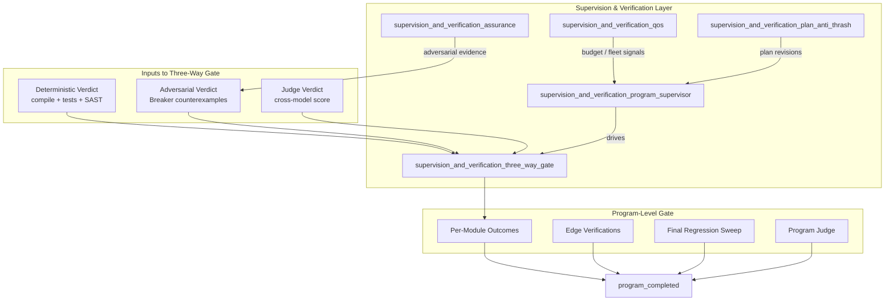
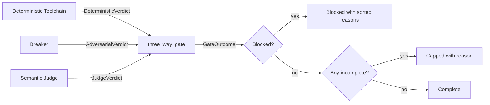
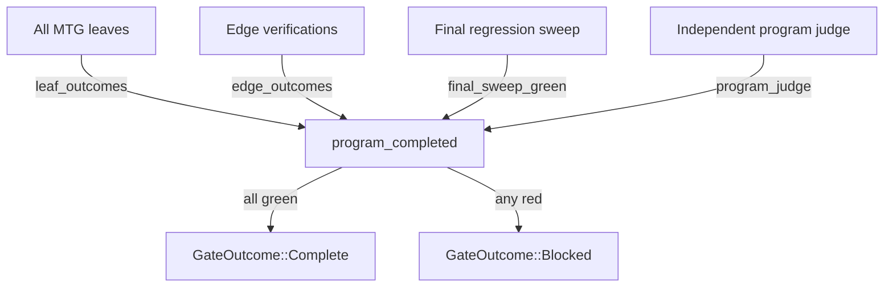
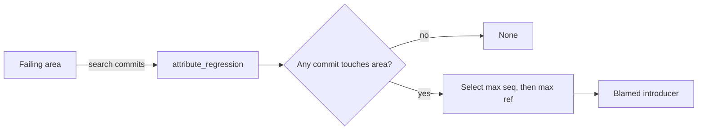

# Supervision and Verification — Three-Way Gate

The **three-way gate** is the pure-logic completion verifier for long-horizon programs. It implements the "never done until proven" rule from ADR-027 (`docs/architecture/LONG_HORIZON_PROGRAMS.md` §6) and `docs/architecture/LOOP_AND_AGENT_TEAMS.md` §7: a module, an edge, or an entire program is **never** marked complete on a self-report. Instead, completion is proven compositionally by three independent, non-substitutable verdicts.

This module lives inside the planner's supervision and verification layer. It consumes verdicts produced by the deterministic toolchain, the adversarial breaker, and the semantic judge, and emits a single honest [`GateOutcome`](supervision_and_verification_three_way_gate.md#gateoutcome). It also provides regression attribution and the program-level `COMPLETED` gate.

---

## Core Purpose

- **Prove completion, don't assume it.** Every gate returns `Complete`, `Capped`, or `Blocked`. There is no silent default to `Complete`.
- **Three independent proofs.** Deterministic, adversarial, and semantic judge axes are combined with hard-block semantics.
- **Cross-model judging.** A same-model producer/judge pairing is rejected structurally to prevent systematic blind spots.
- **Attribution.** Program-scale regressions are attributed to the latest commit that touched the failing area, not the original author.

---

## Architecture

The three-way gate is **stateless pure logic**. It does not run tests, break things, or call models itself. Those responsibilities live in sibling modules and in the pipeline orchestration layer; see [pipeline_stages_and_tools](pipeline_stages_and_tools.md), [pipeline_stages_and_tools_sast](pipeline_stages_and_tools_sast.md), [pipeline_stages_and_tools_breaker](pipeline_stages_and_tools_breaker.md), and [pipeline_stages_and_tools_semantic_review](pipeline_stages_and_tools_semantic_review.md).

---

## Core Components

### `GateOutcome`

The universal result type for every verification scope.

| Variant | Meaning |
|---------|---------|
| `Complete` | All proofs green and every gate ran to completion. |
| `Capped { reason }` | No blocking failure, but at least one gate could not finish (budget, timeout, etc.). Honest partial — must not be treated as `Complete`. |
| `Blocked { reasons }` | At least one hard block fired. Reasons are sorted and de-duplicated for deterministic reporting. |

### `DeterministicVerdict`

The deterministic gate verdict: compilation, tests, and static-analysis findings.

- `compiled` — did the module compile?
- `tests_passed` — did the test suite pass?
- `blocking_findings` — critical/high SAST findings. **Any** finding is a hard block regardless of judge score.
- `completed` — did the deterministic gate itself finish? Distinct from a clean failure.

### `AdversarialVerdict`

The adversarial gate verdict produced by the Breaker.

- `attempts` — number of adversarial attempts executed.
- `counterexamples` — surviving counterexamples that withstood re-verification. Any survivor blocks.
- `completed` — whether the Breaker ran to completion or was cut short.

For the Breaker implementation, see [supervision_and_verification_assurance](supervision_and_verification_assurance.md) and [pipeline_stages_and_tools_breaker](pipeline_stages_and_tools_breaker.md).

### `JudgeVerdict`

The semantic judge verdict.

- `score` — integer in `0..=100`.
- `threshold` — minimum acceptable score.
- `producer_model` — model that produced the work.
- `judge_model` — model that judged the work. Must differ from `producer_model` (§10 cross-model rule).
- `completed` — whether the judge ran to completion.

For the broader judge framework, see [quality_verification_judge](quality_verification_judge.md).

### `three_way_gate`

Combines the three independent proofs into a single `GateOutcome`.

**Precedence:**

1. Collect all blocking reasons.
2. If any reason exists → `Blocked`.
3. Else if any gate did not complete → `Capped`.
4. Else → `Complete`.

**Blocking conditions:**

- Compile failure
- Test failure
- Any SAST blocking finding
- Any surviving adversarial counterexample
- Same-model producer/judge pairing
- Judge score below threshold

### `EdgeVerification`

A per-edge integration verdict scoped to the seam between a just-committed node and an already-committed neighbor. Used by the program-level gate to ensure integration correctness across the module graph.

### `CommitRecord` and `attribute_regression`

`CommitRecord` records a committed node, its monotonic sequence number, and the set of modules it touched (its own ref plus blast radius).

`attribute_regression` finds the commit that **introduced** a regression in a failing area. It selects the commit with the highest `seq` whose `touches` cover the failing area, breaking ties by the largest ref for determinism. This ensures that a later commit (e.g., node 400) that reintroduces a regression in an early node's area is correctly blamed, not the original author (node 5).

### `ProgramCompletionInput` and `program_completed`

The program-level `COMPLETED` gate. A program is `Complete` only when all four clauses hold:

1. Every MTG leaf is present with a `Complete` per-module outcome.
2. Every edge integration is `Complete`.
3. The final regression sweep is green.
4. The independent program-level judge passes (cross-model + at/above threshold + completed).

If any clause fails, the result is `Blocked` with every failing reason enumerated. The Program layer maps this to `CAPPED_PARTIAL`.

---

## Data Flow

### Per-Module Three-Way Gate

### Program Completion Gate

### Regression Attribution

---

## Component Interactions

| Component | Produces | Consumed By | Related Module |
|-----------|----------|-------------|----------------|
| `DeterministicVerdict` | compile/test/SAST result | `three_way_gate` | [pipeline_stages_and_tools_sast](pipeline_stages_and_tools_sast.md), [edit_semantic_edit_engine](edit_semantic_edit_engine.md) |
| `AdversarialVerdict` | breaker counterexamples | `three_way_gate` | [supervision_and_verification_assurance](supervision_and_verification_assurance.md), [pipeline_stages_and_tools_breaker](pipeline_stages_and_tools_breaker.md) |
| `JudgeVerdict` | cross-model score | `three_way_gate`, `program_completed` | [quality_verification_judge](quality_verification_judge.md) |
| `EdgeVerification` | per-edge outcome | `program_completed` | [plan_definition_composition](plan_definition_composition.md) |
| `CommitRecord` | commit touch metadata | `attribute_regression` | [plan_definition_lifecycle](plan_definition_lifecycle.md) |

---

## Dependencies

The three-way gate depends on:

- [`ModuleRef`](plan_definition_mtg.md) from the module graph / MTG subsystem.
- Verdicts produced by the deterministic toolchain, adversarial breaker, and semantic judge.
- The supervisor to drive gate execution across modules and edges.

It is used by:

- [supervision_and_verification_program_supervisor](supervision_and_verification_program_supervisor.md) — orchestrates when gates run.
- [program_execution_driver](program_execution_driver.md) — maps `Blocked` to `CAPPED_PARTIAL` and `Complete` to program completion.
- [supervision_and_verification_plan_anti_thrash](supervision_and_verification_plan_anti_thrash.md) — revises plans when gates cap or block.

---

## Design Invariants

1. **No float scores.** All scores are integers in `0..=100` so every rule is unit-testable on concrete verdicts.
2. **SAST hard block is independent.** A perfect judge score cannot rescue a critical/high SAST finding.
3. **Cross-model judging is structural.** Same-model producer/judge is rejected regardless of score.
4. **Honest partials.** An incomplete gate yields `Capped`, never a silent `Complete`.
5. **Block precedence.** Real failures are reported even when another gate is incomplete.
6. **Deterministic reporting.** Reasons are collected in a `BTreeSet`, so they are sorted and de-duplicated.

---

## Testing Strategy

The module includes unit tests covering:

- All-green path → `Complete`.
- SAST hard block even with a perfect judge score.
- Surviving adversarial counterexample blocks.
- Same-model producer/judge rejection.
- Judge below threshold.
- Incomplete gate → `Capped` when nothing blocks.
- Block precedence over incomplete gate.
- Multiple failures sorted and de-duplicated.
- Regression attribution to latest introducer.
- Program completion requires every clause.

These tests operate on concrete verdict structs, making the gate logic fully property-testable without external services.

---

## When to Use This Module

Use the three-way gate when you need to:

- Decide whether a single module is complete after edits.
- Decide whether an integration edge between two modules is safe.
- Attribute a program-scale regression to the responsible commit.
- Decide whether an entire long-horizon program has reached `COMPLETED`.

Do **not** use this module to run tests, execute breakers, or invoke judges — it only evaluates verdicts. Drive those activities through the supervisor and pipeline stages referenced above.
