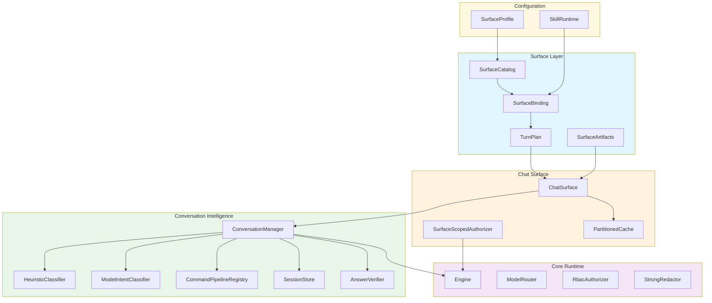
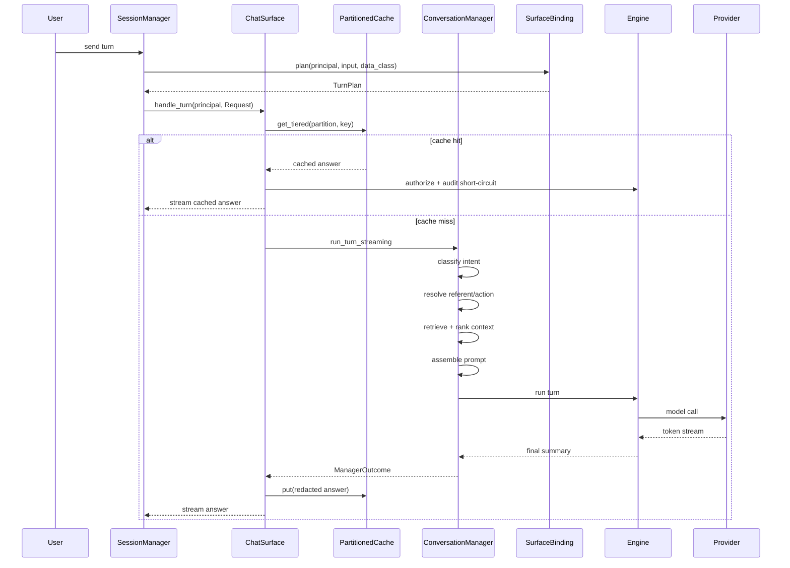
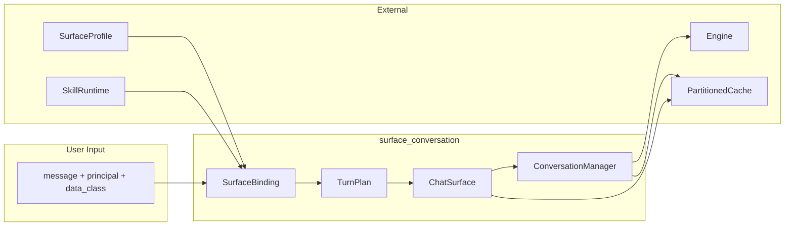

# surface_conversation Module

## Introduction

The `surface_conversation` module is the **user-facing conversation runtime** of the AiNxt platform. It sits at the boundary between declarative surface profiles and the core execution engine, assembling multi-turn chat and command interactions into grounded, audited, and policy-enforced turns. The module's responsibility is to take a resolved [`SurfaceProfile`](surface_conversation_binding.md), a caller [`Principal`](security_config.md), and a user message, and produce a complete turn plan that the runtime engine can execute safely.

The module is composed of three tightly integrated subsystems:

- **Chat Surface** ([`surface_conversation_chat`](surface_conversation_chat.md)) — the end-to-end assembled chat surface that wires retrieval, intent classification, prompt assembly, compliance redaction, caching, and streaming into a single [`TurnHandler`](core_interaction.md).
- **Conversation Intelligence** ([`surface_conversation_intelligence`](surface_conversation_intelligence.md)) — the session memory, intent cascade, referent resolution, command pipelines, and answer verification layer that sits above the engine.
- **Surface Binding** ([`surface_conversation_binding`](surface_conversation_binding.md)) — the profile-to-runtime binding that turns a declarative surface profile into a concrete [`TurnPlan`](surface_conversation_binding.md) and enforces admission, data-class ceilings, capability intersection, and autonomy policy.

## Architecture Overview

## High-Level Data Flow

A single chat turn flows through the module as follows:

## Sub-modules

### [surface_conversation_chat](surface_conversation_chat.md)

The Chat Surface is the **integration seam** that assembles everything the lower crates build in isolation into one end-to-end flow. It owns:

- [`ChatSurface`](surface_conversation_chat.md) — the assembled chat surface implementing [`TurnHandler`](core_interaction.md).
- [`SurfaceScopedAuthorizer`](surface_conversation_chat.md) — narrows tool/connector authorization to the surface's declared capability set.
- Scoping-safe, tiered response caching keyed by clearance, data class, session, and harness id.
- Streaming turn handling with cache short-circuit authorization and audit.

See [surface_conversation_chat.md](surface_conversation_chat.md) for details.

### [surface_conversation_intelligence](surface_conversation_intelligence.md)

The Conversation Intelligence layer is the "chat-done-right" brain above the engine. It owns:

- [`ConversationManager`](surface_conversation_intelligence.md) — session memory, intent cascade, retrieval, prompt assembly, and answer composition.
- [`HeuristicClassifier`](surface_conversation_intelligence.md) and [`ModelIntentClassifier`](surface_conversation_intelligence.md) — deterministic and model-backed intent classification.
- [`CommandPipelineRegistry`](surface_conversation_intelligence.md) — git-native slash-command macro expansion.
- [`AnswerVerifier`](surface_conversation_intelligence.md) — numeric re-derivation and faithfulness/conflict gates.
- Session stores ([`InMemorySessions`](surface_conversation_intelligence.md), [`PersistentSessions`](surface_conversation_intelligence.md)).

See [surface_conversation_intelligence.md](surface_conversation_intelligence.md) for details.

### [surface_conversation_binding](surface_conversation_binding.md)

The Surface Binding layer turns declarative profiles into executable plans. It owns:

- [`SurfaceBinding`](surface_conversation_binding.md) — binds a [`SurfaceProfile`](security_config.md) and [`SkillRuntime`](application_runtime.md) to plan turns.
- [`TurnPlan`](surface_conversation_binding.md) — the concrete inputs the engine needs for one turn.
- [`SurfaceCatalog`](surface_conversation_binding.md) — registry of resolved surface profiles with layered deployment/tenant overrides.
- [`SurfaceArtifacts`](surface_conversation_binding.md) — shared artifact-generation runtime for document output.

See [surface_conversation_binding.md](surface_conversation_binding.md) for details.

## Module Boundaries and Dependencies

The `surface_conversation` module depends on several other modules documented elsewhere:

| Dependency | Module | Purpose |
|------------|--------|---------|
| `ainxt_runtime::Engine` | [runtime_engine](runtime_engine.md) | Core turn execution, provider routing, compliance redaction, audit. |
| `ainxt_session::SessionManager` | [core_interaction](core_interaction.md) | Session concurrency spine that drives `ChatSurface` as a `TurnHandler`. |
| `ainxt_profile::SurfaceProfile` | [security_config](security_config.md) | Declarative surface behavior (persona, capabilities, model policy, RBAC). |
| `ainxt_skill::SkillRuntime` | [skill_execution](skill_execution.md) | Prepares behavioral/execution skills for prompt/context assembly. |
| `ainxt_context` / `ainxt_retrieval` | [knowledge_retrieval](knowledge_retrieval.md) | Grounded retrieval, ranking, and citation assembly. |
| `ainxt_prompt` | [prompt_engineering](prompt_engineering.md) | Layered prompt service and model-agnostic prompt assembly. |
| `ainxt_answer` / `ainxt_artifact` | [answer_artifact](answer_artifact.md) | Answer composition and artifact rendering. |
| `ainxt_guardrails` / `ainxt_injection` | [safety_guardrails](safety_guardrails.md) | Output-side guardrails and retrieved-content injection defense. |
| `ainxt_cache` | [core_interaction](core_interaction.md) | Partition-isolated response cache. |

## Key Design Principles

1. **Fail-closed by default** — A surface refuses a turn if the principal fails admission, the data class exceeds the surface ceiling, or a request override attempts to widen authority.
2. **Least-privilege capability intersection** — Effective authority is always `surface.offered ∩ principal.held`; the surface can never escalate a principal.
3. **Runtime owns control-flow** — Intent classifiers only recommend; the runtime decides whether to answer, clarify, generate an artifact, or execute an action.
4. **Referent resolution** — Content-consuming actions resolve the *prior answer* as content, never treat the instruction itself as content.
5. **Scoping-safe caching** — Cache partitions are isolated by data class, principal scope, and harness id; sensitive classes are never cached.
6. **Audit-and-proceed artifacts** — Document generation records compliance findings but never redacts content inside rendered artifacts.

## Mermaid: Component Interaction

## Related Documentation

- [surface_conversation_chat.md](surface_conversation_chat.md) — Chat surface assembly, scoped authorizer, and tiered caching.
- [surface_conversation_intelligence.md](surface_conversation_intelligence.md) — Conversation manager, intent classifiers, command pipelines, and answer verification.
- [surface_conversation_binding.md](surface_conversation_binding.md) — Surface binding, turn plans, catalog, and artifact generation.
