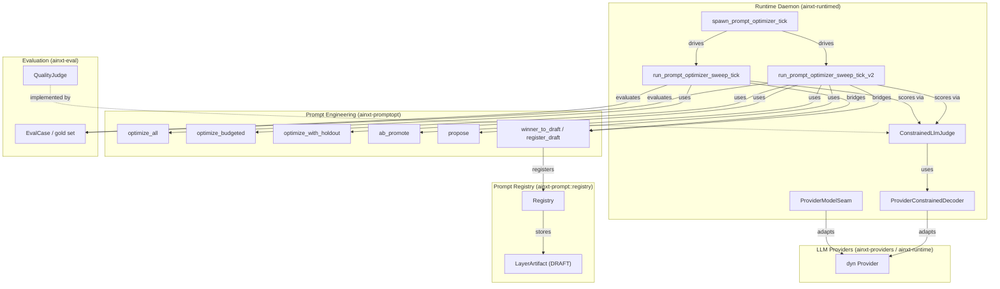
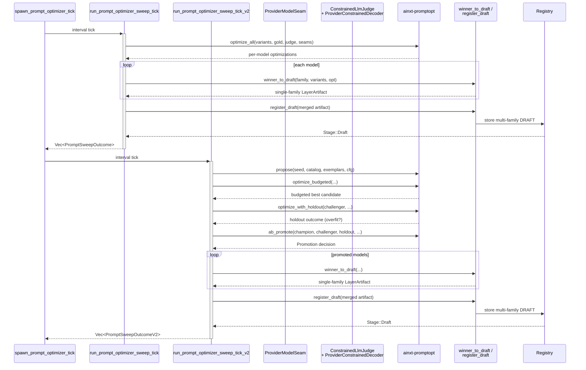
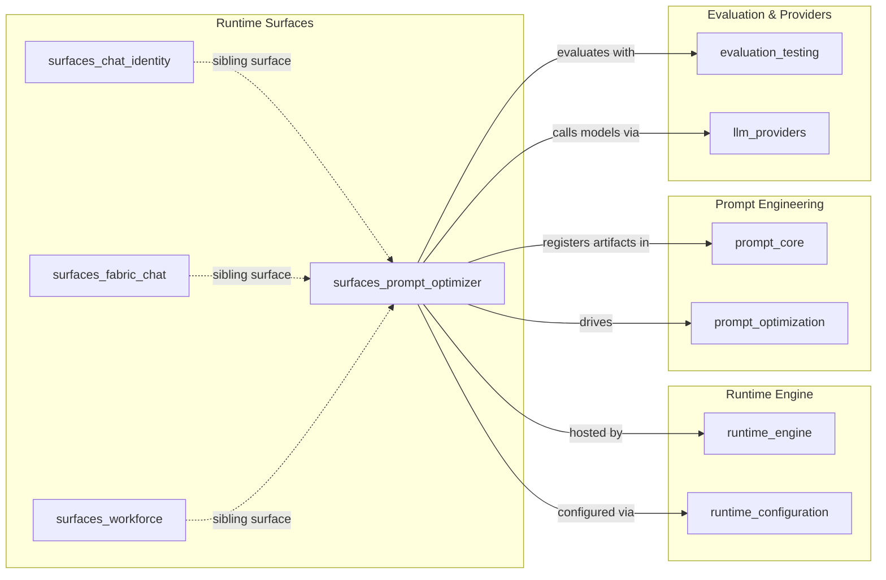
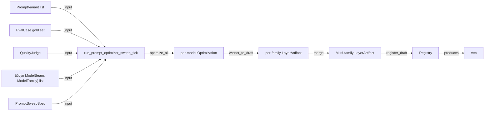
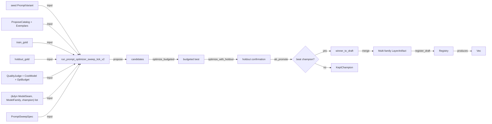
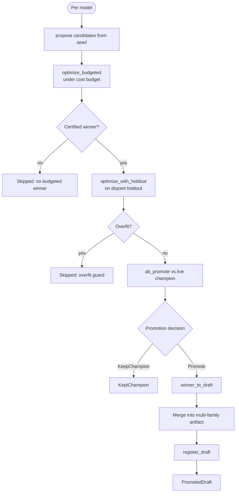
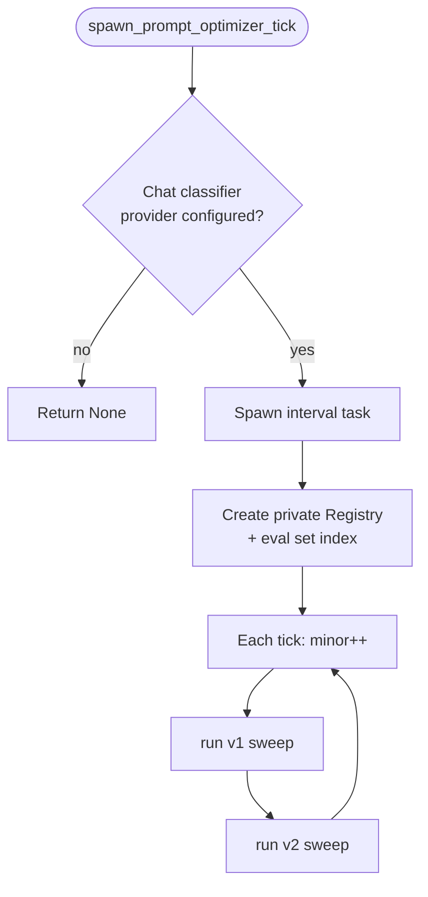

# surfaces_prompt_optimizer

## Brief Introduction

The `surfaces_prompt_optimizer` module is the live runtime surface that closes the gap between the offline prompt-optimization engine and the served system. It exposes the `ainxt-promptopt` search-and-rank pipeline as a recurring, daemon-driven cadence, bridges certified prompt winners into the prompt-registry as `DRAFT` artifacts, and wires real LLM providers into both the optimization seam and the constrained-decoding judge. In short, it turns prompt engineering from a library-only capability into a continuously running production process.

The module lives in `crates/ainxt-runtimed/src/prompt_optimizer_surface.rs` and is part of the `pipeline_runtime` → `runtime_engine` → `surfaces` subsystem.

---

## Module Purpose and Core Functionality

### What Problem It Solves

Before this surface existed, `ainxt-promptopt` provided a fully implemented optimizer, an A/B promotion helper, a holdout overfit guard, and a registry bridge — but none of them were reachable from the running daemon. The optimizer had callers only inside its own unit tests. `surfaces_prompt_optimizer` resolves that by:

1. **Providing a composition-root entrypoint** (`run_prompt_optimizer_sweep_tick`) that a daemon timer can call each cycle.
2. **Wiring real providers** into the optimizer through `ProviderModelSeam` and `ProviderConstrainedDecoder`.
3. **Bridging winners into the live prompt registry** as immutable, versioned `DRAFT` artifacts — never auto-promoting past `DRAFT`.
4. **Offering a fuller, more rigorous pipeline** (`run_prompt_optimizer_sweep_tick_v2`) that adds candidate generation, cost budgeting, holdout confirmation, and A/B non-inferiority checks against the live champion.
5. **Spawning the actual recurring tick** (`spawn_prompt_optimizer_tick`) when a real chat-classifier provider is configured.

### Core Operations

| Operation | Function | Description |
|-----------|----------|-------------|
| Simple sweep | `run_prompt_optimizer_sweep_tick` | Ranks a fixed variant list per model and registers a merged multi-family DRAFT. |
| Full pipeline sweep | `run_prompt_optimizer_sweep_tick_v2` | Proposes candidates under a budget, confirms on holdout, runs A/B promotion, then registers DRAFTs. |
| Cadence spawn | `spawn_prompt_optimizer_tick` | Conditionally starts a Tokio interval loop that drives both sweep functions each cycle. |
| Provider seam | `ProviderModelSeam` | Adapts any `Provider` to the `ModelSeam` interface the optimizer requires. |
| Constrained judge | `ProviderConstrainedDecoder` | Adapts any `Provider` to the `ConstrainedDecoder` interface for the constrained LLM judge. |

---

## Architecture and Component Relationships

### High-Level Architecture

### Component Interaction

---

## How It Fits into the Overall System

`surfaces_prompt_optimizer` sits at the intersection of three major subsystems:

1. **Runtime Engine** — It is one of the runtime surfaces (alongside [surfaces_chat_identity](surfaces_chat_identity.md), [surfaces_fabric_chat](surfaces_fabric_chat.md), and [surfaces_workforce](surfaces_workforce.md)) that the daemon exposes to the rest of the system. See [runtime_engine](runtime_engine.md) and [runtime_configuration](runtime_configuration.md).

2. **Prompt Engineering** — It consumes the optimization primitives defined in [prompt_optimization](prompt_optimization.md) and the prompt registry/layering primitives in [prompt_core](prompt_core.md). It does not reimplement optimization; it only provides the live driver and provider adapters.

3. **Evaluation & Providers** — It uses `EvalCase` and `QualityJudge` from [evaluation_testing](evaluation_testing.md) and the `Provider` trait from [llm_providers](llm_providers.md) / [core_engine](core_engine.md).

---

## Core Components

### `PromptSweepSpec`

Immutable metadata for a single sweep pass. It describes:
- The target layer artifact id and `Layer` (typically an L3 task layer).
- The `next_version` to assign to any produced DRAFT.
- The owner, template variables, and `EvalSetRef` used for validation.

One spec produces one merged multi-family artifact per tick.

### `PromptSweepOutcome` / `PromptSweepOutcomeV2`

Per-model result enums. They guarantee that every input model receives exactly one outcome and that failures are reported with a precise reason rather than silently dropped.

| Outcome | Meaning |
|---------|---------|
| `Drafted` / `PromotedDraft` | Winner certified and registered as DRAFT. |
| `Skipped` | No winner, overfit, A/B loss, or registry rejection. |
| `KeptChampion` (v2 only) | Challenger did not beat the live champion by the A/B margin. |

### `ProviderModelSeam`

Adapts any `dyn Provider` to the `ModelSeam` trait required by `ainxt-promptopt`. It:
- Reports the provider's id and tier.
- Completes prompts by draining the provider's async stream in a blocking context.
- Fails soft on transport errors (returns empty string, letting the judge score it).

### `ProviderConstrainedDecoder`

Adapts any `dyn Provider` to the `ConstrainedDecoder` trait used by `ConstrainedLlmJudge`. It:
- Declares `grammar_native() == false` honestly, because no provider adapter exposes a native GBNF hook at this layer.
- Routes every decode through the `StructuredOutputEngine` bounded prompted-JSON repair loop.
- Uses `tokio::task::block_in_place` to bridge async provider calls from the synchronous decoder interface.

### `drain_provider_reply` / `blocking_provider_call`

Shared helpers that drain a `Provider::stream` into a plain string. They:
- Concatenate `TextDelta` events.
- Fail closed on `Event::Error`.
- Refuse tool-approval requests rather than guess.
- Ignore non-text events (reasoning, tool results, usage, artifacts).

### `spawn_prompt_optimizer_tick`

The daemon entrypoint. It:
1. Resolves a real chat-classifier provider from `LoadedConfig`.
2. Returns `None` on air-gapped defaults (no provider configured), matching other conditional cadences.
3. Spawns a Tokio interval task that runs both v1 and v2 sweeps each cycle.
4. Maintains a private in-task `Registry` with a pre-registered eval set.
5. Bumps the minor version each tick.

> **Honest infra gaps**: the shipped-default gold/variants/holdout are illustrative constants, not a deployment's real role-specific sets; the tick uses a private registry rather than the same registry that serves `/v1/chat`; and version-bumping policy is left to the caller. These are documented explicitly in code rather than hidden.

---

## Data Flow

### v1 Sweep Data Flow

### v2 Sweep Data Flow

---

## Process Flows

### Full v2 Pipeline per Model

### Cadence Lifecycle

---

## Dependencies

### Direct Crate Dependencies

| Crate | Module Doc | Usage |
|-------|------------|-------|
| `ainxt_eval` | [evaluation_testing](evaluation_testing.md) | `EvalCase`, `QualityJudge`, scoring |
| `ainxt_prompt` | [prompt_core](prompt_core.md) | `Registry`, `Layer`, `ModelFamily`, `PromptVariant`, `ConstrainedDecoder` |
| `ainxt_promptopt` | [prompt_optimization](prompt_optimization.md) | Optimization, bridge, budget, holdout, A/B promotion, proposal |
| `ainxt_protocol` | [core_interaction](core_interaction.md) | `Event` streaming contract |
| `ainxt_runtime` | [core_engine](core_engine.md) | `Provider` trait |
| `ainxt_types` | [core_infrastructure](core_infrastructure.md) | `Tier` |

### Sibling Surfaces

- [surfaces_chat_identity](surfaces_chat_identity.md)
- [surfaces_fabric_chat](surfaces_fabric_chat.md)
- [surfaces_workforce](surfaces_workforce.md)

---

## Operational Notes

### Why DRAFT Only

The optimizer never auto-promotes past `DRAFT`. Promotion through `Eval`, `OpenPr`, and production stages is governed by the prompt registry lifecycle and release gates described in [prompt_core](prompt_core.md). This separation keeps the optimizer a pure recommendation engine and leaves human or gated approval processes in control.

### Multi-Family Merge Discipline

A `LayerArtifact` is immutable at a given `(id, version)` and declares all its compiled model families together. Therefore the sweep:
1. Bridges each model's winner into a single-family artifact.
2. Merges all single-family artifacts by extending `model_variants` and `variants`.
3. Calls `register_draft` exactly once per tick.

This prevents version collisions that would occur if each family registered independently.

### Async/Sync Bridge

The optimizer's judge and seam interfaces are synchronous, but provider calls are async. The module uses `tokio::task::block_in_place` plus `Handle::current().block_on` to run provider streams on the same multi-threaded Tokio runtime without nesting runtimes. This requires the caller to already be inside a multi-threaded Tokio runtime.

---

## Testing

The module includes unit tests that prove the end-to-end behavior:

- **`gap_ainxt_runtimed_prmt_12_sweep_tick_lands_a_draft_per_model`** — v1 sweep lands a merged multi-family DRAFT.
- **`gap_ainxt_runtimed_prmt_12_no_winner_is_skipped_not_silently_dropped`** — empty gold produces a reported `Skipped` outcome.
- **`gap_ainxt_runtimed_prmt_12_registry_rejection_is_reported_as_skipped`** — dangling eval-set FK surfaces as a skipped reason.
- **`gap6_promptopt_v2_overfit_challenger_is_refused_before_ab_check`** — v2 holdout guard refuses a memorizing challenger.
- **`gap6_promptopt_v2_worse_challenger_is_refused_by_ab_promote`** — v2 A/B check keeps the live champion when the challenger is worse.
- **`gap6_promptopt_v2_better_challenger_is_promoted_and_actually_drafted`** — v2 promotes a genuinely better challenger to DRAFT.

Test fixtures include deterministic `ModelSeam` implementations (`SbsModel`, `RegurgitateModel`, `MarkerModel`) and a simple `TermJudge` that checks for expected terms.

---

## See Also

- [prompt_optimization](prompt_optimization.md) — the underlying optimizer engine.
- [prompt_core](prompt_core.md) — prompt registry, layers, and lifecycle.
- [runtime_engine](runtime_engine.md) — the runtime engine that hosts this surface.
- [runtime_configuration](runtime_configuration.md) — how `LoadedConfig` and provider resolution work.
- [evaluation_testing](evaluation_testing.md) — eval cases, judges, and quality scoring.
- [llm_providers](llm_providers.md) — provider adapters and the `Provider` trait.
- [surfaces_chat_identity](surfaces_chat_identity.md), [surfaces_fabric_chat](surfaces_fabric_chat.md), [surfaces_workforce](surfaces_workforce.md) — sibling runtime surfaces.
