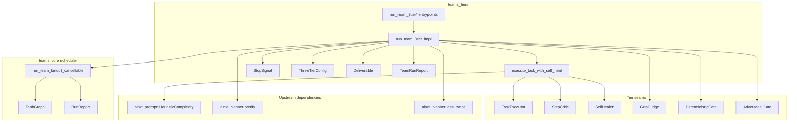
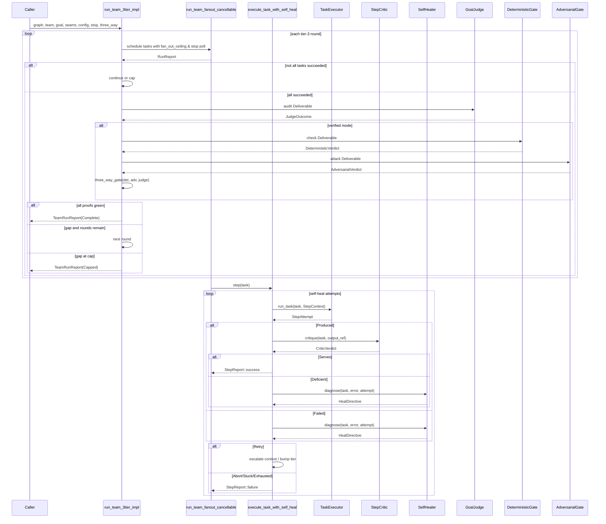
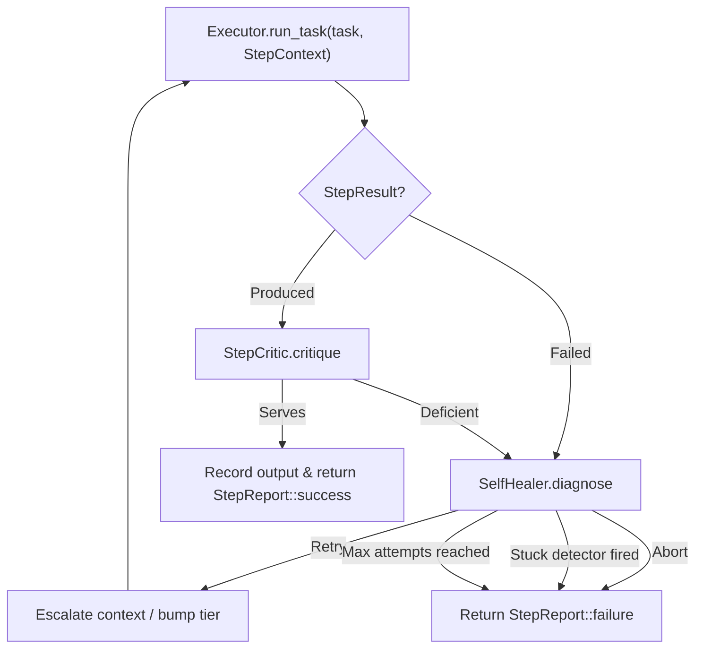
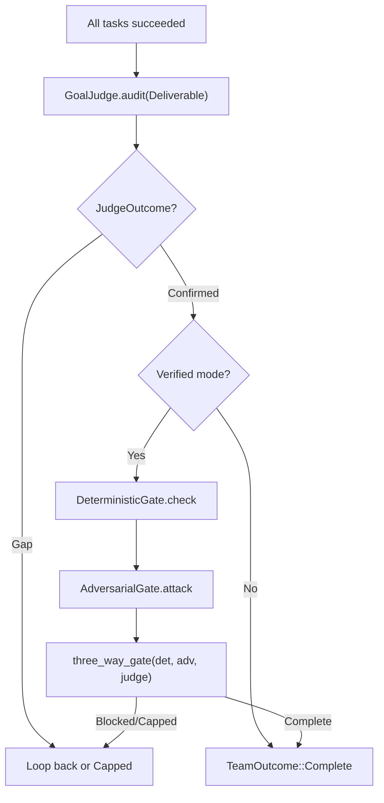
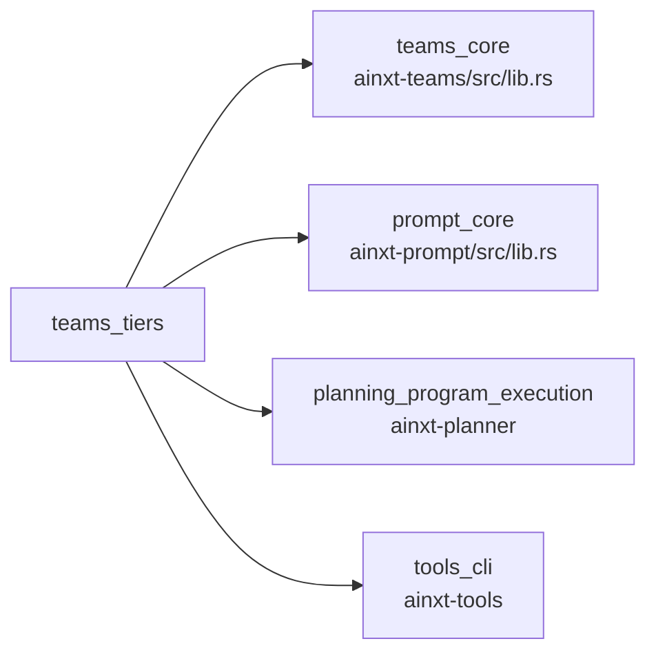

# teams_tiers

The `teams_tiers` module implements the **3-tier team execution loop** for the `ainxt-teams` crate. It wraps the core task scheduler from [`teams_core`](teams_core.md) with intelligent, model-backed execution control: role-to-model-tier routing, bounded self-heal/repair, a per-step critic, and a fresh-context judge audit. The module is designed around trait seams so the entire loop can be tested end-to-end with fakes, without requiring a live model.

This module closes several architectural gaps documented in `docs/architecture/LOOP_AND_AGENT_TEAMS.md` (§4, §5, §6, §10) and `LONG_HORIZON_PROGRAMS.md` §6: adaptive task depth, real fan-out/bulkhead scheduling reachability, tier-2 critic rubber-stamping, and the LOOP §7 requirement that no single check may declare a goal complete.

---

## Core Concepts

### The Three Tiers

The 3-tier loop is the central abstraction of this module. Each tier is a separate seam, allowing different models or policies to be injected at composition time:

| Tier | Trait | Responsibility |
|------|-------|----------------|
| **Tier 1** | [`TaskExecutor`](#taskexecutor) | Reactive inner loop for a single task. Executes the task at a model tier and returns either a produced artifact or a failure. |
| **Tier 2** | [`StepCritic`](#stepcritic) | Cheap, narrow per-step critique. Rejects deficient steps so they are fed back into self-heal instead of silently accepted. |
| **Tier 3** | [`GoalJudge`](#goaljudge) | Fresh-context Architect-as-judge. Audits the whole [`Deliverable`](#deliverable) (goal + acceptance criteria + outputs only) against the original goal. |

### Self-Heal Loop

Tier 1 is wrapped by a bounded self-heal loop driven by the [`SelfHealer`](#selfhealer) seam. When a task fails or the critic rejects a step, the healer classifies the error and decides whether to retry with escalated context and/or a bumped model tier. A deterministic **stuck detector** aborts the task when the same error repeats, preventing unbounded token spend on dead ends.

### Verified Completion (LOOP §7)

The base 3-tier loop terminates `Complete` when the tier-3 judge confirms. The verified variants (`run_team_3tier_verified*` ) add two additional, non-substitutable proofs:

1. **Deterministic gate** ([`DeterministicGate`](#deterministicgate)) — code-level checks (compile/test/lint). The offline default [`ContentDeterministicGate`](#contentdeterministicgate) checks for empty output and unfinished-stub markers.
2. **Adversarial gate** ([`AdversarialGate`](#adversarialgate)) — exploratory attack over the deliverable. The offline default [`BreakerAdversarialGate`](#breakeradversarialgate) reuses [`ainxt_planner::assurance::AdversarialBreaker`](pipeline_orchestration.md).

These three proofs are combined via [`ainxt_planner::verify::three_way_gate`](planning_program_execution.md), the same combinator used at program altitude. A judge that confirms a broken deliverable can no longer single-handedly complete the run.

---

## Architecture



---

## Component Reference

### StopSignal

A cooperative, cheaply-clonable user-stop signal. It is `std`-only (no external dependencies) so the daemon can hot-wire its protocol cancel token to trip the flag. Cloning shares the same underlying `AtomicBool`.

- `stop()` — trip the signal.
- `is_stopped()` — check whether a stop has been requested.

Used by [`run_team_3tier_cancellable`](#entrypoints) and [`run_team_3tier_verified_cancellable`](#entrypoints) to halt an in-flight run promptly. A tripped signal terminates the run as an honest `TeamOutcome::Capped`, never a fabricated `Complete`.

### StepContext

Context handed to the tier-1 [`TaskExecutor`](#taskexecutor) for each attempt:

- `attempt` — 0-based attempt counter within the self-heal loop.
- `model_tier` — the model tier this attempt runs at, escalated by prior self-heal.
- `round` — the tier-3 outer round this execution belongs to.
- `prior_error` — the prior attempt's error, fed back for repair.
- `escalated_context` — whether the self-healer asked for escalated context.
- `capabilities` — this task's role's declared capabilities (least-privilege OBO narrowing target).
- `team_capabilities` — the declared capability envelope of every role in the team.

### StepResult & StepAttempt

`StepResult` is the outcome of one executor attempt:

- `Produced { output_ref }` — the attempt produced an artifact.
- `Failed { error }` — the attempt failed with a classified error.

`StepAttempt` pairs the `StepResult` with the sub-agent `AgentInvocation` call tree, which drives cost roll-up.

### TaskExecutor

```rust
pub trait TaskExecutor {
    fn run_task(&mut self, task: &Task, ctx: &StepContext) -> StepAttempt;
}
```

Tier-1 seam: the reactive inner loop for a single task. The parent composition root backs this with a real base-loop run at `ctx.model_tier`.

### StepCritic

```rust
pub trait StepCritic {
    fn critique(&mut self, task: &Task, output_ref: &str) -> CriticVerdict;
}
```

Tier-2 seam: a cheap, narrow critique run after each produced step. Returns either `Serves` or `Deficient { reason }`.

Provided implementations:

- [`AcceptingCritic`](#acceptingcritic) — accepts every step. Useful for tests or teams that deliberately gate only at tier 3.
- [`ContentStepCritic`](#contentstepcritic) — production default. Reuses the same deterministic content check as the tier-3 gate, scoped to one step.

#### AcceptingCritic

A critic that accepts every step. **Not** a production default — it exists for isolation tests or deliberate tier-3-only gating.

#### ContentStepCritic

The production default `StepCritic`. It inspects each step's produced content using [`deterministic_content_check`](#deterministic-content-check). Empty output or unfinished-stub markers (`todo!`, `unimplemented!`, `not implemented`) are rejected immediately and fed back into the self-heal loop. This prevents deficient steps from sailing through to the whole-deliverable audit.

### SelfHealer

```rust
pub trait SelfHealer {
    fn diagnose(&mut self, task: &Task, error: &str, attempt: u32) -> HealDirective;
}
```

The self-heal seam. Classifies an error or critic rejection and decides whether to retry (with optional context escalation and/or tier bump) or abort.

`HealDirective`:

- `Retry { escalate_context, bump_tier }`
- `Abort { reason }`

#### EscalatingHealer

A reasonable default self-healer: always retries with escalated context, and bumps the model tier on attempts ≥ 1. Bounded by `max_attempts_per_task` and the stuck detector.

### GoalJudge

```rust
pub trait GoalJudge {
    fn audit(&mut self, deliverable: &Deliverable) -> JudgeOutcome;
}
```

Tier-3 seam: the fresh-context Architect-as-judge. It audits only the goal, acceptance criteria, and produced outputs — never the executor's transcripts or self-heal narrative. This is anti-sycophancy by construction.

`JudgeOutcome`:

- `Confirmed` — the deliverable satisfies the goal.
- `Gap { missing }` — a specific, actionable gap that becomes the next round's work.

### Deliverable

The whole-deliverable view handed to the tier-3 judge:

- `goal` — the original goal string.
- `acceptance_criteria` — union of all task acceptance criteria.
- `outputs` — map of `TaskId` → output artifact reference.

### DeterministicGate

```rust
pub trait DeterministicGate {
    fn check(&mut self, deliverable: &Deliverable) -> ainxt_planner::verify::DeterministicVerdict;
}
```

LOOP §7 proof 1: deterministic, code-level checks over the deliverable. The offline default is [`ContentDeterministicGate`](#contentdeterministicgate); deployments can hot-wire real CI pipeline outcomes behind this seam.

#### ContentDeterministicGate

Runs [`deterministic_content_check`](#deterministic-content-check) over the combined output text of every task. Empty content or unfinished-stub markers produce a hard block.

### AdversarialGate

```rust
pub trait AdversarialGate {
    fn attack(&mut self, deliverable: &Deliverable) -> ainxt_planner::verify::AdversarialVerdict;
}
```

LOOP §7 proof 2: an exploratory attack over the deliverable. The offline default is [`BreakerAdversarialGate`](#breakeradversarialgate); deployments can hot-wire a real dynamic tester behind this seam.

#### BreakerAdversarialGate

Reuses the real [`ainxt_planner::assurance::AdversarialBreaker`](planning_program_execution.md) rather than fabricating a pass. Converts the deliverable into a `ModuleArtifact` and runs the breaker against it.

### Deterministic Content Check

A pure, deterministic content check standing in for "compile + tests + lint":

- Empty or whitespace-only content → hard block (`"no committable output produced"`).
- Contains markers such as `todo!`, `unimplemented!`, `not implemented`, `not yet implemented` → hard block per marker.

This function is shared by [`ContentStepCritic`](#contentstepcritic) and [`ContentDeterministicGate`](#contentdeterministicgate), following the discipline of "no new verification code, just new scopes."

### ThreeTierConfig

Deterministic caps for the 3-tier loop:

| Field | Default | Purpose |
|-------|---------|---------|
| `max_attempts_per_task` | 3 | Max self-heal attempts per task per round. |
| `stuck_repeat_cap` | 2 | Same error repeated this many times aborts the task. |
| `max_judge_rounds` | 2 | Max tier-3 outer rounds before `Capped`. |
| `cost_ceiling` | `None` | Optional hard cost ceiling across the whole run. |
| `max_hierarchy_depth` | `DEFAULT_MAX_DEPTH` | Hard sub-agent hierarchy depth cap enforced at the kernel boundary. |
| `fan_out_ceiling` | `usize::MAX` | Max independent tasks admitted into the same scheduler wave. |

### SelfHealEvent & SelfHealKind

Audit-trail entries surfaced across all rounds, never swallowed:

- `Repaired` — executor errored; a repair was attempted.
- `CriticRejected` — critic found the step deficient; a repair was attempted.
- `Stuck` — stuck detector fired; task aborted.
- `Exhausted` — self-heal cap reached; task aborted.
- `Aborted` — self-healer chose to abort.

### TeamOutcome

Terminal outcome of a 3-tier run:

- `Complete` — the judge (and, in verified mode, the deterministic + adversarial proofs) confirmed the deliverable.
- `Capped { reason }` — round cap hit, tasks did not complete, cost ceiling crossed, or user-stop requested. Honest partial — never silently upgraded to `Complete`.

### TeamRunReport

Full report of a 3-tier run:

- `outcome` — `TeamOutcome`.
- `rounds` — how many tier-3 rounds ran.
- `total_cost` — aggregate cost across every attempt of every round.
- `last_run` — the scheduler `RunReport` from the final round.
- `learning` — `LearningRecord` distilled from the final round, with `total_cost` set to the whole-run aggregate.
- `self_heal` — self-heal audit trail across all rounds.
- `judge` — final judge outcome, if tier 3 was reached.

---

## Entrypoints

The module exposes four public entrypoints, all delegating to a single private `run_team_3tier_impl`:

| Function | Cancellation | Verified (3 proofs) |
|----------|--------------|---------------------|
| `run_team_3tier` | No | No |
| `run_team_3tier_cancellable` | Yes | No |
| `run_team_3tier_verified` | No | Yes |
| `run_team_3tier_verified_cancellable` | Yes | Yes |

The verified entrypoints require `det_gate` and `adv_gate` in addition to the judge. The cancellable entrypoints accept a [`StopSignal`](#stopsignal).

---

## Data Flow



---

## Process Flow: Per-Task Self-Heal



---

## Process Flow: Verified Completion Decision



---

## Adaptive Task Depth

The module mirrors the adaptive-depth mechanism used by the served prompt path ([`prompt_core`](prompt_core.md)). The function `adaptive_task_tier` classifies a task's own description using [`ainxt_prompt::HeuristicComplexity`](prompt_core.md) and returns a `ModelTier`.

Important rules:

- A role's declared `model_tier` is a **floor** — it is never downgraded.
- The task's classified tier is combined with the role floor via `max_tier`, so deep-reasoning tasks on simple roles still escalate to `Complex`.
- This ensures consistency with the served chat path's model routing.

---

## Integration with the Core Scheduler

The 3-tier loop does **not** reimplement scheduling. It composes on top of [`teams_core::run_team_fanout_cancellable`](teams_core.md), which provides:

- Topological order validation via `TaskGraph::topological_order`.
- Per-tick admission via `TaskGraph::ready_wave`.
- Bulkhead failure isolation.
- Cost roll-up.
- Real fan-out ceiling and cancellation polling.

The `fan_out_ceiling` config field controls how many independent, dependency-satisfied tasks may be admitted into the same wave. The default is `usize::MAX` (bounded only by graph independence); capacity-constrained deployments should pass a value computed by [`ainxt_planner::qos::ElasticFanoutPolicy`](planning_program_execution.md).

---

## Security & Governance

### Least-Privilege Capability Narrowing

`StepContext` carries both `capabilities` (this task's role's declared capabilities) and `team_capabilities` (the team-wide envelope). A `TaskExecutor` that dispatches tools should authorize the task's turn against **only** the role capabilities, using [`ainxt_tools::obo::OboContext::delegate`](tools_cli.md) for parent→child narrowing. A role absent from the team gets an empty capability set — fail-closed.

### Hierarchy Depth Cap

`config.max_hierarchy_depth` is enforced at the kernel boundary inside `execute_task_with_self_heal`. Every attempt's `AgentInvocation` call tree is validated against this cap before the attempt's result is accepted. This is a runtime guarantee, not a convention roles are trusted to self-police.

### Honest Partial Outcomes

The module never silently upgrades a partial result to `Complete`. Terminal states include:

- Round cap hit with unresolved gap.
- Tasks did not all complete.
- Cost ceiling exhausted.
- User-stop requested.

---

## Module Dependencies



### Direct Dependencies

- [`teams_core`](teams_core.md) — `TaskGraph`, `Task`, `Team`, `Role`, `AgentInvocation`, `RunReport`, `StepReport`, `LearningRecord`, `Cost`, `TaskId`, and the `run_team_fanout_cancellable` scheduler.
- [`prompt_core`](prompt_core.md) — `ComplexityClassifier` and `HeuristicComplexity` for adaptive task depth classification.
- [`planning_program_execution`](planning_program_execution.md) — `verify::three_way_gate`, `verify::DeterministicVerdict`, `verify::JudgeVerdict`, `assurance::AdversarialBreaker`, and `assurance::ModuleArtifact` for the verified completion proofs.
- [`tools_cli`](tools_cli.md) — `OboContext::delegate` for capability narrowing (referenced in documentation/seams).

---

## How It Fits into the System

`teams_tiers` sits within the [`teams`](teams.md) subsystem under [`governance_compliance`](governance_compliance.md). It is the execution intelligence layer on top of the pure [`teams_core`](teams_core.md) scheduler.

Upstream consumers include:

- [`runtime_engine`](runtime_engine.md) — `ainxt-runtimed::program_exec::drive_served_team_blocking` calls `run_team_3tier_verified_cancellable` on the served `/v1/chat` team path.
- [`server_serving`](server_serving.md) — HTTP surfaces wire `StopSignal` from protocol cancel tokens into the team loop.
- [`workforce`](workforce.md) / [`teams_flywheel`](teams_flywheel.md) — learning records and role tuning consume `TeamRunReport` and `LearningRecord`.

The module bridges high-level team planning with low-level model execution, ensuring that multi-agent runs are bounded, observable, verifiable, and testable.

---

## Testing Strategy

The module's design around trait seams enables exhaustive fake-based tests in the same file. Test coverage includes:

- Happy path through all three tiers to `Complete`.
- Fresh-context judge catching an incomplete deliverable.
- Self-heal repairing a transient failure.
- Stuck detector aborting repeating failures.
- Role-to-model-tier routing and tier bumping.
- Cost ceiling enforcement.
- Learning record emission with aggregate cost.
- Real fan-out and bulkhead isolation via `run_team_fanout_cancellable`.
- `ContentStepCritic` rejecting stubs that `AcceptingCritic` would pass.
- Adaptive task depth escalation and floor preservation.

These tests demonstrate that the guarantees are deterministic properties of the loop, independent of any live model behavior.
