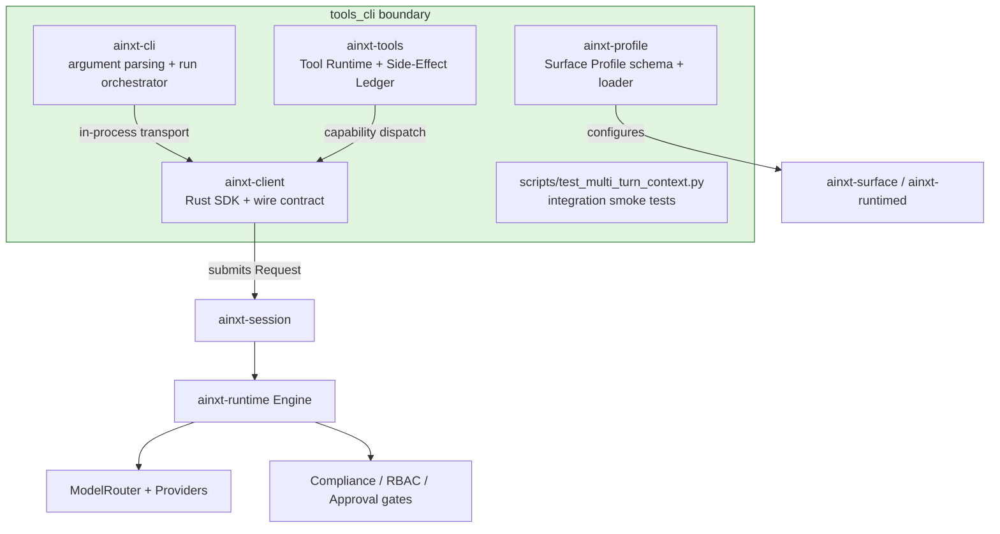
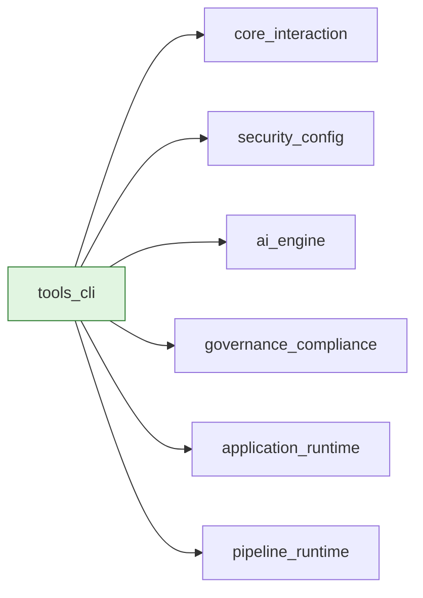

# tools_cli — Headless CLI, Client SDK, Tool Runtime & Surface Profiles

## Purpose

`tools_cli` is the **developer-facing boundary** of the AiNxt system. It packages the runtime spine into a headless command-line tool, a reference Rust client SDK, a deterministic tool runtime with side-effect ledger, and declarative surface profiles. Together these crates let operators, CI pipelines, and downstream applications invoke the AiNxt engine locally or embed it in-process, while preserving the system's core safety invariants: least-privilege capability dispatch, exactly-once side effects, data-class escalation, and human-in-the-loop approval.

The module is deliberately **non-interactive** — the headless CLI (`ainxt-cli`) is built for SSH boxes, air-gapped hosts, and CI, while richer surfaces are handled by the desktop application. All heavy lifting (model routing, compliance, RBAC, session management) is delegated to the [core_infrastructure](../core_infrastructure/core_infrastructure.md), [ai_engine](../ai_engine/ai_engine.md), [pipeline_runtime](../pipeline_runtime/pipeline_runtime.md), and [governance_compliance](../governance_compliance/governance_compliance.md) modules; this module only provides the thin, deterministic wrappers that connect human or script input to those subsystems.

## Architecture Overview

### High-level responsibilities

| Sub-module | Crate(s) | Responsibility |
|------------|----------|----------------|
| [Headless CLI](tools_cli_headless_cli.md) | `ainxt-cli` | Parse `run`, `harness`, and `sdk` subcommands; resolve input/session; render `--print` or `--json` output; return deterministic exit codes. |
| [Client SDK](tools_cli_client_sdk.md) | `ainxt-client` | Reference Rust implementation of the wire contract; `ChatStream`, `Transport` seam, harness engine bridge, SDK contract descriptor + Python/TypeScript codegen. |
| [Tool Runtime](tools_cli_tool_runtime.md) | `ainxt-tools` | Capability registry, deterministic pre/post hooks, OBO dispatch, side-effect ledger with exactly-once sagas, reconciler sweeper. |
| [Surface Profiles](tools_cli_surface_profiles.md) | `ainxt-profile` | Declarative `SurfaceProfile` schema (autonomy, model policy, RBAC, context strategy, prompt policy) with layered TOML resolution. |
| [Integration Tests](tools_cli_integration_tests.md) | `scripts/test_multi_turn_context.py` | Python smoke tests against a running `ainxt-runtimed` daemon for multi-turn context retention and cross-session isolation. |

Each sub-module above has its own detailed documentation file; follow the links for component-level descriptions, data-flow diagrams, and usage notes.

## Module Boundaries & Dependencies

`tools_cli` sits at the edge of the system and depends on nearly every other major module, but it does not duplicate their logic:

- **Core interaction** — uses [core_interaction](../core_infrastructure/core_interaction.md) (`ainxt-protocol`, `ainxt-session`) for the wire contract, session lifecycle, and event streaming.
- **Security & config** — uses [security_config](../core_infrastructure/security_config.md) (`ainxt-types`, `ainxt-config`) for principals, data classes, and layered configuration loading.
- **AI engine** — chat turns and harness steps are executed by the [ai_engine](../ai_engine/ai_engine.md) through the runtime engine; compliance redaction and guardrails run inside the engine, not in the CLI.
- **Governance** — harness linting, pre-receive gating, and publish workflows delegate to [governance_compliance](../governance_compliance/governance_compliance.md) (`ainxt-admission`, `ainxt-governance`).
- **Application runtime** — surface profiles configure [application_runtime](../core_infrastructure/application_runtime.md) surfaces; the integration script exercises the [pipeline_runtime](../pipeline_runtime/pipeline_runtime.md) server layer.
- **Payments** — the tool runtime adopts `ainxt_payments::boundary::PaymentEffectClass` directly from [governance_compliance](../governance_compliance/governance_compliance.md) so payment-initiating tools are structurally non-dispatchable.

## Key Design Decisions

1. **Headless by default.** The CLI is intentionally not a TUI. It runs one turn per invocation, emits deterministic exit codes (`0` ok, `1` turn/lint error, `2` usage, `3` backpressure), and supports NDJSON event streaming for pipelines.
2. **Offline provider.** `ainxt-cli` ships an `OfflineProvider` so it works with no network or model configured — essential for air-gap smoke tests and CI.
3. **Reference client.** `ainxt-client` is the canonical Rust implementation of the wire contract; planned Python and TypeScript SDKs are generated from the same `ContractDescriptor` rather than hand-maintained.
4. **Exactly-once side effects.** `ainxt-tools` uses a durable ledger, idempotency keys, sagas with compensation, and a reconciler sweeper to guarantee that payment-adjacent or side-effecting capabilities execute at most once.
5. **Defense-in-depth hooks.** Pre/post hooks run deterministically inside the dispatch path, can rewrite arguments/output or refuse calls, and apply uniformly to native, MCP-discovered, and plugin-provided capabilities.
6. **Safe profile defaults.** `SurfaceProfile` defaults to read-only autonomy, platform+namespace retrieval, and simple-tier routing; request-layer overrides can only narrow authority, never widen it.

## Entry Points

- `ainxt run [PROMPT]` — run a single chat turn against the embedded offline runtime.
- `ainxt harness <lint|publish|dev|test> <MANIFEST.json>` — author, validate, and locally execute declarative harnesses.
- `ainxt sdk emit <python|typescript>` / `ainxt sdk contract` — emit generated SDK bindings or the machine-readable contract descriptor.
- `scripts/test_multi_turn_context.py` — integration smoke test for conversation history and session isolation.

## See Also

- [Headless CLI](tools_cli_headless_cli.md) — `ainxt-cli` parsing, orchestration, and subcommands.
- [Client SDK](tools_cli_client_sdk.md) — `ainxt-client` wire contract, transport seam, harness bridge, and SDK codegen.
- [Tool Runtime](tools_cli_tool_runtime.md) — `ainxt-tools` capability registry, hooks, ledger, and reconciler.
- [Surface Profiles](tools_cli_surface_profiles.md) — `ainxt-profile` schema and layered resolution.
- [Integration Tests](tools_cli_integration_tests.md) — multi-turn context retention smoke tests.
