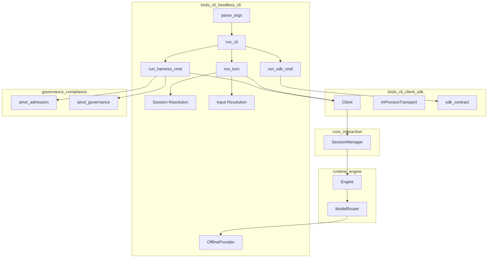
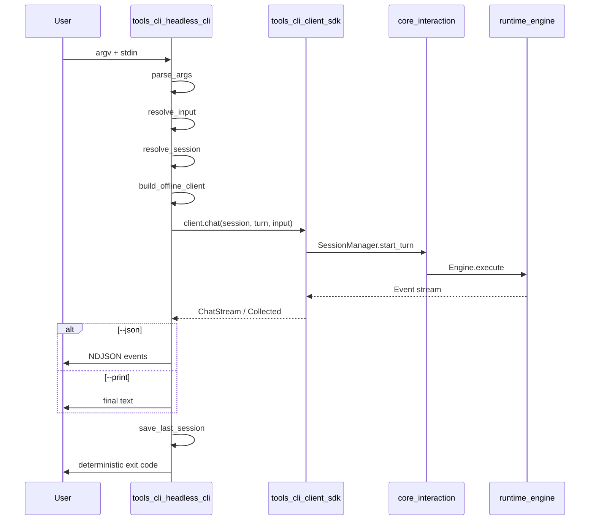
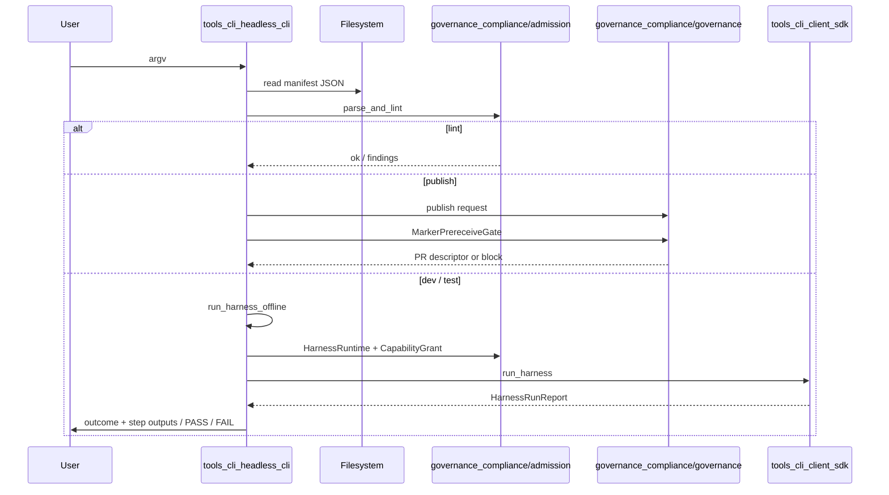
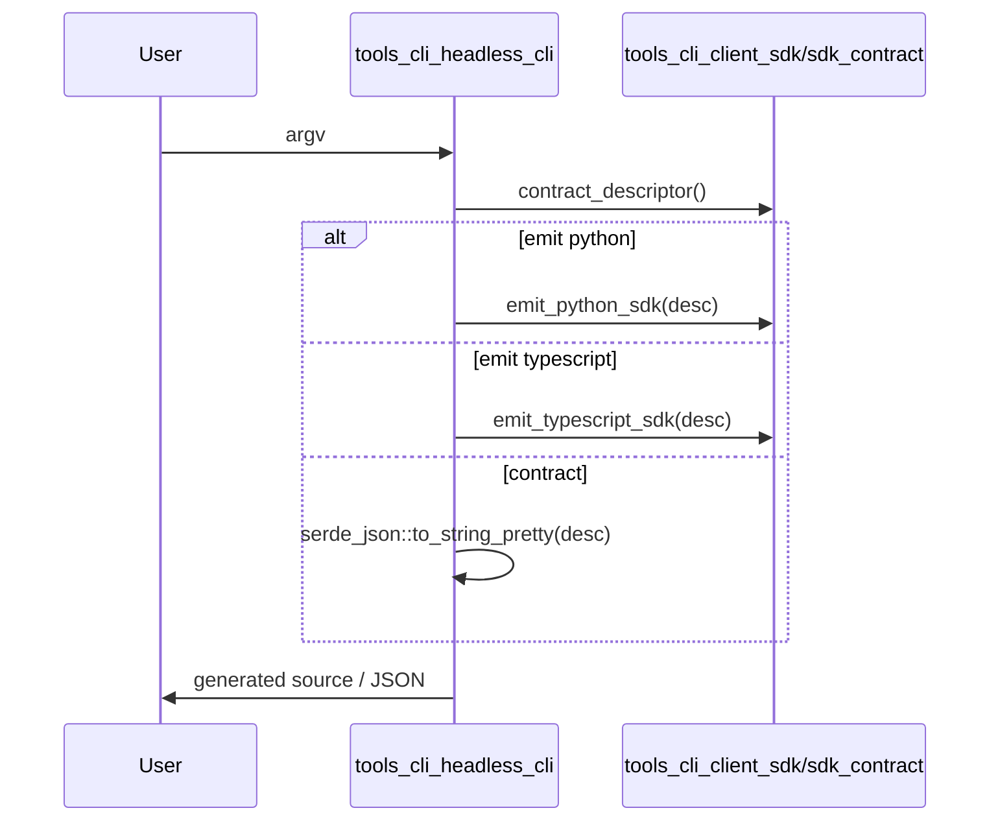
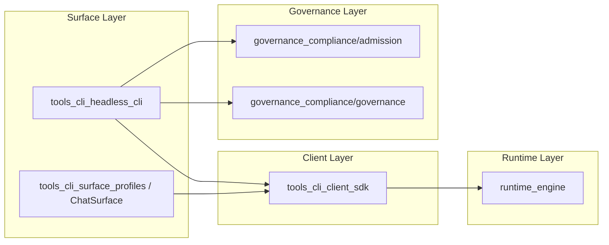

# tools_cli_headless_cli

## Brief Introduction

`tools_cli_headless_cli` is the library half of `ainxt-cli`, the **headless command-line interface** for the AiNxt runtime. It is designed for SSH boxes, air-gapped hosts, CI pipelines, and other non-interactive environments where a rich desktop UI is unavailable or undesirable. The CLI embeds the runtime in-process via [`ainxt_client`](tools_cli_client_sdk.md) and executes a single turn per invocation, producing deterministic output and exit codes that automation can rely on.

The module is intentionally **pure and testable**: argument parsing, input/session resolution, event rendering, and exit-code mapping live in this crate, while `main.rs` remains a thin async shell. It ships with an [`OfflineProvider`](tools_cli_headless_cli.md#offlineprovider) so the binary works without any network or model configuration, making it ideal for smoke tests and air-gapped deployments.

---

## Core Functionality

The headless CLI exposes three top-level command families:

| Command | Purpose |
|---------|---------|
| `ainxt run` | Execute a single conversational turn against the embedded runtime. |
| `ainxt harness` | Author, validate, publish, and locally test governance harnesses. |
| `ainxt sdk` | Emit language SDK bindings (Python / TypeScript) or the raw wire contract descriptor. |

### Output Modes

- **`--print`** (default): emits only the final answer text.
- **`--json`**: emits every protocol event as one JSON object per line (NDJSON), suitable for Unix-style pipelines.

### Exit-Code Contract

The CLI exposes a stable, deterministic exit-code contract for CI branching:

| Code | Constant | Meaning |
|------|----------|---------|
| `0` | `EXIT_OK` | Success. |
| `1` | `EXIT_TURN_ERROR` | Turn error, harness lint/run failure, or serialization error. |
| `2` | `EXIT_USAGE` | Invalid arguments or missing input. |
| `3` | `EXIT_BACKPRESSURE` | Runtime at capacity. |

### Session Handling

Sessions are resolved in the following priority:

1. Explicit `--session <ID>`.
2. `--continue` reusing the last session id persisted in `AINXT_SESSION_FILE`.
3. Default session id (`ainxt-cli`).

The last used session id is persisted to `AINXT_SESSION_FILE` after each successful turn resolution.

### Data Classification

All run and harness commands accept `--data-class` with values:

- `public`
- `internal` (default)
- `confidential`
- `regulated-payment`
- `pii`

This classification is forwarded to the embedded runtime and client so that downstream guards, routing, and audit policies can enforce the appropriate handling. See [`ainxt_types`](../core_infrastructure/core_infrastructure.md#security_config) for the underlying data-class model.

---

## Architecture

### Component Breakdown

#### `CliCommand`

Represents a parsed `ainxt run` invocation. It captures:

- The prompt (or `None`/`Some("-")` for stdin).
- Output mode (`Print` or `Json`).
- Session flags (`--continue`, `--session`).
- Data class.

#### `HarnessCommand`

Represents a parsed `ainxt harness` invocation. It supports four subcommands:

- **`lint`**: validate a harness manifest against ADR-026 schema and consistency rules.
- **`publish`**: lint, run the pre-receive PII/secret gate, and emit a publish PR descriptor.
- **`dev`**: run the harness locally against the embedded offline runtime; supports `--watch` for hot-reload.
- **`test`**: local acceptance smoke test that asserts the harness reaches a `Completed` outcome.

#### `SdkCommand`

Represents a parsed `ainxt sdk` invocation. Targets:

- `Python`
- `Typescript`
- `Contract` (raw JSON descriptor)

The actual code generation is delegated to [`ainxt_client::sdk_contract`](tools_cli_client_sdk.md#sdk_contract).

#### `OfflineProvider`

A deterministic, network-free [`Provider`](../pipeline_runtime/runtime_engine.md) implementation. It always returns:

1. A `TextDelta` event containing `"offline mode: no model is configured."`.
2. A `Usage` event with zero input tokens and eight output tokens.
3. A `Done` event.

`OfflineProvider` is registered into a local [`ModelRouter`](../pipeline_runtime/runtime_engine.md#modelrouter) so that `run`, `harness dev`, and `harness test` can execute without any external model credentials. Production composition replaces this with real providers loaded from `RuntimeConfig`.

---

## Data Flow

### Single Turn (`ainxt run`)

### Harness Authoring (`ainxt harness`)

### SDK Generation (`ainxt sdk`)

---

## Component Interactions

### Parsing Layer

`parse_args`, `parse_harness`, and `parse_sdk` transform raw `argv` into the strongly typed `Parsed` enum. The parser is intentionally simple (manual token walk) to avoid hidden macro behavior and to keep the CLI deterministic and easy to audit. Errors are returned as `CliError` and rendered with usage help.

### Runtime Composition

`build_offline_client` and `build_offline_client_with_caps` wire together:

- A [`ModelRouter`](../pipeline_runtime/runtime_engine.md#modelrouter) containing `OfflineProvider`.
- A default [`Engine`](../pipeline_runtime/runtime_engine.md) via `engine_with_defaults`.
- A [`SessionManager`](../core_infrastructure/core_interaction.md) wrapping the engine.
- An in-process [`Client`](tools_cli_client_sdk.md) bound to a `Principal::user("cli", caps)`.

This composition is fully self-contained and requires no external services.

### Harness Capability Granting

When running a harness offline, the CLI grants the principal exactly:

- The base capability `chat.send`.
- Every capability listed in `manifest.requested_capabilities`.

The harness is then executed through [`ainxt_admission::HarnessRuntime`](../governance_compliance/governance_compliance.md#admission) with an [`InMemoryHarnessAudit`](../governance_compliance/governance_compliance.md#admission) sink. See the [admission module](../governance_compliance/governance_compliance.md#admission) for details on harness validation, RBAC, and audit.

### Hot-Reload Loop

`harness dev --watch` uses an injected `DevPoll` closure so the reload decision logic is pure and testable. The real poller (`real_file_poller`) sleeps 500 ms between reads. The loop re-runs the harness only when `dev_should_reload` detects a content change from the previous iteration.

---

## Module Fit in the Overall System

`tools_cli_headless_cli` sits at the **human/automation boundary** of the AiNxt stack. It is the thinnest possible surface over the in-process runtime: it does not implement model providers, retrieval, memory, or governance logic itself, but delegates all of that to sibling modules.

The CLI is a consumer of:

- [`tools_cli_client_sdk`](tools_cli_client_sdk.md) for transport, approval gating, and SDK contract generation.
- [`runtime_engine`](../pipeline_runtime/runtime_engine.md) for turn execution, routing, and provider abstraction.
- [`core_interaction`](../core_infrastructure/core_interaction.md) for session management.
- [`governance_compliance/admission`](../governance_compliance/governance_compliance.md#admission) for harness manifests, capability authorization, and offline harness execution.
- [`governance_compliance/governance`](../governance_compliance/governance_compliance.md#governance) for the publish pre-receive gate and PR descriptor generation.
- [`core_infrastructure`](../core_infrastructure/core_infrastructure.md) for `Principal`, `DataClass`, and protocol primitives.

It does **not** depend directly on retrieval, memory, prompt engineering, or serving modules; those concerns are reached through the runtime and client abstractions.

---

## Key Design Decisions

1. **Headless by design.** No TUI, no interactive prompts, no stateful daemon. Each invocation is independent except for the optional session file.
2. **Pure library + thin binary.** `lib.rs` contains all testable logic; `main.rs` only calls `run_cli`. This makes the CLI behavior unit-testable without spawning a process.
3. **Offline-first.** The built-in `OfflineProvider` guarantees the CLI is usable in air-gapped environments and CI without model credentials.
4. **Deterministic exit codes.** The four exit codes are a stable contract for shell scripts and CI pipelines.
5. **NDJSON for machine output.** `--json` emits one event per line so downstream tools can stream-process results with standard Unix tooling.
6. **Injected file polling.** The hot-reload loop is driven by an injected `DevPoll` closure, keeping the reload decision logic deterministic and testable without a real filesystem watcher.

---

## References

- [`tools_cli_client_sdk`](tools_cli_client_sdk.md) — in-process client, approval coordination, and SDK contract generation.
- [`tools_cli_tool_runtime`](tools_cli_tool_runtime.md) — tool runtime, OBO dispatch, and ledger semantics consumed by harnesses.
- [`tools_cli_surface_profiles`](tools_cli_surface_profiles.md) — surface profiles and RBAC policies that complement the CLI surface.
- [`runtime_engine`](../pipeline_runtime/runtime_engine.md) — the core execution engine and model router.
- [`core_interaction`](../core_infrastructure/core_interaction.md) — session management and protocol event types.
- [`governance_compliance`](../governance_compliance/governance_compliance.md) — admission, governance, harness validation, and pre-receive gates.
- [`core_infrastructure`](../core_infrastructure/core_infrastructure.md) — `Principal`, `DataClass`, and shared protocol primitives.
