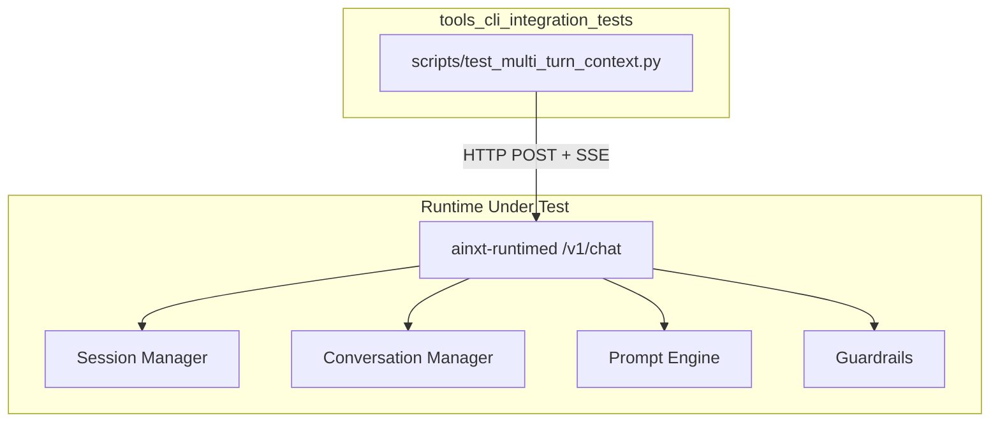
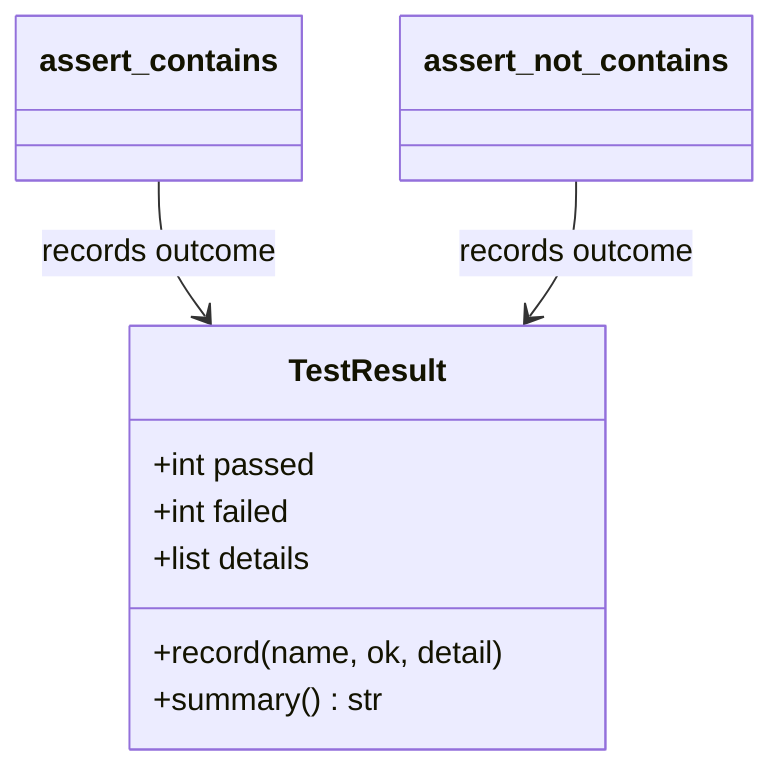
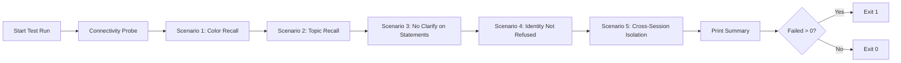
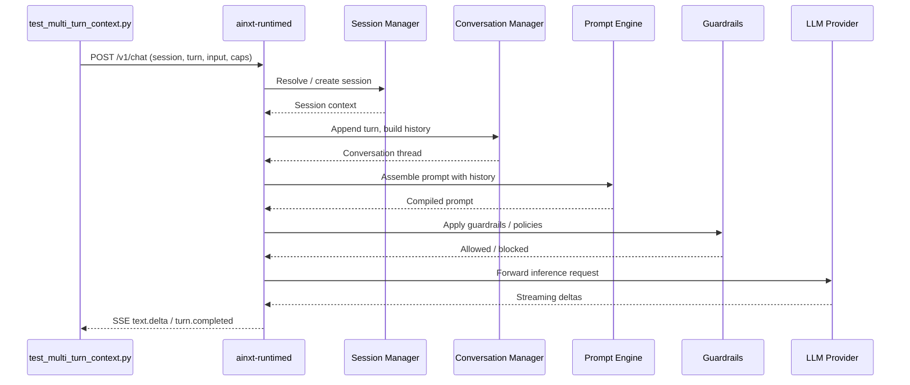
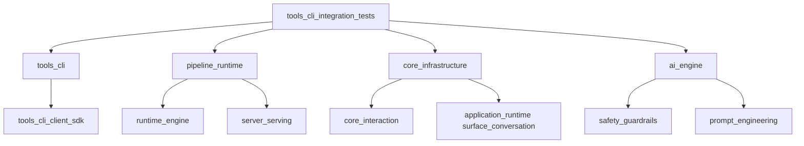

# tools_cli_integration_tests

## Brief Introduction

The `tools_cli_integration_tests` module provides end-to-end integration tests for the AiNxt command-line and client surface. Unlike the unit-test-heavy Rust crates, this module focuses on black-box validation of a live runtime daemon through its public HTTP API. The current implementation is centered on `scripts/test_multi_turn_context.py`, a regression guard that verifies multi-turn conversation context retention, session isolation, and guardrail behavior on the `/v1/chat` endpoint.

These tests are designed to be run against a running `ainxt-runtimed` instance and exercise the full stack from the HTTP surface through [session management](../core_infrastructure/core_infrastructure.md), [conversation orchestration](../core_infrastructure/core_infrastructure.md), [prompt assembly](../ai_engine/ai_engine.md), and [guardrails](../ai_engine/ai_engine.md). They complement the in-process Rust tests in [tools_cli](tools_cli.md) and the evaluation harnesses in [ai_engine evaluation_testing](../ai_engine/ai_engine.md) by validating real-world conversational behavior.

---

## Core Responsibilities

1. **Multi-turn context retention**: Ensure facts established in earlier turns are recalled in later turns on the same session.
2. **Session isolation**: Ensure facts from one session do not leak into another session.
3. **Guardrail regression testing**: Verify that benign statements and identity questions are not incorrectly refused or clarified.
4. **Live daemon validation**: Provide a lightweight, environment-configurable smoke test that can be pointed at any running runtime endpoint.

---

## Architecture

The module is intentionally thin. It consists of a standalone Python script that acts as an external client, driving the runtime's chat surface through HTTP and Server-Sent Events (SSE).



### Component Overview

| Component | File | Purpose |
|-----------|------|---------|
| `TestResult` | `scripts/test_multi_turn_context.py` | Aggregates pass/fail state and produces a human-readable summary for the test run. |

---

## `TestResult`

`TestResult` is a small accumulator used by the test scenarios to record individual assertion outcomes. It tracks:

- `passed`: count of successful assertions
- `failed`: count of failed assertions
- `details`: a list of `(name, ok, detail)` tuples used to render the final summary

The class is scenario-agnostic; the actual semantic checks are performed by helper functions such as `assert_contains` and `assert_not_contains`, which then call `TestResult.record`.



---

## Test Scenarios

The script implements five scenario functions. Each scenario creates one or more fresh session IDs and drives the `/v1/chat` endpoint through the `chat_turn` helper.



### Scenario 1 — Favorite Color Recall

Establishes a fact (`"My favorite color is blue."`) and later asks the model to recall it. This is the canonical regression test for conversation-history injection.

### Scenario 2 — Topic Recall

Asks about UPI, then asks an unrelated question about NACH, and finally asks whether UPI was discussed earlier and what was said about it. Validates that the model can distinguish multiple prior turns and recall both the question and the answer content.

### Scenario 3 — No Clarify on Statements

A plain declarative statement (`"I like pizza."`) must be acknowledged, not met with a clarify fallback such as `"I didn't quite catch that"`. This guards the [ClarifyPolicy](../ai_engine/ai_engine.md) fallback behavior.

### Scenario 4 — Identity Question Not Refused

Asking `"What is AiNxt?"` must produce a helpful answer rather than a refusal referencing "internal instructions." This guards the L4 guard-body behavior in [guardrails](../ai_engine/ai_engine.md).

### Scenario 5 — Cross-Session Isolation

Establishes a fact in session A, then asks the same recall question in session B. Session B must not know the answer, validating that session-scoped cache keys and conversation state are properly isolated. This depends on correct behavior from the [session](../core_infrastructure/core_infrastructure.md) and [cache](../core_infrastructure/core_infrastructure.md) subsystems.

---

## Data Flow

A single test turn follows this flow:



For a detailed breakdown of the runtime surface, see [pipeline_runtime runtime_engine](../pipeline_runtime/pipeline_runtime.md) and [pipeline_runtime server_serving](../pipeline_runtime/pipeline_runtime.md). For conversation and session internals, see [core_infrastructure core_interaction](../core_infrastructure/core_infrastructure.md) and [core_infrastructure application_runtime surface_conversation](../core_infrastructure/core_infrastructure.md).

---

## Dependencies

The integration test module depends on the runtime and its subsystems, but it does not introduce library dependencies beyond Python's standard library (`urllib`, `json`, `uuid`, etc.).



### Direct runtime dependencies

| Dependency | Module | Role in this test |
|------------|--------|-------------------|
| `ainxt-runtimed` | [pipeline_runtime](../pipeline_runtime/pipeline_runtime.md) | The daemon exposing `/v1/chat`. |
| Session management | [core_infrastructure core_interaction](../core_infrastructure/core_infrastructure.md) | Creates and isolates session state. |
| Conversation orchestration | [core_infrastructure application_runtime surface_conversation](../core_infrastructure/core_infrastructure.md) | Maintains turn history and injects it into prompts. |
| Guardrails | [ai_engine safety_guardrails](../ai_engine/ai_engine.md) | Determines whether inputs/outputs are allowed or clarified. |
| Prompt engine | [ai_engine prompt_engineering](../ai_engine/ai_engine.md) | Assembles the final prompt including history. |

---

## Configuration and Usage

The script is configured through environment variables:

| Variable | Default | Description |
|----------|---------|-------------|
| `RUNTIME_URL` | `http://127.0.0.1:8080` | Base URL of the running runtime daemon. |
| `LOCAL_API_KEY` | `""` | Bearer token forwarded as `Authorization` if provided. |
| `RUNTIME_TIMEOUT` | `120` | HTTP request timeout in seconds. |

### Running the tests

```bash
# Daemon must already be running on 127.0.0.1:8080
python scripts/test_multi_turn_context.py

# Point at a different host/port
RUNTIME_URL=http://127.0.0.1:8080 python scripts/test_multi_turn_context.py

# Use a real API key if the daemon forwards to the Neuron gateway
LOCAL_API_KEY=ainxt-ainxtloc-xxxx python scripts/test_multi_turn_context.py
```

### Exit codes

| Code | Meaning |
|------|---------|
| `0` | All assertions passed. |
| `1` | One or more context-recall assertions failed. |
| `2` | Could not reach the daemon (connection or HTTP error). |

---

## Integration with the Broader System

`tools_cli_integration_tests` sits at the outer edge of the [tools_cli](tools_cli.md) module family. While [tools_cli_headless_cli](tools_cli.md) and [tools_cli_client_sdk](tools_cli.md) provide the user-facing command and library interfaces, and [tools_cli_tool_runtime](tools_cli.md) implements the tool execution substrate, this module validates that the assembled system behaves correctly from an end-user conversational perspective.

It is typically used:

- In local development, to verify a running daemon after code changes.
- In CI, as a smoke test against a deployed runtime.
- As a regression guard for specific historical bugs (history injection, session cache collisions, clarify fallback, identity refusal).

For more comprehensive evaluation and benchmarking, see [ai_engine evaluation_testing](../ai_engine/ai_engine.md). For runtime configuration and serving internals, see [pipeline_runtime](../pipeline_runtime/pipeline_runtime.md).
