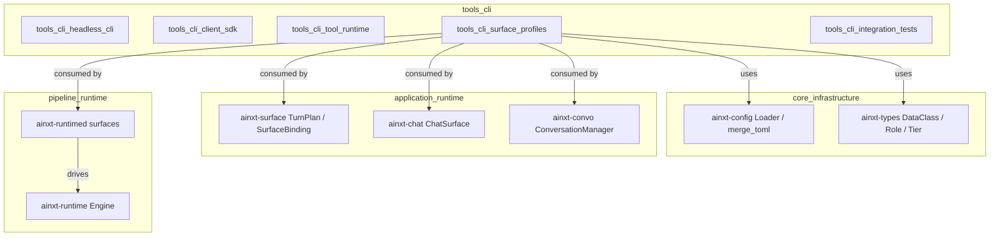
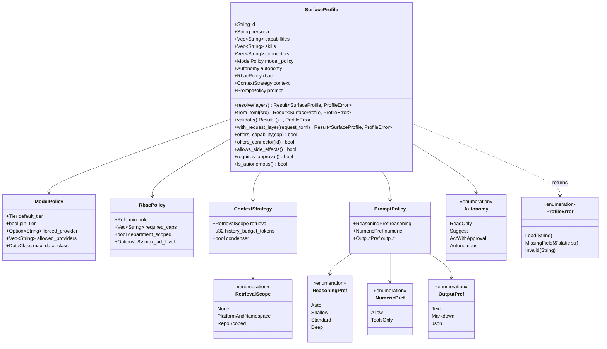
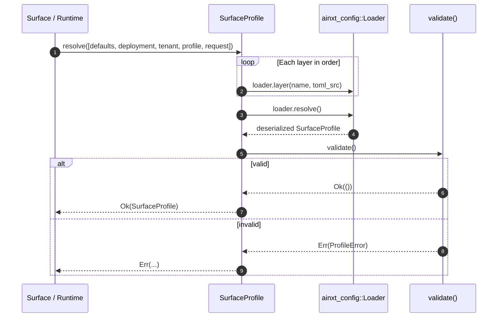
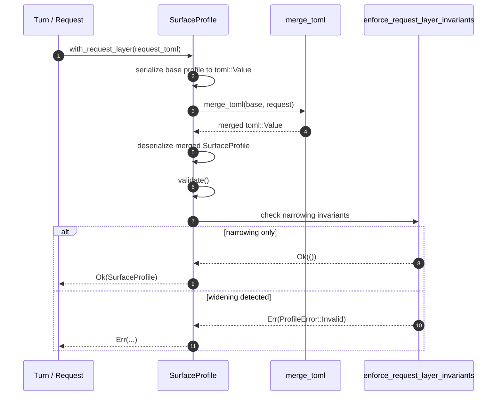
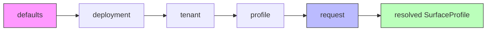
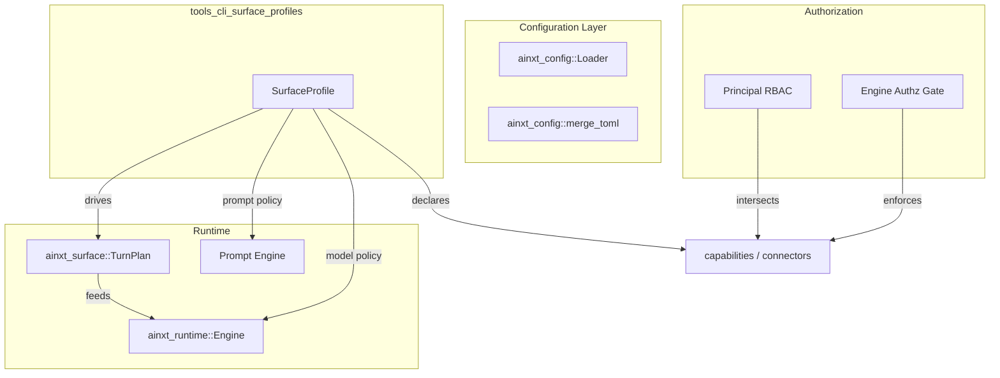

# tools_cli_surface_profiles — Surface Profile Schema & Layered Loader

## Brief Introduction

The `tools_cli_surface_profiles` module (crate `ainxt-profile`) defines the **declarative Surface Profile** schema and its layered resolution/validation engine. A product surface — such as Chat, Buddy, Code, or SDLC — is not a separate runtime; it is a **Renderer** plus a **Surface Profile** that configures the shared AI spine for that surface's persona, capabilities, model routing, autonomy, RBAC floor, retrieval scope, and prompt policy.

The crate's core responsibility is to answer one question: *"Given a stack of configuration layers, what is the effective, validated profile for this surface on this turn?"* It resolves profiles through a deep TOML merge (`defaults → deployment → tenant → profile → request`, most-specific last) and enforces hard safety invariants: a profile can **declare** authority but never **escalate** a principal, and a per-turn request layer may only narrow — never widen — the surface's authority.

All enterprise-hard concerns (compliance, RBAC enforcement, budget, audit) remain in the spine; the profile only declares intent. The engine enforces.

---

## Core Concepts

| Concept | Description |
|---------|-------------|
| **Surface Profile** | A validated, resolved configuration (`SurfaceProfile`) describing how one product surface behaves. |
| **Layered Resolution** | Deep TOML merge across `defaults`, `deployment`, `tenant`, `profile`, and `request` layers. |
| **Safety Invariant** | Profiles default to the safest posture (`Autonomy::ReadOnly`); request layers can only narrow authority. |
| **Effective Authority** | `capabilities`/`connectors` offered by the profile are intersected with the calling principal's RBAC by the engine. |
| **Turn-Time Override** | `with_request_layer` allows a single turn to tweak narrow preferences (reasoning depth, output format, tier) without changing identity, RBAC, or autonomy. |

---

## Architecture

### High-Level Module Position

### Component Diagram

---

## Component Reference

### `SurfaceProfile`

The top-level resolved profile. It is `Default`-derived so every omitted field falls back to a safe default. The struct is serializable with `serde` and validated after resolution.

Key methods:

- **`resolve(layers)`** — deep-merges ordered TOML layers and validates the result.
- **`from_toml(src)`** — convenience single-layer parse.
- **`validate()`** — ensures `id` is non-empty and `forced_provider` is inside `allowed_providers` when the allow-list is non-empty.
- **`with_request_layer(request_toml)`** — applies a turn-time request layer on top of an already-resolved profile, then enforces narrowing invariants.
- **`offers_capability` / `offers_connector`** — exact-match queries used by the engine to intersect with principal RBAC.
- **`allows_side_effects` / `requires_approval` / `is_autonomous`** — autonomy helpers.

### `ModelPolicy`

Controls model routing inputs. The runtime's router and data-class gate enforce the policy.

- `default_tier` — fallback complexity tier.
- `pin_tier` — when `true`, the surface hard-pins every turn to `default_tier`; the engine fails closed if no eligible provider exists at that tier.
- `forced_provider` — optional pinned provider (still subject to data-class exclusion).
- `allowed_providers` — provider allow-list; empty means any eligible provider.
- `max_data_class` — compliance ceiling for data the surface may handle.

### `RbacPolicy`

Declares the RBAC floor a principal must meet. The engine's authz gate enforces it; the profile never escalates a principal.

- `min_role` — minimum `Role` required.
- `required_caps` — capability claims required to use the surface.
- `department_scoped` — whether data is scoped by the principal's department.
- `max_ad_level` — optional Active Directory seniority ceiling (`0` = most senior, `6` = junior); principals without an `ad_level` claim are fail-closed refused.

### `ContextStrategy`

Configures how context is assembled.

- `retrieval` — `None`, `PlatformAndNamespace`, or `RepoScoped`.
- `history_budget_tokens` — token budget for conversation-history tail.
- `condenser` — whether the condenser may compress history when over budget.

### `PromptPolicy`

Mapped to the Prompt Engine in the runtime binding.

- `reasoning` — default reasoning depth (`Auto`, `Shallow`, `Standard`, `Deep`).
- `numeric` — whether numeric/tabular reasoning must go through tools (`Allow` vs `ToolsOnly`).
- `output` — preferred output rendering (`Text`, `Markdown`, `Json`).

### `Autonomy`

Ordered least-to-most capable:

1. `ReadOnly` — no side effects.
2. `Suggest` — may propose drafts/diffs but not execute.
3. `ActWithApproval` — may execute side-effecting tools, each requiring HITL approval.
4. `Autonomous` — may execute side-effecting tools without per-action approval (still RBAC-gated).

---

## Data Flow

### Profile Resolution Flow

### Turn-Time Request Layer Flow

---

## Layered Merge Semantics

- **Deep merge** — nested tables are recursively merged; later layers override scalar values in the same path.
- **Arrays replace** — a later array fully replaces an earlier array (not concatenated).
- **Most-specific wins** — `request` is the last layer and has the highest precedence.
- **Safe defaults** — omitted fields use `Default`, e.g. `Autonomy::ReadOnly`, `RetrievalScope::PlatformAndNamespace`, `Tier::Simple`.

---

## Request-Layer Narrowing Invariants

A request layer may only **narrow or hold** authority. The following changes are **rejected** (fail-closed):

| Attempted Change | Result |
|------------------|--------|
| Change `id` | Rejected |
| Change `persona` | Rejected |
| Change `skills` | Rejected |
| Change `rbac` floor | Rejected |
| Change `capabilities` | Rejected |
| Change `connectors` | Rejected |
| Change `autonomy` | Rejected |
| Change `context` / `retrieval` | Rejected |
| Change `model_policy.max_data_class` ceiling | Rejected |
| Change `model_policy.allowed_providers` allow-list | Rejected |
| Remove a deployment-pinned `pin_tier` | Rejected |
| Override a deployment-pinned `forced_provider` | Rejected |
| Select a `forced_provider` outside the allow-list | Rejected |
| Loosen `numeric` discipline (`tools-only` → `allow`) | Rejected |

Allowed narrowing tweaks include:

- `model_policy.default_tier`
- `prompt.reasoning`
- `prompt.output`
- Setting `forced_provider` when unset and within the allow-list
- Strengthening `numeric` (`allow` → `tools-only`)

---

## Dependencies

### Direct Crate Dependencies

| Crate | Module | Usage |
|-------|--------|-------|
| `ainxt-config` | [`core_infrastructure`](../core_infrastructure/core_infrastructure.md) | `Loader` for deep TOML merge and `merge_toml` for request-layer override. |
| `ainxt-types` | [`core_infrastructure`](../core_infrastructure/core_infrastructure.md) | `DataClass`, `Role`, `Tier` vocabulary. |
| `serde` / `toml` | external | Serialization and TOML parsing. |

### Consumers

| Crate | Module | Relationship |
|-------|--------|--------------|
| `ainxt-surface` | [`application_runtime`](../core_infrastructure/application_runtime.md) | `TurnPlan` and `SurfaceBinding` consume the profile to plan a turn. |
| `ainxt-chat` | [`application_runtime`](../core_infrastructure/application_runtime.md) | `ChatSurface` binds a profile to a chat surface. |
| `ainxt-convo` | [`application_runtime`](../core_infrastructure/application_runtime.md) | `ConversationManager` uses profile-derived context strategy. |
| `ainxt-runtimed` | [`pipeline_runtime`](../pipeline_runtime/pipeline_runtime.md) | Runtime surfaces (`chat_identity`, `fabric_chat`, `workforce_surface`, `prompt_optimizer_surface`) load and apply profiles. |
| `ainxt-runtime` | [`pipeline_runtime`](../pipeline_runtime/pipeline_runtime.md) | `Engine` enforces the model policy, RBAC, and data-class ceiling declared by the profile. |

---

## Error Model

`ProfileError` is the crate's only error type:

- **`Load(String)`** — parse or merge/deserialize failure.
- **`MissingField(&'static str)`** — required field absent after resolution (currently `id`).
- **`Invalid(String)`** — internal inconsistency or request-layer invariant violation.

All failures are fail-closed: an invalid profile cannot be used.

---

## Integration with the Wider System

The profile is a **declaration**; the engine is the **enforcer**. This separation is intentional: enterprise-hard concerns such as compliance, RBAC, budget, and audit remain in the spine, while the profile provides a product-surface-specific configuration layer.

---

## Testing Strategy

The crate's inline tests cover:

- Safe defaults for a minimal profile.
- Deep layered merge with most-specific-wins semantics.
- Array replacement behavior.
- Validation of required fields and provider allow-lists.
- Unknown-field rejection (`deny_unknown_fields`).
- Autonomy helper correctness.
- Capability/connector query helpers.
- JSON serde round-tripping.
- Request-layer narrowing invariants (R15).
- Tier-pin policy (`pin_tier`) behavior.
- Numeric discipline strengthening.

---

## Related Documentation

- [`tools_cli.md`](tools_cli.md) — parent module overview (CLI, client SDK, tool runtime, profiles, integration tests).
- [`tools_cli_tool_runtime.md`](tools_cli_tool_runtime.md) — tool runtime and capability/connector execution.
- [`core_infrastructure.md`](../core_infrastructure/core_infrastructure.md) — `ainxt-config` loader and `ainxt-types` vocabulary.
- [`application_runtime.md`](../core_infrastructure/application_runtime.md) — surfaces, chat, and conversation runtime that consume profiles.
- [`pipeline_runtime.md`](../pipeline_runtime/pipeline_runtime.md) — runtime engine and served surfaces that enforce profile policies.
