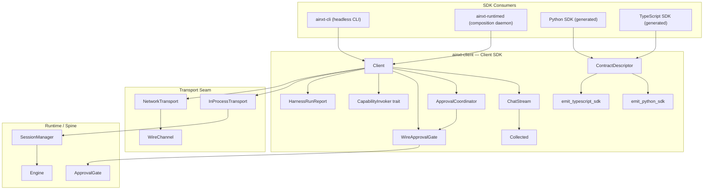
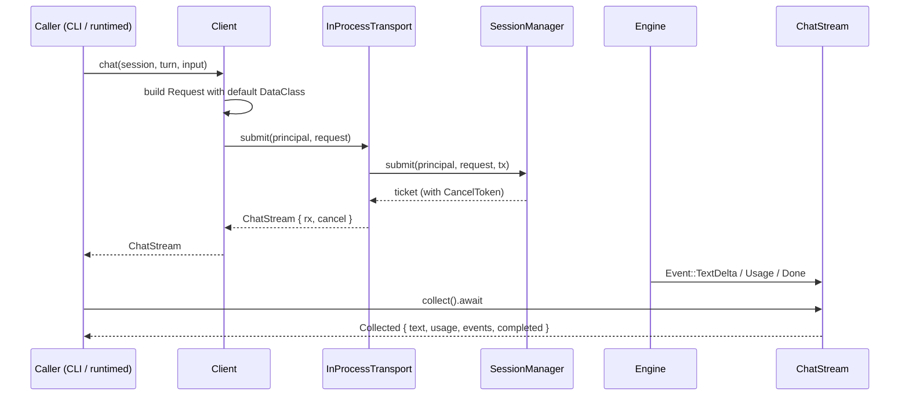
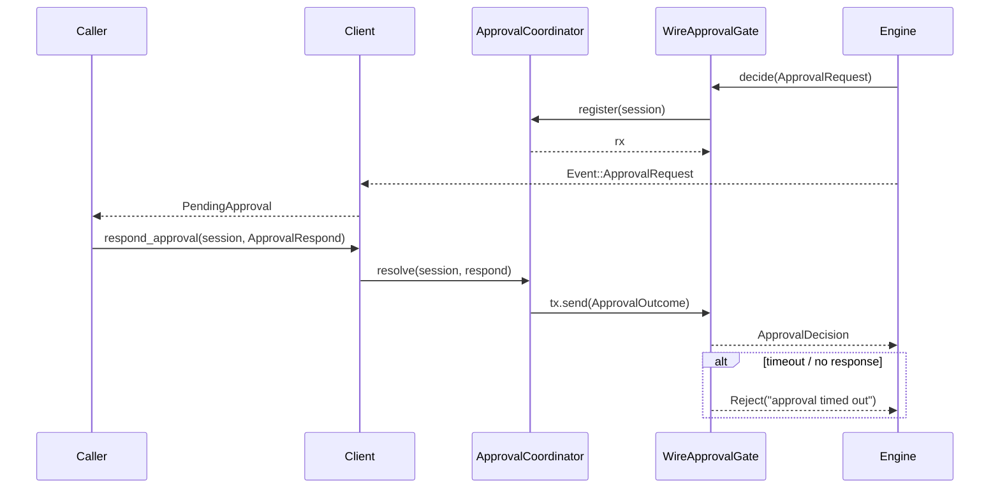
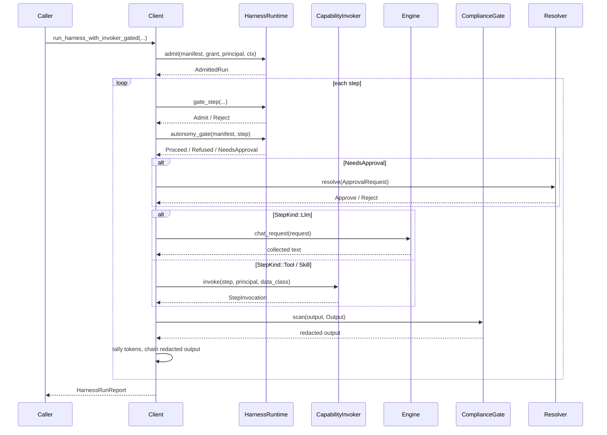
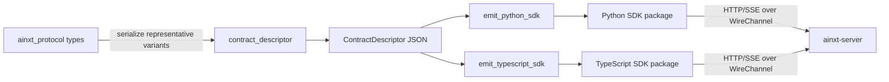
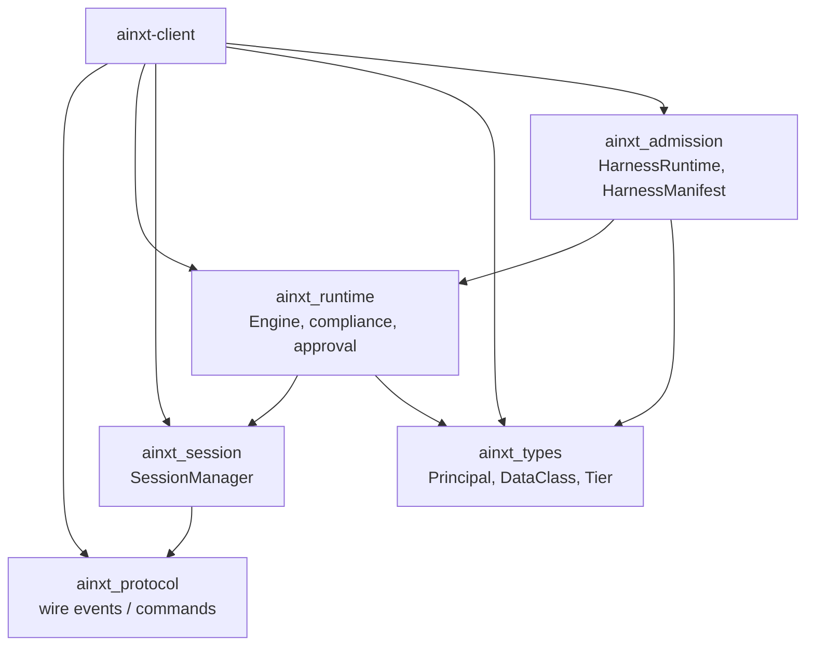

# tools_cli_client_sdk

The **Client SDK** (`ainxt-client`) is the Rust protocol client and the reference implementation of the AiNxt wire contract. It provides the typed boundary through which local and remote callers submit turns, stream events, and run declarative harnesses against the AiNxt runtime. Its consumers today are the headless CLI (`ainxt-cli`) and the composition daemon (`ainxt-runtimed`); future Python and TypeScript SDKs are generated from the same machine-readable contract descriptor maintained in this crate.

The SDK is intentionally transport-agnostic: an [`InProcessTransport`] embeds the [`SessionManager`](ainxt_session::SessionManager) and runs turns directly inside the caller's process, while a [`NetworkTransport`] (feature `http`) encodes the same contract over HTTP/SSE to a remote `ainxt-server`. Both transports yield the same [`ChatStream`] of typed [`Event`](ainxt_protocol::Event)s and the same [`Collected`] result semantics, so callers see a single surface regardless of deployment topology.

---

## Architecture



### Key Design Decisions

- **Reference contract implementation**: every wire type, event shape, and error category used by the Python/TypeScript SDKs is derived from the live `ainxt_protocol` types via [`contract_descriptor`], not hand-maintained.
- **Transport seam**: the [`Transport`] trait isolates the client from whether the runtime is in-process or remote. The in-process path is production today; the network path is a thin socket shim over a proven codec.
- **Fail-closed HITL**: [`WireApprovalGate`] blocks a gated turn on [`ApprovalCoordinator`] and rejects if no human response arrives before the timeout. This mirrors the server-side `ApprovalCoordinator`/`WireApprovalGate` pair exactly.
- **Harness bridge**: declarative harness steps are executed as real engine turns or real capability invocations, so compliance, RBAC, backpressure, and cancelation run inside the spine rather than around it.

---

## Core Components

### `Client`

[`Client`] is the typed entry point. It is bound to one authenticated [`Principal`](ainxt_types::Principal) and can run many turns across many sessions. It exposes:

- `chat(session, turn, input)` — convenience one-shot turn using the configured default [`DataClass`](ainxt_types::DataClass).
- `chat_request(Request)` — fully-specified turn (tier, forced provider, namespace, data class).
- `respond_approval(session, ApprovalRespond)` — deliver a human approval decision back to a blocked in-process gate.
- `run_harness(...)` — run a declarative harness with every admitted step executed as an engine turn.
- `run_harness_with_invoker(...)` — run a harness with real tool/skill/connector dispatch and autonomy/HITL enforcement.
- `run_harness_with_invoker_gated(...)` — same as above, but applies a [`ComplianceGate`](ainxt_runtime::compliance::ComplianceGate) to every step result before chaining.

### `Transport` and `InProcessTransport`

The [`Transport`] trait is the seam a client speaks through:

```rust
pub trait Transport: Send + Sync {
    fn submit(&self, principal: Principal, request: Request) -> Result<ChatStream, ClientError>;
}
```

[`InProcessTransport`] implements this by calling [`SessionManager::submit`](ainxt_session::SessionManager). If the session cap is reached it returns [`ClientError::Backpressure`], which the caller can translate to an HTTP 503 or retry.

### `NetworkTransport` and `WireChannel`

The `net` submodule contains the offline-proven codec for the future HTTP/SSE transport:

- `encode_submit` — JSON body for `POST /v1/chat`.
- `sse_data_payload` — strip SSE `data:` framing.
- `decode_event_frame` — decode one payload into an [`Event`](ainxt_protocol::Event) or the `[DONE]` sentinel.
- [`WireChannel`] — the socket seam; a real deployment fills it with `reqwest`/`hyper`.
- [`NetworkTransport`] — a [`Transport`] over any [`WireChannel`], forwarding decoded events into a [`ChatStream`].

Because the codec is implemented and tested here, the network transport is a thin socket shim over a proven core rather than untested prose.

### `ChatStream` and `Collected`

[`ChatStream`] is a live stream of a turn's events backed by a bounded channel. Callers can:

- `recv().await` — stream events incrementally.
- `cancel()` — stop the in-flight turn (idempotent).
- `collect().await` — drain the stream into a [`Collected`] result.

[`Collected`] contains the final text, every event, terminal error, token [`Usage`], pending approvals, and a completion flag. It is the non-streaming API used by the CLI `--print` mode and contract tests.

### HITL Approval: `ApprovalCoordinator` and `WireApprovalGate`

The SDK-side HITL round-trip mirrors the server-side pair:

- [`ApprovalCoordinator`] registers a pending approval per session and resolves it when `respond_approval` is called.
- [`WireApprovalGate`] implements the runtime's [`ApprovalGate`](ainxt_runtime::approval::ApprovalGate) trait. It blocks on the coordinator and fails closed on timeout.
- `Client::in_process_with_approvals` installs this gate on a fresh embedded engine so an in-process caller (CLI/desktop app) can both observe `Event::ApprovalRequest` and answer it.

### Harness Bridge

The harness bridge turns a declarative [`HarnessManifest`](ainxt_admission::HarnessManifest) into real execution:

- `run_harness` — every admitted `Llm` step runs as an engine chat turn. `Tool`/`Skill` steps are also run as engine turns in this bare entrypoint (no real capability dispatch).
- `run_harness_with_invoker` — `Tool`/`Skill` steps invoke their named capability through a [`CapabilityInvoker`], while `Llm` steps still stream through the engine. Autonomy (`none`/`assisted`/`autonomous`) and an [`ApprovalResolver`](ainxt_admission::ApprovalResolver) enforce write approval.
- `run_harness_with_invoker_gated` — additionally applies a [`ComplianceGate`](ainxt_runtime::compliance::ComplianceGate) to every step result, so untrusted tool/connector output is redacted before it is recorded or fed to the next step.

[`StepInvocation`] is the result of a real capability execution, distinct from a bare LLM chat turn.

### SDK Contract Descriptor and Codegen

The `sdk_contract` submodule is the machine-readable projection of the wire contract:

- [`ContractDescriptor`] — serializable description of protocol version, supported major window, every runtime→client event, every client→runtime command, the closed error taxonomy, and referenced closed enums.
- [`contract_descriptor`] — derives the descriptor directly from live `ainxt_protocol` types by serializing representative variants, so it cannot silently drift.
- [`emit_python_sdk`] — generates Python dataclasses, error taxonomy, enum unions, and an ergonomic `Runtime`/`Harness` skeleton.
- [`emit_typescript_sdk`] — generates TypeScript interfaces, discriminated unions, and a matching client skeleton.

The generated language packages are the infra follow-up; this crate provides the offline seam, implementation, and tests they build on.

---

## Data Flows

### Chat Turn (In-Process)



### HITL Approval Round-Trip



### Harness Execution with Real Capability Dispatch



### SDK Codegen Pipeline



---

## Dependencies

The Client SDK sits at the edge of the system and depends on the protocol, runtime, session, type system, and admission crates. It does not depend on the server, serving infrastructure, or specific AI models.



For details on the modules this crate builds on, see:

- [core_interaction.md](core_interaction.md) — session, protocol, and event-log semantics.
- [ai_engine.md](ai_engine.md) — the engine that executes turns behind the client.
- [governance_compliance.md](governance_compliance.md) — admission, approval, and harness governance.
- [tools_cli_headless_cli.md](tools_cli_headless_cli.md) — the headless CLI that consumes this SDK.
- [tools_cli_tool_runtime.md](tools_cli_tool_runtime.md) — the tool runtime that backs [`CapabilityInvoker`] implementations.

---

## Error Handling

The client surfaces two high-level error variants:

- `ClientError::Backpressure(String)` — the runtime shed the turn under load. Callers should retry later or surface HTTP 503.
- `ClientError::Transport(String)` — a transport-level failure (network, serialization). Relevant for network transports.

Harness execution reports policy refusals (capability denied, data-class exceeded, approval rejected) inside [`HarnessRunReport::outcome`](ainxt_admission::HarnessOutcome) rather than as a client error, because a refused harness is a successful SDK operation with a negative result.

---

## Testing Strategy

The crate's tests cover:

- Streaming and collecting a chat turn.
- Incremental `recv()` delivery.
- Backpressure surfacing as `ClientError::Backpressure`.
- Cancelation safety and idempotency.
- SDK-side HITL approve/reject/timeout round-trips.
- Harness bridge running steps through the engine and redacting PANs.
- Capability denial before any engine turn.
- Data-class ceiling enforcement.
- Real capability dispatch for `Tool`/`Skill` steps.
- Assisted-autonomy write approval before side effects.
- Step-result redaction before chaining.
- Harness `model_policy` and `context.namespace` shaping the engine request.

These tests run fully offline against mock providers and in-memory session managers.

---

## Future Work

The following items are intentionally infra-gated and recorded in the design docs (`HARNESS_SDK.md`, `P4_EXIT_DOD.md`):

- **Network HTTP/SSE transport**: the codec and `NetworkTransport` skeleton exist; the live socket implementation against a running `ainxt-server` is the remaining piece.
- **Python SDK package**: generated from [`emit_python_sdk`], lives in its own repo/CI, and speaks HTTP/SSE to the server.
- **TypeScript SDK package**: generated from [`emit_typescript_sdk`], lives in its own repo/CI, and powers the IDE extension and web tooling.
