# tools_cli_tool_runtime

## Brief Introduction

The `tools_cli_tool_runtime` module implements the **Tool Runtime** and **Side-Effect Ledger** for the ainxt system. It is the execution layer that sits beneath the CLI and client SDK, responsible for dispatching tool calls, enforcing deterministic guardrails, preventing double-execution of side effects, and auditing every authorization decision. The module is defined in the `ainxt-tools` crate and is a core part of the broader [`tools_cli`](tools_cli.md) subsystem.

This module guarantees that side-effecting tools execute **at most once** per idempotency key, supports multi-step sagas with compensation, and resolves lost-ack scenarios through reconciliation rather than silent re-execution. It also integrates pre/post hooks, on-behalf-of (OBO) authorization, data-class classification, and egress controls.

---

## Module Purpose and Core Functionality

The Tool Runtime answers four questions for every tool call:

1. **Is the caller authorized?** — via OBO policy, grants, clearance, and issued scopes.
2. **Is the call safe to execute?** — via deterministic pre/post hooks, data-class scans, and egress allow-lists.
3. **Has this side effect already happened?** — via the ledger-backed idempotency system.
4. **What happens if the call is lost in flight?** — via the reconciler/sweeper that resolves pending rows.

Core capabilities include:

- **Tool dispatch** for native, MCP-discovered, and plugin-provided capabilities.
- **Effect classification** using the canonical four-value `EffectClass` from [`ainxt_payments`](governance_compliance_payments.md).
- **Exactly-once execution** for `SideEffecting` tools through a durable or in-memory ledger.
- **Two-phase commit** (`dry_run` → `commit`) for `HighRisk` tools.
- **Pre/post hooks** for argument/output rewriting and refusal.
- **OBO dispatch** with structured audit and no ambient fallback.
- **Saga execution** with compensation steps.
- **Reconciliation sweeper** for in-doubt ledger rows.

---

## Architecture

### High-Level Component Overview

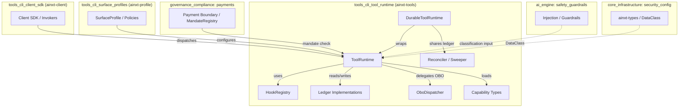

### ToolRuntime Internal Structure

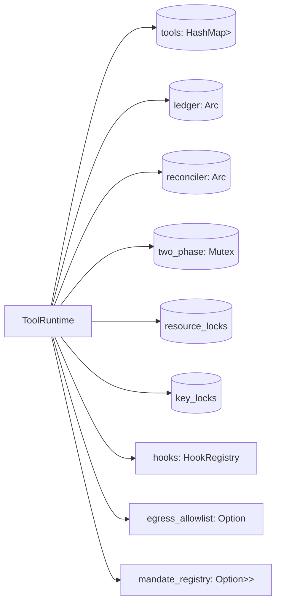

The runtime is intentionally stateful around concurrency control and idempotency. It maintains:

- A registry of `Tool` implementations keyed by capability name.
- A pluggable `Ledger` for exactly-once tracking.
- A `Reconciler` for resolving in-doubt rows.
- Two-phase commit state for `HighRisk` previews.
- Per-resource and per-idempotency-key mutex tables for concurrent duplicate prevention.
- A `HookRegistry` for deterministic guardrails.
- Optional egress and mandate registries.

---

## Core Components

### Capability Model

Tools are represented by the `Tool` trait (referenced from `lib.rs`). The runtime supports multiple capability origins:

| Capability Type | Source | Key Types |
|----------------|--------|-----------|
| Native | Built-in Rust implementations | `NativeControlLock` |
| MCP | Model Context Protocol servers | `McpTool`, `McpCapability` |
| Plugin | WASM/native plugins | `PluginCapability` |
| Search | Capability discovery | `CapabilitySearchTool` |
| Ledger Query | Introspection of the ledger | `LedgerQueryTool` |

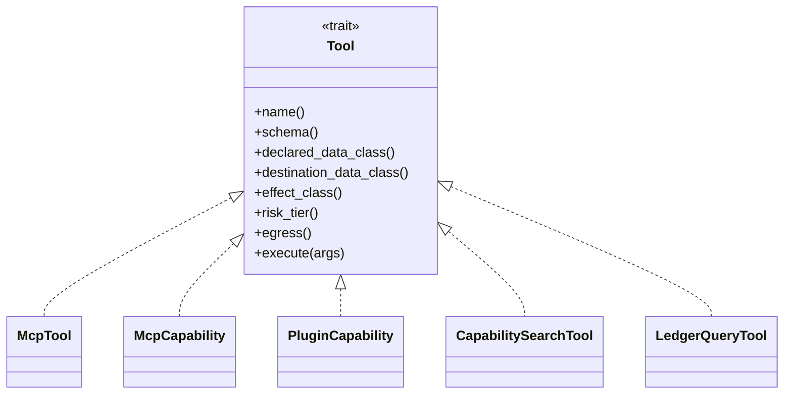

### Effect Classification and Risk Tiers

The runtime adopts `PaymentEffectClass` from [`ainxt_payments`](governance_compliance_payments.md) as the canonical effect classification:

- `Pure` — no side effects; safe to retry.
- `Idempotent` — world-changing but retry-safe; no ledger needed.
- `SideEffecting` — requires ledger-backed exactly-once execution.
- `PaymentInitiating` — **non-dispatchable**; refused at registration and dispatch.

Risk tiers drive approval and two-phase requirements:

| RiskTier | Approval Gate | Two-Phase Commit |
|----------|--------------|------------------|
| `Low` | No | No |
| `Elevated` | Yes | No |
| `High` | Yes | No |
| `HighRisk` | Yes | Yes (`dry_run` → `commit`) |

### Data-Class Classification

Every call is classified by fusing three independent signals and escalating to the most sensitive:

1. **Declared** — the tool's own claim.
2. **ArgScan** — compliance scan of serialized arguments (`MarkerArgScanner`, `BoundedArgScanner`).
3. **Destination** — egress destination sensitivity.

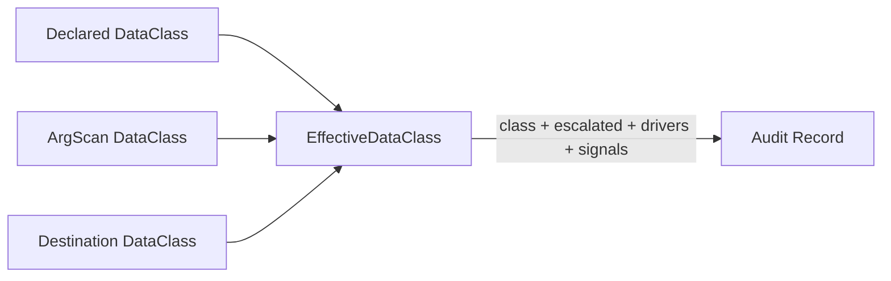

This classification gates model routing and approval but does not itself deny the turn. See [`ai_engine_safety_guardrails`](ai_engine_safety_guardrails.md) for the broader safety context.

---

## Hook System

The `HookRegistry` provides deterministic pre/post guardrails around every dispatch. Hooks are defined in [`hooks.rs`](crates/ainxt-tools/src/hooks.rs).

### Hook Types

- `PreHook` — runs before execution; may rewrite arguments or refuse.
- `PostHook` — runs after execution; may rewrite output or refuse.

### Ordering

- **Pre-hooks**: global first, then tool-specific. Ensures platform-wide checks cannot be bypassed by a tool-specific rewrite.
- **Post-hooks**: tool-specific first, then global. Ensures targeted verification sees raw output before blanket transforms like redaction.

### Built-in Hooks

| Hook | Type | Behavior |
|------|------|----------|
| `HashVerifyHook` | Post | Refuses output whose SHA-256 does not match an expected digest. |
| `DenyArgsHook` | Pre | Refuses arguments containing forbidden substrings (substring, not regex, to avoid ReDoS). |
| `TruncateOutputHook` | Post | Rewrites oversized output with a visible truncation marker. |

Hooks refuse by returning `Err(HookRefusal)`, which becomes a `Blocked` dispatch result. They are intentionally sync, non-blocking, and allocation-free of a runtime.

---

## Ledger and Exactly-Once Execution

The ledger is the foundation of the exactly-once guarantee for `SideEffecting` tools.

### Ledger Implementations

| Implementation | Use Case |
|----------------|----------|
| `InMemoryLedger` | Tests and single-process deployments. |
| `EventLogLedger<L: EventLog>` | Durable append-only log backing. |
| `SqlLedger<D: SqlLedgerDriver>` | SQL-backed durability (e.g., PostgreSQL via `PostgresSqlLedgerDriver`). |
| `InMemorySqlStore` | In-memory SQL semantics for testing. |

### Ledger States

A side-effecting call progresses through ledger states:

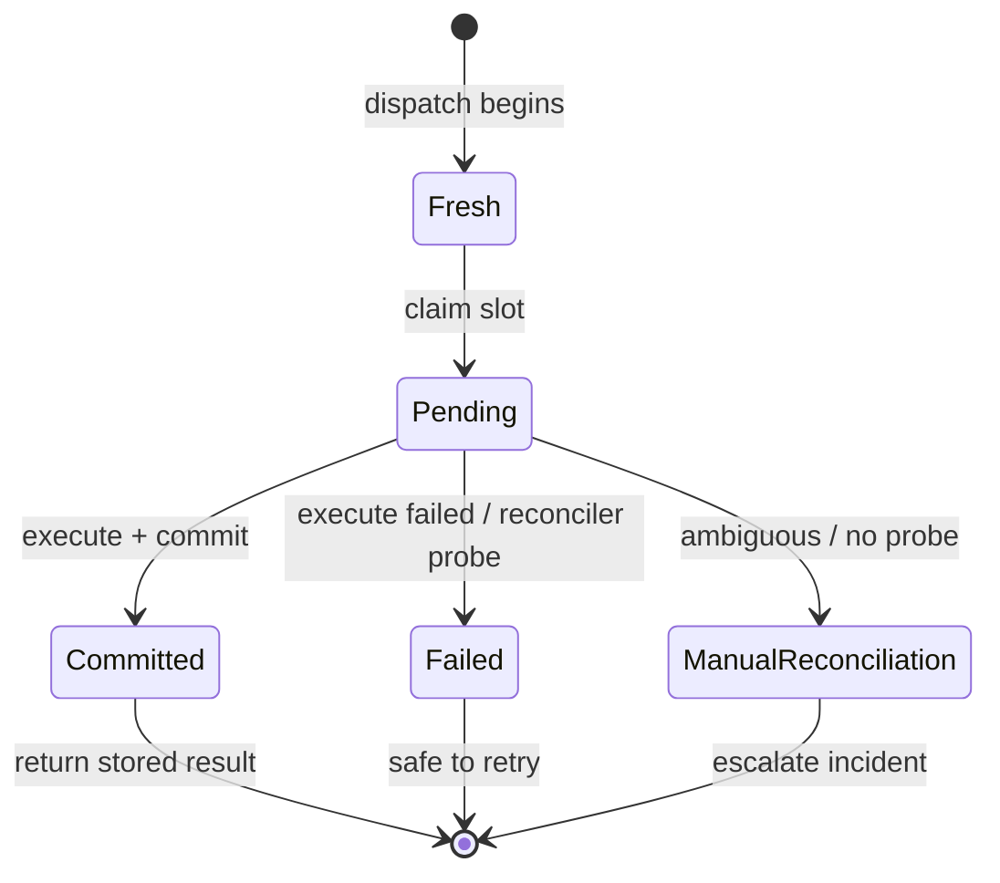

### Concurrency Controls

The runtime uses two complementary locking tables:

1. **`resource_locks`** — serializes calls targeting the same resource key while allowing parallel execution across disjoint resources.
2. **`key_locks`** — serializes concurrent dispatches with the same idempotency key (e.g., UI double-click + retry).

Together with the cross-process ledger, these cover both concurrent-duplicate and retry-after-restart double-execution scenarios.

---

## Dispatch Flow

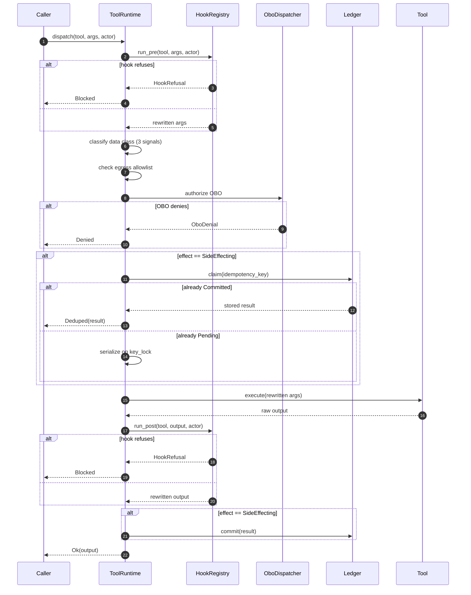

---

## Two-Phase Commit for HighRisk Tools

`HighRisk` tools cannot be dispatched directly. They require a preview step:

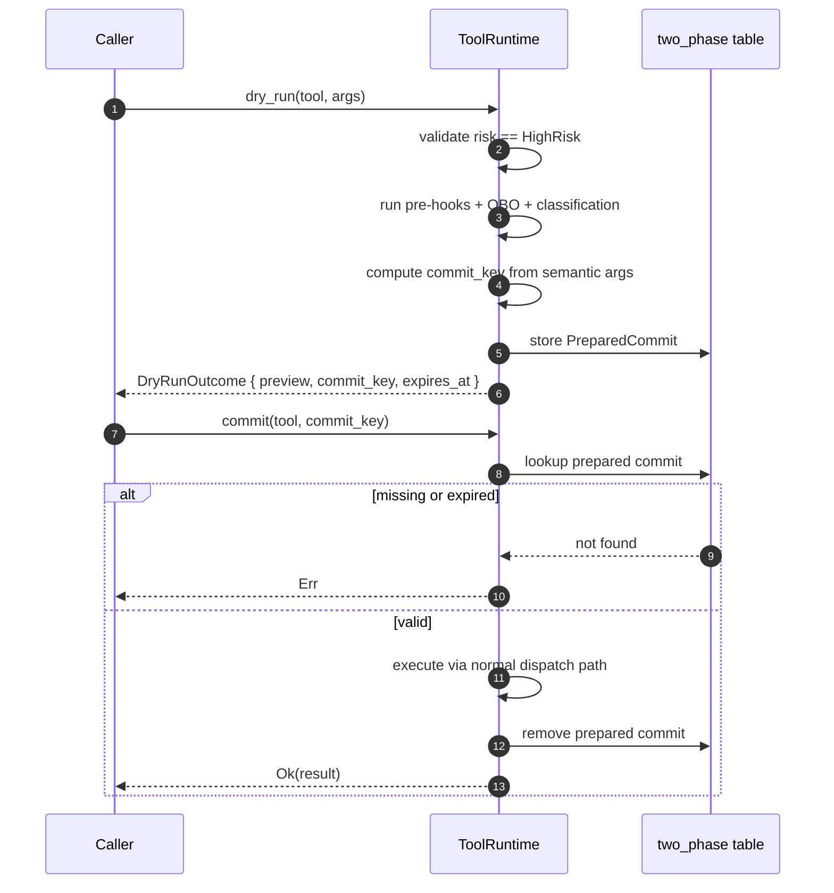

The idempotency key must be purely semantic; timestamps or random components are forbidden because they would reopen the double-execution hole.

---

## OBO Authorization

`OboDispatcher` enforces on-behalf-of authorization with three layers:

1. **Layer 1 — Harness/role grants**: scoped declared grants.
2. **Layer 2 — Issued credential scope**: the user's actual token scopes (e.g., GitLab, Graph consent).
3. **Layer 3 — Clearance**: maximum data class the user may touch.

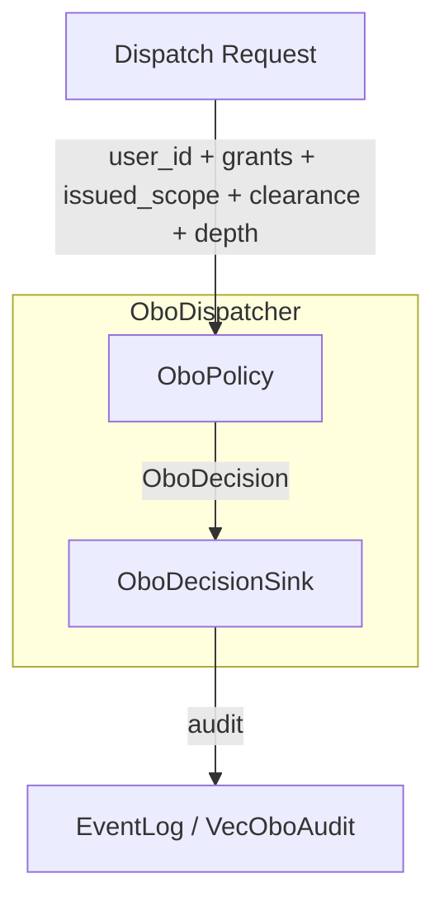

There is no ambient fallback. A denied OBO call returns a structured `OboDenial` and is recorded in the audit sink (`VecOboAudit`, `EventLogOboAudit`, or `NoOboAudit`).

---

## Reconciliation and Sweeper

When a `Pending` row is left in the ledger (crash, lost ack, downstream timeout), the `ReconcilerSweeper` resolves it:

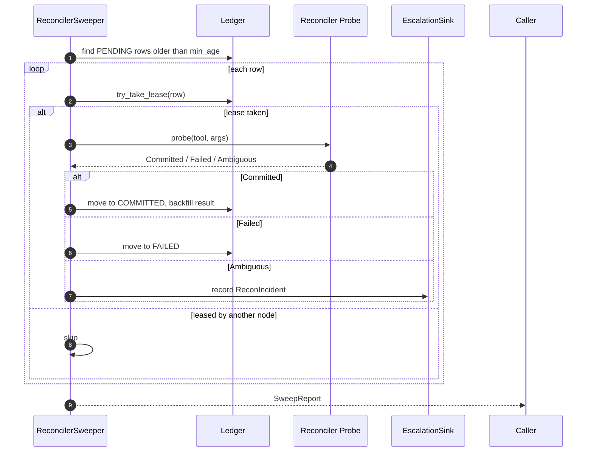

The sweeper is designed to be safe to run concurrently: leases prevent double-probe, and ambiguous rows are escalated rather than guessed.

---

## Sagas

Multi-step side effects run as sagas with compensation. Each `LedgerSagaStep` carries:

- `name` — human-readable step name.
- `key` — semantic idempotency key for the step.
- `action` — the forward effect.
- `compensate` — the compensating action.

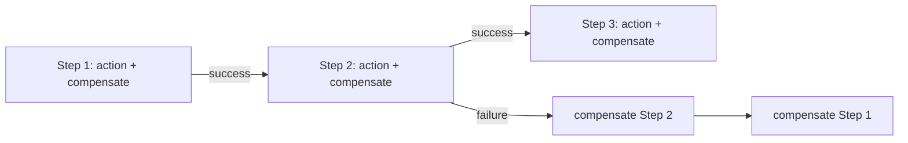

Sagas extend the single-tool exactly-once guarantee to coordinated sequences.

---

## Dependencies

The `tools_cli_tool_runtime` module depends on several other modules in the system:

| Dependency Module | Purpose |
|-------------------|---------|
| [`tools_cli_client_sdk`](tools_cli_client_sdk.md) | Higher-level invokers and transport abstractions that call into the runtime. |
| [`tools_cli_surface_profiles`](tools_cli_surface_profiles.md) | Surface profiles and policies that configure runtime behavior. |
| [`governance_compliance_payments`](governance_compliance_payments.md) | `PaymentEffectClass`, `MandateRegistry`, and payment-adjacent mandate enforcement. |
| [`core_infrastructure_security_config`](core_infrastructure_security_config.md) | `DataClass`, `Principal`, and token/config primitives. |
| [`ai_engine_safety_guardrails`](ai_engine_safety_guardrails.md) | Injection detection and guardrail inputs for data-class classification. |
| [`core_infrastructure_connectors`](core_infrastructure_connectors.md) | Connector runtime and MCP registry integration for MCP capabilities. |
| [`core_infrastructure_application_runtime`](core_infrastructure_application_runtime.md) | Plugin host and WASM sandbox for plugin capabilities. |

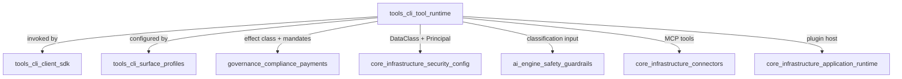

---

## Safety and Invariants

The module enforces several critical invariants:

1. **Payment-initiating tools are structurally non-dispatchable.** `EffectClass::PaymentInitiating` has no dispatch arm.
2. **Side-effecting tools require a purely semantic idempotency key.** Missing or non-semantic keys are refused.
3. **No ambient fallback for OBO authorization.** Every call is authorized as a specific user or denied.
4. **Hooks refuse, not just warn.** A guardrail that only logs is decoration.
5. **Data-class classification escalates to the most sensitive signal.** Disagreement never averages down.
6. **Reconciliation escalates ambiguity.** Rows that cannot be probed are paged, not silently re-run.
7. **Two-phase commit is mandatory for `HighRisk` tools.** Direct dispatch is refused.

---

## Integration with the Broader System

The Tool Runtime sits at the boundary between the conversational/surface layer and the outside world. It is called by:

- The [`tools_cli_client_sdk`](tools_cli_client_sdk.md) invokers (`RecordingInvoker`, `LeakThenRecordInvoker`, etc.).
- The runtime engine in [`pipeline_runtime_runtime_engine`](pipeline_runtime_runtime_engine.md) via surfaces like `WorkforceSurface` and `PromptOptimizerSurface`.
- The server layer in [`pipeline_runtime_server_serving`](pipeline_runtime_server_serving.md) through HTTP request handlers.

It delegates outward to:

- Connectors and MCP servers for external tool discovery and execution.
- The payment boundary for mandate checks on payment-adjacent actions.
- The event log for durable audit records.

---

## References

- [`tools_cli`](tools_cli.md) — parent module overview.
- [`tools_cli_client_sdk`](tools_cli_client_sdk.md) — client SDK and invokers.
- [`tools_cli_surface_profiles`](tools_cli_surface_profiles.md) — surface profiles and runtime configuration.
- [`governance_compliance_payments`](governance_compliance_payments.md) — payment boundary and effect classification.
- [`core_infrastructure_security_config`](core_infrastructure_security_config.md) — security primitives (`DataClass`, `Principal`).
- [`ai_engine_safety_guardrails`](ai_engine_safety_guardrails.md) — injection detection and content guardrails.
- [`core_infrastructure_connectors`](core_infrastructure_connectors.md) — connector and MCP runtime.
- [`core_infrastructure_application_runtime`](core_infrastructure_application_runtime.md) — plugin and WASM runtime.
- [`pipeline_runtime_runtime_engine`](pipeline_runtime_runtime_engine.md) — runtime engine integration.
- [`pipeline_runtime_server_serving`](pipeline_runtime_server_serving.md) — server and serving infrastructure.
