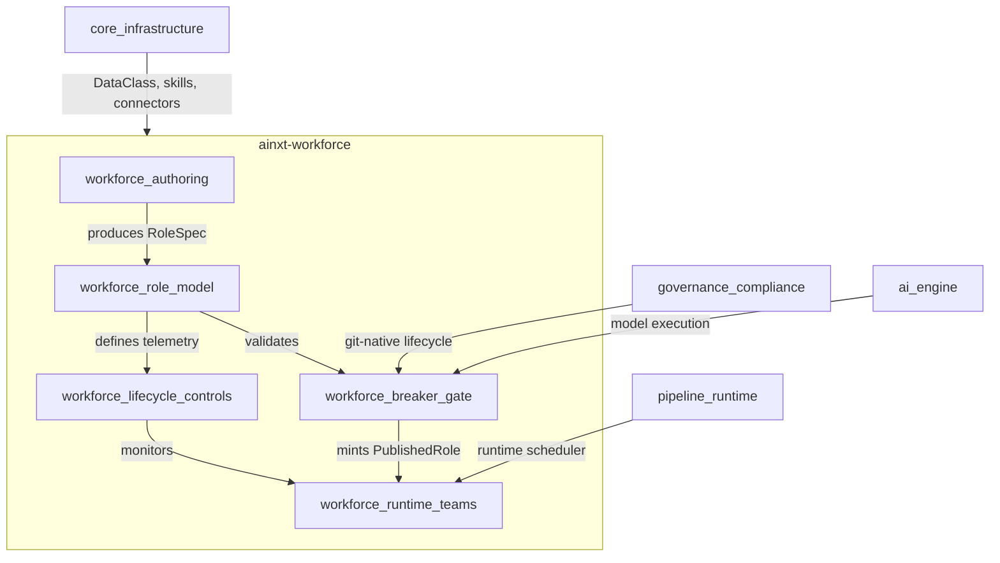

# Workforce Module

## Overview

The **Workforce** module (`ainxt-workforce`) implements the *digital worker* layer of the system: the creation, governance, lifecycle, and runtime orchestration of autonomous AI roles. It provides the type system and state machines that turn a plain-language job description into a published, monitored, and eventually retired digital worker — while enforcing that no role can ever be published without passing a mandatory adversarial Breaker gate.

The module's central contract is **governance by construction**: a [`PublishedRole`](workforce_role_model.md) can only be minted by the Breaker publish gate, a [`RoleProcess`](workforce_runtime_teams.md) can only be spawned from a `PublishedRole`, and a [`DigitalTeam`](workforce_runtime_teams.md) can only be assembled from published roles. These invariants are enforced in the type system, not by runtime convention.

## Purpose

- Enable **conversational authoring**: a creator describes a job in plain language and the system auto-assembles a governed role spec from pre-vetted templates.
- Enforce **least-privilege, data-class-aware, human-accountable** role design through structural validation.
- Provide a **non-skippable adversarial gate** (the Breaker) that stress-tests every role before publish.
- Run **continuous production controls**: decay, orphan, re-certification, oversight-health, and attention-check sweeps.
- Bridge to the runtime by modelling published roles as **processes on a kernel** and departments as **digital teams** of collaborating roles.

## Architecture

The Workforce module sits between the infrastructure crates (types, skills, connectors) and the runtime / governance crates. It consumes declarative primitives (data classes, skill refs, connector refs) and produces governed, publishable, runnable role artifacts.

## Role Lifecycle (AINXT_OS §4)

```mermaid
flowchart LR
    S0[0. Pick template] --> S1[1. Describe job]
    S1 --> S2[2. Auto-assemble draft]
    S2 --> S3[3. Grant & govern]
    S3 --> S4[4. Set per-task autonomy]
    S4 --> S5[5. Attach knowledge + retrieval-quality check]
    S5 --> S6[6. Define KPIs]
    S6 --> S7[7. Breaker gate]
    S7 -->|pass| S8[8. Shadow run]
    S7 -->|fail| S6
    S8 -->|evidence clears bar| S9[9. Governed publish]
    S8 -->|insufficient| S6
    S9 --> S10[10. Monitor]
    S10 -->|drift / cost| S10a[Pause or Rollback]
    S10 -->|decay / orphan| S10b[Re-certify or Reassign]
```

The lifecycle is implemented as a typed state machine in [`RoleStudio`](workforce_authoring.md). Each transition is explicit and order-enforced; the Breaker gate and governed publish are load-bearing and cannot be bypassed.

## Sub-modules

### [workforce_authoring](workforce_authoring.md)

Conversational role creation. The [`Factory`](workforce_authoring.md) turns a [`JobDescription`](workforce_authoring.md) into a structured [`Charter`](workforce_role_model.md) and auto-assembles a draft [`RoleSpec`](workforce_role_model.md) from a [`TemplateBlueprint`](workforce_authoring.md). The [`RoleStudio`](workforce_authoring.md) state machine drives the full Steps 0–10 authoring flow, including shadow-run evidence and governed publish.

### [workforce_role_model](workforce_role_model.md)

The role composition model. Defines [`RoleSpec`](workforce_role_model.md), [`ValidatedRole`](workforce_role_model.md), and [`PublishedRole`](workforce_role_model.md); the lower rungs [`AgentRung`](workforce_role_model.md), [`Capability`](workforce_role_model.md), and [`SkillRef`](workforce_role_model.md); and the per-task [`AutonomyModel`](workforce_role_model.md). Validation enforces data-class ceilings, residency, OBO authority, retention, and autonomy constraints.

### [workforce_breaker_gate](workforce_breaker_gate.md)

The mandatory adversarial Test Agent. [`Breaker`](workforce_breaker_gate.md) runs a static spec battery and an actual adversarial run of the role through the [`RoleExecutor`](workforce_breaker_gate.md) seam. A sealed [`BreakerPass`](workforce_breaker_gate.md) is the only token accepted by [`publish`](workforce_breaker_gate.md), which routes the role through the git-native governance lifecycle.

### [workforce_lifecycle_controls](workforce_lifecycle_controls.md)

Continuous production governance. [`lifecycle`](workforce_lifecycle_controls.md) provides pure decay, orphan, re-certification, succession, and deprecation logic; [`oversight`](workforce_lifecycle_controls.md) provides approve-latency / override-rate metrics, decoy attention-checks, and competency routing; [`controls`](workforce_lifecycle_controls.md) orchestrates the nightly sweep and routes digests and events to the data plane, notifier, and event log.

### [workforce_runtime_teams](workforce_runtime_teams.md)

Runtime binding and org composition. The [`Kernel`](workforce_runtime_teams.md) maintains a process table of [`RoleProcess`](workforce_runtime_teams.md)es; only `PublishedRole`s can be spawned. [`DigitalTeam`](workforce_runtime_teams.md) assembles departments from published roles and validates collaboration edges.

## Dependencies

| Dependency | Usage |
|------------|-------|
| `ainxt_types` | [`DataClass`](core_infrastructure.md) for capability/connector/knowledge sensitivity |
| `ainxt_governance` | Git-native publish lifecycle, CODEOWNERS, signatures, pre-receive gates ([governance_compliance](governance_compliance.md)) |
| `ainxt_skill` / `ainxt_connector` | Skill and connector references resolved at runtime ([core_infrastructure](core_infrastructure.md)) |
| `ainxt_runtime` / `ainxt_runtimed` | Runtime scheduler and workforce surface binding ([pipeline_runtime](pipeline_runtime.md)) |
| `ainxt_eval` / `ainxt_judge` | KPI/eval and adversarial judging primitives ([ai_engine](ai_engine.md)) |

## Key Design Invariants

1. **No publish without Breaker**: `PublishedRole` has no public constructor; only `breaker::publish` can mint one.
2. **No runtime without publish**: `Kernel::spawn` consumes a `PublishedRole` by value.
3. **No team without published roles**: `DigitalTeam::assemble` requires `PublishedRole`s.
4. **Per-task autonomy**: autonomy is dialled per task, not per role, and regulated tasks can never be `Auto`.
5. **Derived data-class governance**: oversight requirements key off the computed `max_data_class`, not self-declared labels.
6. **Continuous controls**: lifecycle and oversight sweeps run in production, not only at build time.

## Related Documentation

- [workforce_authoring.md](workforce_authoring.md) — conversational factory and Studio state machine
- [workforce_role_model.md](workforce_role_model.md) — role spec, agent rungs, capabilities, and autonomy dial
- [workforce_breaker_gate.md](workforce_breaker_gate.md) — adversarial Breaker gate and governed publish
- [workforce_lifecycle_controls.md](workforce_lifecycle_controls.md) — decay, orphan, re-certification, oversight, and nightly sweeps
- [workforce_runtime_teams.md](workforce_runtime_teams.md) — kernel process model and digital team assembly
- [governance_compliance.md](governance_compliance.md) — parent governance module (git-native lifecycle)
- [core_infrastructure.md](core_infrastructure.md) — shared primitives (DataClass, skills, connectors)
- [pipeline_runtime.md](pipeline_runtime.md) — runtime scheduler and serving surfaces
- [ai_engine.md](ai_engine.md) — model execution, eval, and judging primitives
