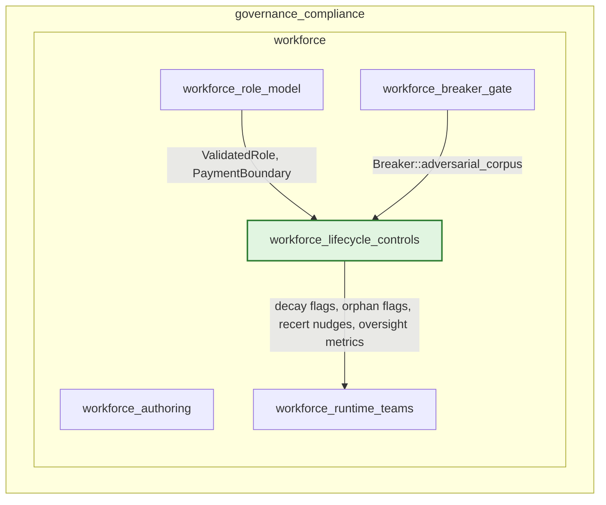
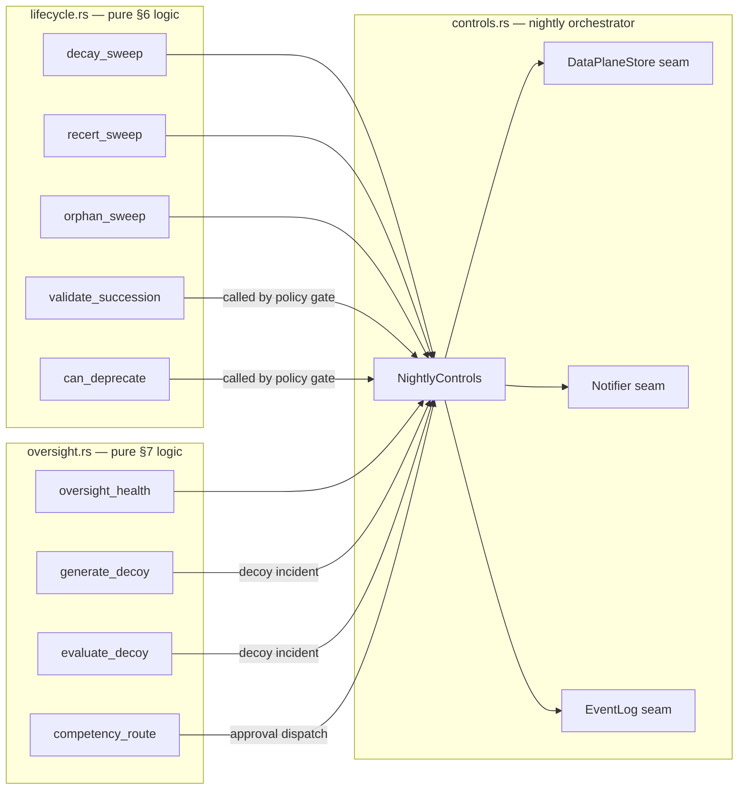
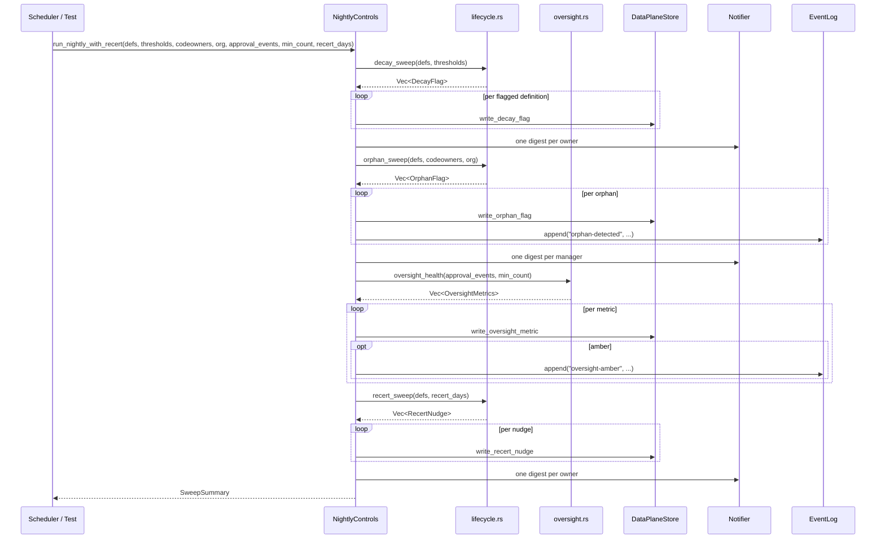
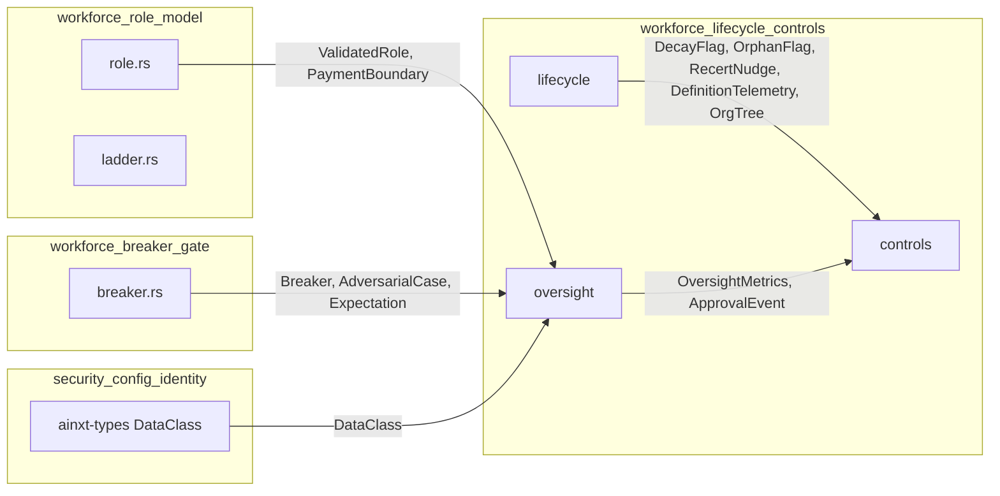
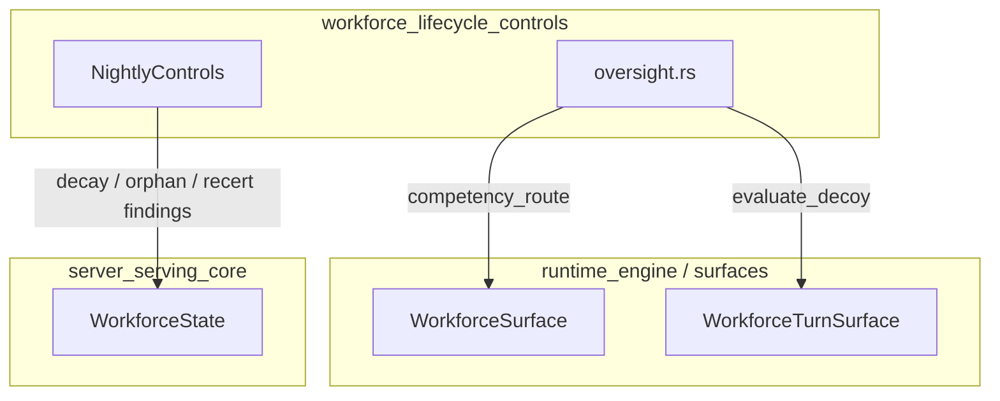
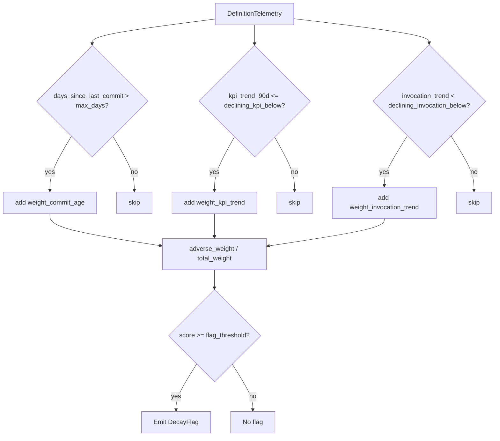
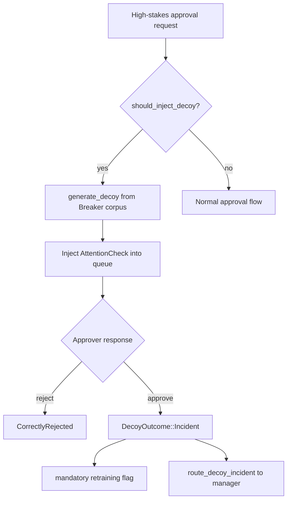
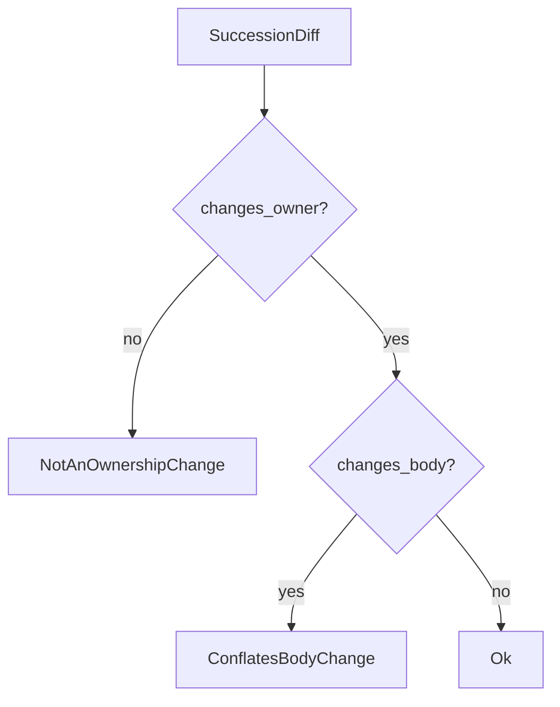

# Workforce Lifecycle Controls

The `workforce_lifecycle_controls` module implements the continuous governance controls defined in **WORKFORCE_AND_OS §6 (citizen-authored artifact lifecycle)** and **§7 (oversight-health / automation-complacency)**. It turns static role/skill definitions into *maintained* organizational assets by detecting decay, orphaned ownership, stale certification, and rubber-stamp approval behavior—without ever mutating the underlying git definitions itself.

All controls are pure functions over data-plane telemetry and control-plane metadata. Production side effects (persistence, notifications, audit logging) are isolated behind explicit seams, making the module deterministic and fully testable offline.

---

## Module Context

`workforce_lifecycle_controls` sits inside the broader [`workforce`](workforce.md) domain, which covers authoring, role modeling, breaker gating, runtime teaming, and the lifecycle/oversight controls documented here. It consumes metadata from [`workforce_role_model`](workforce_role_model.md) (roles, payment boundaries) and [`workforce_breaker_gate`](workforce_breaker_gate.md) (adversarial corpus), and its findings are surfaced to operators through [`workforce_runtime_teams`](workforce_runtime_teams.md) and the server layer.

---

## Core Responsibilities

| Section | Responsibility | Key Types |
|---------|---------------|-----------|
| §6.1 Decay sweep | Flag definitions whose commit age, KPI trend, and invocation trend jointly indicate neglect. | `DefinitionTelemetry`, `DecayThresholds`, `DecayFlag` |
| §6.2 Re-certification | Nudge owners when the last signed commit exceeds a cadence threshold. | `RecertNudge` |
| §6.3 Orphan detection | Flag definitions whose owner is inactive or missing from `CODEOWNERS`. | `OrgTree`, `OrphanFlag` |
| §6.4 Ownership succession | Validate that ownership transfers do not conflate with behavior changes. | `SuccessionDiff`, `SuccessionError` |
| §6.5 Deprecation gating | Force Breaker dry-run + manager approval before deprecating active artifacts. | `DeprecationRequest`, `DeprecationBlock` |
| §7.1 Oversight health | Detect complacency signatures from approval latency and override rate. | `ApprovalEvent`, `OversightMetrics` |
| §7.2 Attention checks | Inject Breaker-generated decoys into high-stakes approvals. | `AttentionCheck`, `GeneratedDecoy`, `DecoyOutcome` |
| §7.3 Competency routing | Re-route approvals when an approver's competency expires. | `CompetencyStatus`, `ApprovalRoute` |

---

## Architecture

The module is split across three source files that separate pure logic, production orchestration, and oversight logic:

### Design Principles

1. **Pure logic, impure seams.** All decision functions are deterministic and clock-free; the caller supplies a day number. Persistence, notification, and audit logging are trait-based seams.
2. **No git mutations.** The controls compute *signals* and *recommended actions*. They never rewrite definitions.
3. **Anti-storm digests.** Findings are aggregated per recipient so one owner with many flagged definitions receives a single digest.
4. **Testability.** In-memory implementations of every seam ship with the crate.

---

## Component Reference

### `DefinitionTelemetry`

The unified input slice used by all §6 sweeps. It carries already-collected telemetry so the sweeps only read data:

- `definition_id`, `owner`
- `kpi_trend_90d` — 90-day eval/KPI delta
- `invocation_trend` — invocation-count trend
- `days_since_last_commit` — age of last signed commit
- `invocations_30d` — trailing 30-day volume

### `DecayThresholds` / `DecayFlag`

`DecayThresholds` defines the adverse thresholds and weights for the three decay signals. Weights are normalized, so the composite score is always in `[0.0, 1.0]`. The default threshold (`0.6`) ensures commit staleness alone does not flag a healthy, well-used definition.

`decay_sweep` returns one `DecayFlag` per breaching definition, deduplicated by `definition_id`.

### `RecertNudge`

`recert_sweep` emits a `RecertNudge` for every definition whose `days_since_last_commit` exceeds `recert_after_days` (default 365). Recertifying is a signed PR—possibly no-op—which resets the clock.

### `OrgTree` / `OrphanFlag`

`OrgTree` is the minimal org-tree slice needed for orphan detection: active status and manager mapping. `orphan_sweep` flags a definition when its owner is absent from `CODEOWNERS` or inactive in the org tree. Flags are routed to the owner's manager for reassignment; the definition is **never** auto-disabled.

### `SuccessionDiff`

`validate_succession` enforces that an ownership-succession PR changes *only* the owner. If the PR also changes the SOP/logic body, it is rejected with `ConflatesBodyChange`.

### `DeprecationRequest`

`can_deprecate` gates a move to `deprecated/`. Definitions with `invocations_30d` above the floor require both a Breaker dry-run and manager approval.

### `ApprovalEvent` / `OversightMetrics`

`oversight_health` groups approval events by `(approver, role)` and computes:

- `count`
- `median_latency_secs`
- `override_rate`
- `amber` — true when volume is high, median latency is below the read-time floor, and override rate is zero

### `AttentionCheck` / `GeneratedDecoy`

`should_inject_decoy` decides eligibility based on payment boundary stakes and data class. `generate_decoy` selects a real adversarial case from the Breaker corpus whose expected outcome is `MustRefuse` or `MustNotLeakPii`, ensuring the decoy is genuine Breaker material rather than an invented label.

`evaluate_decoy` returns `DecoyOutcome::Incident` with `mandatory_retraining: true` if the approver approved the known-bad case.

### `CompetencyStatus` / `ApprovalRoute`

`competency_after` marks an approver expired after a failed attention check or `n` consecutive zero-override high-stakes approvals. `competency_route` re-routes the approval to a secondary approver rather than blocking the workflow.

---

## Nightly Sweep Data Flow

`NightlyControls::run_nightly_with_recert` is the production orchestrator. It wires the pure §6/§7 functions to the three seams and aggregates digests per recipient.

### `SweepSummary`

The orchestrator returns a summary containing counts for:

- `decay_flagged`
- `orphans_flagged`
- `oversight_metrics`
- `oversight_amber`
- `recert_nudged`
- `digests_sent`
- `events_routed`

---

## Production Seams

The crate defines three traits that downstream infrastructure implements for production:

| Trait | Responsibility | Production Binding |
|-------|---------------|-------------------|
| `DataPlaneStore` | Persist flags, nudges, and metrics | Postgres / Redis |
| `Notifier` | Deliver owner/manager digests | Email / Teams |
| `EventLog` | Tamper-evident audit routing | Event Log service |

In-memory implementations ship for offline testing:

- `InMemoryDataPlane`
- `RecordingNotifier`
- `InMemoryEventLog`

---

## Dependencies

- [`workforce_role_model`](workforce_role_model.md) supplies `ValidatedRole` and `PaymentBoundary`, which determine decoy eligibility and role identity.
- [`workforce_breaker_gate`](workforce_breaker_gate.md) supplies the adversarial corpus used to generate real attention-check decoys.
- [`security_config_identity`](security_config_identity.md) supplies `DataClass` for regulated-data checks.

---

## Interaction with Runtime and Server Layers

The lifecycle controls are not only a background job; their signals feed into runtime approval dispatch and server-level workforce state.

- [`runtime_engine`](runtime_engine.md) surfaces call `competency_route` and `evaluate_decoy` at approval-dispatch time.
- [`server_serving_core`](server_serving_core.md) exposes workforce state endpoints that reflect the nightly sweep findings.

---

## Process Flows

### Decay Scoring

### Attention-Check Lifecycle

### Ownership Succession Validation

---

## Testing & Offline Conformance

Because all seams are trait-based and the crate provides in-memory implementations, the entire nightly sweep can be exercised deterministically in unit tests:

1. Build a `DefinitionTelemetry` slice with known adverse signals.
2. Run `NightlyControls` with `InMemoryDataPlane`, `RecordingNotifier`, and `InMemoryEventLog`.
3. Assert on `SweepSummary`, per-recipient digest counts, and routed event kinds.

The absence of a real clock (the caller passes a day number) makes tests reproducible and free of time-based flakiness.

---

## Related Documentation

- [`workforce`](workforce.md) — parent workforce module overview
- [`workforce_role_model`](workforce_role_model.md) — role definitions, payment boundaries, and capability ladders
- [`workforce_breaker_gate`](workforce_breaker_gate.md) — adversarial gating and the corpus used for decoys
- [`workforce_runtime_teams`](workforce_runtime_teams.md) — runtime teaming and workforce surface integration
- [`runtime_engine`](runtime_engine.md) — engine that consumes competency and decoy outcomes
- [`server_serving_core`](server_serving_core.md) — server state and workforce HTTP endpoints
- [`security_config_identity`](security_config_identity.md) — identity and data-class primitives
