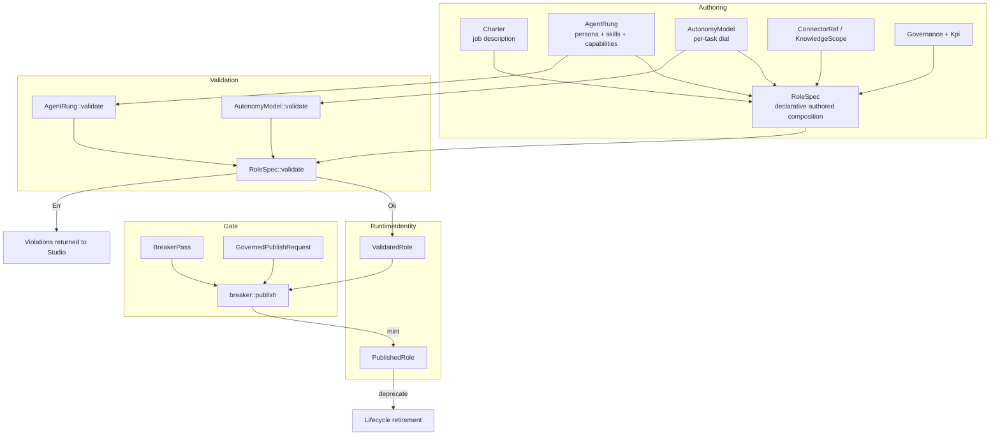
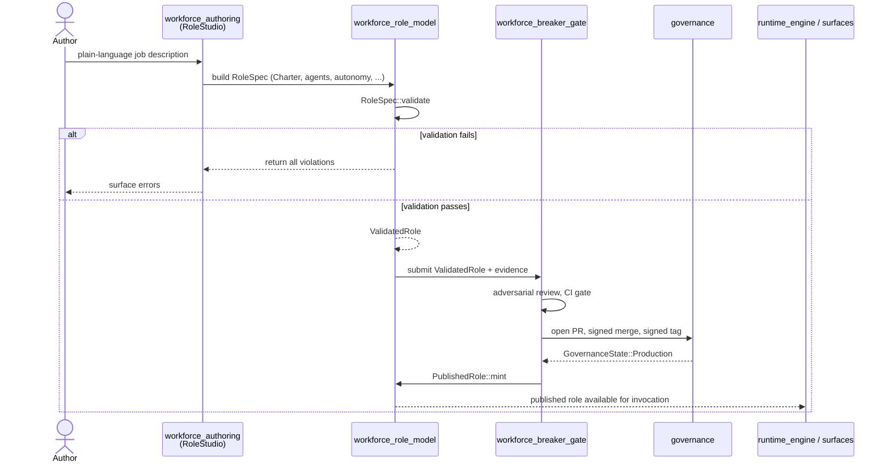
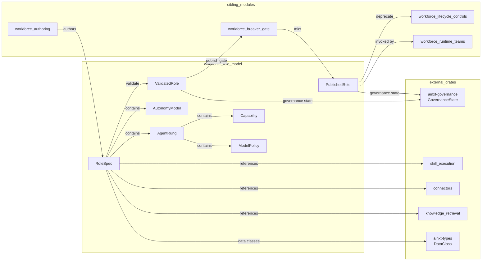
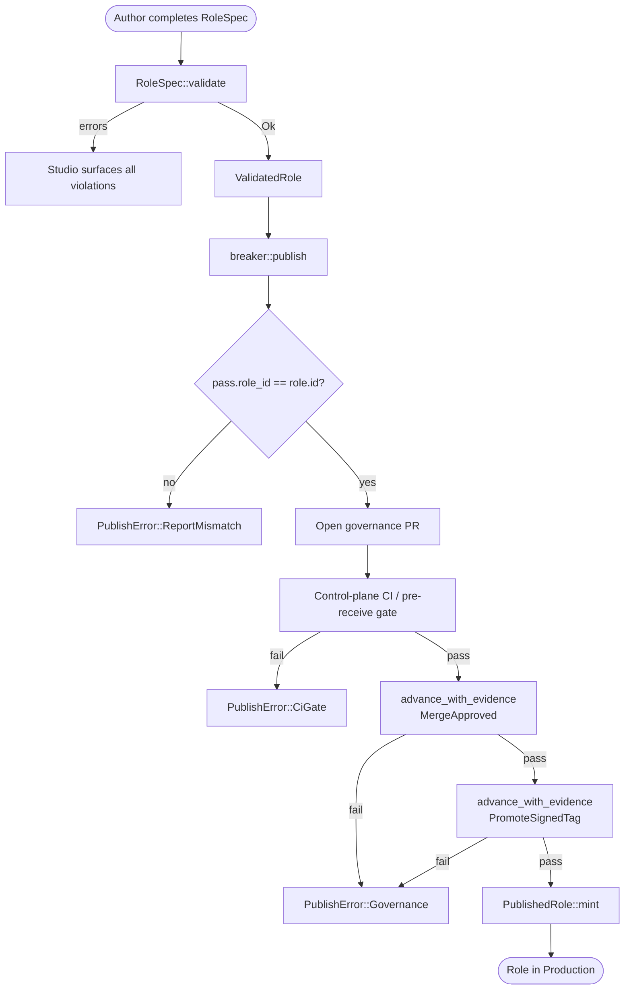
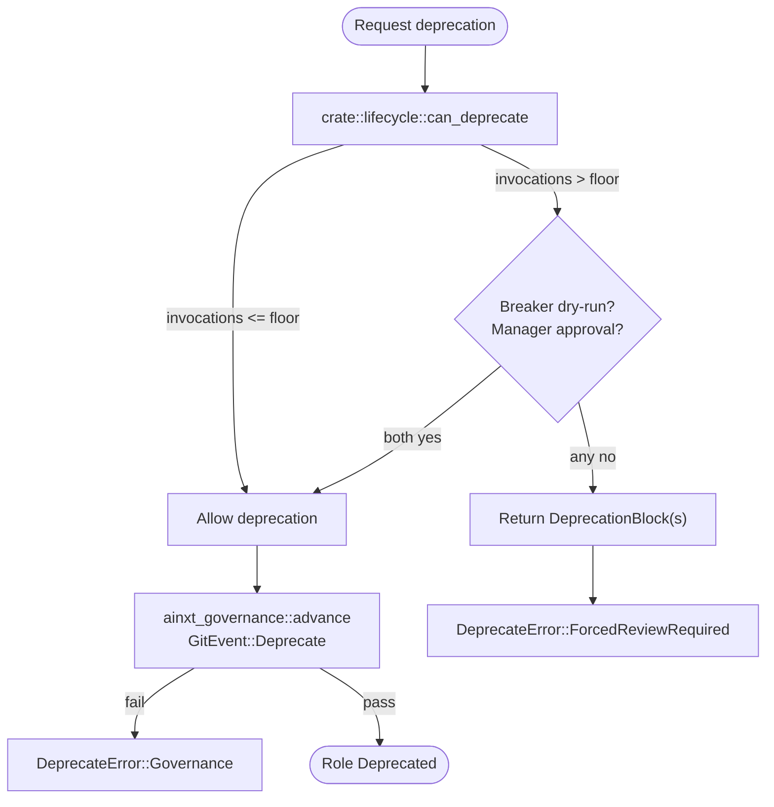

# workforce_role_model

The **workforce_role_model** module defines the governed composition model for *digital workers* (Roles) in the AINXT workforce system. It sits in the `governance_compliance → workforce → workforce_role_model` subtree and is responsible for turning declarative job descriptions into validated, publishable, and eventually deprecatable runtime identities.

A Role is not a single skill or agent. It is a structured bundle that combines:

- a [`Charter`](#charter) (job description),
- one or more [`AgentRung`](#agentrung) units (persona + skills + capabilities + model policy),
- [`SkillRef`](#skillref) references to reusable capabilities,
- [`ConnectorRef`](#connectorref) and [`KnowledgeScope`](#knowledgescope) attachments,
- [`Governance`](#governance) metadata (owner, RBAC, residency, retention, model risk),
- [`Kpi`](#kpi) targets,
- an [`AutonomyModel`](#autonomymodel) that dials human oversight *per task*.

The module enforces a strict lifecycle: authored [`RoleSpec`](#rolespec) → [`ValidatedRole`](#validatedrole) (structural validation) → [`PublishedRole`](#publishedrole) (Breaker gate + git-native governance). The only way to obtain a `PublishedRole` is through the Breaker publish gate in [`workforce_breaker_gate`](workforce_breaker_gate.md), making the type system the enforcement mechanism for "cannot skip the adversarial gate."

---

## Architecture

The architecture is intentionally layered:

1. **Authoring layer** (`RoleSpec` and sub-structs) captures the human-authored intent.
2. **Validation layer** (`RoleSpec::validate`, `AgentRung::validate`, `AutonomyModel::validate`) checks hard invariants and returns *all* violations so the Studio can surface them at once.
3. **Gate layer** (`breaker::publish`) runs adversarial review and git-native governance promotion.
4. **Runtime identity layer** (`ValidatedRole`, `PublishedRole`) provides type-level evidence that a role has passed the required stages.

---

## Core Components

### `RoleSpec`

`RoleSpec` is the declarative, not-yet-validated composition of a digital worker. It is the input to the validation pipeline and contains every element required by WORKFORCE_AND_OS §2.

Key responsibilities:

- Hold the complete role definition: `id`, `charter`, `agents`, `skills`, `connectors`, `knowledge`, `governance`, `kpis`, `autonomy`, and `payment_boundary`.
- Compute the **derived** most-sensitive data class via `max_data_class()`, folding in connectors, knowledge, agent capabilities, *and* per-task data-class attestations. This derived value is the authoritative signal for residency and autonomy constraints; it cannot be understated by mis-declaring the `payment_boundary`.
- Enumerate all capabilities across agents for over-privilege probing.
- Produce a `ValidatedRole` via `validate()`, or return a list of every violation.

### `ValidatedRole`

A `ValidatedRole` wraps a `RoleSpec` that has passed structural validation. It is the only type the Breaker will run, and the only type that can be promoted to `PublishedRole`. Its constructor is private to the module; it must be created through `RoleSpec::validate`.

### `PublishedRole`

A `PublishedRole` represents a validated role that has cleared the Breaker gate and reached `GovernanceState::Production`. Its constructor is `pub(crate)` and is called from exactly one place: `crate::breaker::publish`. This guarantees that no role can reach production without passing the adversarial gate.

`PublishedRole` also controls retirement through `deprecate`, which enforces §6.5 forced review: an actively-used role requires a Breaker dry-run and manager sign-off before the git-native deprecate transition is allowed.

### `Charter`

The structured job description produced by the Studio from a plain-language description. It contains `title`, `responsibilities`, `inputs`, `outputs`, and `escalation_rules`. A non-empty escalation path is mandatory — a worker with no defined hand-off to a human is not shippable.

### `ConnectorRef`

A reference to a connector the role may use, tagged with the sensitivity (`DataClass`) of the data it exposes. This drives the derived data-class computation and residency decisions.

### `KnowledgeScope`

A RAG / knowledge namespace attached to the role, also tagged with a `DataClass`. It carries an optional `retrieval_quality` score that is populated by the Studio Step-5 retrieval-quality check.

### `Governance`

The governance block baked into every role by construction. It records:

- `owner`: the named accountable human (CODEOWNERS owner).
- `codeowners_group`: the authoring RBAC group.
- `rbac_visibility`: `Public` or `Private`.
- `obo_authority`: whether the role acts on-behalf-of the user rather than with its own broad credentials.
- `model_risk_class`: `Low`, `Medium`, or `High`.
- `residency`: `InHouse` or `Cloud`.
- `retention_days`: data-lifecycle retention in days (`0` is invalid).

### `Kpi`

A role-specific evaluation target with a name and target value. Presence of KPIs is required by the Breaker; interpretation is metric-specific.

### `AgentRung`

Defined in [`ladder.rs`](workforce_role_model.md#agentrung), `AgentRung` is the "Agent" rung of the creation ladder: persona + skills + least-privilege capabilities + a `ModelPolicy`. It is a governed ladder unit with its own validation.

### `SkillRef`

Also in [`ladder.rs`](workforce_role_model.md#skillref), `SkillRef` is a reference to a reusable skill in the Skill Runtime. Skills may be *behavioral* (SOP text injected into the system prompt) or *execution* (sandboxed `run()` whose output is injected as context).

### `Capability`

A least-privilege capability grant from [`ladder.rs`](workforce_role_model.md#capability). It names a tool/connector/data-class and a `data_class_ceiling`. A capability whose ceiling exceeds the agent's `ModelPolicy::max_data_class` is rejected as over-privilege.

### `ModelPolicy`

The model policy for an agent rung, specifying allowed providers and the maximum data class that may be sent to a model. This is the declarative intent that the runtime router enforces.

### `AutonomyModel`

The per-task autonomy dial from [`autonomy.rs`](workforce_role_model.md#autonomymodel). It defines a default autonomy level, per-task overrides, and an uncertainty escalation threshold. A task that touches regulated data cannot be set to `Auto`; uncertainty above the threshold forces escalation regardless of the dial.

### `TaskAutonomy`

One task's autonomy setting, including the task name, level, a self-declared `regulated` flag, and an optional attested `data_class`. The effective regulated signal is the OR of the flag and a regulated `data_class`, preventing authors from bypassing constraints by leaving the flag false while attesting a regulated class.

---

## Data Flow

The data flow is fail-closed at every stage:

- Validation returns *all* errors so the Studio can show them together.
- The Breaker gate verifies the role, runs control-plane CI, and requires signed git transitions.
- `PublishedRole` can only be minted at `Production`.
- Runtime surfaces consume `PublishedRole` (or `ValidatedRole` for shadow cases), never raw `RoleSpec`.

---

## Component Interactions

`workforce_role_model` is the schema and validation hub. It does not execute skills, run connectors, or perform retrieval itself; it composes *references* to those capabilities and enforces that the composition is coherent and governed before it can be published.

---

## Validation Invariants

`RoleSpec::validate` encodes the "responsible reality" requirements structurally. The most important invariants are:

| Invariant | Rationale |
|-----------|-----------|
| Role id, charter title, responsibilities, and escalation rules must be present. | A worker must have a defined job and hand-off path. |
| At least one agent must be present. | Something must execute the work. |
| Governance owner and codeowners group must be non-empty; retention days must be non-zero. | Accountability, RBAC, and data lifecycle cannot be undefined. |
| Every `AgentRung` must pass `AgentRung::validate`. | Agent-level coherence (persona, skills/capabilities, provider list, no over-privilege). |
| `AutonomyModel` must pass `AutonomyModel::validate`. | Threshold in `[0, 1]`; regulated tasks cannot be `Auto`. |
| If the role touches regulated/PII data, residency must be `InHouse`. | Gap N / RBI+DPDP: regulated data stays in-house. |
| If the role touches regulated/PII data, `obo_authority` must be true, default autonomy cannot be `Auto`, and an escalation path must exist. | Gap AI / §5: fail-closed human oversight derived from actual data class. |
| Per-task `Auto` on a task that touches regulated data is rejected. | Prevents understating regulation via the self-declared flag. |
| High model-risk roles cannot default to `Auto`. | Gap P / RBI SR-11-7: high-judgment roles stay supervised. |
| Payment-boundary roles must have `obo_authority` and cannot default to `Auto`. | ADR-016 / §7: money-movement roles require strict oversight. |

These invariants are **derived**, not self-declared. The `payment_boundary` label is advisory; the actual constraints key off `max_data_class`, which is computed from connectors, knowledge, agent capabilities, and per-task data-class attestations.

---

## Process Flows

### Publishing a Role

### Deprecating a Role

---

## Module Boundaries

`workforce_role_model` owns the **schema and static validation** of roles. It deliberately does *not* own:

- **Authoring UX** — that belongs to [`workforce_authoring`](workforce_authoring.md) (`author.rs`, `studio.rs`).
- **Adversarial review / publish gate** — that belongs to [`workforce_breaker_gate`](workforce_breaker_gate.md) (`breaker.rs`).
- **Lifecycle controls and oversight** — runtime telemetry, nightly controls, and attention checks live in [`workforce_lifecycle_controls`](workforce_lifecycle_controls.md) (`lifecycle.rs`, `controls.rs`, `oversight.rs`).
- **Runtime execution** — the `Kernel`, `RoleProcess`, `Collaboration`, and `DigitalTeam` execution models live in [`workforce_runtime_teams`](workforce_runtime_teams.md) (`kernel.rs`, `team.rs`).

It depends on:

- [`security_config_identity`](security_config_identity.md) / `ainxt-types` for `DataClass` and `Principal`.
- [`governance`](governance.md) / `ainxt-governance` for `GovernanceState` and lifecycle transitions.
- [`skill_execution`](skill_execution.md) for skill references and execution semantics.
- [`connectors`](connectors.md) for connector references and capability grants.
- [`knowledge_retrieval`](knowledge_retrieval.md) for knowledge-scope namespaces and retrieval quality.

---

## How It Fits into the System

The workforce_role_model module is the *contract* between human authors and the governed runtime. It translates organizational intent ("this digital worker does X, is owned by Y, and may touch Z data") into a machine-enforceable structure. By making `PublishedRole` unconstructable outside the Breaker gate, the module ensures that every production role has passed:

1. Structural validation (schema + invariants),
2. Adversarial review (Breaker),
3. Control-plane CI (pre-receive gate),
4. Git-native governance (signed merge + signed tag).

Downstream, [`workforce_runtime_teams`](workforce_runtime_teams.md) and the [`runtime_engine`](runtime_engine.md) surfaces invoke only published (or validated shadow-case) roles, so the guarantees established at authoring time propagate into execution.
