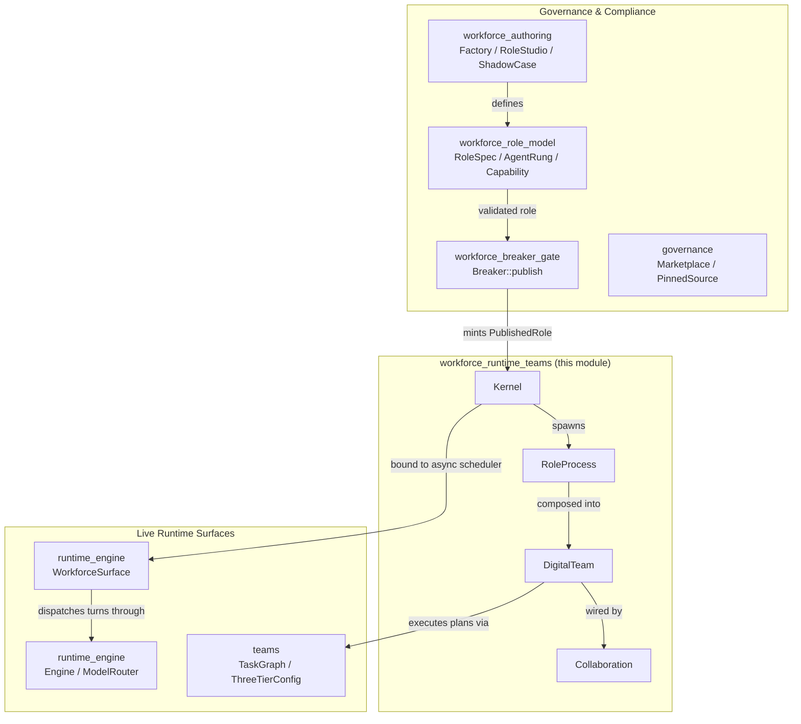
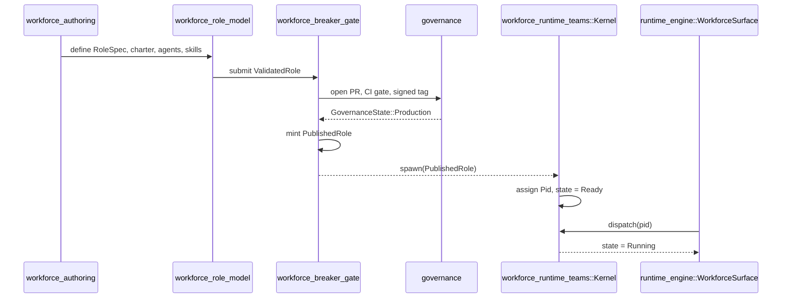
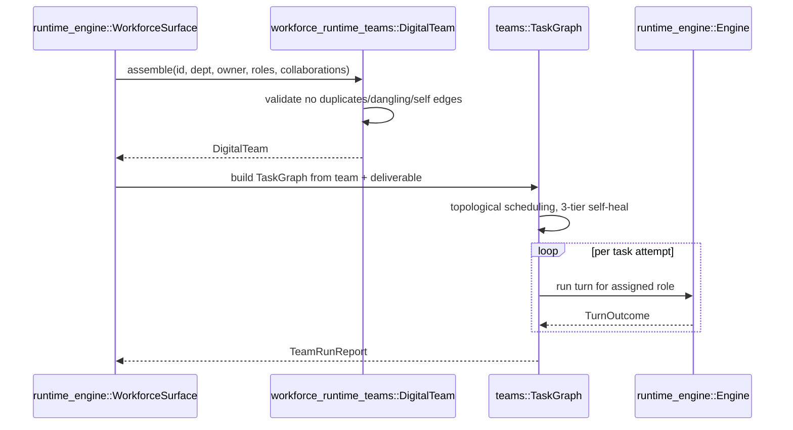
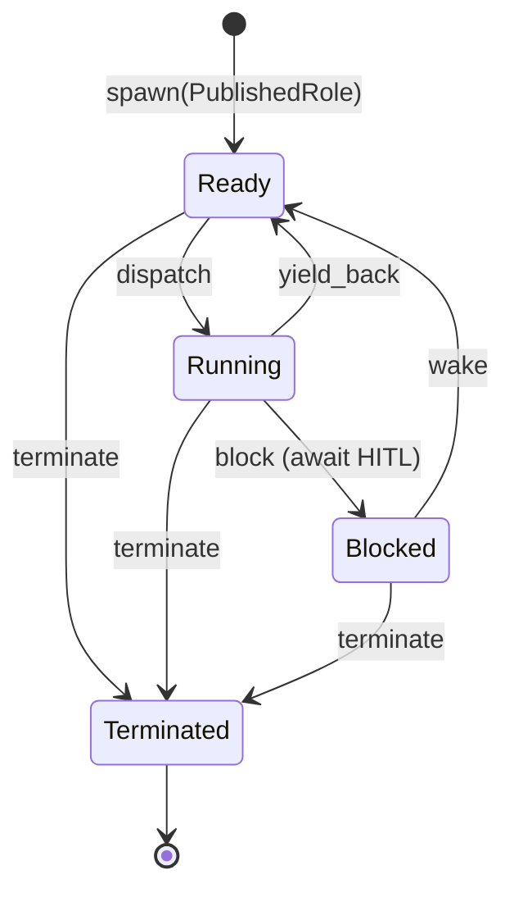

# workforce_runtime_teams

The **workforce_runtime_teams** module is the execution bridge of the [workforce](workforce.md) subsystem. It maps the governance concepts defined in the workforce authoring and role-model modules onto a deterministic, OS-like runtime: a [`Kernel`](workforce_runtime_teams.md#kernel) maintains a process table of [`RoleProcess`](workforce_runtime_teams.md#roleprocess) instances, and [`DigitalTeam`](workforce_runtime_teams.md#digitalteam) composes published roles into governed departments with explicit collaboration edges.

This module is intentionally pure — it contains no async, clock, or threading code. The live async scheduler that binds it to the served runtime lives in [runtime_engine](runtime_engine.md) (specifically `ainxt-runtimed::workforce_surface`), while the multi-agent task loop that executes team plans lives in [teams](teams.md). The kernel and team structures here provide the deterministic state machine and validation invariants that those runtime surfaces rely on.

---

## Core Components

### `Kernel`

`Kernel` is the runtime process table for digital workers. It owns a monotonically increasing `next_pid` counter and a `BTreeMap<Pid, RoleProcess>` table. All state transitions are pure functions, making the kernel deterministic and trivially testable.

Key responsibilities:

- **Spawn**: Admit a [`PublishedRole`](workforce_role_model.md#publishedrole) as a [`RoleProcess`](workforce_runtime_teams.md#roleprocess) in `ProcessState::Ready`. Because `spawn` consumes `PublishedRole` by value, only roles that have passed the [workforce_breaker_gate](workforce_breaker_gate.md) can ever become processes.
- **Dispatch / block / wake / yield / terminate**: Drive the role-process lifecycle with explicit, validated state transitions.
- **Scheduling support**: Expose `runnable()` (Ready pids in deterministic order) and `live_count()` for the live scheduler.

The kernel maps operating-system concepts onto the AiNxt runtime: the kernel *is* the runtime, and each process *is* a published role executing on it.

### `RoleProcess`

A `RoleProcess` wraps a [`PublishedRole`](workforce_role_model.md#publishedrole) together with its assigned [`Pid`](workforce_runtime_teams.md#pid) and [`ProcessState`](workforce_runtime_teams.md#processstate). Its existence is a proof that the role has cleared the Breaker gate and been admitted to the kernel.

### `ProcessState`

The lifecycle of a role-process mirrors a traditional OS process model:

| State | Meaning |
|-------|---------|
| `Ready` | Admitted, waiting for the scheduler. |
| `Running` | Currently executing a task on the runtime. |
| `Blocked` | Awaiting human input / HITL approval / escalation. |
| `Terminated` | Finished or retired; no longer schedulable. |

### `DigitalTeam`

`DigitalTeam` represents a governed digital department: a collection of [`PublishedRole`](workforce_role_model.md#publishedrole)s plus the [`Collaboration`](workforce_runtime_teams.md#collaboration) edges that describe how work flows between them.

`DigitalTeam::assemble` enforces structural invariants:

- Non-empty `id`, `department`, and `owner`.
- At least one role.
- No duplicate role ids.
- No self-collaboration edges.
- No dangling collaboration edges (every referenced role must be present on the team).

Because assembly requires `PublishedRole` values, a team can only be built from Breaker-passed, governed workers.

### `Collaboration`

A directed edge `from_role → to_role` annotated with a `purpose`. It expresses the org-chart wiring of a digital team: who hands work to whom, and why.

---

## Architecture

---

## Component Relationships

```mermaid
classDiagram
    class Kernel {
        +next_pid: u64
        +table: BTreeMap~Pid, RoleProcess~
        +spawn(role: PublishedRole): Pid
        +dispatch(pid: Pid): Result~()~
        +block(pid: Pid): Result~()~
        +wake(pid: Pid): Result~()~
        +yield_back(pid: Pid): Result~()~
        +terminate(pid: Pid): Result~()~
        +runnable(): Vec~Pid~
        +live_count(): usize
    }

    class RoleProcess {
        +pid: Pid
        +role: PublishedRole
        +state: ProcessState
        +pid(): Pid
        +state(): ProcessState
        +role(): &PublishedRole
        +role_id(): &str
    }

    class ProcessState {
        <<enumeration>>
        Ready
        Running
        Blocked
        Terminated
    }

    class DigitalTeam {
        +id: String
        +department: String
        +owner: String
        +roles: Vec~PublishedRole~
        +collaborations: Vec~Collaboration~
        +assemble(...): Result~DigitalTeam, TeamError~
    }

    class Collaboration {
        +from_role: String
        +to_role: String
        +purpose: String
    }

    class PublishedRole {
        <<from workforce_role_model>>
    }

    Kernel "1" --> "*" RoleProcess : manages
    RoleProcess --> ProcessState : has
    RoleProcess --> PublishedRole : wraps
    DigitalTeam --> "*" PublishedRole : composed_of
    DigitalTeam --> "*" Collaboration : wired_by
```

---

## Data Flow

### From Role Definition to Running Process

### Team Assembly and Execution

---

## Process Lifecycle

---

## How This Module Fits into the System

`workforce_runtime_teams` sits at the boundary between **governance** and **live execution**:

- **Upstream**, it depends on [workforce_role_model](workforce_role_model.md) for the shape of a role and on [workforce_breaker_gate](workforce_breaker_gate.md) for the only legal constructor of a [`PublishedRole`](workforce_role_model.md#publishedrole). It also depends on [governance](governance.md) for the marketplace/state machinery that makes a role production-ready.
- **Downstream**, it is consumed by [runtime_engine](runtime_engine.md) (`ainxt-runtimed::workforce_surface`), which wraps the pure `Kernel` in async scheduling, persists published roles and assembled teams, and binds role execution to the [runtime_engine](runtime_engine.md) `Engine`.
- **Sideways**, it collaborates with [teams](teams.md), which owns the multi-agent task graph, handoff contracts, and 3-tier self-heal loop that actually executes a `DigitalTeam`'s plan.

The module's design enforces two critical invariants by construction:

1. **Only governed roles run.** `Kernel::spawn` takes `PublishedRole` by value; there is no other public constructor, so un-tested roles cannot be scheduled.
2. **Only consistent teams assemble.** `DigitalTeam::assemble` rejects duplicate, dangling, and self-referential collaboration edges, ensuring the org chart is structurally sound before any runtime execution.

For the live scheduling, turn execution, and HTTP surface that expose these primitives, see [runtime_engine](runtime_engine.md). For the task-graph planning and self-healing execution loop, see [teams](teams.md).
